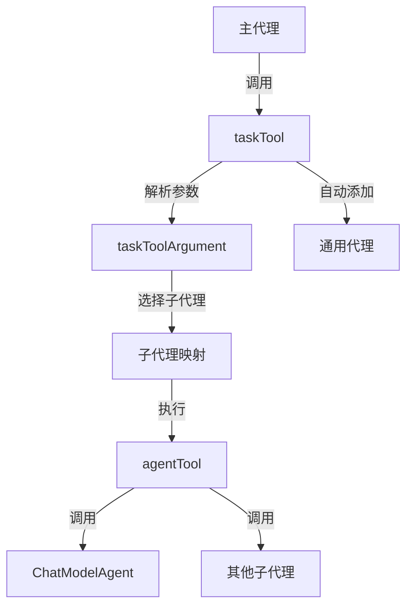

# 子代理协调模块技术深度解析

## 1. 模块概述

子代理协调模块是深度研究系统中的核心组件，它通过一种优雅的方式将多个子代理（Sub-Agent）以工具的形式暴露给主代理，实现了代理之间的协作。这个模块解决了复杂任务分解与执行的问题，让主代理可以通过简单的工具调用就能委派任务给专门的子代理处理。

## 2. 核心问题

在复杂的AI应用中，单个代理往往无法高效处理所有类型的任务。子代理协调模块解决了以下关键问题：

- **任务分解与委派**：将复杂任务拆分为子任务，由专门的子代理处理
- **统一接口抽象**：将不同类型的代理统一抽象为工具接口，便于统一调用
- **通用代理兜底**：当没有专门子代理时，提供通用处理能力

## 3. 架构设计

### 架构图



### 核心组件

- **taskTool**：核心协调器，将子代理包装为可调用工具
- **taskToolArgument**：参数结构，定义子代理选择和任务描述
- **agentTool**：将代理转换为工具的桥接组件
- **通用代理**：兜底处理能力，确保系统的完整性

## 4. 核心组件详解

### taskTool 结构体

```go
type taskTool struct {
    subAgents     map[string]tool.InvokableTool
    subAgentSlice []adk.Agent
    descGen       func(ctx context.Context, subAgents []adk.Agent) (string, error)
}
```

**设计意图**：
- `subAgents`：以名称为键的子代理映射，快速查找和调用
- `subAgentSlice`：子代理切片，用于生成工具描述时遍历
- `descGen`：描述生成器函数，动态生成工具描述

**关键方法**：

1. **Info 方法：
```go
func (t *taskTool) Info(ctx context.Context) (*schema.ToolInfo, error)
```
- 生成工具信息，包括名称、描述和参数定义
- 动态生成描述，包含所有可用子代理的信息

2. **InvokableRun 方法：
```go
func (t *taskTool) InvokableRun(ctx context.Context, argumentsInJSON string, opts ...tool.Option) (string, error)
```
- 解析参数，选择合适的子代理并调用
- 转换任务描述为子代理需要的输入格式

### taskToolArgument 结构体

```go
type taskToolArgument struct {
    SubagentType string `json:"subagent_type"`
    Description  string `json:"description"`
}
```

**设计意图**：
- `SubagentType`：指定要调用的子代理类型
- `Description`：任务描述，传递给子代理的具体请求

## 5. 数据流程

1. **初始化阶段**：
   - 创建 `taskTool` 实例
   - 注册所有提供的子代理
   - 可选地添加通用代理
   - 将所有代理转换为工具形式

2. **工具调用阶段**：
   - 主代理调用 `taskTool`
   - 解析 `taskToolArgument` 参数
   - 根据 `SubagentType` 查找对应的子代理工具
   - 将 `Description` 转换为子代理的输入
   - 调用子代理工具并返回结果

## 6. 设计决策与权衡

### 关键设计决策：

1. **代理即工具**：
   - 将子代理统一抽象为工具，简化了主代理的接口
   - 权衡：增加了一层抽象，但提供了更好的统一性

2. **自动添加通用代理**：
   - 默认添加通用代理作为兜底
   - 权衡：增加了系统的复杂性，但确保了完整性

3. **动态生成工具描述**：
   - 使用描述生成器函数，动态生成工具描述
   - 权衡：增加了灵活性，但可能影响性能

4. **简单参数转换**：
   - 将任务描述直接作为子代理的请求
   - 权衡：简化了接口，但可能需要子代理处理复杂请求

## 7. 使用示例

```go
// 创建子代理
subAgent1, _ := adk.NewChatModelAgent(ctx, &adk.ChatModelAgentConfig{
    Name: "researcher",
    Description: "专门负责研究任务",
    // ...
})

subAgent2, _ := adk.NewChatModelAgent(ctx, &adk.ChatModelAgentConfig{
    Name: "writer",
    Description: "专门负责写作任务",
    // ...
})

// 创建子代理协调工具
taskTool, _ := newTaskTool(ctx, nil, []adk.Agent{subAgent1, subAgent2}, false, model, instruction, toolsConfig, maxIteration, middlewares)

// 在主代理中使用
// ...
```

## 8. 注意事项与边界情况

1. **子代理名称冲突**：
   - 确保子代理名称唯一，避免映射冲突
   - 建议使用有意义的名称

2. **参数格式转换**：
   - 任务描述需要子代理能正确理解和处理
   - 可能需要对子代理进行参数格式适配

3. **错误处理**：
   - 子代理调用失败会直接传递给主代理
   - 主代理需要适当处理子代理错误

4. **性能考虑**：
   - 动态生成工具描述可能影响性能
   - 大量子代理时考虑缓存描述

## 9. 相关模块参考

- [ADK Agent Interface](adk_agent_interface.md)：了解代理接口定义
- [ADK Agent Tool](adk_agent_tool.md)：了解代理工具的实现
- [Compose Graph Engine](compose_graph_engine.md)：了解更复杂的代理组合方式
- [ADK ChatModel Agent](adk_chatmodel_agent.md)：了解聊天模型代理的实现

## 10. 总结

子代理协调模块提供了一种简洁而有效的方式来组织和协调多个代理的工作。通过将代理即工具的抽象，它实现了任务的分解和委派，同时保持了系统的灵活性和可扩展性。这个模块是深度研究系统中不可或缺的一部分，为复杂任务的处理提供了基础架构支持。
