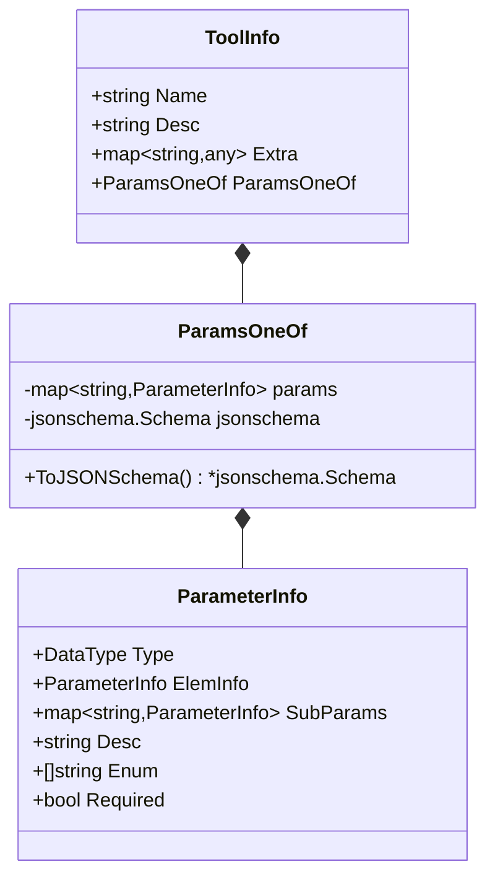

# 工具定义子模块

## 概述

工具定义子模块是整个系统中用于描述和定义工具的核心基础设施。它解决了一个看似简单但实际上相当复杂的问题：如何以一种既灵活又标准化的方式描述工具，使得不同的模型提供商（如 OpenAI、Anthropic 等）都能理解并使用这些工具，同时又不牺牲易用性。

想象一下，如果每个工具都需要为不同的模型提供商编写不同的参数描述，那将是多么繁琐和容易出错的工作。这个子模块通过提供统一的工具描述接口，解决了这个问题。它允许开发者使用两种主要方式来定义工具参数：一种是直观易用的 `ParameterInfo` 方式，另一种是功能强大的 JSONSchema 方式，然后自动将这些描述转换为模型需要的格式。

## 核心概念与架构

工具定义子模块的架构非常简洁，由三个核心结构体组成，形成了一个清晰的层次结构：



这个架构的核心思想是**统一接口与可选实现**：`ToolInfo` 是工具的完整描述，而 `ParamsOneOf` 则提供了两种不同但等价的参数描述方式，开发者可以根据自己的需求选择合适的一种。

## 核心组件深度解析

### ToolInfo

`ToolInfo` 是工具的完整描述，它包含了工具的名称、描述、额外信息以及参数定义。这是系统中其他部分（如 [Component Interfaces](component_interfaces.md) 中的 `BaseTool`）与工具定义交互的主要接口。

**设计意图**：
- 将工具的元信息（名称、描述）与参数定义分离，使得参数定义可以灵活变化而不影响工具的基本标识
- 提供 `Extra` 字段以支持模型特定的扩展，避免了为每个模型提供商创建不同的工具定义结构

**重要特性**：
- `Name` 是工具的唯一标识，应该清晰地传达工具的用途
- `Desc` 不仅可以描述工具的功能，还可以包含少样本示例，帮助模型更好地理解如何使用工具
- `ParamsOneOf` 是可选的，如果为 nil，则表示工具不需要任何输入参数

### ParamsOneOf

`ParamsOneOf` 是这个子模块中最巧妙的设计之一。它允许开发者使用两种不同的方式来描述工具参数，同时确保只使用其中一种方式。

**设计意图**：
- 解决了易用性与灵活性之间的权衡：对于大多数简单场景，使用 `ParameterInfo` 方式更加直观；对于复杂场景，使用 JSONSchema 方式则提供了完整的表达能力
- 通过 `ToJSONSchema()` 方法，将两种不同的描述方式统一转换为 JSONSchema 格式，这是大多数模型提供商都能理解的标准格式

**关键方法**：
- `NewParamsOneOfByParams()`: 使用直观的 `ParameterInfo` 方式创建参数描述
- `NewParamsOneOfByJSONSchema()`: 使用功能强大的 JSONSchema 方式创建参数描述
- `ToJSONSchema()`: 将参数描述转换为模型可用的 JSONSchema 格式

### ParameterInfo

`ParameterInfo` 提供了一种直观的方式来描述工具参数，不需要开发者了解 JSONSchema 的复杂细节。

**设计意图**：
- 提供一个简化的参数描述接口，覆盖了大多数常见的使用场景
- 支持嵌套的参数结构（对象类型的 `SubParams` 和数组类型的 `ElemInfo`），可以描述复杂的参数
- 包含常见的参数属性：类型、描述、枚举值、是否必需等

**重要特性**：
- 支持所有 JSONSchema 标准数据类型：object、number、integer、string、array、null、boolean
- 对于数组类型，可以通过 `ElemInfo` 指定元素类型
- 对于对象类型，可以通过 `SubParams` 指定子参数
- 对于字符串类型，可以通过 `Enum` 指定允许的值列表

## 数据流程

让我们通过一个典型的使用场景来追踪数据的流动：

1. 开发者创建一个 `ToolInfo` 实例，使用 `NewParamsOneOfByParams()` 或 `NewParamsOneOfByJSONSchema()` 设置参数描述
2. 当工具需要被传递给模型时，系统调用 `ParamsOneOf.ToJSONSchema()` 方法
3. 如果使用的是 `ParameterInfo` 方式，`ToJSONSchema()` 会递归地将 `ParameterInfo` 结构转换为 JSONSchema
4. 转换后的 JSONSchema 被传递给 [Component Interfaces](component_interfaces.md) 中的 `ToolCallingChatModel`
5. 模型提供商的客户端使用这个 JSONSchema 来格式化工具调用请求

## 设计决策与权衡

这个子模块的设计中包含了几个重要的权衡：

### 1. 两种参数描述方式的选择

**决策**：同时提供 `ParameterInfo` 和 JSONSchema 两种参数描述方式

**权衡**：
- **优点**：满足了不同开发者的需求，初学者可以使用简单的方式，专家可以使用强大的方式
- **缺点**：增加了代码复杂度，需要维护两种描述方式之间的转换逻辑

**为什么这样选择**：在实际开发中，大多数工具的参数都比较简单，使用 `ParameterInfo` 更加高效；但也有一些工具需要复杂的参数验证，这时 JSONSchema 就显得非常必要。

### 2. 递归转换而非组合模式

**决策**：在 `paramInfoToJSONSchema()` 函数中使用递归方式转换参数结构，而不是使用组合模式

**权衡**：
- **优点**：代码简单直观，易于理解和维护
- **缺点**：对于非常深的嵌套结构，可能会有栈溢出的风险（尽管在实际使用中这种情况非常罕见）

**为什么这样选择**：考虑到工具参数的嵌套深度通常不会太深，递归方式的简单性超过了其潜在的风险。

### 3. 属性排序

**决策**：在转换 `ParameterInfo` 为 JSONSchema 时，对属性名称进行排序

**权衡**：
- **优点**：生成的 JSONSchema 具有确定性，便于测试和调试
- **缺点**：稍微增加了一些计算开销

**为什么这样选择**：确定性的输出对于测试和调试非常重要，而排序的开销相对于其带来的好处来说是微不足道的。

## 使用指南与示例

### 基本使用：使用 ParameterInfo 定义工具

```go
// 创建一个简单的搜索工具
searchTool := &schema.ToolInfo{
    Name: "search",
    Desc: "Search the web for information about a given query",
    ParamsOneOf: schema.NewParamsOneOfByParams(map[string]*schema.ParameterInfo{
        "query": {
            Type:     schema.String,
            Desc:     "The search query",
            Required: true,
        },
        "num_results": {
            Type:     schema.Integer,
            Desc:     "The number of results to return (default: 10)",
            Required: false,
        },
    }),
}
```

### 高级使用：使用 JSONSchema 定义工具

```go
import "github.com/eino-contrib/jsonschema"

// 创建一个复杂的数据分析工具
analysisSchema := &jsonschema.Schema{
    Type: "object",
    Properties: orderedmap.New[string, *jsonschema.Schema](),
    Required: []string{"dataset"},
}

// 添加 dataset 参数
analysisSchema.Properties.Set("dataset", &jsonschema.Schema{
    Type:        "string",
    Description: "The name of the dataset to analyze",
})

// 添加 options 参数（复杂的嵌套结构）
analysisSchema.Properties.Set("options", &jsonschema.Schema{
    Type: "object",
    Properties: orderedmap.New[string, *jsonschema.Schema](),
})

analysisTool := &schema.ToolInfo{
    Name: "analyze_data",
    Desc: "Perform complex data analysis on a dataset",
    ParamsOneOf: schema.NewParamsOneOfByJSONSchema(analysisSchema),
}
```

### 定义数组和嵌套对象参数

```go
// 创建一个处理数组和嵌套对象的工具
complexTool := &schema.ToolInfo{
    Name: "process_data",
    Desc: "Process complex data structures",
    ParamsOneOf: schema.NewParamsOneOfByParams(map[string]*schema.ParameterInfo{
        "items": {
            Type:     schema.Array,
            Desc:     "List of items to process",
            Required: true,
            ElemInfo: &schema.ParameterInfo{
                Type: schema.Object,
                SubParams: map[string]*schema.ParameterInfo{
                    "id": {
                        Type:     schema.String,
                        Required: true,
                    },
                    "value": {
                        Type:     schema.Number,
                        Required: true,
                    },
                },
            },
        },
        "options": {
            Type: schema.Object,
            SubParams: map[string]*schema.ParameterInfo{
                "validate": {
                    Type:     schema.Boolean,
                    Desc:     "Whether to validate the input data",
                    Required: false,
                },
                "format": {
                    Type:     schema.String,
                    Desc:     "The output format",
                    Enum:     []string{"json", "csv", "xml"},
                    Required: false,
                },
            },
        },
    }),
}
```

## 边缘情况与注意事项

在使用工具定义子模块时，有几个需要注意的边缘情况和潜在陷阱：

1. **两种参数描述方式互斥**：`ParamsOneOf` 只能使用一种参数描述方式，同时设置 `params` 和 `jsonschema` 会导致不可预测的行为。当前实现中，`params` 方式优先于 `jsonschema` 方式。

2. **nil ParamsOneOf 的含义**：如果 `ToolInfo.ParamsOneOf` 为 nil，则表示工具不需要任何输入参数。这与传入空的参数映射是不同的。

3. **递归转换的深度限制**：虽然没有明确的递归深度限制，但非常深的嵌套参数结构可能会导致栈溢出。建议保持参数结构的深度在合理范围内。

4. **JSONSchema 验证**：当使用 `NewParamsOneOfByJSONSchema()` 时，系统不会验证传入的 JSONSchema 是否有效。无效的 JSONSchema 可能会在后续使用中导致错误。

5. **类型安全**：`ParameterInfo` 中的字段（如 `ElemInfo` 和 `SubParams`）只在特定类型下有意义。例如，`ElemInfo` 只对数组类型有用，而 `SubParams` 只对对象类型有用。设置不相关的字段不会导致错误，但可能会造成混淆。

## 与其他模块的关系

工具定义子模块是整个系统的基础组件，被多个其他模块使用：

- **[Component Interfaces](component_interfaces.md)**：`BaseTool` 接口使用 `ToolInfo` 来描述工具
- **[Compose Tool Node](compose_tool_node.md)**：使用工具定义来创建可调用的工具节点
- **[ADK Agent Tool](adk_agent_tool.md)**：使用工具定义来创建代理可用的工具

了解这些关系将帮助您更好地理解整个系统的架构。
