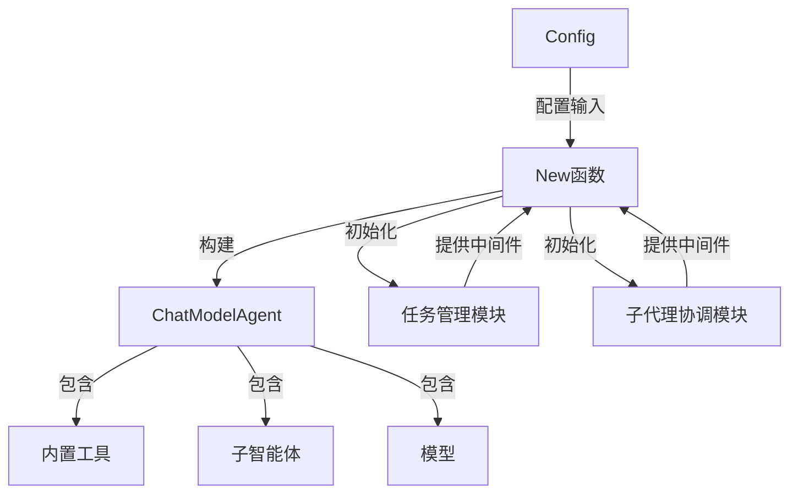

# 核心配置与构建模块

## 1. 模块概述

**核心配置与构建模块** 是 Deep Research 预构建智能体的入口与组装核心。它的作用类似于智能体的"工厂车间"，负责将各种组件（模型、工具、子智能体、中间件）按照用户配置组装成一个完整且功能强大的深度研究智能体。

这个模块解决了**智能体构建的复杂性问题**：直接使用底层组件构建一个支持多智能体协作、任务管理、工具调用的深度研究系统需要大量的胶水代码，而这个模块将这些复杂性封装在清晰的配置和构建函数中。

## 2. 架构设计

### 2.1 组件关系图



### 2.2 架构角色

整个模块采用了**工厂模式**与**中间件模式**的组合：

1. **Config 结构**：扮演"配方"的角色，定义了构建 DeepAgent 所需的所有原料
2. **New 函数**：担任"工厂车间"，负责按照配方将原料组装成最终产品
3. **中间件系统**：作为"插件架构"，允许功能的灵活扩展与组合
4. **ChatModelAgent**：是最终的"产品"，一个功能完整的可恢复智能体

## 3. 核心组件解析

### 3.1 Config 结构

**设计意图**：Config 结构是 DeepAgent 的"配置中心"，它采用了**选项模式**的思想，将所有配置集中在一个结构体中，同时提供合理的默认值，使得智能体的配置既灵活又易用。

```go
type Config struct {
    // 基础标识
    Name string        // 智能体的唯一标识符
    Description string // 智能体能力的简短描述
    
    // 核心组件
    ChatModel model.ToolCallingChatModel  // 用于推理和任务执行的模型
    SubAgents []adk.Agent                  // 可被调用的子智能体集合
    ToolsConfig adk.ToolsConfig            // 工具及工具调用配置
    
    // 行为控制
    Instruction string     // 指导智能体行为的系统提示词
    MaxIteration int       // 限制推理迭代的最大次数
    
    // 功能开关
    WithoutWriteTodos bool          // 是否禁用内置的 write_todos 工具
    WithoutGeneralSubAgent bool     // 是否禁用通用子智能体
    
    // 扩展点
    TaskToolDescriptionGenerator func(...) (string, error) // 自定义任务工具描述
    Middlewares []adk.AgentMiddleware                       // 用户自定义中间件
    ModelRetryConfig *adk.ModelRetryConfig                  // 模型重试配置
    
    // 输出配置
    OutputKey string // 用于在会话中存储智能体响应的键
}
```

**设计亮点**：
- **分层配置**：将配置分为基础标识、核心组件、行为控制、功能开关、扩展点、输出配置等几个逻辑组，使得配置结构清晰易懂
- **功能可选**：通过 `WithoutWriteTodos` 和 `WithoutGeneralSubAgent` 等布尔字段，允许用户选择性地禁用某些内置功能
- **扩展友好**：提供 `Middlewares` 和 `TaskToolDescriptionGenerator` 等扩展点，允许用户在不修改核心代码的情况下定制行为
- **合理默认**：对于 `Instruction` 等字段，当用户未提供时会使用内置默认值，降低使用门槛

### 3.2 New 函数

**设计意图**：New 函数是 DeepAgent 的"组装线"，它按照 Config 的配置，将各种组件组装成一个完整的智能体。这个函数体现了**依赖注入**和**中间件组合**的设计思想。

```go
func New(ctx context.Context, cfg *Config) (adk.ResumableAgent, error) {
    // 步骤1: 构建内置中间件
    middlewares, err := buildBuiltinAgentMiddlewares(cfg.WithoutWriteTodos)
    if err != nil {
        return nil, err
    }
    
    // 步骤2: 设置默认系统提示词
    instruction := cfg.Instruction
    if len(instruction) == 0 {
        instruction = baseAgentInstruction
    }
    
    // 步骤3: 有条件地添加任务工具中间件
    if !cfg.WithoutGeneralSubAgent || len(cfg.SubAgents) > 0 {
        tt, err := newTaskToolMiddleware(...)
        if err != nil {
            return nil, fmt.Errorf("failed to new task tool: %w", err)
        }
        middlewares = append(middlewares, tt)
    }
    
    // 步骤4: 构建并返回最终的 ChatModelAgent
    return adk.NewChatModelAgent(ctx, &adk.ChatModelAgentConfig{
        Name:          cfg.Name,
        Description:   cfg.Description,
        Instruction:   instruction,
        Model:         cfg.ChatModel,
        ToolsConfig:   cfg.ToolsConfig,
        MaxIterations: cfg.MaxIteration,
        Middlewares:   append(middlewares, cfg.Middlewares...),
        GenModelInput: genModelInput,
        ModelRetryConfig: cfg.ModelRetryConfig,
        OutputKey:        cfg.OutputKey,
    })
}
```

**数据流程**：

1. **配置验证与默认值设置**：
   - 检查并构建内置中间件
   - 如未提供指令，则使用默认指令
   
2. **条件组件激活**：
   - 根据配置决定是否启用任务工具中间件
   - 这是一个关键设计点：只有在需要时（有子智能体或未禁用通用子智能体）才加载相关组件

3. **最终组装**：
   - 将所有组件（内置中间件、用户中间件、模型、工具等）组合在一起
   - 委托给 `adk.NewChatModelAgent` 完成最终的智能体创建

### 3.3 内置中间件构建

**设计意图**：`buildBuiltinAgentMiddlewares` 函数负责构建 DeepAgent 的内置中间件，这体现了**功能模块化**的设计思想——每个功能都被封装为一个中间件，可以独立启用或禁用。

```go
func buildBuiltinAgentMiddlewares(withoutWriteTodos bool) ([]adk.AgentMiddleware, error) {
    var ms []adk.AgentMiddleware
    if !withoutWriteTodos {
        t, err := newWriteTodos()
        if err != nil {
            return nil, err
        }
        ms = append(ms, t)
    }
    return ms, nil
}
```

**writeTodos 工具**：
- 这是一个内置的任务管理工具，允许智能体维护一个待办事项列表
- 它通过 `adk.AddSessionValue` 将待办事项存储在会话中，实现了任务状态的持久化
- 工具描述和使用说明被封装在中间件的 `AdditionalInstruction` 中

## 4. 设计决策与权衡

### 4.1 配置集中式 vs 配置分散式

**决策**：采用集中式 Config 结构

**原因**：
- **可发现性**：用户可以在一个地方看到所有可用的配置选项
- **一致性**：确保配置的处理逻辑在一个地方，减少了配置分散可能导致的不一致
- **可扩展性**：添加新配置选项时，只需在 Config 结构中添加一个字段，不需要修改函数签名

**权衡**：
- Config 结构可能变得很大，但通过字段分组和合理的注释可以缓解这个问题
- 相比函数参数列表爆炸，集中式配置仍然是更好的选择

### 4.2 功能默认启用 vs 默认禁用

**决策**：内置功能默认启用，通过 `Without*` 选项禁用

**原因**：
- **开箱即用**：用户可以获得完整功能的智能体，不需要手动启用各个功能
- **渐进式学习**：用户可以先使用默认配置，然后根据需要逐步禁用不需要的功能

**权衡**：
- 可能会包含用户不需要的功能，增加一点点开销
- 但对于大多数用户，便利性超过了微小的性能开销

### 4.3 中间件组合 vs 继承

**决策**：采用中间件模式而不是继承

**原因**：
- **灵活性**：中间件可以按需组合，而继承会导致类爆炸
- **关注点分离**：每个中间件负责一个特定功能，代码更清晰
- **可测试性**：中间件可以独立测试

**权衡**：
- 中间件的执行顺序需要小心管理
- 中间件之间的依赖关系需要明确文档化

### 4.4 条件加载 vs 始终加载

**决策**：根据配置条件性地加载组件

**原因**：
- **资源效率**：不加载不需要的组件，节省内存和初始化时间
- **清晰性**：只有相关的功能会出现在智能体的工具箱中，减少了智能体的困惑

**权衡**：
- 增加了代码的复杂性，需要处理各种条件组合
- 但通过清晰的条件判断和错误处理，可以控制这种复杂性

## 5. 依赖关系分析

### 5.1 依赖图

```
核心配置与构建模块
├── 任务管理模块 (write_todos 工具)
├── 子代理协调模块 (newTaskToolMiddleware)
├── adk.chatmodel (NewChatModelAgent, ChatModelAgentConfig)
├── components.model (ToolCallingChatModel)
├── components.tool (BaseTool)
└── schema (Message, RegisterName)
```

### 5.2 关键依赖说明

1. **adk.chatmodel**：
   - 这是核心依赖，DeepAgent 本质上是一个配置好的 ChatModelAgent
   - Config 中的大部分字段最终都会传递给 ChatModelAgentConfig

2. **子代理协调模块**：
   - 负责创建协调子智能体的任务工具中间件
   - 它是 DeepAgent 实现多智能体协作的关键

3. **任务管理模块**：
   - 提供 write_todos 工具，让智能体能够管理自己的任务列表
   - 这是 DeepAgent 与普通 ChatModelAgent 的区别之一

## 6. 使用指南与示例

### 6.1 基本使用

```go
// 创建最基本的 DeepAgent
agent, err := deep.New(ctx, &deep.Config{
    Name:        "我的研究助手",
    Description: "一个可以帮助进行深度研究的智能体",
    ChatModel:   myChatModel, // 预先创建好的 ToolCallingChatModel
})
```

### 6.2 高级配置

```go
// 创建一个配置完整的 DeepAgent
agent, err := deep.New(ctx, &deep.Config{
    Name:        "高级研究助手",
    Description: "一个功能强大的研究助手，可以调用子智能体和工具",
    ChatModel:   myChatModel,
    Instruction: "你是一个专业的研究助手，请按照以下步骤进行研究...",
    SubAgents:   []adk.Agent{webSearchAgent, dataAnalysisAgent}, // 子智能体
    ToolsConfig: adk.ToolsConfig{
        Tools: []tool.BaseTool{myCustomTool}, // 自定义工具
    },
    MaxIteration: 10, // 最多迭代10次
    WithoutWriteTodos: false, // 启用任务管理
    WithoutGeneralSubAgent: false, // 启用通用子智能体
    Middlewares: []adk.AgentMiddleware{myMiddleware}, // 自定义中间件
    OutputKey: "research_result", // 输出键
})
```

### 6.3 自定义任务工具描述

```go
agent, err := deep.New(ctx, &deep.Config{
    // ... 其他配置
    TaskToolDescriptionGenerator: func(ctx context.Context, availableAgents []adk.Agent) (string, error) {
        // 自定义任务工具的描述
        return fmt.Sprintf("可用于调用以下专业智能体: %s", getAgentNames(availableAgents)), nil
    },
})
```

## 7. 常见陷阱与注意事项

1. **配置顺序问题**：
   - 中间件的顺序很重要，内置中间件会先于用户中间件执行
   - 如果你需要在内置中间件之前执行某些逻辑，需要特殊处理

2. **子智能体初始化**：
   - 子智能体应该在传入 Config 之前完全初始化
   - 避免在子智能体初始化中进行耗时操作，这会阻塞 DeepAgent 的创建

3. **会话状态管理**：
   - 使用 OutputKey 时，确保键名不会与其他会话键冲突
   - 会话状态在智能体的多次调用之间是持久的，注意清理不需要的状态

4. **错误处理**：
   - New 函数返回的错误应该被正确处理，不要忽略
   - 常见错误包括：必需字段缺失、模型初始化失败、中间件创建失败

## 8. 扩展点与定制

这个模块设计了几个关键的扩展点，允许用户在不修改核心代码的情况下定制 DeepAgent 的行为：

1. **自定义中间件**：通过 `Config.Middlewares` 字段添加
2. **自定义任务工具描述**：通过 `Config.TaskToolDescriptionGenerator` 函数
3. **自定义系统提示词**：通过 `Config.Instruction` 字段
4. **自定义工具**：通过 `Config.ToolsConfig` 字段
5. **自定义模型重试策略**：通过 `Config.ModelRetryConfig` 字段

每个扩展点都有明确的用途和使用方式，用户可以根据需要选择合适的扩展点。

## 9. 相关模块链接

- [任务管理模块](任务管理模块.md)
- [子代理协调模块](子代理协调模块.md)
- [ChatModelAgent](ADK_ChatModel_Agent.md)
