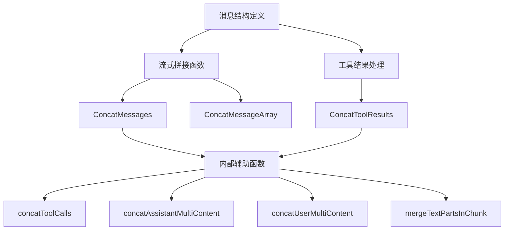

# 消息与流式拼接子模块技术深度解析

## 1. 引言

在构建基于大语言模型(LLM)的应用时，流式输出和消息拼接是两个核心需求。流式输出允许模型在生成内容时实时反馈，提升用户体验；而消息拼接则负责将分散的消息片段或流式输出组装成完整的对话上下文。本模块正是为了解决这些问题而设计的，它提供了一套完整的消息结构定义和流式拼接机制，让开发者能够轻松处理对话历史、多模态内容和工具调用结果。

## 2. 核心概念与架构

### 2.1 问题背景

在对话系统中，我们经常面临以下挑战：
- 如何处理流式输出的消息片段，将它们组装成完整的回复？
- 如何合并多个工具调用的结果，特别是当这些结果包含多模态内容时？
- 如何确保消息结构的一致性，同时支持文本、图片、音频、视频等多种内容类型？
- 如何高效地管理对话历史，包括用户输入、助手回复和工具执行结果？

### 2.2 核心设计思路

本模块采用了"分块处理、智能拼接"的设计理念。它将消息拆分为可组合的部分，然后提供专门的拼接函数来处理不同类型的内容。核心思想是：
1. **统一消息结构**：定义了一套完整的消息类型，支持多种角色和内容格式
2. **流式友好设计**：每个消息部分都设计为可以独立传输和拼接
3. **多模态支持**：不仅支持文本，还支持图片、音频、视频等多种内容类型
4. **工具调用集成**：内置了工具调用和结果处理的机制

### 2.3 架构概览



## 3. 核心组件详解

### 3.1 Message 结构体

`Message` 是整个模块的核心数据结构，它代表了对话中的一条消息，可以是用户输入、助手回复、系统消息或工具执行结果。

```go
type Message struct {
    Role RoleType `json:"role"`
    Content string `json:"content"`
    UserInputMultiContent []MessageInputPart `json:"user_input_multi_content,omitempty"`
    AssistantGenMultiContent []MessageOutputPart `json:"assistant_output_multi_content,omitempty"`
    Name string `json:"name,omitempty"`
    ToolCalls []ToolCall `json:"tool_calls,omitempty"`
    ToolCallID string `json:"tool_call_id,omitempty"`
    ToolName string `json:"tool_name,omitempty"`
    ResponseMeta *ResponseMeta `json:"response_meta,omitempty"`
    ReasoningContent string `json:"reasoning_content,omitempty"`
    Extra map[string]any `json:"extra,omitempty"`
}
```

**设计要点**：
- **角色分离**：通过 `Role` 字段区分不同来源的消息（用户、助手、系统、工具）
- **内容多态**：支持简单文本内容（`Content`）和复杂多模态内容（`UserInputMultiContent`/`AssistantGenMultiContent`）
- **工具集成**：内置了工具调用（`ToolCalls`）和工具结果（`ToolCallID`/`ToolName`）的支持
- **元数据扩展**：通过 `Extra` 字段支持自定义扩展信息

### 3.2 多模态内容部分

模块定义了两套多模态内容部分结构：
- `MessageInputPart`：用于用户输入的多模态内容
- `MessageOutputPart`：用于助手生成的多模态内容

这两种结构都支持文本、图片、音频、视频和文件类型，并且可以通过 `URL` 或 `Base64Data` 两种方式提供内容。

**设计考虑**：
- 分离输入和输出结构，允许两者有不同的特性（如输入图片有 `Detail` 字段控制质量）
- 支持 URL 和 Base64 两种内容提供方式，适应不同的使用场景
- 通过 `MessagePartCommon` 结构体复用公共字段，保持代码简洁

### 3.3 工具调用与结果

模块提供了完整的工具调用支持：
- `ToolCall`：表示一个工具调用，包含 ID、类型和函数信息
- `ToolResult`：表示工具执行的结果，支持多模态内容输出

```go
type ToolCall struct {
    Index *int `json:"index,omitempty"`
    ID string `json:"id"`
    Type string `json:"type"`
    Function FunctionCall `json:"function"`
    Extra map[string]any `json:"extra,omitempty"`
}

type ToolResult struct {
    Parts []ToolOutputPart `json:"parts,omitempty"`
}
```

**设计亮点**：
- `ToolCall` 的 `Index` 字段用于流式场景下的分片合并
- `ToolResult` 支持多模态输出，工具可以返回文本、图片、音频等多种类型的结果
- 提供了 `ToMessageInputParts()` 方法，方便将工具结果转换为消息输入部分

## 4. 流式拼接机制详解

### 4.1 ConcatMessages 函数

`ConcatMessages` 是模块中最核心的函数，它负责将多个消息片段拼接成一个完整的消息。

**功能特性**：
- 检查所有消息的角色和名称是否一致
- 拼接文本内容和推理内容
- 合并工具调用（通过索引匹配）
- 处理多模态内容
- 合并响应元数据和扩展信息

**拼接策略**：
```go
func ConcatMessages(msgs []*Message) (*Message, error) {
    // 1. 初始化各种内容收集器
    // 2. 遍历所有消息，收集各种内容
    // 3. 检查角色、名称等一致性
    // 4. 合并文本内容
    // 5. 合并工具调用
    // 6. 合并多模态内容
    // 7. 合并元数据
    // 8. 返回合并后的消息
}
```

**设计考虑**：
- 严格的一致性检查：确保所有要拼接的消息具有相同的角色和名称，避免意外合并不相关的消息
- 智能的工具调用合并：通过 `Index` 字段匹配属于同一工具调用的片段
- 高效的字符串拼接：预分配足够的缓冲区，减少内存分配
- 完整的元数据处理：不仅处理内容，还处理响应元数据、使用情况等

### 4.2 ConcatToolResults 函数

`ConcatToolResults` 专门用于合并工具执行结果的多个分片。

**合并规则**：
- 文本部分：将同一分块内的连续文本部分合并
- 非文本部分：保持原样，但不允许同一种非文本类型出现在多个分块中

**设计理由**：
- 文本内容通常会被分成多个片段流式输出，所以需要合并
- 非文本内容（如图片、音频）通常是完整传输的，不需要合并，且不应该分散在多个分块中

### 4.3 内部辅助函数

模块包含多个专门的辅助函数，处理不同类型内容的拼接：

- `concatToolCalls`：合并工具调用，通过索引匹配分片
- `concatAssistantMultiContent`：合并助手生成的多模态内容，特殊处理文本和 Base64 音频
- `concatUserMultiContent`：合并用户输入的多模态内容，主要处理文本部分
- `mergeTextPartsInChunk`：在单个工具结果分块内合并连续的文本部分

## 5. 数据流程分析

### 5.1 流式消息拼接流程

```
┌─────────────┐     ┌─────────────┐     ┌─────────────┐     ┌─────────────┐
│ 消息片段 1   │     │ 消息片段 2   │     │ 消息片段 3   │     │ 消息片段 n   │
└──────┬──────┘     └──────┬──────┘     └──────┬──────┘     └──────┬──────┘
       │                   │                   │                   │
       └───────────────────┴───────────────────┴───────────────────┘
                           │
                           ▼
                  ┌─────────────────┐
                  │  ConcatMessages │
                  └────────┬────────┘
                           │
            ┌──────────────┼──────────────┐
            │              │              │
            ▼              ▼              ▼
    ┌─────────────┐ ┌──────────┐ ┌─────────────┐
    │ 文本内容合并 │ │工具调用合并│ │多模态内容合并│
    └─────────────┘ └──────────┘ └─────────────┘
            │              │              │
            └──────────────┼──────────────┘
                           │
                           ▼
                  ┌─────────────────┐
                  │   完整消息       │
                  └─────────────────┘
```

### 5.2 工具结果拼接流程

```
┌──────────────┐     ┌──────────────┐     ┌──────────────┐
│ 工具结果分块1 │     │ 工具结果分块2 │     │ 工具结果分块3 │
└──────┬───────┘     └──────┬───────┘     └──────┬───────┘
       │                     │                     │
       └─────────────────────┴─────────────────────┘
                           │
                           ▼
              ┌───────────────────────┐
              │  ConcatToolResults    │
              └───────────┬───────────┘
                          │
          ┌───────────────┼───────────────┐
          │               │               │
          ▼               ▼               ▼
 ┌────────────────┐ ┌────────────────┐ ┌────────────────┐
 │分块内文本合并   │ │非文本类型检查   │ │所有部分收集     │
 └────────────────┘ └────────────────┘ └────────────────┘
          │               │               │
          └───────────────┼───────────────┘
                          │
                          ▼
                 ┌─────────────────┐
                 │ 完整工具结果     │
                 └─────────────────┘
```

## 6. 设计决策与权衡

### 6.1 消息结构设计：简单与复杂的平衡

**决策**：同时提供简单的 `Content` 字段和复杂的多模态内容字段

**权衡分析**：
- ✅ 优点：满足不同复杂度的使用场景，简单场景用简单字段，复杂场景用复杂字段
- ❌ 缺点：增加了结构的复杂性，使用者需要理解不同字段的使用场景
- **理由**：在实际应用中，大多数场景只需要简单的文本内容，但某些场景需要多模态支持。同时提供两种方式可以让模块适应更广泛的使用场景。

### 6.2 流式拼接：严格一致性 vs 灵活性

**决策**：在拼接消息时严格检查角色和名称的一致性

**权衡分析**：
- ✅ 优点：避免意外合并不相关的消息，提高安全性
- ❌ 缺点：降低了灵活性，某些特殊场景下可能需要先手动修改消息才能拼接
- **理由**：在大多数流式场景中，要拼接的消息片段确实应该具有相同的角色和名称。严格检查可以帮助开发者及时发现错误，而不是在后期出现难以调试的问题。

### 6.3 工具结果拼接：非文本内容唯一性约束

**决策**：同一种非文本类型（如图片）不能出现在多个工具结果分块中

**权衡分析**：
- ✅ 优点：简化了拼接逻辑，避免了复杂的多模态内容合并
- ❌ 缺点：限制了工具输出的方式，某些场景下可能不够灵活
- **理由**：在实际应用中，非文本内容通常作为一个整体传输，而不是分片传输。这个约束符合大多数实际场景，同时简化了实现。

## 7. 使用指南与最佳实践

### 7.1 基本使用场景

**场景 1：拼接流式输出的消息**

```go
var msgs []*schema.Message
for {
    msg, err := stream.Recv()
    if errors.Is(err, io.EOF) {
        break
    }
    if err != nil {
        // 处理错误
    }
    msgs = append(msgs, msg)
}

concatedMsg, err := schema.ConcatMessages(msgs)
if err != nil {
    // 处理错误
}
```

**场景 2：使用多模态内容**

```go
// 用户输入多模态消息
userMsg := &schema.Message{
    Role: schema.User,
    UserInputMultiContent: []schema.MessageInputPart{
        {
            Type: schema.ChatMessagePartTypeText,
            Text: "这张图片里有什么？",
        },
        {
            Type: schema.ChatMessagePartTypeImageURL,
            Image: &schema.MessageInputImage{
                MessagePartCommon: schema.MessagePartCommon{
                    URL: &imageURL,
                },
                Detail: schema.ImageURLDetailHigh,
            },
        },
    },
}

// 处理助手输出的多模态消息
if len(assistantMsg.AssistantGenMultiContent) > 0 {
    for _, part := range assistantMsg.AssistantGenMultiContent {
        switch part.Type {
        case schema.ChatMessagePartTypeText:
            // 处理文本
        case schema.ChatMessagePartTypeImageURL:
            // 处理图片
        // ... 其他类型
        }
    }
}
```

**场景 3：处理工具结果**

```go
// 创建工具结果
toolResult := &schema.ToolResult{
    Parts: []schema.ToolOutputPart{
        {
            Type: schema.ToolPartTypeText,
            Text: "搜索结果：",
        },
        {
            Type: schema.ToolPartTypeImage,
            Image: &schema.ToolOutputImage{
                MessagePartCommon: schema.MessagePartCommon{
                    URL: &resultImageURL,
                },
            },
        },
    },
}

// 转换为消息输入部分
inputParts, err := toolResult.ToMessageInputParts()
if err != nil {
    // 处理错误
}

// 创建工具消息
toolMsg := &schema.Message{
    Role:               schema.Tool,
    ToolCallID:         toolCallID,
    UserInputMultiContent: inputParts,
}
```

### 7.2 最佳实践

1. **始终检查拼接错误**：`ConcatMessages` 和 `ConcatToolResults` 都会返回错误，不要忽略这些错误
2. **优先使用新的多模态字段**：虽然保留了 `MultiContent` 字段，但应该优先使用 `UserInputMultiContent` 和 `AssistantGenMultiContent`
3. **合理使用 Base64 和 URL**：小文件可以用 Base64 嵌入，大文件建议用 URL 引用
4. **流式场景下注意 Index 字段**：在流式输出工具调用时，确保正确设置 `Index` 字段，以便正确合并
5. **扩展信息使用 Extra 字段**：如果需要在消息中添加自定义信息，使用 `Extra` 字段而不是修改结构

## 8. 注意事项与常见问题

### 8.1 注意事项

1. **消息一致性**：拼接消息前确保所有消息具有相同的角色和名称，否则会报错
2. **非文本内容约束**：在拼接工具结果时，同一种非文本类型不能出现在多个分块中
3. **已弃用字段**：注意 `MultiContent` 等已弃用的字段，避免在新代码中使用
4. **深拷贝问题**：模块中的拼接函数通常会创建新的对象，而不是修改输入对象
5. **并发安全**：模块中的函数本身是并发安全的，但如果在多个 goroutine 中共享消息对象，需要额外的同步机制

### 8.2 常见问题

**Q: 为什么拼接消息时会报错 "cannot concat messages with different roles"？**

A: 这是因为你尝试拼接的消息具有不同的角色。在流式场景中，要拼接的消息片段通常应该具有相同的角色。如果你确实需要合并不同角色的消息，应该先分别拼接相同角色的消息，然后再处理它们之间的关系。

**Q: 如何处理工具结果中的多个图片？**

A: 目前的 `ConcatToolResults` 函数不允许同一种非文本类型出现在多个分块中，但在同一个分块中可以有多个相同类型的部分。所以你可以将所有图片放在同一个工具结果分块中。

**Q: 拼接后的消息会保留原消息的哪些属性？**

A: 拼接后的消息会保留所有可以合并的属性，包括文本内容、推理内容、工具调用、多模态内容等。对于元数据，通常会保留最后一个非空值（如 `FinishReason`）或最大值（如 token 使用量）。

## 9. 总结

消息与流式拼接子模块是一个精心设计的模块，它解决了对话系统中消息结构定义和流式输出拼接的核心问题。通过统一的消息结构、智能的拼接机制和完整的多模态支持，它为构建复杂的对话应用提供了坚实的基础。

模块的设计体现了简单性与灵活性的平衡，既满足了常见场景的需求，又为复杂场景提供了扩展空间。虽然有一些约束和限制，但这些都是基于实际应用场景的考虑，有助于避免常见的错误。

对于新加入团队的开发者，理解本模块的设计思想和使用方法，将有助于快速上手对话系统的开发，并构建出高质量的应用。
