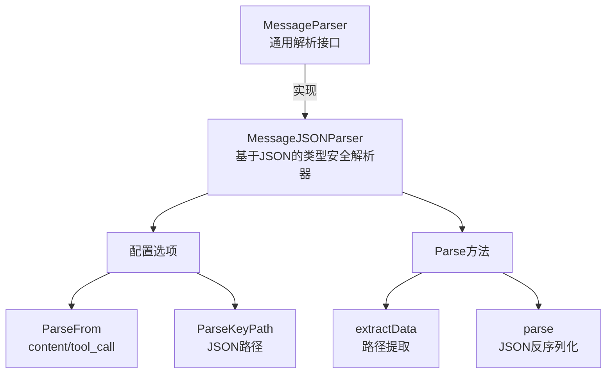

# 消息解析子模块技术深度解析

## 1. 模块概述

### 问题背景

在构建对话式AI系统时，我们经常需要从模型输出的消息中提取结构化数据。这些消息可能来自：
- 模型直接返回的文本内容（Content）
- 工具调用（Tool Call）中的函数参数
- 嵌套在JSON结构中的特定字段

一个简单的JSON反序列化往往无法满足复杂场景的需求：
- 数据来源不固定（Content或ToolCall）
- 需要提取JSON中的特定路径字段
- 需要保持类型安全，避免运行时类型断言错误

### 解决方案

消息解析子模块提供了一个通用的、类型安全的消息解析框架，通过`MessageParser`接口定义了统一的解析行为，并提供了基于JSON的默认实现`MessageJSONParser`。

## 2. 核心概念与心智模型

### 核心抽象

```
MessageParser[T] → 从Message中提取T类型数据
    ↓
MessageJSONParser[T] → 基于JSON的实现
    ↓
配置驱动：ParseFrom + ParseKeyPath
```

### 心智模型

可以将`MessageJSONParser`想象成一个**智能数据提取器**：
1. **选择数据源**：像切换水龙头一样，从Content或ToolCall中选择数据来源
2. **定位目标数据**：像使用文件路径一样，通过`ParseKeyPath`在JSON中导航到目标字段
3. **类型安全转换**：像精密模具一样，将原始JSON数据铸造成指定的类型T

## 3. 架构与数据流程

### 核心组件关系



### 数据流程详解

当调用`Parse`方法时，数据流向如下：

1. **数据源选择**：
   - 根据`ParseFrom`配置，从`Message.Content`或`Message.ToolCalls[0].Function.Arguments`获取原始数据
   - 如果选择`tool_call`但没有工具调用，返回错误

2. **数据提取（可选）**：
   - 如果配置了`ParseKeyPath`，通过`extractData`方法提取指定路径的数据
   - 使用`sonic.GetFromString`进行高效的JSON路径导航
   - 将提取的节点重新序列化为JSON字符串

3. **类型安全反序列化**：
   - 使用`sonic.UnmarshalString`将JSON字符串反序列化为类型T
   - 整个过程保持泛型类型安全，无需运行时类型断言

## 4. 核心组件深度解析

### MessageParser[T] 接口

```go
type MessageParser[T any] interface {
    Parse(ctx context.Context, m *Message) (T, error)
}
```

**设计意图**：
- 定义了统一的消息解析契约
- 使用泛型确保类型安全，避免返回`interface{}`
- 接收`context.Context`以支持未来的扩展（如超时、取消、追踪等）

### MessageJSONParseConfig 结构体

```go
type MessageJSONParseConfig struct {
    ParseFrom    MessageParseFrom `json:"parse_from,omitempty"`
    ParseKeyPath string            `json:"parse_key_path,omitempty"`
}
```

**字段说明**：
- `ParseFrom`：指定数据来源，默认为`content`
- `ParseKeyPath`：JSON路径表达式，如`"user.address.city"`，默认为空

**设计意图**：
- 通过配置而非代码逻辑来控制解析行为，提高灵活性
- 支持JSON序列化，便于从配置文件或外部系统加载解析规则

### MessageJSONParser[T] 结构体

```go
type MessageJSONParser[T any] struct {
    ParseFrom    MessageParseFrom
    ParseKeyPath string
}
```

**核心方法解析**：

#### Parse 方法

```go
func (p *MessageJSONParser[T]) Parse(ctx context.Context, m *Message) (parsed T, err error)
```

**功能**：解析Message为类型T

**流程**：
1. 根据`ParseFrom`选择数据源
2. 调用`parse`方法处理数据
3. 返回解析结果或错误

**设计意图**：
- 保持方法简洁，将复杂逻辑委托给辅助方法
- 清晰的错误处理，便于调试

#### extractData 方法

```go
func (p *MessageJSONParser[T]) extractData(data string) (string, error)
```

**功能**：从JSON字符串中提取指定路径的数据

**实现细节**：
- 使用`strings.Split`将路径拆分为键数组
- 转换为`[]any`类型以适配`sonic.GetFromString`的API
- 使用`sonic`库进行高效的JSON操作

**设计意图**：
- 支持嵌套JSON结构的数据提取
- 通过`sonic`库保证高性能
- 返回JSON字符串而非中间结构，保持灵活性

#### parse 方法

```go
func (p *MessageJSONParser[T]) parse(data string) (parsed T, err error)
```

**功能**：将JSON字符串解析为类型T

**流程**：
1. 调用`extractData`提取数据
2. 使用`sonic.UnmarshalString`反序列化
3. 返回类型安全的结果

**设计意图**：
- 将数据提取和反序列化分离，提高可测试性
- 使用泛型确保类型安全

## 5. 依赖关系分析

### 外部依赖

- **github.com/bytedance/sonic**：高性能JSON库
  - 用于JSON路径查询和反序列化
  - 相比标准库`encoding/json`有显著的性能优势

### 内部依赖

- **schema.message.Message**：消息结构定义
  - 解析器的输入数据类型
  - 包含Content和ToolCalls等字段

### 被依赖关系

根据模块树结构，该模块是`Schema Core Types`的子模块，可能被以下组件依赖：
- 消息处理管道
- 工具调用处理逻辑
- 对话状态管理组件

## 6. 设计决策与权衡

### 决策1：使用泛型而非interface{}

**选择**：使用`MessageParser[T]`泛型接口

**原因**：
- 提供编译时类型安全
- 避免调用方进行类型断言
- 提高代码可读性和可维护性

**权衡**：
- ✅ 优点：类型安全、代码清晰
- ❌ 缺点：Go 1.18+才能使用，不同类型需要不同的解析器实例

### 决策2：配置驱动的解析行为

**选择**：通过`MessageJSONParseConfig`配置解析行为

**原因**：
- 提高灵活性，无需修改代码即可改变解析逻辑
- 支持从配置文件或外部系统加载解析规则
- 便于测试不同的解析策略

**权衡**：
- ✅ 优点：灵活、可配置、易于测试
- ❌ 缺点：增加了配置的复杂性

### 决策3：使用sonic库而非标准库

**选择**：使用`github.com/bytedance/sonic`进行JSON操作

**原因**：
- sonic在JSON解析和序列化方面性能优异
- 提供了便捷的JSON路径查询API
- 由字节跳动维护，可靠性有保障

**权衡**：
- ✅ 优点：高性能、功能丰富
- ❌ 缺点：增加了外部依赖

### 决策4：只支持单个ToolCall

**选择**：当`ParseFrom`为`tool_call`时，只处理`ToolCalls[0]`

**原因**：
- 简化API设计
- 覆盖大多数常见场景（单个工具调用）
- 如果需要处理多个工具调用，可以在外部循环处理

**权衡**：
- ✅ 优点：API简洁、覆盖常见场景
- ❌ 缺点：不直接支持多个工具调用的场景

## 7. 使用指南与示例

### 基本用法：从Content解析

```go
type UserInfo struct {
    Name string `json:"name"`
    Age  int    `json:"age"`
}

config := &schema.MessageJSONParseConfig{
    ParseFrom: schema.MessageParseFromContent,
}
parser := schema.NewMessageJSONParser[UserInfo](config)

// message.Content = `{"name":"Alice","age":30}`
user, err := parser.Parse(ctx, message)
if err != nil {
    // 处理错误
}
fmt.Printf("User: %+v\n", user)
```

### 从ToolCall解析

```go
type GetUserParam struct {
    UserID string `json:"user_id"`
}

config := &schema.MessageJSONParseConfig{
    ParseFrom: schema.MessageParseFromToolCall,
}
parser := schema.NewMessageJSONParser[GetUserParam](config)

// message.ToolCalls[0].Function.Arguments = `{"user_id":"123"}`
param, err := parser.Parse(ctx, message)
if err != nil {
    // 处理错误
}
fmt.Printf("UserID: %s\n", param.UserID)
```

### 使用JSON路径提取

```go
type Address struct {
    City string `json:"city"`
}

config := &schema.MessageJSONParseConfig{
    ParseFrom:    schema.MessageParseFromContent,
    ParseKeyPath: "user.address",
}
parser := schema.NewMessageJSONParser[Address](config)

// message.Content = `{"user":{"address":{"city":"Beijing"}}}`
address, err := parser.Parse(ctx, message)
if err != nil {
    // 处理错误
}
fmt.Printf("City: %s\n", address.City)
```

## 8. 注意事项与最佳实践

### 常见陷阱

1. **ToolCall为空**：当`ParseFrom`为`tool_call`时，确保`Message.ToolCalls`不为空，否则会返回错误。

2. **JSON路径错误**：`ParseKeyPath`必须是有效的JSON路径，否则`extractData`会返回错误。注意路径中不要包含空格。

3. **类型不匹配**：确保目标类型T的结构与JSON数据匹配，否则反序列化会失败。

### 最佳实践

1. **错误处理**：始终检查`Parse`方法返回的错误，不要忽略。

2. **配置验证**：在创建解析器前，验证配置的有效性，特别是`ParseFrom`的值。

3. **性能考虑**：
   - 如果需要解析大量消息，考虑复用解析器实例
   - 对于简单场景，避免使用不必要的`ParseKeyPath`

4. **扩展性**：如果需要自定义解析逻辑，可以实现`MessageParser`接口，而不是修改`MessageJSONParser`。

## 9. 扩展点与未来方向

### 可能的扩展

1. **支持多个ToolCall**：添加配置选项，允许指定解析第几个ToolCall或所有ToolCall。

2. **支持数组解析**：添加对JSON数组的原生支持，方便解析列表数据。

3. **更多数据源**：扩展`ParseFrom`选项，支持从消息的其他部分提取数据。

4. **验证器集成**：添加数据验证功能，在解析后自动验证数据的有效性。

### 与其他模块的集成

- 可以与[消息与流式拼接子模块](消息与流式拼接子模块.md)集成，解析拼接后的消息
- 可以与工具定义子模块集成，根据工具定义自动创建解析器
