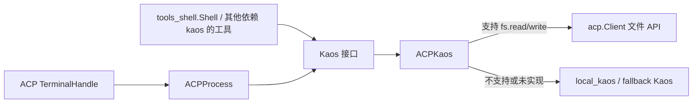
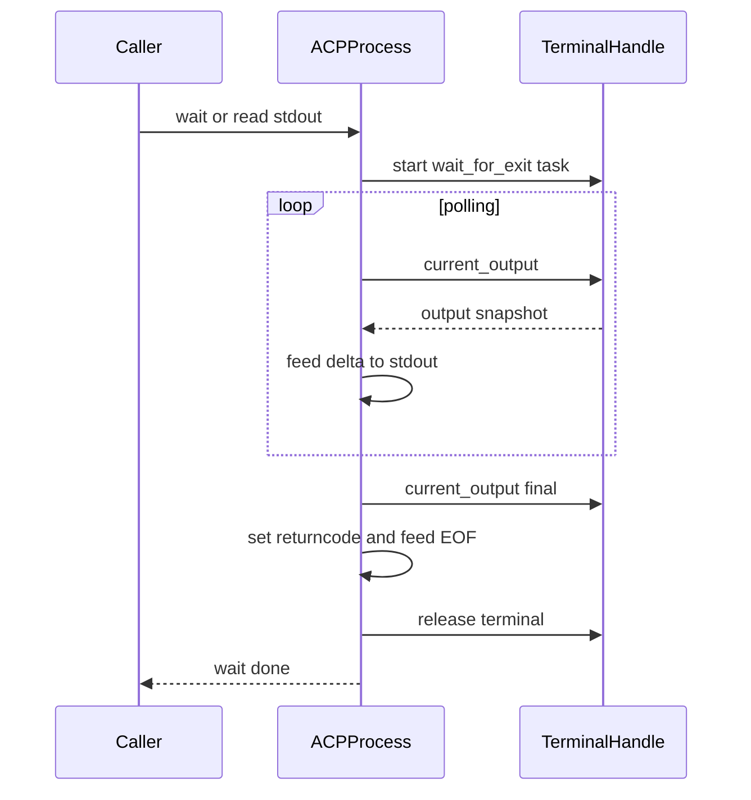
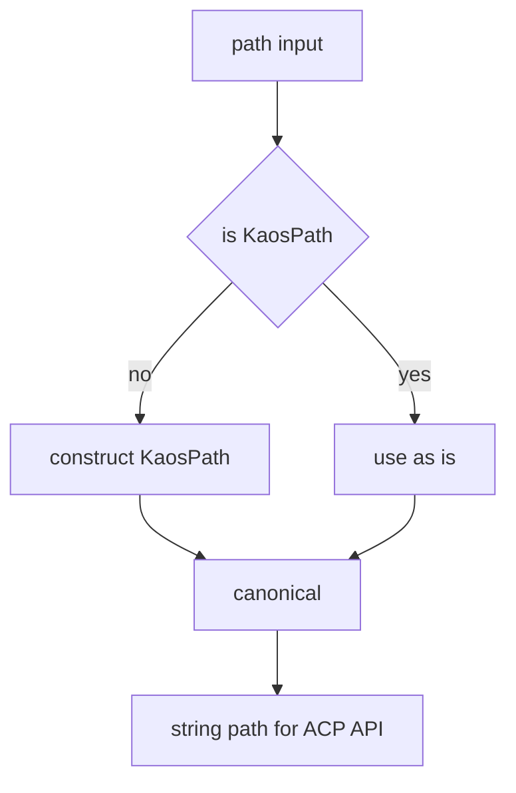

# acp_kaos 模块文档

`acp_kaos` 是 Kimi CLI 在“远程执行能力”与“本地 KAOS 抽象”之间的一层协议适配模块。它的价值不在于提供全新的文件系统或进程模型，而在于把 ACP（Agent Compute Protocol）所暴露的能力，映射成 [kaos_core](kaos_core.md) 约定的 `Kaos` / `KaosProcess` 接口形状，让上层工具（例如 [tools_shell](tools_shell.md)）尽量不关心执行环境究竟来自本地子进程，还是来自远程会话。

从当前实现看，这个模块有两个核心关注点。第一，`ACPProcess` 负责把 ACP 的 `TerminalHandle` 包装为类 `KaosProcess` 的异步进程对象，并解决 ACP 输出模型与本地流模型的语义差异。第二，`ACPKaos` 负责按能力路由读写请求：如果 ACP 客户端声明支持文件读写，就走 ACP；否则回退到 `fallback`（默认 `local_kaos`）。这是一种“能力协商 + 渐进增强”的设计：功能能用就用远端，不能用时尽量不影响系统继续工作。

需要特别说明的是：虽然文件里同时定义了 `ACPProcess` 与 `ACPKaos`，但当前 `ACPKaos.exec()` 仍直接委托给 fallback，而没有接入 `ACPProcess`。这意味着该模块在“终端执行桥接”上已经具备低层实现组件，但尚未在 `ACPKaos` 路由层完全启用。这是理解行为差异时最关键的一点。

---

## 1. 模块定位与系统关系

在系统分层中，`acp_kaos` 位于工具层与协议层之间：上接工具运行时（如 Shell tool），下接 ACP 客户端与本地 KAOS。



上图表达的重点是：`ACPKaos` 是“路由层”，`ACPProcess` 是“进程语义适配层”。在当前代码版本中，二者并非完全串联；`ACPProcess` 提供了终端适配能力，但 `ACPKaos.exec` 尚未调用它。

---

## 2. 核心组件：`ACPProcess`

### 2.1 设计目的

`ACPProcess` 的目标是实现 `KaosProcess` 协议需要的最小进程语义：`stdin/stdout/stderr` 三流、`wait()`、`kill()`、`returncode`。ACP 给出的终端接口是“可查询当前完整输出 + 等待退出”，而不是传统 OS 子进程管道，所以必须通过轮询与增量计算把它模拟成 `AsyncReadable` 流。

### 2.2 构造与状态

构造函数签名：

```python
ACPProcess(
    terminal: acp.TerminalHandle,
    *,
    poll_interval: float = 0.2,
)
```

构造时会立即初始化并启动后台任务 `_poll_output()`。核心内部状态包括：

- `_stdout` / `_stderr`：`asyncio.StreamReader`，对外暴露为 `AsyncReadable`。
- `_stdin`：`_NullWritable`，对外暴露为 `AsyncWritable`，但实际写入被吞掉。
- `_last_output`：上一次拿到的完整终端输出，用于计算增量。
- `_truncation_noted`：是否已插入截断提示，避免重复刷提示。
- `_exit_future`：`wait()` 的完成信号。
- `_poll_task`：后台轮询任务。

### 2.3 `_NullWritable` 的语义

`_NullWritable` 是一个 no-op 写入对象，实现了 `AsyncWritable` 期望的方法，但所有操作都不生效。它确保调用方即使误写 `stdin` 也不会抛接口缺失错误，同时明确表达当前 ACP 终端适配“不支持交互式输入”。

这对上层工具有实际影响：如果工具依赖“先启动进程，再向 stdin 喂数据”，则在 ACP 终端场景中不会得到预期行为。

### 2.4 输出增量算法：`_feed_output`

ACP `current_output()` 返回的是“当前累计输出文本”，而不是“新产生的一段”。`_feed_output` 做了如下转换：

1. 读取本次输出 `output_response.output`。
2. 判断是否“重置”场景：
   - `output_response.truncated` 为真；或
   - 上次输出存在，但这次不再以上次为前缀（意味着历史窗口滚动或服务端裁剪）。
3. 若发生重置且此前已有输出且尚未提示过，先写入 `"[acp output truncated]\n"`。
4. 计算增量：
   - 重置时，增量为整段新输出；
   - 否则增量为 `output[len(last_output):]`。
5. 把增量编码为 UTF-8（`errors="replace"`）写入 `_stdout`。
6. 更新 `_last_output`。

这种做法最大限度保持“流式阅读”体验，并在输出丢失风险出现时给出显式标记。

### 2.5 生命周期主循环：`_poll_output`



这条流程强调两个并发信号源：一是轮询输出，二是 `wait_for_exit()`。代码优先保证“尽量不漏最终输出”，因此在退出后还会额外拉取一次 `current_output()`。

### 2.6 公共接口行为说明

`pid` 恒为 `-1`，因为 ACP 不暴露 OS 进程号。`returncode` 在退出前是 `None`，退出后变成整数。`wait()` 等待 `_exit_future`，返回最终退出码。`kill()` 直接调用 `terminal.kill()`。

退出码标准化通过 `_normalize_exit_code()` 完成：若 ACP 返回 `None`，统一映射为 `1`。这保证了调用方不会拿到空退出码，也符合“未知失败按非零处理”的通用约定。

### 2.7 异常与副作用

如果 `_poll_output` 内发生异常，会向 stdout 注入：

```text
[acp terminal error] <异常信息>
```

然后在缺省情况下把退出码设为 1。这个策略偏向“可见失败”而非抛出到调用栈顶，适合工具链持续运行场景；代价是错误语义会被文本化，需要调用方从输出中区分业务输出与系统错误提示。

---

## 3. 核心组件：`ACPKaos`

### 3.1 设计角色

`ACPKaos` 实现 `Kaos` 协议，核心是能力探测与操作分发。它并不试图完全替代 `local_kaos`，而是作为“前置网关”：能走 ACP 的走 ACP，不能走的回落本地。

构造函数：

```python
ACPKaos(
    client: acp.Client,
    session_id: str,
    client_capabilities: acp.schema.ClientCapabilities | None,
    fallback: Kaos | None = None,
    *,
    output_byte_limit: int | None = 50_000,
    poll_interval: float = 0.2,
)
```

其中 `fallback` 缺省为 `local_kaos`。`output_byte_limit` 当前仅存储未使用，`poll_interval` 当前也仅存储，尚未在 `exec` 路由中实际驱动 `ACPProcess`。

### 3.2 能力位解析

`client_capabilities` 被转成三个布尔开关：

- `_supports_read`：`fs.read_text_file` 是否存在。
- `_supports_write`：`fs.write_text_file` 是否存在。
- `_supports_terminal`：是否声明 terminal 能力。

这些能力位决定文件读写是否使用 ACP API。

### 3.3 各方法行为分组

#### 3.3.1 委托 fallback 的方法

`pathclass`、`normpath`、`gethome`、`getcwd`、`chdir`、`stat`、`iterdir`、`glob`、`readbytes`、`writebytes`、`mkdir`、`exec` 当前都直接委托给 fallback。

这说明 ACP 侧目前只接入了“文本文件读写”这条窄路径，其余能力仍遵循本地 KAOS 语义。

#### 3.3.2 `readtext`

`readtext` 会先把路径 canonical 成绝对路径字符串（`_abs_path`），再判断能力：

- 支持读：调用 `client.read_text_file(path, session_id)` 并返回 `response.content`。
- 不支持读：回退 `fallback.readtext(...)`。

注意：虽然签名暴露 `encoding/errors`，ACP 路径实际上直接返回字符串，不经过本地解码逻辑；编码参数在 ACP 分支中不产生实质影响。

#### 3.3.3 `readlines`

实现方式是先 `readtext`，再 `splitlines(keepends=True)` 逐行 yield。这意味着它不是流式文件读取，而是“整文件入内存再切行”。大文件场景要注意内存峰值。

#### 3.3.4 `writetext`

`writetext` 需要区分覆盖写（`mode="w"`）和追加写（`mode="a"`）：

- `mode="w"`：
  - 支持 ACP 写：直接 `write_text_file(content=data)`，返回 `len(data)`。
  - 不支持：fallback。
- `mode="a"`：
  - 只有在 ACP 同时支持读+写时，才用“读旧内容 + 拼接新内容 + 整体回写”的模拟追加。
  - 否则 fallback 真追加。

这里的 ACP 追加是非原子的 read-modify-write；并发写入下可能出现覆盖冲突。

### 3.4 路径标准化：`_abs_path`

`_abs_path` 接受 `str | KaosPath`，统一转成 `KaosPath(...).canonical()` 后的字符串。这保证 ACP API 调用时路径尽量稳定、绝对、无歧义。



这一步减少了相对路径和路径格式差异带来的远端解析不一致问题。

---

## 4. 与相关模块的协作关系

`acp_kaos` 不是独立运行单元，它的价值来自“被谁调用”和“调用谁”。

与 [kaos_core](kaos_core.md) 的关系是实现关系：`ACPProcess` 对齐 `KaosProcess` 协议，`ACPKaos` 对齐 `Kaos` 协议。与 [tools_shell](tools_shell.md) 的关系是消费关系：Shell 工具通过全局 `kaos.exec` 获取进程对象并读取 `stdout/stderr`。这也是为什么 `ACPProcess` 必须提供 `readline` 可用的流接口。

与此同时，当前 `ACPKaos.exec` 仍回退本地执行，所以在真实运行中，Shell 工具能否走 ACP 终端取决于上层是否另外接入 `ACPProcess`，而不是仅靠 `ACPKaos` 本身。

---

## 5. 典型使用与扩展示例

### 5.1 初始化 `ACPKaos`

```python
acp_kaos = ACPKaos(
    client=acp_client,
    session_id=session_id,
    client_capabilities=capabilities,
    fallback=local_kaos,
)

content = await acp_kaos.readtext("/workspace/README.md")
await acp_kaos.writetext("/workspace/out.txt", "hello\n")
```

这段代码展示了最常见用途：在能力允许时，读写由 ACP 处理；否则自动回退。

### 5.2 使用 `ACPProcess` 适配终端句柄

```python
terminal = await acp_client.open_terminal(session_id=session_id, command=["bash", "-lc", "echo hi"])
proc = ACPProcess(terminal, poll_interval=0.2)

# 逐行读取 stdout
while True:
    line = await proc.stdout.readline()
    if not line:
        break
    print(line.decode("utf-8", "replace"), end="")

code = await proc.wait()
print("exit:", code)
```

当你在上层实现“ACP 原生 exec”时，这类逻辑就是把 ACP 终端纳入 KAOS 进程语义的基础。

### 5.3 可能的扩展方向：让 `ACPKaos.exec` 真正走 ACP

一个自然扩展是在 `_supports_terminal` 为真时，通过 ACP 启动终端并返回 `ACPProcess`；否则 fallback：

```python
async def exec(self, *args: str, env: Mapping[str, str] | None = None) -> KaosProcess:
    if self._supports_terminal:
        terminal = await self._client.open_terminal(
            session_id=self._session_id,
            command=list(args),
            env=dict(env) if env else None,
            output_byte_limit=self._output_byte_limit,
        )
        return ACPProcess(terminal, poll_interval=self._poll_interval)
    return await self._fallback.exec(*args, env=env)
```

以上是设计草图，不代表当前代码已实现；实际字段名需以 ACP SDK 为准。

---

## 6. 边界条件、错误场景与限制

### 6.1 交互式命令限制

因为 `stdin` 是 `_NullWritable`，所以需要用户输入的命令（例如等待密码输入）在 ACPProcess 场景下不可交互。调用方应优先使用非交互参数（如 token、环境变量、配置文件）。

### 6.2 输出截断与日志可信度

出现 `[acp output truncated]` 表示中间历史可能已丢失。对于依赖“完整日志”的场景（调试、审计、测试断言），应把 ACP 终端输出窗口限制与轮询策略一起评估，必要时改用文件落盘再读取。

### 6.3 退出码不确定性

ACP 返回 `exit_code=None` 时会被归一化成 `1`。这对上层是安全的（失败即非零），但不能区分“明确失败 1”和“未知失败被映射 1”。

### 6.4 `writetext(mode="a")` 并发风险

ACP 追加是“读旧值 + 本地拼接 + 全量写回”，非原子。在并发写同一文件时可能丢更新。若业务需要强一致追加，应该让服务端提供原子 append 能力。

### 6.5 编码参数语义差异

`readtext`/`writetext` 暴露 `encoding/errors` 以对齐 Kaos 接口，但 ACP 分支处理的是文本内容，不经过本地字节编解码，参数只在 fallback 分支真正生效。

### 6.6 大文件读取内存峰值

`readlines` 依赖 `readtext` 全量读取，不适合超大文本。若要支持流式，应在 ACP 协议层增加 chunked read 能力或引入分页 API。

---

## 7. 维护建议

如果你准备维护这个模块，优先级最高的工作通常是把 `ACPKaos.exec` 与 `ACPProcess` 真正打通，并补齐以下测试：

- 正常退出、异常退出、`exit_code=None` 的返回码行为；
- 截断触发条件（`truncated=True` 与前缀不匹配）是否只提示一次；
- `writetext(mode="a")` 在 ACP 与 fallback 两分支下的行为一致性；
- `tools_shell` 在 ACP 路径下是否仍满足超时杀进程、stdout/stderr 消费等约束。

这能显著降低“看起来支持 ACP、实际走本地”导致的运行时偏差。

---

## 8. 参考文档

- [kaos_core.md](kaos_core.md)：`Kaos` / `KaosProcess` 协议定义与本地实现语义。
- [tools_shell.md](tools_shell.md)：Shell 工具如何消费 `kaos.exec` 返回的进程流。
- [wire_protocol.md](wire_protocol.md)：会话与能力协商在系统中的传递背景（ACP 上下文来源）。
