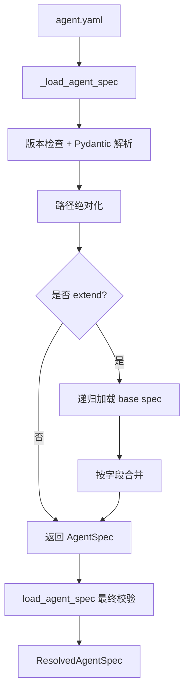
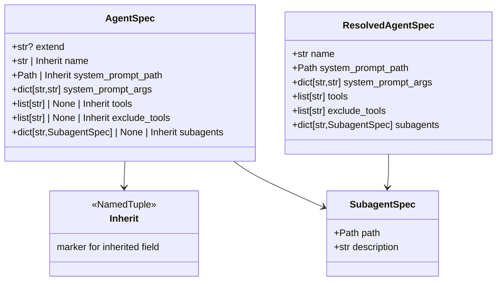
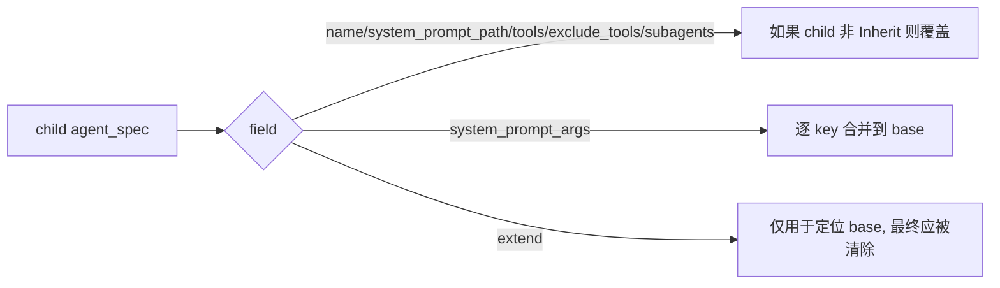
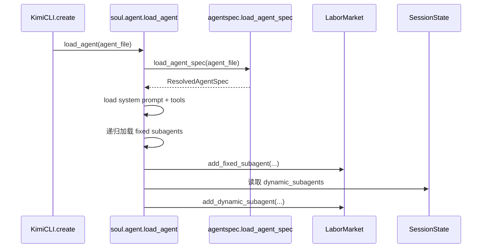
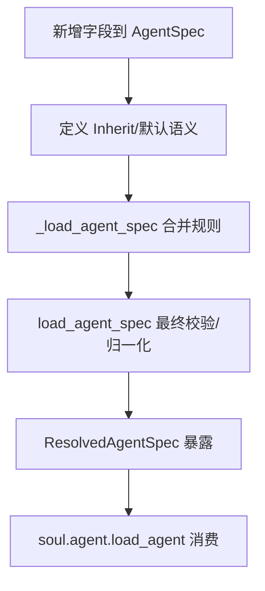

# agent_spec_resolution

`agent_spec_resolution` 模块（实现文件 `src/kimi_cli/agentspec.py`）负责将 Agent 的 YAML 声明解析为运行时可直接消费的强类型规格对象。它解决的核心问题是：**如何用一个可继承、可组合、可校验的静态配置格式，定义主代理与固定子代理的能力边界**，并在真正启动 `soul_engine` 前把不完整或错误配置尽早拦截。

从系统分层上看，它与 [configuration_loading_and_validation.md](configuration_loading_and_validation.md) 互补：后者负责全局应用配置（模型、provider、loop 控制等），本模块负责“某个 agent 人格与工具集合如何定义”。它也与 [session_state_persistence.md](session_state_persistence.md) 形成静态/动态分工：本模块处理**静态子代理定义**（写在 agent.yaml 中），而 session state 处理**会话期动态子代理**（运行中创建并持久化）。

---

## 1. 模块存在的原因与设计目标

在 Kimi CLI 中，Agent 不是硬编码在 Python 里，而是通过 `agent.yaml + system prompt template` 的组合进行声明式定义。这样做的直接收益是：产品可以在不改动核心代码的前提下快速迭代“人格、工具白名单、子代理拓扑”。但是声明式配置也带来三个风险：字段缺失、路径错误、继承关系复杂化。本模块正是为了解决这三类问题。

它的设计目标可以概括为三点。第一，提供一个最小但清晰的 schema（`AgentSpec` / `SubagentSpec`）。第二，支持单层或多层 `extend` 继承，并对字段采用“可继承/可覆盖/可合并”的明确语义。第三，在输出阶段统一生成 `ResolvedAgentSpec`，把“是否继承完成、默认值是否补齐、路径是否绝对化”这些问题一次性收敛。



这个流程意味着：调用方（例如 `soul.agent.load_agent`）拿到的永远是“已展开、可直接执行”的规格对象，而不是半成品配置树。

---

## 2. 核心数据结构与组件关系

虽然模块树把 `SubagentSpec` 与 `Inherit` 标记为核心组件，但实际运行语义依赖以下几个类型共同工作：`Inherit`、`AgentSpec`、`SubagentSpec`、`ResolvedAgentSpec`，以及入口函数 `load_agent_spec()`。



`Inherit` 是一个“哨兵值（sentinel）”，不是业务数据。它的目的不是表达字段值，而是表达“当前文件没有覆盖，沿用父规格”。这比用 `None` 更安全，因为某些字段（例如 `tools`）业务上允许 `None`，但 `None` 与“未覆盖”是两种不同语义。模块里通过 `inherit = Inherit()` 单例来统一判断。

`SubagentSpec` 是静态子代理声明，包含两个必填字段：`path`（子代理配置文件位置）和 `description`（暴露给 `Task` 工具的说明）。它本身不加载子代理，仅声明“在哪里、叫什么用途”；真正加载发生在 `src/kimi_cli/soul/agent.py` 的 `load_agent()` 内。

---
## 2.1 组件级 API 行为说明（按实现细节）

`Inherit` 是 `NamedTuple`，不携带字段，唯一职责是作为“未覆盖”标记。它的关键价值在于把“字段显式为空值（例如 `tools: null`）”与“字段应继续继承父配置”区分开。模块通过全局单例 `inherit = Inherit()` 作为默认值注入 `AgentSpec` 多个字段，因此在合并阶段只需做 `isinstance(x, Inherit)` 判断即可。

`SubagentSpec` 是一个 `pydantic.BaseModel`，字段只有 `path` 与 `description`。解析时该对象会被原地修改：`_load_agent_spec()` 会把 `path` 从相对路径转为绝对路径。也就是说，`SubagentSpec` 在“模型定义上”看似纯数据对象，但在“加载行为上”是可变输入，这一点对调试很重要：你在断点里看到的值通常已经是绝对路径而非 YAML 原值。

`AgentSpec` 是“中间态模型”，它允许字段保留 `Inherit`，因此并不适合直接给运行时使用。`load_agent_spec()` 的意义正是把它收敛为 `ResolvedAgentSpec`。此外，`AgentSpec.extend` 字段只在递归解析阶段生效，完成后会通过 `assert agent_spec.extend is None` 保证没有残留继承指针泄漏到下游。

`ResolvedAgentSpec` 是不可变 dataclass（`frozen=True, slots=True`），字段都是运行时可直接消费的稳定形态：`name` 必有值、`system_prompt_path` 已绝对化、`tools/exclude_tools/subagents` 都已归一成容器类型。该对象本身没有方法，也没有副作用，主要作用是作为“解析层 -> 运行层”的边界契约。


## 3. 关键常量与路径约定

模块内定义了几个关键常量，它们是继承与默认行为的基础：

- `DEFAULT_AGENT_SPEC_VERSION = "1"`
- `SUPPORTED_AGENT_SPEC_VERSIONS = ("1",)`
- `DEFAULT_AGENT_FILE = src/kimi_cli/agents/default/agent.yaml`
- `OKABE_AGENT_FILE = src/kimi_cli/agents/okabe/agent.yaml`

`get_agents_dir()` 通过 `Path(__file__).parent / "agents"` 定位内置 agents 目录，因此它依赖源码布局稳定。`extend: default` 会被解析为 `DEFAULT_AGENT_FILE`，这是一个内置别名机制，允许用户文件复用默认配置而无需知道完整安装路径。

---

## 4. 解析入口：`load_agent_spec(agent_file: Path) -> ResolvedAgentSpec`

这是模块对外最重要的 API。它先调用 `_load_agent_spec()` 做递归解析，再进行“最终必填校验 + 默认值补齐”，最后返回不可变风格的 `ResolvedAgentSpec`（`dataclass(frozen=True, slots=True)`）。

```python
from pathlib import Path
from kimi_cli.agentspec import load_agent_spec

spec = load_agent_spec(Path("./my_agent/agent.yaml"))
print(spec.name)
print(spec.system_prompt_path)
print(spec.tools)
```

该函数的关键行为是“把继承态变成可执行态”：

1. `assert agent_spec.extend is None` 确认继承已在内部递归展开。
2. `name` / `system_prompt_path` / `tools` 仍为 `Inherit` 时直接抛 `AgentSpecError`（视为缺失必填项）。
3. `exclude_tools` 和 `subagents` 若仍为 `Inherit`，分别补为 `[]` 与 `{}`。
4. `tools`、`exclude_tools`、`subagents` 即便 YAML 显式写 `null`，也在最终对象中归一化为容器空值（通过 `or []` / `or {}`）。

返回值 `ResolvedAgentSpec` 可以直接被 `soul.agent.load_agent()` 消费，不再需要调用方处理继承哨兵。

---

## 5. 内部递归解析：`_load_agent_spec(agent_file: Path) -> AgentSpec`

`_load_agent_spec` 是整个模块最核心的实现，负责 I/O、YAML 解析、版本检查、相对路径归一化、继承递归与字段合并。

### 5.1 文件与 YAML 解析阶段

函数先检查路径存在且为文件，否则抛 `AgentSpecError`。随后执行 `yaml.safe_load`，捕获 `yaml.YAMLError` 并包装成 `AgentSpecError`。

版本字段读取逻辑是 `str(data.get("version", DEFAULT_AGENT_SPEC_VERSION))`。这意味着即使 YAML 写 `version: 1`（整数），也会转成字符串再比较，保证兼容常见写法。

### 5.2 基础模型构造与路径标准化

函数用 `AgentSpec(**data.get("agent", {}))` 构造模型。之后有两步非常关键的“上下文化路径”操作：

1. 若 `system_prompt_path` 是 `Path`，则转为 `agent_file.parent / system_prompt_path` 的绝对路径。
2. 若 `subagents` 是字典，则把每个 `SubagentSpec.path` 也按当前 agent 文件目录转绝对路径。

这个步骤保证了相对路径是“相对当前 YAML 文件”，而不是相对进程工作目录，避免 CLI 在不同 cwd 下行为不一致。

### 5.3 `extend` 递归与合并规则

当 `agent_spec.extend` 非空时，会先解析基配置文件，再把当前配置覆盖到基配置上。合并策略不是统一“覆盖”，而是按字段类型细分：



其中最值得注意的是 `system_prompt_args`：它是 **merge**（逐 key 更新），不是整体替换。也就是说，base 的参数默认保留，child 同名键覆盖、新增键追加。这与 `tools` 的整字段覆盖形成鲜明对比。

---

## 6. 与运行时模块的协作关系

`agent_spec_resolution` 不直接运行 Agent，它只输出规格对象。真正的装配在 `src/kimi_cli/soul/agent.py`：

1. `KimiCLI.create()` 选择 `agent_file`（默认 `DEFAULT_AGENT_FILE`）。
2. `load_agent(agent_file, runtime, ...)` 内部调用 `load_agent_spec()`。
3. 读取并渲染 system prompt（Jinja 模板 + builtin args + `system_prompt_args`）。
4. 先加载固定子代理（来自 `subagents`），注册到 `LaborMarket.fixed_subagents`。
5. 再根据 `tools` / `exclude_tools` 装配工具集。
6. 最后恢复会话期动态子代理（来自 `Session.state.dynamic_subagents`）。



因此，静态子代理（本模块）与动态子代理（会话状态）是在同一个 `LaborMarket` 里汇合的，但来源与生命周期不同。动态部分细节可参考 [session_state_persistence.md](session_state_persistence.md)。

---

## 7. 配置示例与扩展模式

### 7.1 最小可用 agent.yaml

```yaml
version: 1
agent:
  name: "assistant"
  system_prompt_path: ./system.md
  tools:
    - "kimi_cli.tools.shell:Shell"
```

这个最小配置满足 `load_agent_spec` 的必填校验（`name`、`system_prompt_path`、`tools`）。

### 7.2 基于默认 Agent 扩展

```yaml
version: 1
agent:
  extend: default
  name: "team_lead"
  system_prompt_args:
    ROLE_ADDITIONAL: "Focus on architecture trade-offs."
  exclude_tools:
    - "kimi_cli.tools.shell:Shell"
```

这里 `extend: default` 指向内置 `DEFAULT_AGENT_FILE`。`system_prompt_args` 会与默认参数合并；`exclude_tools` 会在后续 `load_agent` 阶段过滤工具。

### 7.3 定义固定子代理

```yaml
version: 1
agent:
  name: "orchestrator"
  system_prompt_path: ./system.md
  tools:
    - "kimi_cli.tools.multiagent:Task"
  subagents:
    coder:
      path: ./coder/agent.yaml
      description: "Good at implementation and refactoring."
```

该配置只声明子代理入口，真正调用由 `Task` 工具触发。若 `path` 是相对路径，会被自动解析为当前文件所在目录的绝对路径。

---

## 8. 错误处理、边界条件与已知限制

本模块的错误以 `AgentSpecError` 为主（定义在 `src/kimi_cli/exception.py`）。不过仍有一些实现层面的“非包装异常”或行为细节，开发者需要特别注意。

### 8.1 会抛出的典型错误

- 文件不存在 / 路径不是文件：`AgentSpecError`
- YAML 语法错误：`AgentSpecError`
- `version` 不受支持：`AgentSpecError`
- 最终缺失 `name` / `system_prompt_path` / `tools`：`AgentSpecError`

### 8.2 需要注意的 gotchas

第一，空 YAML 文件可能触发 `AttributeError`。`yaml.safe_load` 在空文档时可能返回 `None`，代码随后直接调用 `data.get(...)`，这不是 `AgentSpecError` 路径。调用方如果要提供更友好错误提示，建议在上层兜底。

第二，`extend` 循环继承没有显式检测。例如 A extend B 且 B extend A，会导致无限递归直到 `RecursionError`。当前实现假定配置作者不会构造环。

第三，`load_agent_spec` 的 docstring 提到 `FileNotFoundError`，但实际“不存在文件”由 `_load_agent_spec` 抛 `AgentSpecError`。维护者在写调用方异常处理时，应以实现为准。

第四，继承合并是“字段级策略混合”：`tools` 是整体覆盖，`system_prompt_args` 是 key 级 merge。扩展配置时若误以为所有字段都 merge，容易产生意外结果。

第五，当前只支持版本 `1`。这让 schema 简洁，但也意味着升级策略要通过未来版本迁移逻辑补充。

---

## 9. 如何安全扩展本模块

如果你要增加新的 agent 字段（例如 `model_hint`、`temperature_profile`），建议遵循现有模式：

1. 在 `AgentSpec` 增加字段，默认值使用 `Inherit`（若可继承）或显式默认值（若全局固定）。
2. 在 `_load_agent_spec` 的继承分支中补充合并策略，明确“覆盖还是 merge”。
3. 在 `ResolvedAgentSpec` 中决定是否要变成必填、是否归一化空值。
4. 在 `load_agent_spec` 追加最终校验，确保调用方拿到的是可执行对象。
5. 在 `soul.agent.load_agent` 中接入该字段的运行时语义。



这样可以保持“解析层纯净、运行层明确”的边界，避免把运行时副作用塞进配置解析函数。

---

## 10. 与其他文档的关系

为了避免重复，建议按下面路径继续阅读：

- 全局配置加载、校验与持久化： [configuration_loading_and_validation.md](configuration_loading_and_validation.md)
- 会话状态（含动态子代理持久化）： [session_state_persistence.md](session_state_persistence.md)
- 多代理工具（`Task` / `CreateSubagent`）的运行行为：建议结合 `tools_multiagent` 模块文档阅读（若已生成）。

`agent_spec_resolution` 的核心价值是把“人可编辑的 YAML”转成“系统可执行的强类型规格”，并在系统启动最早阶段做失败快（fail-fast）。只要理解它的继承语义和路径解析规则，就能稳定地自定义、复用和扩展 Agent 体系。
