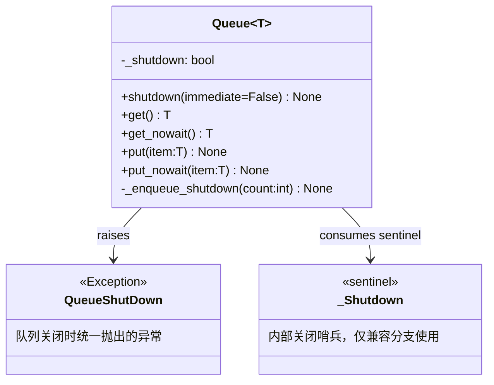
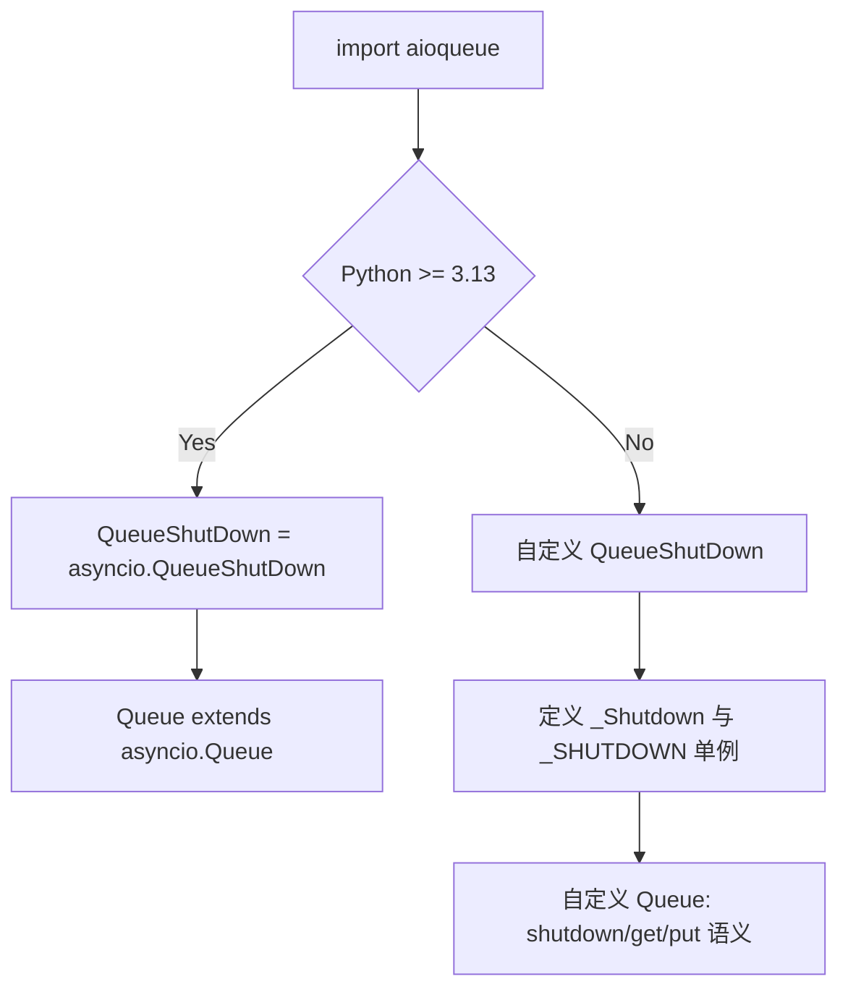
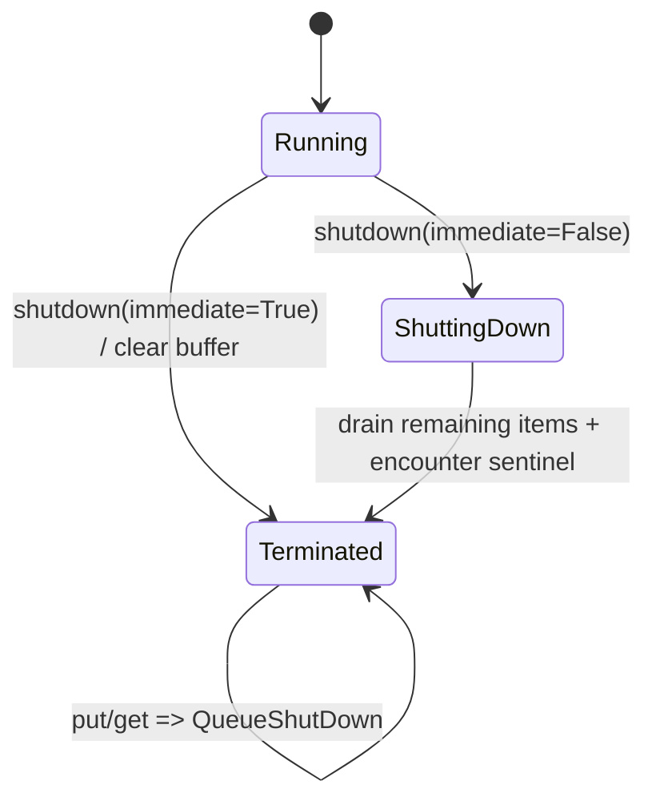
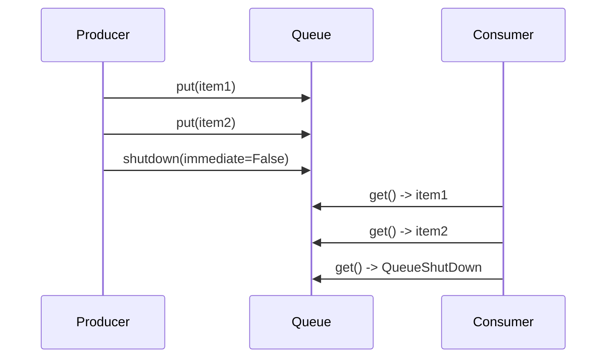
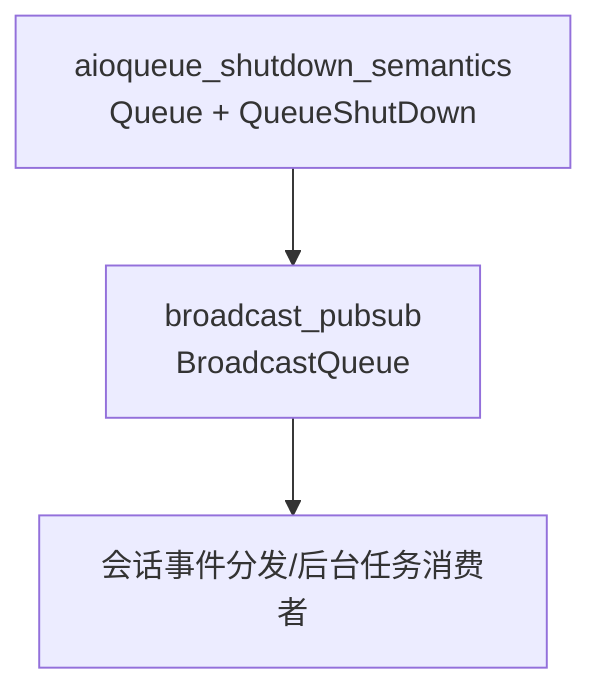

# aioqueue_shutdown_semantics

## 引言：这个模块解决了什么问题，为什么必须存在

`aioqueue_shutdown_semantics` 模块对应 `src/kimi_cli/utils/aioqueue.py`，它在系统中的角色是为异步生产者-消费者通信提供**可关闭（shutdown-aware）队列语义**。在很多 asyncio 代码中，队列负责跨协程传递消息，但“结束”本身往往没有统一协议：消费者可能一直阻塞在 `await get()`，生产者在退出时也不知道是否还能 `put()`，最终导致任务悬挂、退出顺序混乱，甚至事件循环无法优雅收敛。

这个模块的设计目标是把“队列生命周期结束”从业务 payload 中剥离出来，变成明确的控制语义：调用 `shutdown()` 后，写入方立即得到一致反馈（抛出 `QueueShutDown`），读取方最终也会收到同样的终止信号并退出循环。这样，上层模块无需把 `None`、`"__END__"` 之类魔法值混入业务消息类型，也不需要依赖超时轮询判断是否结束。

另一个关键动机是 Python 版本兼容。Python 3.13 才在 `asyncio.Queue` 中引入官方 shutdown 异常语义；该模块在 3.13+ 直接对齐官方实现，在旧版本提供兼容实现，从而让项目内部始终使用同一套 API 与异常约定。

---

## 模块边界与核心组件

当前模块树将本模块核心组件标记为：

- `src.kimi_cli.utils.aioqueue.QueueShutDown`
- `src.kimi_cli.utils.aioqueue._Shutdown`

但从可运行行为看，真实承载 shutdown 逻辑的是同文件内的 `Queue[T]`。`QueueShutDown` 定义了终止信号的异常协议，`_Shutdown`（仅 Python < 3.13）是内部哨兵对象，`Queue` 则把二者串成完整状态机。



上图体现了一个重要事实：业务侧只需要理解并捕获 `QueueShutDown`，不应直接操作 `_Shutdown`。`_Shutdown` 是实现细节，不是公共协议。

---

## 版本分支设计：对齐 Python 3.13，兼容更早版本

模块在导入时按 `sys.version_info` 分支。



在 Python 3.13+ 分支，模块最大程度复用标准库语义，减少自定义代码的维护成本；在旧版本分支，通过哨兵注入与异常转换模拟“可关闭队列”。这个策略的价值在于：上层调用者不需要写版本判断，统一 `from ... import Queue, QueueShutDown` 即可。

---

## 详细 API 与内部机制

> 说明：以下以 Python < 3.13 的兼容实现为主，因为它包含全部语义细节；3.13+ 可视作“语义委托给标准库”。

### `QueueShutDown`

`QueueShutDown` 是模块级终止异常。它表示“队列进入关闭生命周期后，不再允许继续按普通收发语义工作”。

在调用层，`QueueShutDown` 应被当作**控制流信号**而非错误告警。典型消费者循环会在捕获该异常后执行收尾并正常退出。

```python
from src.kimi_cli.utils.aioqueue import Queue, QueueShutDown

async def worker(q: Queue[str]) -> None:
    while True:
        try:
            item = await q.get()
        except QueueShutDown:
            return
        # process item
```

### `_Shutdown`

`_Shutdown` 是内部哨兵类型，配合 `_SHUTDOWN = _Shutdown()` 单例使用。它存在的唯一目的，是在旧版本中唤醒阻塞在 `get()` 的消费者，并把“读到哨兵”转换成 `QueueShutDown`。

选择独立类型（而不是 `None` 或字符串）可以避免与业务消息冲突，尤其在泛型队列里更安全。

### `Queue.__init__(self) -> None`

构造函数在父类 `asyncio.Queue` 初始化后设置 `self._shutdown = False`。这个布尔标记是所有方法的第一层闸门。

副作用方面，构造时没有后台任务、没有 I/O，只建立内存状态。

### `Queue.shutdown(self, immediate: bool = False) -> None`

这是模块最关键的生命周期 API。

参数 `immediate` 控制关闭强度：

- `False`（默认）：不主动清除排队数据，允许消费者继续取到已有业务项，随后再终止。
- `True`：立即清空底层缓冲区，强调“尽快停机”而非“尽量处理剩余消息”。

执行流程是：先检查幂等（已关闭则直接返回），再标记 `_shutdown=True`，按 `immediate` 决定是否 `self._queue.clear()`，之后统计当前等待 `get()` 的协程数量（来自内部 `_getters`），并至少注入一个 shutdown 哨兵。

返回值恒为 `None`。主要副作用是：

1. 队列进入不可写状态；
2. 可能清空未消费数据（`immediate=True`）；
3. 向队列注入控制哨兵以唤醒消费者。

### `Queue._enqueue_shutdown(self, count: int) -> None`

内部辅助方法，负责把 `_SHUTDOWN` 放入队列 `count` 次。若 `put_nowait` 遇到 `asyncio.QueueFull`，方法会清空底层缓冲后再放入哨兵，确保 shutdown 信号具有可达性。

这段实现体现了一个设计选择：在关闭阶段，优先保证“能退出”而不是“保留剩余消息”。

### `Queue.get(self) -> T`

`get` 的行为分两段：

1. 如果已关闭且队列为空，立即抛 `QueueShutDown`；
2. 否则走父类 `await super().get()`，若取到 `_Shutdown` 哨兵，再抛 `QueueShutDown`；否则返回业务项 `T`。

这让默认关闭（`immediate=False`）具备“先排空后终止”的直觉语义，而不会让消费者永远等待。

### `Queue.get_nowait(self) -> T`

同步版本与 `get` 一致：先做关闭+空队列短路判断，再取元素，若读到哨兵则抛 `QueueShutDown`，否则返回数据。

调用者需要注意：它仍可能抛出父类的 `asyncio.QueueEmpty`（在未关闭且无元素时）。也就是说，`QueueEmpty` 与 `QueueShutDown` 表示不同状态，不能混为一谈。

### `Queue.put(self, item: T) -> None`

异步写入前若发现 `_shutdown=True`，立即抛 `QueueShutDown`，否则委托父类 `put`。

该方法没有返回业务值，副作用是向队列追加项（或在关闭状态下触发异常）。

### `Queue.put_nowait(self, item: T) -> None`

非阻塞写入版本，关闭语义与 `put` 完全一致：关闭后抛 `QueueShutDown`，未关闭时走父类逻辑（可能抛 `asyncio.QueueFull`）。

---

## 队列生命周期与数据流

### 生命周期状态图



`Running` 阶段行为接近普通 `asyncio.Queue`。进入 `ShuttingDown` 后，写入被硬禁止，读取端则在“消化剩余数据或收到哨兵”后进入 `Terminated`。`immediate=True` 直接跳过“消化剩余数据”过程。

### 典型交互时序



这个时序说明默认关闭并非“立即终止读取”，而是“禁止新写入 + 最终向读取方发出终止信号”。

---

## 与其他模块的关系（系统位置）

本模块位于 `utils` 基础设施层，直接被 `broadcast_pubsub` 复用。`BroadcastQueue` 在每个订阅者上创建一个 `Queue`，发布时向所有队列写入，关闭时统一调用 `queue.shutdown()`，从而把“广播系统停止”可靠地传播到每个订阅消费者。相关上层细节可参考 [broadcast_pubsub.md](broadcast_pubsub.md)。



这意味着本模块虽然代码量小，但稳定性要求很高：它是退出路径上的公共基础件，行为漂移会放大到多个上层子系统。

---

## 实战用法与配置模式

### 模式一：优雅收尾（推荐默认）

```python
q: Queue[dict] = Queue()

# producer
await q.put({"type": "event", "id": 1})
q.shutdown()  # immediate=False

# consumer
while True:
    try:
        evt = await q.get()
    except QueueShutDown:
        break
    handle(evt)
```

这个模式适合“尽量处理完已入队任务”的场景，例如日志落盘前的缓冲清空。

### 模式二：快速中止（应急停止）

```python
q.shutdown(immediate=True)
```

适用于取消风暴、进程即将退出等情形。代价是队列中未消费数据会被丢弃。

### 模式三：生产者侧容错

```python
try:
    await q.put(payload)
except QueueShutDown:
    # 下游已结束，停止继续生产
    return
```

这段处理非常重要。关闭后写入抛异常是预期语义，不应统一记录为“系统故障”。

---

## 边界条件、错误条件与限制

兼容实现为了达到语义目标，使用了 `asyncio.Queue` 的内部属性（如 `_queue`、`_getters`）。这在当前 CPython 下可工作，但属于实现耦合点：未来 Python 内部结构变化可能要求同步调整。维护时应优先通过回归测试验证 shutdown 语义，而不是只看类型检查是否通过。

另一个容易误解的点是 `shutdown(immediate=True)` 的破坏性。它不是“更快的优雅关闭”，而是“允许丢数据的硬切断”。如果业务有强一致消费要求，应避免使用该模式，或在更上层补偿（重放、重试、持久化队列等）。

还需要注意，`shutdown()` 是幂等但不提供 `join` 语义。也就是说，它负责发出终止信号，不负责等待所有消费者任务真正结束。若需要强同步收尾，应在调用层显式 `await` 消费者任务（如 `TaskGroup` 管理）。

最后，`get_nowait()` / `put_nowait()` 仍会保留父类异常（`QueueEmpty` / `QueueFull`）语义；`QueueShutDown` 只是额外生命周期信号。调用方应区分“暂时无数据”与“系统已关闭”这两类状态。

---

## 可扩展性建议

若未来要增强该模块，建议继续坚持“基础语义最小化”的原则：保持 `QueueShutDown` 作为唯一终止协议，把“终止原因”“指标上报”“审计日志”等增强功能放在包装层，而非直接改变 `Queue` 的核心行为。这样可以减少对上游依赖模块（特别是 [broadcast_pubsub.md](broadcast_pubsub.md)）的破坏性影响，也更便于跟随 Python 标准库语义演进。

从维护优先级看，最关键的不变量有两条：关闭后禁止写入；等待中的读取方最终可退出。只要这两条被稳定保证，该模块就能持续作为全系统的可靠并发收尾基建。
