# anthropic_provider 模块文档（新版）

## 引言：模块定位、存在意义与设计目标

`anthropic_provider` 是 `kosong_contrib_chat_providers` 中面向 Anthropic Messages API 的供应商适配器。它的核心职责不是“实现一个聊天系统”，而是把 `kosong` 的统一抽象协议（`ChatProvider`、`Message`、`Tool`、`StreamedMessagePart`、`TokenUsage`）可靠地映射到 Anthropic SDK/协议，并把 Anthropic 的响应事件再解码回统一模型，供上层 Agent、编排器和 UI 无差别消费。

这个模块存在的价值在于“隔离供应商差异”。上层业务只依赖统一协议，不需要知道 Anthropic 的 `system` 字段约束、thinking 模式差异（legacy budget vs adaptive）、流式事件类型细节、错误类型命名方式。换言之，`anthropic_provider` 是一个协议边界层（boundary layer）：向上稳定、向下适配。

从实现风格看，它强调三点：第一，输入与输出双向转换的显式性；第二，错误与 token 统计的归一化；第三，通过 `with_generation_kwargs()` / `with_thinking()` 保持“配置派生而非原地修改”的可复用语义。

---

## 架构位置与模块关系

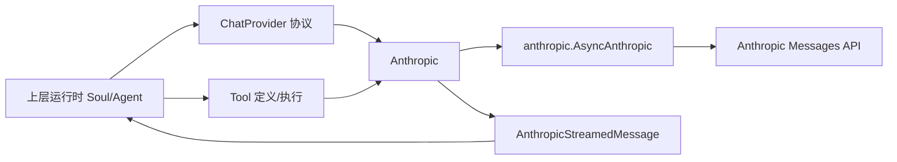

`Anthropic` 负责请求构造与调用，`AnthropicStreamedMessage` 负责响应流解码。两者配合后，上层只看到统一的 `StreamedMessagePart` 序列和 `TokenUsage` 统计。这种分层方式降低了供应商升级时对上层代码的冲击。

如需理解统一接口与错误层次，请参考 [kosong_chat_provider.md](./kosong_chat_provider.md)；如需理解工具对象与 JSON Schema，请参考 [kosong_tooling.md](./kosong_tooling.md)。

---

## 组件清单与职责说明

当前文件核心组件包括 `Anthropic.GenerationKwargs`（TypedDict 配置结构）、`Anthropic`（主 provider）、`AnthropicStreamedMessage`（响应包装器），以及 `_convert_tool`、`_tool_result_message_to_block`、`_image_url_part_to_anthropic`、`_convert_error` 等协议转换函数。

其中 `GenerationKwargs` 是本模块在模块树中标注的核心组件，决定了该 provider 在运行期可以被上层覆盖的生成参数边界。

---

## `GenerationKwargs`：可配置能力面

`Anthropic.GenerationKwargs` 是一个 `total=False` 的 TypedDict，代表“可选覆盖”的模型生成参数。关键字段包括 `max_tokens`、`temperature`、`top_k`、`top_p`、`thinking`、`tool_choice`、`beta_features` 和 `extra_headers`。它们最终会传入 `AsyncAnthropic.messages.create(...)`，其中 `beta_features` 会被转换成 `anthropic-beta` 请求头。

默认初始化时，provider 会设置：`max_tokens = default_max_tokens` 且 `beta_features = ["interleaved-thinking-2025-05-14"]`。这意味着如果调用方不显式覆盖，默认会启用 interleaved-thinking beta header。

---

## `Anthropic` 主类：内部工作机制

### 初始化阶段

构造函数接收 `model`、`api_key`、`base_url`、`stream`、`tool_message_conversion`、`default_max_tokens` 等参数，并立即创建 `AsyncAnthropic` 客户端。模块导入时还会执行依赖检查：若环境中没有安装 `anthropic` 包，会抛出带安装指引的 `ModuleNotFoundError`，这是典型的 fail-fast 策略。

### thinking 语义归一化

`thinking_effort` 属性把 Anthropic 原生 thinking 配置映射到统一档位（`off/low/medium/high`）。当配置是 `adaptive` 时，统一语义按 `high` 处理；当是 budget 模式时，按阈值 1024/4096/更高进行分档。这是跨 provider 可比性所需的“语义压缩”，不是 Anthropic 字段的一一对应。

### 生成请求流程

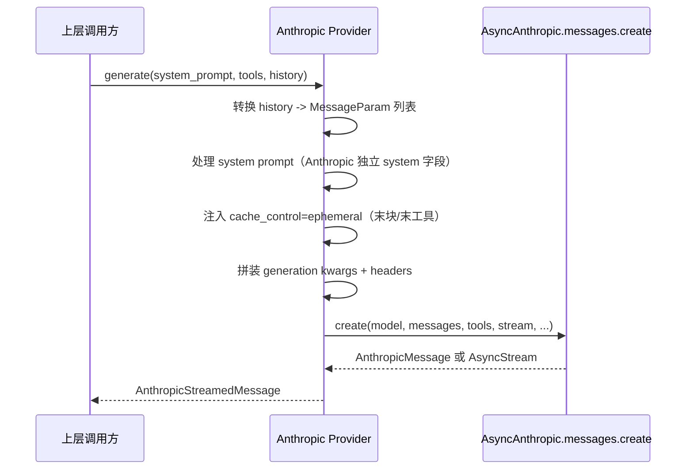

这里最关键的适配点是：Anthropic 不支持会话消息中的 `system` role，所以 provider 会把系统提示放入独立 `system` 参数；此外它还对最后内容块和最后工具定义注入 `cache_control=ephemeral`，用于提示 prompt caching 行为。

### `with_thinking()` 的模型代际分流

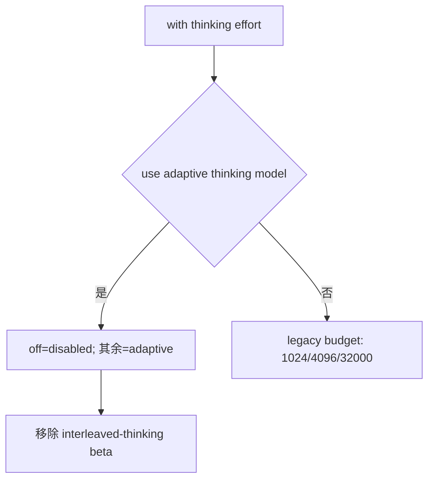

这段逻辑体现了模块的“协议演进兼容性”设计：上层始终传统一档位，provider 根据模型版本转成正确 Anthropic 配置。

### `with_generation_kwargs()` 的派生语义

该方法通过浅拷贝 provider + 深拷贝 generation kwargs 创建新实例，而非就地修改原对象。对多会话并行、模板化 provider 复用、避免共享状态污染非常重要。

---

## 消息编码：`_convert_message()` 细节

`_convert_message()` 负责把内部 `Message` 转成 Anthropic `MessageParam`，是请求侧最关键的桥接逻辑。

对于 `system` 角色，Anthropic 不支持直接放入消息列表，因此会被转换成 `role="user"` 的文本块，文本内容包装为 `<system>...</system>`。对于 `tool` 角色，若缺失 `tool_call_id` 会直接抛出 `ChatProviderError`；其内容会被包装成 `tool_result` block。对于 `user/assistant`，则逐个遍历内容片段：`TextPart` 转文本块、`ImageURLPart` 转图片块、`ThinkPart` 仅在带签名时才保留（无签名会被跳过）。

此外，`tool_calls` 的参数会从 JSON 字符串解析为对象。若参数不是合法 JSON 或解析结果不是 object（例如数组/字符串），会抛错终止。这保证了 `tool_use.input` 满足 Anthropic 的类型要求。

---

## 响应解码：`AnthropicStreamedMessage`

`AnthropicStreamedMessage` 统一封装了两类响应：非流式 `AnthropicMessage` 与流式 `AsyncStream[RawMessageStreamEvent]`。对上层它始终表现为一个异步迭代器，可持续产出 `StreamedMessagePart`（如 `TextPart`、`ThinkPart`、`ToolCall`、`ToolCallPart`）。

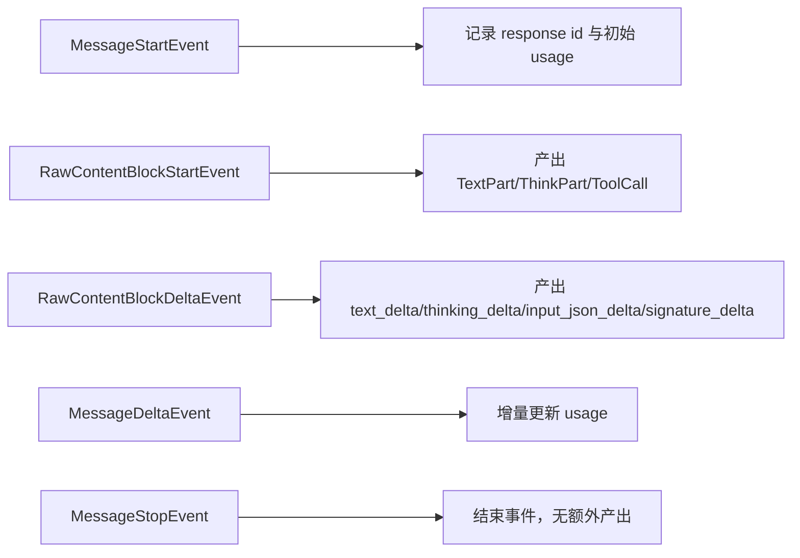

`usage` 属性会把 Anthropic usage 归一化成 `TokenUsage`：输入 token、输出 token、缓存命中读 token、缓存创建 token。这样上层计费/监控逻辑不需要识别供应商特有字段名。

---

## 辅助转换函数与错误映射

`_convert_tool()` 将 `Tool` 映射为 Anthropic `ToolParam`，基本是字段直通（`name/description/input_schema`）。`_tool_result_message_to_block()` 用于把工具执行结果编码为 `tool_result`，支持字符串或 `ContentPart` 列表；列表模式下仅接受 `TextPart` 与 `ImageURLPart`，否则抛错。`_image_url_part_to_anthropic()` 支持 URL 图片和 `data:` base64 图片，后者要求 `data:<media-type>;base64,<data>` 且媒体类型仅限 `image/png`、`image/jpeg`、`image/gif`、`image/webp`。

`_convert_error()` 将 Anthropic SDK 错误映射到统一异常：状态类错误映射到 `APIStatusError`（含状态码）、网络错误映射到 `APIConnectionError`、超时映射到 `APITimeoutError`、其他映射到通用 `ChatProviderError`。这让上层可按统一策略做退避重试或告警分级。

---

## 数据流总览

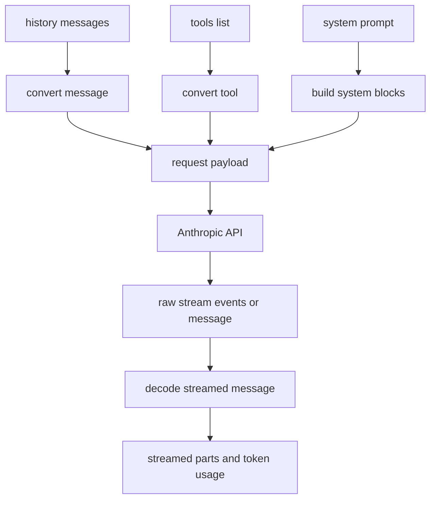

这个图展示了模块核心价值：它将上游统一数据结构编解码为供应商协议，再转回统一结构，形成清晰可维护的“适配闭环”。

---

## 使用示例

```python
from kosong.contrib.chat_provider.anthropic import Anthropic
from kosong.message import Message

provider = Anthropic(
    model="claude-sonnet-4-5",
    api_key="ANTHROPIC_API_KEY",
    default_max_tokens=2048,
    stream=True,
)

provider2 = provider.with_thinking("medium").with_generation_kwargs(
    temperature=0.2,
    tool_choice={"type": "auto", "disable_parallel_tool_use": True},
)

stream = await provider2.generate(
    system_prompt="你是一个严谨的代码审查助手",
    tools=[],
    history=[Message(role="user", content="请解释这个函数可能的边界问题")],
)

async for part in stream:
    # 上层按统一协议消费 part
    pass

print(stream.id, stream.usage)
```

---

## 扩展与维护建议

如果后续 Anthropic 新增内容块类型或流事件类型，建议优先在 `AnthropicStreamedMessage` 中增加“显式处理 + 安全忽略”分支，避免未知类型导致崩溃。若新增请求参数，优先加入 `GenerationKwargs` 并在 `model_parameters` 中可观测化，便于 tracing。

若需要增强重试能力，建议在上层组合 `RetryableChatProvider` 风格的包装器，而不是把重试状态机内嵌到 provider 适配层，以保持职责清晰。

---

## 边界条件、错误场景与限制

本模块有几个高频易错点。第一，`tool` 消息缺 `tool_call_id` 会直接失败。第二，`ToolCall.function.arguments` 必须是 JSON object 字符串，不能是数组或任意文本。第三，未签名的 `ThinkPart` 会被忽略，可能导致“以为发送了 thinking，实际未发送”的认知偏差。第四，`data:` 图片 URL 格式和 MIME 类型校验较严格，`image/jpg` 这类非标准值会失败。第五，当前 cache-control 注入采用“最后块策略”，不是全量块策略；如果你的缓存策略更复杂，需要自定义扩展。

---

## 相关文档引用

- 统一 Provider 协议与异常模型：[`kosong_chat_provider.md`](./kosong_chat_provider.md)
- Tool 抽象与 schema 生成：[`kosong_tooling.md`](./kosong_tooling.md)
- 贡献 provider 总览：[`kosong_contrib_chat_providers.md`](./kosong_contrib_chat_providers.md)
- 其他 provider 对比：[`google_genai_provider.md`](./google_genai_provider.md)、[`openai_legacy_provider.md`](./openai_legacy_provider.md)、[`openai_responses_provider.md`](./openai_responses_provider.md)

---

> 说明：本文件上方为新版文档。若下方仍存在历史内容，请以本节为准。


## 模块概述

`anthropic_provider` 是 `kosong_contrib_chat_providers` 中面向 Anthropic Messages API 的适配层，实现位于 `packages/kosong/src/kosong/contrib/chat_provider/anthropic.py`。这个模块的核心目标是把 `kosong` 统一的对话抽象（`Message`、`Tool`、`StreamedMessagePart`、`TokenUsage`）转换为 Anthropic 协议格式，并把 Anthropic 的流式事件再还原回 `kosong` 的统一消息片段模型。

这个模块存在的根本原因是：上层 Agent/编排代码不应感知供应商差异。通过该适配层，上层仅依赖 `ChatProvider` 协议（见 [kosong_chat_provider.md](./kosong_chat_provider.md)），即可在 Anthropic、OpenAI、Google GenAI 等提供方之间切换，同时保留统一的工具调用、思维链（thinking）、流式消费与错误语义。

从设计上看，该模块强调三件事：

1. **协议桥接**：把内部 `Message` 与内容分块映射到 Anthropic `MessageParam`/`ContentBlockParam`。
2. **能力对齐**：兼容 Anthropic 的 thinking 模式演进（旧版 budget tokens 与 Opus 4.6+ adaptive 模式）。
3. **可观测与可恢复语义**：统一 token usage 与错误类型，便于上层重试、计费与日志系统处理。

---

## 在系统中的位置与职责边界

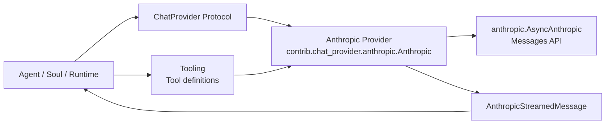

`Anthropic` 类实现了 `ChatProvider` 协议要求的核心能力：`model_name`、`thinking_effort`、`generate()`、`with_thinking()`。但是它不负责对话历史存储、工具实际执行、重试策略编排、会话生命周期管理，这些由上层模块承担。

建议把该模块理解为“**供应商协议适配器 + 流事件解码器**”，而不是完整会话引擎。

---
## 依赖与兼容性说明

该模块运行时依赖 `anthropic` 官方 Python SDK，并在模块导入阶段就进行显式检查。也就是说，只要代码路径触发了 `kosong.contrib.chat_provider.anthropic` 的 import，就必须已经安装可选依赖；否则会立刻抛出带安装指引的 `ModuleNotFoundError`。这种“早失败（fail fast）”策略能避免服务启动后才在首个请求处暴露依赖问题。

在协议层面，`Anthropic` 对齐的是 `ChatProvider` 接口（参见 [provider_protocols.md](./provider_protocols.md) 与 [kosong_chat_provider.md](./kosong_chat_provider.md)）。它**没有**实现 `RetryableChatProvider` 的 `on_retryable_error()` 钩子，因此连接重建、客户端重置等“重试恢复动作”需要由更高层重试框架承担。

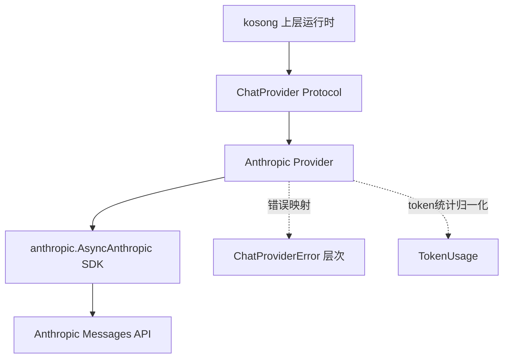

这张图体现了一个关键设计：该模块不改变上层抽象，只在“供应商 SDK 与统一协议”之间做窄层桥接。

---


## 核心组件总览

当前模块的关键实现如下：

- `Anthropic`
- `Anthropic.GenerationKwargs`（核心配置 TypedDict）
- `AnthropicStreamedMessage`
- `_convert_tool()`
- `_tool_result_message_to_block()`
- `_image_url_part_to_anthropic()`
- `_convert_error()`

此外，文件内定义了：

- `type BetaFeatures = Literal["interleaved-thinking-2025-05-14"]`
- `type MessagePayload = tuple[str | None, list[MessageParam]]`（当前实现中未被使用，可视为历史遗留类型别名）

---

## 依赖关系与交互结构

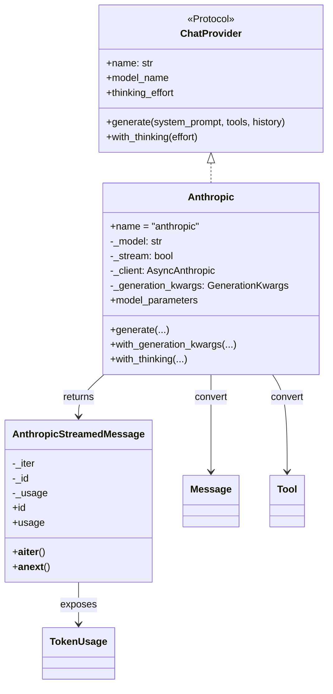

该关系体现了一个清晰分层：`Anthropic` 负责“请求侧编码”，`AnthropicStreamedMessage` 负责“响应侧解码”，二者共同向上暴露 `ChatProvider`/`StreamedMessage` 语义。

---

## `Anthropic.GenerationKwargs` 详解

`GenerationKwargs` 是请求参数的可选覆盖集合，支持以下关键字段：

| 字段 | 类型 | 作用 |
|---|---|---|
| `max_tokens` | `int | None` | 限制生成 token 上限 |
| `temperature` | `float | None` | 采样温度 |
| `top_k` | `int | None` | Top-k 采样 |
| `top_p` | `float | None` | nucleus sampling |
| `thinking` | `ThinkingConfigParam | None` | Anthropic thinking 配置（disabled / adaptive / enabled+budget） |
| `tool_choice` | `ToolChoiceParam | None` | 工具选择策略 |
| `beta_features` | `list[BetaFeatures] | None` | 通过 header 启用 beta 能力 |
| `extra_headers` | `Mapping[str, str] | None` | 注入自定义请求头 |

默认初始化时会注入：

- `max_tokens = default_max_tokens`
- `beta_features = ["interleaved-thinking-2025-05-14"]`

这意味着如果你不主动改写 thinking 策略，模块默认会携带 interleaved-thinking beta 标记。

---

## `Anthropic` 类：内部机制与行为

### 1) 初始化与实例不可变式风格

构造函数签名（简化）：

```python
Anthropic(
    model: str,
    api_key: str | None = None,
    base_url: str | None = None,
    stream: bool = True,
    tool_message_conversion: ToolMessageConversion | None = None,
    default_max_tokens: int,
    **client_kwargs: Any,
)
```

该类内部创建 `AsyncAnthropic` 客户端并保存默认 generation kwargs。值得注意的是，`with_generation_kwargs()` 与 `with_thinking()` 不会原地修改当前对象，而是通过 `copy.copy + deepcopy(kwargs)` 返回“新 provider”。这使它更适合作为配置模板在不同会话中复用，减少共享状态污染。

### 2) `thinking_effort` 属性

`thinking_effort` 用于把 Anthropic 原生 thinking 配置映射到统一语义 `Literal["off", "low", "medium", "high"]`。映射规则是：

- `thinking is None` -> `None`
- `type == "disabled"` -> `"off"`
- `type == "adaptive"` -> `"high"`（统一语义上视为高思考）
- `enabled + budget_tokens`：
  - `<=1024` -> `low`
  - `<=4096` -> `medium`
  - 更高 -> `high`

这不是 Anthropic 原生字段的“等值映射”，而是跨 provider 的“语义归一化映射”。

### 3) `generate()` 请求构建流程

`generate(system_prompt, tools, history)` 的核心步骤如下：

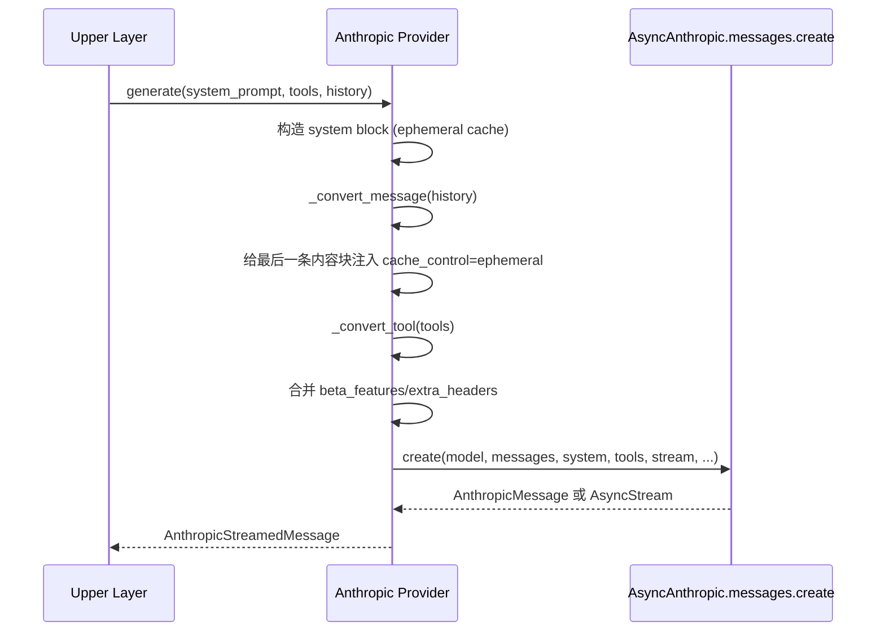

这里有几个关键的 Anthropic 特性适配：

- Anthropic 不支持会话消息中的 `system` role，因此系统提示通过独立 `system` 字段传递。
- 系统提示和最后一个消息块/最后一个工具定义会被标记 `cache_control: ephemeral`，用于 prompt caching 场景下的缓存策略提示。
- `beta_features` 被转成 `anthropic-beta` 请求头，支持多个特性以逗号连接。

### 4) thinking 模式自动分流：`with_thinking()`

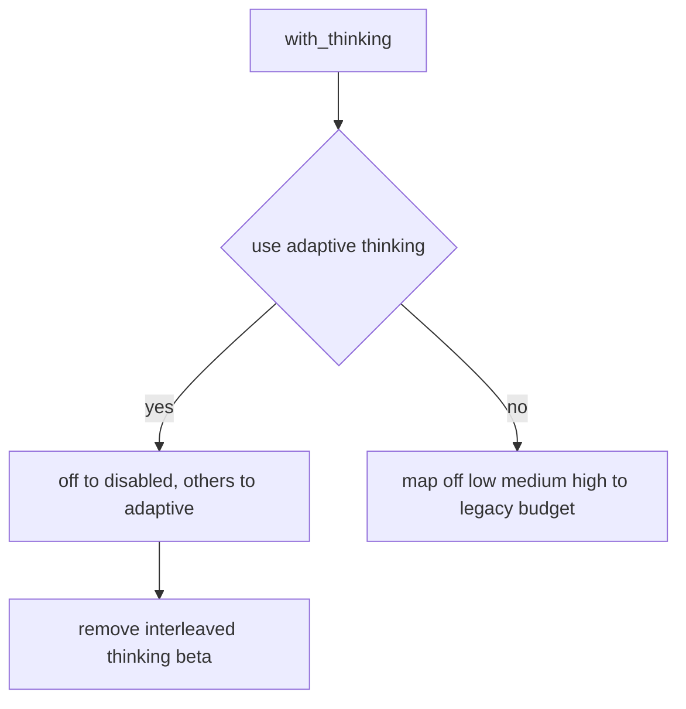

实现要点：

- 对 `opus-4.6` 家族模型，优先使用 `{"type": "adaptive"}`，并移除过时 beta header。
- 对旧模型，使用 `budget_tokens`（1024/4096/32000）。

这让上层调用方只关心统一 effort 档位，不必处理 Anthropic 模型代际差异。

### 5) `model_parameters`

该属性用于 tracing/logging，返回 `base_url + generation_kwargs`。它不包含全部 client 内部状态，但足够用于请求级观测和问题回放。

---

## 消息转换逻辑：`_convert_message()`

这是该模块最关键的协议桥接点，负责把 `kosong.message.Message` 转成 Anthropic `MessageParam`。

### role 级转换规则

- `system`：Anthropic 会话消息不支持 system role，因此被降级为 `role="user"` 且文本包装为 `<system>...</system>`。
- `tool`：必须带 `tool_call_id`，否则抛出 `ChatProviderError`；内容转换为 `tool_result` block。
- `user` / `assistant`：逐个转换内容分块与 `tool_calls`。

### content part 级转换规则

- `TextPart` -> `TextBlockParam`
- `ImageURLPart` -> `_image_url_part_to_anthropic()`
- `ThinkPart`：只有 `encrypted` 不为空时才保留为 `ThinkingBlockParam`；若无签名会被静默丢弃

最后一条尤其重要：如果上游构造了未签名 `ThinkPart`，它不会进入 Anthropic 请求，避免发出不合规 thinking block。

### tool_calls 转换

`ToolCall.function.arguments` 必须是 JSON 字符串，且解析后必须为 JSON object（`dict`）。否则抛出 `ChatProviderError`。这保证 Anthropic `tool_use.input` 类型正确。

---

## `AnthropicStreamedMessage`：响应与流事件解码

`AnthropicStreamedMessage` 同时兼容两种返回：

1. 非流式 `AnthropicMessage`
2. 流式 `AsyncStream[RawMessageStreamEvent]`

内部通过 `_iter` 统一成异步迭代器，对上层暴露一致的 `__aiter__/__anext__` 接口。

### 流式事件到统一消息片段的映射

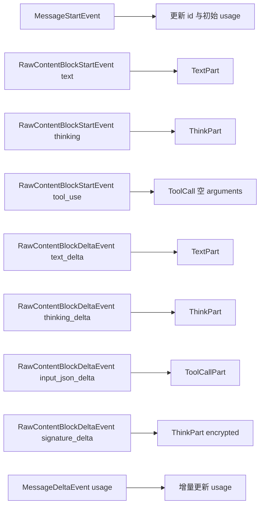

这个映射让上层可以边收边 merge：

- 文本增量由 `TextPart.merge_in_place()` 拼接。
- 工具参数增量由 `ToolCallPart` 与 `ToolCall.merge_in_place()` 拼接 JSON 片段。
- thinking 的明文与 signature 分片也可逐步聚合。

### usage 统计语义

`usage` 属性输出统一 `TokenUsage`：

- `input_other` <- `input_tokens`（若为 `None` 则回退为 0）
- `output` <- `output_tokens`
- `input_cache_read` <- `cache_read_input_tokens`
- `input_cache_creation` <- `cache_creation_input_tokens`

这与 Anthropic prompt caching 统计一致，并被归一化到 `kosong.chat_provider.TokenUsage`。

---

## 工具函数详解

### `_convert_tool(tool: Tool) -> ToolParam`

直接映射 `name/description/parameters`。其中 `parameters` 需是合法 JSON Schema（由 `Tool` 模型自身校验）。

### `_tool_result_message_to_block(tool_call_id, content)`

把工具执行结果包装为 Anthropic `tool_result`。

- 如果 `content` 是字符串：直接作为 tool_result 文本。
- 如果是 `list[ContentPart]`：仅允许 `TextPart` 与 `ImageURLPart`。
- 遇到其它 part 类型会抛 `ChatProviderError`。

这里体现了 Anthropic tool result 支持类型受限的事实。

### `_image_url_part_to_anthropic(part)`

支持两类图片来源：

- 普通 URL：`{"type": "url", "url": ...}`
- `data:` URL（base64）

对 data URL 执行严格校验：

- 必须匹配 `data:<media-type>;base64,<data>`
- media type 仅允许 `image/png`, `image/jpeg`, `image/gif`, `image/webp`

否则抛 `ChatProviderError`。

### `_convert_error(error: AnthropicError)`

把 Anthropic SDK 异常映射为统一异常层次：

- `APIStatus/Auth/Permission/RateLimit` -> `APIStatusError(status_code, message)`
- `APIConnectionError` -> `APIConnectionError`
- `APITimeoutError` -> `APITimeoutError`
- 其他 -> `ChatProviderError("Anthropic error: ...")`

这种映射让上层重试和错误分级逻辑与其他 provider 保持一致。

---

## 典型用法

### 基础创建与调用

```python
from kosong.contrib.chat_provider.anthropic import Anthropic
from kosong.message import Message

provider = Anthropic(
    model="claude-sonnet-4-5",
    api_key="...",
    default_max_tokens=2048,
    stream=True,
)

stream = await provider.generate(
    system_prompt="你是一个代码助手",
    tools=[],
    history=[Message(role="user", content="请解释这段代码")],
)

parts = []
async for part in stream:
    parts.append(part)

print(stream.id, stream.usage)
```

### 配置 thinking 档位

```python
p2 = provider.with_thinking("medium")
# 对旧模型会转成 enabled+budget_tokens=4096
# 对 opus-4.6 会转成 adaptive（且自动移除 interleaved-thinking beta header）
```

### 精细覆盖 generation kwargs

```python
p3 = provider.with_generation_kwargs(
    temperature=0.2,
    top_p=0.95,
    tool_choice={"type": "auto", "disable_parallel_tool_use": True},
    extra_headers={"x-trace-id": "abc-123"},
)
```

---

## 配置与扩展建议

扩展该 provider 时，建议遵循“编码/解码分离”原则：请求侧逻辑优先放在 `Anthropic`，响应事件映射放在 `AnthropicStreamedMessage`。新增 Anthropic block 类型时，优先保证不会破坏旧行为：未知类型建议显式忽略或降级，而非直接抛错，除非该类型会导致语义损坏。

如果你要增加新的 beta feature，建议通过 `with_generation_kwargs(beta_features=[...])` 注入，并在文档中记录是否与特定模型代际绑定，避免像 interleaved-thinking 一样在新模型上成为冗余头。

---

## 边界条件、错误场景与已知限制

### 1) 依赖缺失

模块 import 时会检查 `anthropic` 包。若缺失，直接抛出带安装提示的 `ModuleNotFoundError`。这意味着该模块是“可选依赖”而非核心依赖。

### 2) tool message 约束

`role="tool"` 的消息必须有 `tool_call_id`。缺失即报错，无法自动推断。

### 3) tool call 参数必须是 JSON object

如果 `ToolCall.function.arguments` 不是合法 JSON，或是数组/字符串而非对象，都会报错。这是为了确保 Anthropic `input` 类型正确。

### 4) thinking 内容可能被丢弃

未带 `encrypted` 的 `ThinkPart` 在请求侧会被忽略，这可能让调用方误以为“thinking 发出去了”。调试时应检查入参 part 的 `encrypted` 字段。

### 5) 图片 data URL 格式严格

不符合 `;base64,` 分隔格式或不在允许 MIME 白名单的图片会报错。尤其是 `image/jpg`（非标准写法）不会被接受，应使用 `image/jpeg`。

### 6) 缓存控制注入是“最后块策略”

当前只给“最后一个消息块”和“最后一个工具定义”注入 `ephemeral`，不是全量注入。若你依赖更复杂 cache-control 策略，需要扩展实现。

### 7) `MessagePayload` 暂未使用

该类型别名在当前实现中未参与逻辑，可视为潜在清理项。

---

## 与其他模块文档的关系

为避免重复，以下内容建议参考对应文档：

- `ChatProvider` 协议、统一异常与 `TokenUsage`：见 [kosong_chat_provider.md](./kosong_chat_provider.md)
- `Message` / `ContentPart` / `ToolCall` 数据模型：见 [kosong_core.md](./kosong_core.md)（若该文档把消息模型单列，则优先引用对应消息文档）
- 工具定义 `Tool` 与 JSON Schema：见 [kosong_tooling.md](./kosong_tooling.md)
- 其他 provider 的 GenerationKwargs 差异：
  - [google_genai_provider.md](./google_genai_provider.md)
  - [openai_legacy_provider.md](./openai_legacy_provider.md)
  - [openai_responses_provider.md](./openai_responses_provider.md)

---

## 维护者速查（实践建议）

在维护或排障时，优先检查三层：

1. **输入层**：`history` 中 `tool` 消息是否含 `tool_call_id`、tool arguments 是否 JSON object、图片 URL 是否合规。
2. **配置层**：`with_thinking()` 是否与模型代际匹配、`beta_features` 与 `extra_headers` 是否冲突。
3. **输出层**：流式事件是否正确 merge（尤其 `ToolCallPart` 与 `ThinkPart` signature 片段），`usage` 是否按预期递增。

如果你在上层实现自动重试，建议按统一异常类型判定：`APIConnectionError`/`APITimeoutError` 常可重试，`APIStatusError` 则需基于状态码细分策略（例如 429 可退避重试，401/403 需要凭证修复）。
