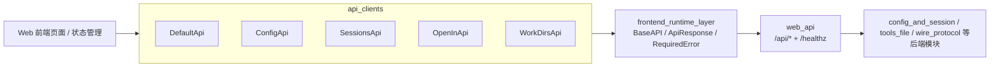
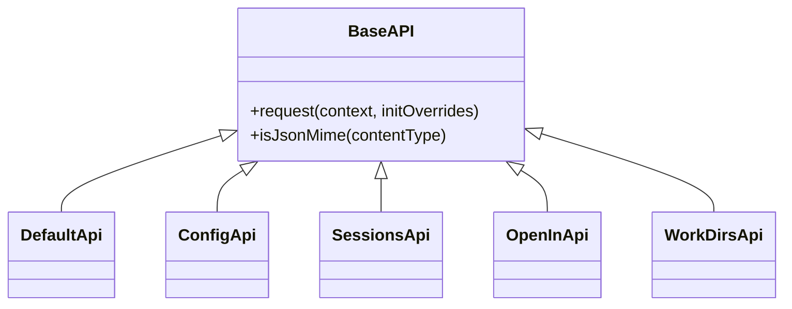
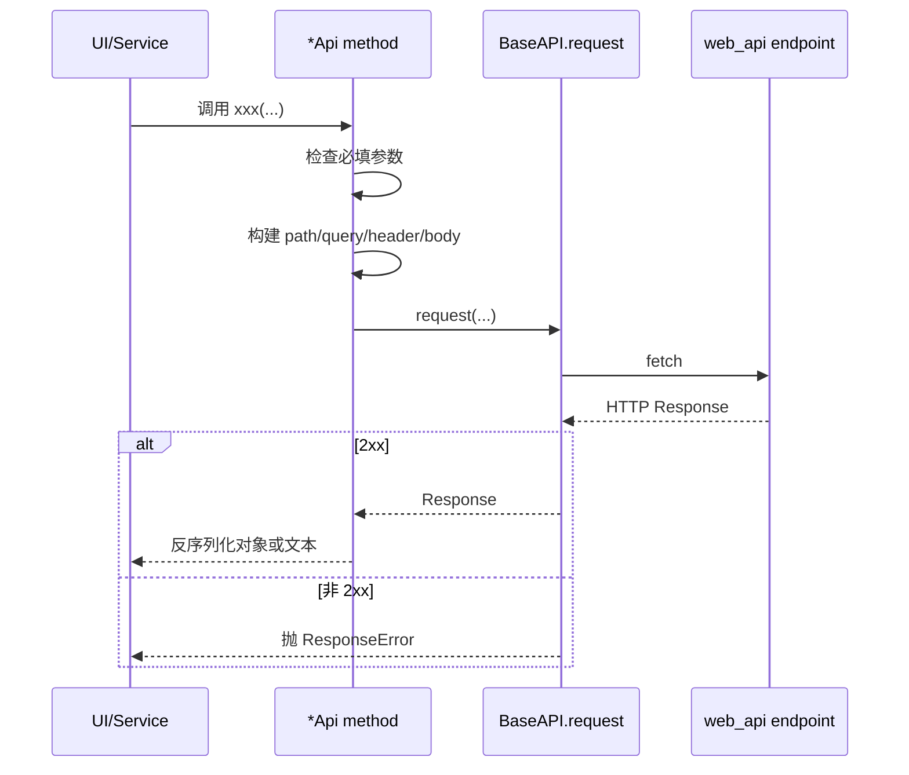
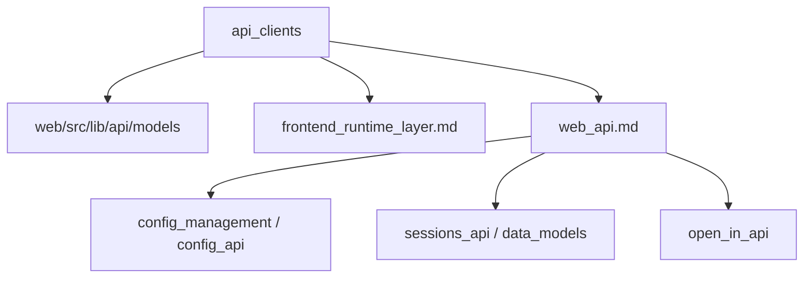

# api_clients 模块文档

## 模块简介

`api_clients` 是 `web_frontend_api` 子系统中的前端 API 客户端集合，代码位于 `web/src/lib/api/apis/`，由 OpenAPI Generator 自动生成。它的核心作用是把后端 `web_api` 暴露的 HTTP 接口，转换成一组可类型检查、可组合、可维护的 TypeScript 调用入口，包括 `ConfigApi`、`DefaultApi`、`SessionsApi`、`OpenInApi` 和 `WorkDirsApi`。

这个模块存在的意义，不只是“封装 fetch”。在一个包含会话生命周期、配置写入、文件上传、路径打开、工作目录发现等多种行为的系统里，手写 HTTP 调用会快速出现路径字符串漂移、请求体序列化不一致、错误处理风格分裂、参数校验遗漏等工程问题。`api_clients` 通过“统一生成 + 统一 runtime 执行”的方式，把这些风险尽量前置到编译期和固定的运行时边界。

从系统分层看，`api_clients` 位于 Web UI 和后端 `web_api` 之间，是一个严格的“契约适配层”。它不承载业务决策，不管理状态，不负责 UI 交互，而是专注于请求构建、参数检查、响应反序列化和错误传播。

## 架构与模块关系



上图说明 `api_clients` 的设计重心：各 API 类本身都很薄，主要负责 endpoint 层的参数与路径映射；真正的请求生命周期由 `runtime` 统一执行。这样做的直接收益是跨 API 客户端的行为一致性，比如“非 2xx 一律抛异常”“必填参数本地先校验”“Raw 与非 Raw 双层方法并存”。

## 组件关系（类继承与职责）



所有客户端都继承 `runtime.BaseAPI`，因此拥有相同的调用方式：每个 endpoint 通常提供 `xxxRaw` 与 `xxx` 两个方法。`xxxRaw` 返回 `ApiResponse<T>`，便于读取原始 `Response`；`xxx` 是便捷解包方法，直接返回业务对象。多数业务代码使用 `xxx` 即可，只有在需要状态码/响应头/原始 body 时才选择 `Raw`。

## 请求执行流程



这个流程体现了一个常被忽略的事实：调用失败多数走异常通道，而不是“返回一个错误对象”。因此上层需要统一 `try/catch` 策略，不建议在每个页面独立拼装错误语义。

## 核心组件详解

### 1) `ConfigApi`

`ConfigApi` 负责配置读取与更新，对应后端 `/api/config/*`。它是前端“设置页”和“全局配置编辑”能力的契约入口。

`getConfigTomlApiConfigTomlGet` 与 `getConfigTomlApiConfigTomlGetRaw` 通过 `GET /api/config/toml` 获取 `ConfigToml`。该调用无请求参数，返回结构化 TOML 快照对象。副作用上是只读操作，但调用方应注意这不保证本地编辑内容与后端磁盘内容始终一致，仍需在保存前后重新拉取。

`getGlobalConfigApiConfigGet` 通过 `GET /api/config/` 获取 `GlobalConfig`，用于读取全局默认模型、思考模式等快照。该接口同样只读，常用于页面初始化。

`updateConfigTomlApiConfigTomlPut` 通过 `PUT /api/config/toml` 提交 `UpdateConfigTomlRequest`。方法会先检查 `updateConfigTomlRequest` 是否为 `null/undefined`，缺失时本地抛 `RequiredError`。请求头固定 `Content-Type: application/json`，响应为 `UpdateConfigTomlResponse`。这是高副作用接口，可能影响运行中会话行为（具体后端策略见 [config_api.md](config_api.md)）。

`updateGlobalConfigApiConfigPatch` 通过 `PATCH /api/config/` 更新全局默认配置，必填参数是 `updateGlobalConfigRequest` 对象。注意“对象必填”不等于“内部字段必填”，空对象在类型上可通过，语义由后端解释。

### 2) `DefaultApi`

`DefaultApi` 当前只承载健康探测接口 `healthProbeHealthzGet`，对应 `GET /healthz`。返回值类型是 `{ [key: string]: any }`，表示健康信息结构可能随后端演进而变化。

这个类虽然简单，但在系统可用性链路里非常关键。实践上，前端可以在应用启动、重连或错误恢复阶段先调用健康接口，再决定是否继续调用更重的业务接口。

### 3) `SessionsApi`

`SessionsApi` 是本模块最复杂的客户端，覆盖会话生命周期、会话文件访问、上传文件、标题生成和 Git 统计。

`createSessionApiSessionsPost` 通过 `POST /api/sessions/` 创建会话，请求体 `createSessionRequest` 可选；若不传，由后端采用默认创建策略。返回 `Session`。

`listSessionsApiSessionsGet` 通过 `GET /api/sessions/` 获取会话列表，支持 `limit`、`offset`、`q`、`archived` 查询参数。它没有本地必填检查，但调用方要自己保证分页参数合理，避免一次请求过大。

`getSessionApiSessionsSessionIdGet`、`updateSessionApiSessionsSessionIdPatch`、`deleteSessionApiSessionsSessionIdDelete` 分别对应按 ID 查询、更新、删除。它们都会先检查 `sessionId`；更新接口还会检查 `updateSessionRequest`。删除接口返回 `any`，并根据响应 content-type 在 JSON/Text 间切换。

`generateSessionTitleApiSessionsSessionIdGenerateTitlePost` 通过 `POST /api/sessions/{session_id}/generate-title` 调用 AI 生成标题。`generateTitleRequest` 可选，不传时后端可回退到首轮对话内容。该接口本身不保证幂等，因为模型输出可能随上下文变化。

`getSessionFileApiSessionsSessionIdFilesPathGet` 与 `getSessionUploadFileApiSessionsSessionIdUploadsPathGet` 是两个文件读取接口，分别面向会话工作目录和上传目录。它们都要求 `sessionId` 与 `path`，并对 path 做 `encodeURIComponent`。返回类型是 `any`，因为响应可能是 JSON（目录列表）也可能是文本/其他类型（文件内容）。

`uploadSessionFileApiSessionsSessionIdFilesPost` 通过 `multipart/form-data` 上传单个 `Blob` 到会话目录。方法内部自动选择 `FormData` 并 append `file` 字段。该接口有实际 I/O 副作用，失败时可能出现“文件未落盘”或“部分过程已执行”的后端状态，调用方应在失败后重新拉取目录确认结果。

`getSessionGitDiffApiSessionsSessionIdGitDiffGet` 返回 `GitDiffStats`，用于展示当前会话工作目录变更概览。该接口通常用于 UI 信息展示，不直接修改状态。

### 4) `OpenInApi`

`OpenInApi` 提供 `openInApiOpenInPost`，对应 `POST /api/open-in`。请求参数 `openInRequest` 必填，缺失即本地 `RequiredError`。返回 `OpenInResponse`。

需要特别强调，这个动作执行在后端宿主机，不是用户浏览器本机。也就是说，在远程部署或容器环境下，“打开路径”行为可能与用户直觉不一致，前端应在 UI 上明确提示执行环境边界。

### 5) `WorkDirsApi`

`WorkDirsApi` 负责工作目录相关只读能力。

`getStartupDirApiWorkDirsStartupGet` 通过 `GET /api/work-dirs/startup` 返回启动目录字符串。它会根据响应 `content-type` 在 JSON 与文本解析之间动态切换。

`getWorkDirsApiWorkDirsGet` 通过 `GET /api/work-dirs/` 返回目录列表 `Array<string | null>`。之所以包含 `null`，通常是为了容忍后端元数据中的空值或历史脏数据，前端渲染时应显式过滤或降级显示。

## API 客户端依赖与跨模块协作



`api_clients` 通过 `models/index` 完成 JSON <-> TS 对象转换，依赖 `FromJSON/ToJSON` 函数保障字段映射一致性。它自身不维护业务状态，状态管理应放在上层 store/service。

## 使用与配置建议

下面是一个典型初始化方式，展示如何共享 `Configuration` 并复用到多个客户端。

```ts
import { Configuration } from '@/lib/api/runtime'
import { SessionsApi } from '@/lib/api/apis/SessionsApi'
import { ConfigApi } from '@/lib/api/apis/ConfigApi'
import { WorkDirsApi } from '@/lib/api/apis/WorkDirsApi'

const conf = new Configuration({
  basePath: 'http://127.0.0.1:8000',
  credentials: 'include',
  headers: { 'X-Client': 'kimi-web' },
})

export const sessionsApi = new SessionsApi(conf)
export const configApi = new ConfigApi(conf)
export const workDirsApi = new WorkDirsApi(conf)
```

推荐在业务层封装一层 service，而不是让页面直接调用生成客户端。这样可以集中处理错误翻译、重试策略、空值兜底和埋点逻辑。

```ts
export async function safeListSessions() {
  try {
    return await sessionsApi.listSessionsApiSessionsGet({ limit: 50, archived: false })
  } catch (e) {
    // 统一映射 runtime.ResponseError / FetchError
    throw normalizeApiError(e)
  }
}
```

## 边界条件、错误语义与常见陷阱

`api_clients` 的第一类常见问题是本地参数错误。很多方法会在发请求前抛 `RequiredError`，这意味着请求根本没有到达后端。排查时不要只看网络面板，也要看调用参数来源。

第二类问题是返回类型不稳定带来的运行时风险。`SessionsApi` 的文件读取相关接口返回 `any`，并根据 `content-type` 决定 JSON/Text 解包。若上层直接按固定结构访问字段，很容易触发运行时异常。建议增加类型守卫。

第三类问题是路径编码。`{path}` 使用 `encodeURIComponent` 后，斜杠会被编码，后端路由和反向代理若处理不一致，会出现 404 或路径错位。联调时应重点验证包含多级目录、空格、中文字符的路径。

第四类问题是副作用接口的幂等性与重试。`PUT/PATCH/POST` 不应与 `GET` 共享自动重试策略，尤其是上传文件与配置更新接口，盲目重试可能导致重复写入或状态不一致。

第五类问题是自动生成代码的可维护性。`api_clients` 文件通常不建议手工修改，因为重新生成会覆盖变更。正确做法是更新 OpenAPI 规范并重新生成，再在外层 wrapper 做定制。

## 扩展与演进建议

当你要新增接口时，建议沿用现有模式：在 OpenAPI schema 定义请求/响应模型，再生成新的 `*Api` 方法。若新增接口涉及二进制下载或空响应，请优先确认 runtime 是否应使用 `BlobApiResponse` 或 `VoidApiResponse`（见 [frontend_runtime_layer.md](frontend_runtime_layer.md)）。

如果要扩展鉴权、trace-id、审计日志，优先通过 runtime 中间件扩展，不要在每个 API 方法里手工加 header。这样可避免跨客户端行为不一致。

## 相关文档

- 总览：[`web_frontend_api.md`](web_frontend_api.md)
- 运行时层：[`frontend_runtime_layer.md`](frontend_runtime_layer.md)
- 会话客户端细节：[`frontend_sessions_api_client.md`](frontend_sessions_api_client.md)
- 配置客户端细节：[`frontend_config_api_client.md`](frontend_config_api_client.md)
- Open In 客户端细节：[`frontend_open_in_api_client.md`](frontend_open_in_api_client.md)
- 工作目录客户端细节：[`frontend_work_dirs_api_client.md`](frontend_work_dirs_api_client.md)
- 后端 API 语义：[`web_api.md`](web_api.md)
