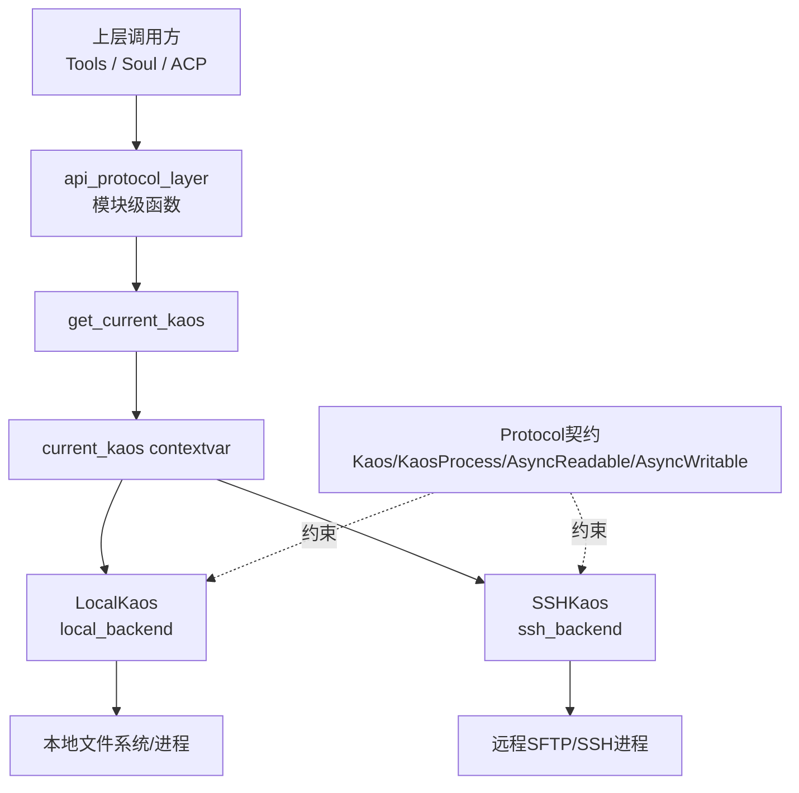
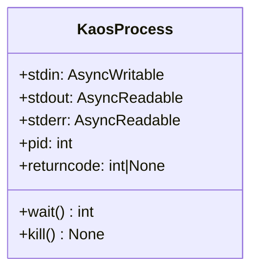
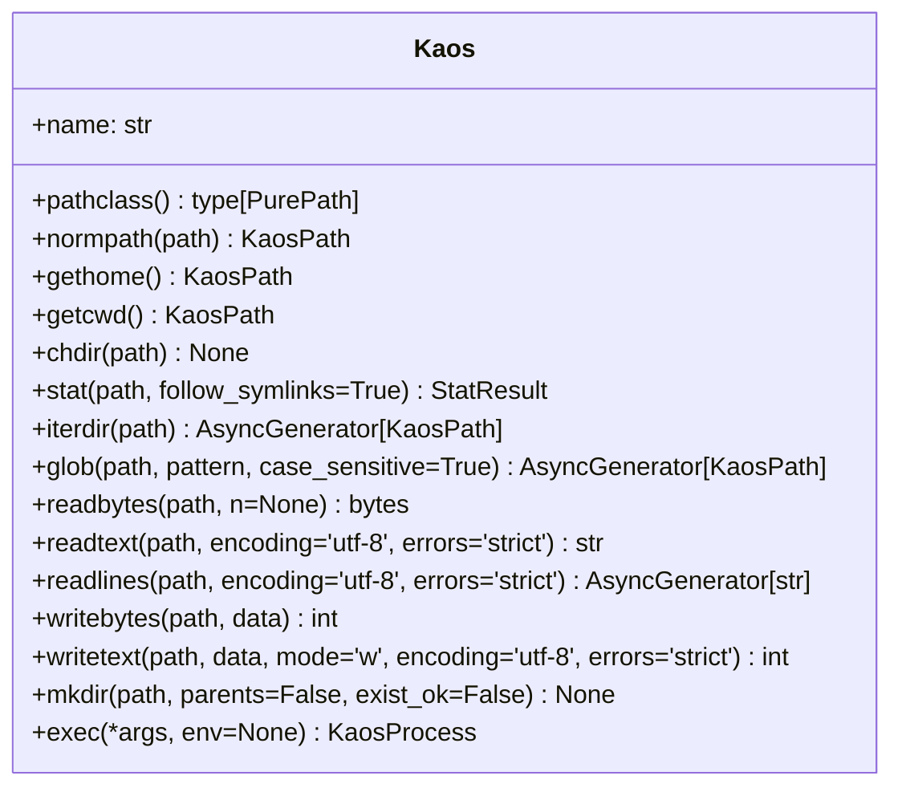
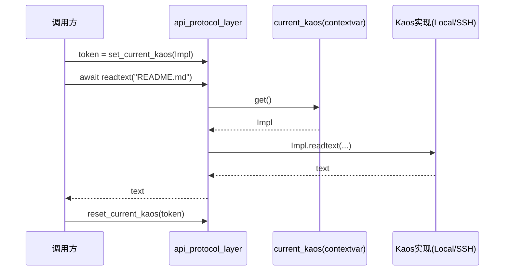
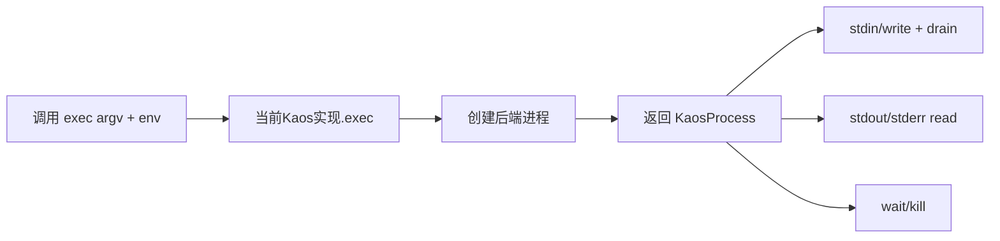

# api_protocol_layer 模块文档

## 1. 模块定位：它是什么、为什么存在

`api_protocol_layer` 对应 `packages/kaos/src/kaos/__init__.py` 中的协议与门面 API，是 `kaos_core` 的“契约层 + 分发层”。这个模块本身几乎不执行真实 I/O，而是定义统一接口（Protocol）并把调用转发给当前上下文中的具体后端（如 `local_backend` 的 `LocalKaos`、`ssh_backend` 的 `SSHKaos`）。

它存在的根本原因，是让上层能力（例如 `tools_file`、`tools_shell`、`acp_kaos`、`soul_engine`）不需要感知运行目标到底是本地还是远程。上层只调用一致 API（`readtext`、`writetext`、`exec`、`stat` 等），底层由当前绑定的 `Kaos` 实现实例负责真正执行。这样系统可在“同一套业务代码”下切换执行环境，降低耦合并提升可测试性。

从设计角度看，这个模块同时做了三件事：第一，定义跨后端必须遵守的能力边界；第二，统一跨后端的返回结构（`StatResult`）；第三，通过 `contextvars` 暴露“当前后端”的全局门面函数。它是 `kaos_core` 的稳定入口，也是后端扩展的契约锚点。

---

## 2. 架构总览



该图反映了模块最关键的运行机制：**所有门面函数都先取当前上下文的 KAOS 实例，然后委派调用**。因此 API 层可以长期稳定，而后端可独立演进。

---

## 3. 核心协议与数据模型

## 3.1 `AsyncReadable`

`AsyncReadable` 是异步“可读字节流”协议，覆盖 `read/readline/readexactly/readuntil`、`__aiter__`、EOF 相关接口。它的设计重点是“字节级一致性”，而不是文本级一致性，这避免了后端在编码层的隐式差异。

典型来源是进程 `stdout/stderr`。协议兼容 `asyncio.StreamReader` 与 `asyncssh` reader 这一类对象，使本地与 SSH 后端在流读取方式上保持统一。

## 3.2 `AsyncWritable`

`AsyncWritable` 是异步“可写字节流”协议，典型用于子进程 `stdin`。它包含 `write/writelines` 与 `drain`，以及 `close/write_eof/wait_closed` 这组关闭与刷缓冲语义。

`drain()` 的存在很关键：它表达了“背压感知”能力。若大量写入但不 `drain`，上层逻辑可能在高吞吐场景下触发缓冲风险。

## 3.3 `KaosProcess`

`KaosProcess` 抽象“已启动进程”的生命周期与 I/O 接口，暴露 `stdin/stdout/stderr`、`pid`、`returncode`、`wait()`、`kill()`。



这让上层可以统一处理本地子进程与远程 SSH 进程。需要注意，`pid` 的语义依赖后端实现：它是“可观测 ID”，不一定总能与本机 OS PID 一一对应。

## 3.4 `Kaos`

`Kaos` 是整个 API 协议层的核心，统一定义路径、目录、文件、进程四类能力：

- 路径语义：`pathclass`、`normpath`
- 工作目录语义：`gethome`、`getcwd`、`chdir`
- 文件系统语义：`stat`、`iterdir`、`glob`、`read*`、`write*`、`mkdir`
- 执行语义：`exec`



这个接口集合刻意保持“够用而克制”：提供代理运行最常用能力，而不试图复制全部 POSIX 细节，从而降低跨后端实现复杂度。

## 3.5 `StatResult`

`StatResult` 是统一的 stat 数据结构，字段包括 `st_mode/st_size/st_mtime` 等标准信息。它让调用方无需依赖后端私有 stat 类型。

但要理解它是“统一形状”而非“绝对同源语义”：部分后端（尤其远程）可能无法提供完全等价的 inode/device 语义，字段可能是兼容值。

---

## 4. 上下文分发机制：`contextvars`

模块通过以下函数管理当前 KAOS 实例：`set_current_kaos`、`get_current_kaos`、`reset_current_kaos`。这意味着 API 调用行为由“当前异步上下文”决定，而不是由每个函数显式传入后端。



这个机制特别适合并发任务隔离；同时也要求调用方严格遵守 token 对称恢复，否则会污染后续任务上下文。

---

## 5. 模块级 API 详解（门面函数）

这些函数全部位于 `kaos.__init__`，本质是“读取 current kaos 并转发同名调用”。

## 5.1 上下文管理

- `get_current_kaos() -> Kaos`：获取当前上下文绑定实例。
- `set_current_kaos(kaos: Kaos) -> contextvars.Token[Kaos]`：设置并返回 token。
- `reset_current_kaos(token)`：按 token 恢复旧值。

副作用是修改当前 contextvar 状态。推荐配合 `try/finally` 使用。

## 5.2 路径与工作目录

- `pathclass() -> type[PurePath]`：当前后端路径 flavor。
- `normpath(path: str | KaosPath) -> KaosPath`：路径标准化。
- `gethome()/getcwd()`：获取 home 与 cwd。
- `chdir(path)`：异步切换 cwd。

这些接口是 `KaosPath` 等路径抽象的基础。不同后端路径规则可能不同（例如大小写或分隔符语义），要避免写死本地假设。

## 5.3 文件系统操作

- `stat(path, follow_symlinks=True) -> StatResult`
- `iterdir(path) -> AsyncGenerator[KaosPath]`
- `glob(path, pattern, case_sensitive=True) -> AsyncGenerator[KaosPath]`
- `readbytes(path, n=None) -> bytes`
- `readtext(path, encoding='utf-8', errors='strict') -> str`
- `readlines(path, encoding='utf-8', errors='strict') -> AsyncGenerator[str]`
- `writebytes(path, data: bytes) -> int`
- `writetext(path, data: str, mode='w'|'a', encoding='utf-8', errors='strict') -> int`
- `mkdir(path, parents=False, exist_ok=False)`

其中 `readlines/iterdir/glob` 是异步生成器，消费方必须以 `async for` 使用。

## 5.4 进程执行

- `exec(*args: str, env: Mapping[str, str] | None = None) -> KaosProcess`

`args` 采用 argv 形式；`env` 为可选环境变量映射。返回的是运行中的进程对象，调用方可以持续读写流并最终 `wait()`。

---

## 6. 关键流程说明

## 6.1 文件读取流程


这个流程看似简单，但其稳定性来自协议约束：只要后端满足 `Kaos.readtext` 语义，上层代码无需区分 Local/SSH。

## 6.2 命令执行流程



该流程体现了协议层分工：`api_protocol_layer` 不做执行策略决策，只统一生命周期操作面。

---

## 7. 实际使用示例

## 7.1 安全切换后端作用域

```python
import kaos
from kaos.local import local_kaos

async def load_file() -> str:
    token = kaos.set_current_kaos(local_kaos)
    try:
        return await kaos.readtext("README.md")
    finally:
        kaos.reset_current_kaos(token)
```

## 7.2 读写进程流

```python
proc = await kaos.exec("python", "-c", "print(input())")
proc.stdin.write(b"hello\n")
await proc.stdin.drain()
if proc.stdin.can_write_eof():
    proc.stdin.write_eof()
out = await proc.stdout.read()
code = await proc.wait()
```

## 7.3 部分读取与编码容错

```python
head = await kaos.readbytes("large.log", n=4096)
text = await kaos.readtext("legacy.txt", encoding="utf-8", errors="replace")
```

---

## 8. 扩展与实现建议（给后端开发者）

实现新的 `Kaos` 后端时，建议先以契约一致性为目标：

1. 确保 `normpath/getcwd/chdir` 构成一致闭环，避免路径状态漂移。
2. 保证 `exec` 返回对象完整实现 `KaosProcess` 协议，并具备可读写流。
3. 明确 `glob` 的大小写规则与平台差异，并在文档中写清。
4. `readtext/writetext` 的 encoding/errors 参数应严格遵守传入值。
5. 对不可完全模拟的字段（如 stat 某些元信息）提供可预测兼容行为。

`@runtime_checkable` 允许用 `isinstance(obj, Kaos)` 做运行时结构检查，但这只能验证“方法存在”，不能验证“语义正确”。仍应配套契约测试。

---

## 9. 边界条件、错误与限制

最常见问题不在代码复杂度，而在语义细节：

- 如果未先 `set_current_kaos`，门面函数在 `get_current_kaos()` 处会失败（异常形态取决于 `_current` 默认值策略）。
- `readtext/writetext` 默认 `errors='strict'`，遇到非法编码会抛异常；容错场景需显式设为 `replace` 或 `ignore`。
- `exec(*args)` 不是 shell 字符串执行，不会自动解释 pipe/redirection/glob；需要 shell 特性时请显式调用 `bash -lc`。
- `readlines/iterdir/glob` 为异步生成器，若中途取消迭代，资源释放行为依赖后端实现。
- `writetext` 只提供 `w/a` 两种模式，不直接覆盖原子写、权限位、文件锁等高级语义。
- `pid`、`stat` 某些字段在远程后端可能不具备与本地完全一致的可观测性。

---

## 10. 与其他模块文档的关系

为避免重复，建议配套阅读：

- [kaos_core.md](kaos_core.md)：`kaos_core` 全局架构与模块角色。
- [local_kaos.md](local_kaos.md)：`local_backend` 的具体实现细节。
- [ssh_kaos.md](ssh_kaos.md)：`ssh_backend` 的远程语义与安全注意事项。
- [tools_shell.md](tools_shell.md) 与 [tools_file.md](tools_file.md)：上层如何消费该协议层能力。
- [acp_kaos.md](acp_kaos.md)：KAOS 在 ACP 进程封装中的使用方式。

`api_protocol_layer` 文档重点是“接口契约与分发机制”；后端执行细节应在后端文档中展开。
