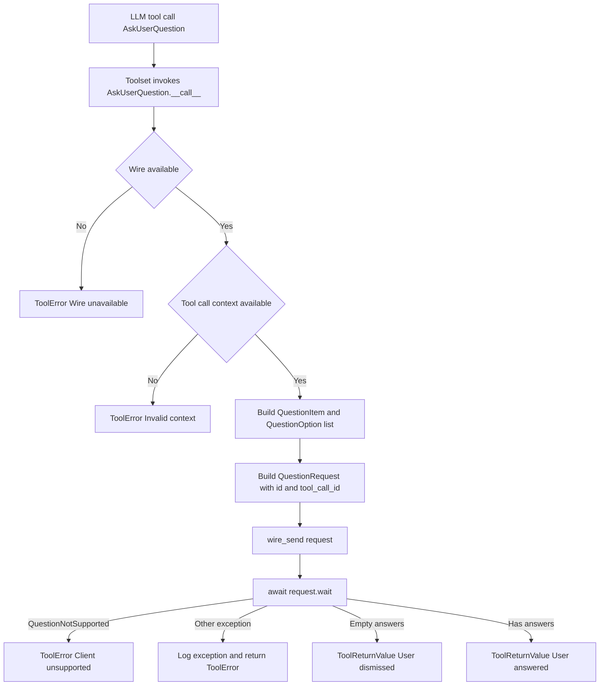
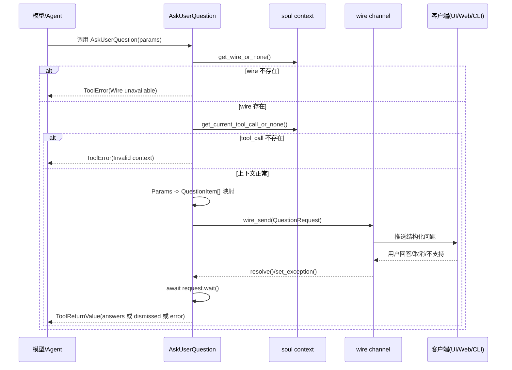
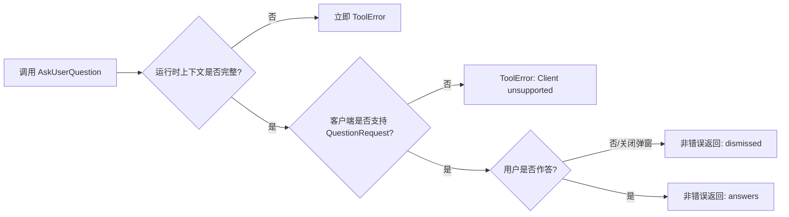

# ask_user_interaction 模块文档

## 1. 模块简介：它做什么、为什么存在

`ask_user_interaction`（实现文件：`src/kimi_cli/tools/ask_user/__init__.py`）是 `tools_misc` 下的一个“结构化询问用户”工具模块。它的核心职责是在 Agent 执行过程中，遇到关键分歧、需求不明确或策略需要用户裁决时，通过统一的 Wire 协议向前端发起问题，并等待用户选择后再继续执行。

这个模块存在的设计动机非常明确：在复杂任务中，模型并不总能安全地“自作主张”。如果继续推理会导致错误路径或高代价操作，系统需要一个标准化、可追踪、可回放的交互中断点。相比“直接让模型输出一句追问文本”，该模块把问题结构化为 `question/header/options/multi_select`，让 UI 能够渲染成可点击选项，也让返回结果对后续自动化处理更稳定。

从系统位置看，它是 `kosong_tooling` 工具调用框架上的一个具体 `CallableTool2` 实现，向下依赖 `soul_engine` 的 Wire 上下文与当前 `tool_call` 上下文，向旁路依赖 `wire_protocol` 中的 `QuestionRequest/QuestionItem/QuestionOption` 类型。换句话说，它不是“对话层追问”，而是“运行时交互协议的一部分”。

---

## 2. 架构与依赖关系



上图展示了该工具的完整执行路径。它首先验证运行上下文是否满足“可交互”前提，然后把参数模型映射为 Wire 协议对象并发出请求，最后阻塞等待用户反馈。该阻塞不是线程阻塞，而是异步等待 `QuestionRequest` 内部 future 被前端响应事件 resolve。

---

## 3. 数据模型与组件详解

### 3.1 `QuestionOptionParam`

`QuestionOptionParam` 是工具参数层的“单个选项”模型，字段包括：

- `label: str`：选项标题，要求简短（描述中建议 1-5 个词）。
- `description: str = ""`：选项补充说明，用于描述权衡和影响。

这个模型本身不做复杂逻辑，只负责输入结构化和 JSON Schema 导出。其注释约定了推荐项可追加 `(Recommended)`，但这是提示语义，不是硬校验。

### 3.2 `QuestionParam`

`QuestionParam` 表示单个问题，字段如下：

- `question: str`：完整问题文本（描述建议以 `?` 结尾）。
- `header: str = ""`：短标签（例如 `Auth`、`Style`），用于 UI 分类展示。
- `options: list[QuestionOptionParam]`：选项列表，`min_length=2`、`max_length=4`。
- `multi_select: bool = False`：是否允许多选。

这里最关键的是 `options` 的长度约束。它避免了“无意义单选”或“选项爆炸”两类 UX 问题，同时与 `description.md` 中“不要手工添加 Other”约定一致：客户端会自动提供自定义输入兜底。

### 3.3 `Params`

`Params` 是工具顶层参数模型：

- `questions: list[QuestionParam]`，长度限制 `1..4`。

这让一次工具调用可以打包多个相关问题，减少反复打断用户流程。

### 3.4 `AskUserQuestion`

`AskUserQuestion` 继承 `CallableTool2[Params]`，是该模块唯一可执行工具类。类属性：

- `name = "AskUserQuestion"`
- `description = load_desc(.../description.md)`
- `params = Params`

它的 `__call__` 是核心逻辑，返回类型统一为 `ToolReturnValue`（成功或错误都结构化返回）。

---

## 4. 关键执行流程（逐步拆解）



该流程有三个设计重点。第一，`tool_call_id` 会写入 `QuestionRequest`，把用户反馈与当前工具调用关联起来，便于追踪。第二，`QuestionRequest.wait()` 通过 future 等待，不耦合具体前端类型。第三，错误不是抛给外层，而是转换成 `ToolError`，符合 `Toolset` 期望的“错误内收”模型。

---

## 5. `AskUserQuestion.__call__` 的内部机制

`__call__` 的执行逻辑可概括为“上下文检查 → 协议映射 → 发送请求 → 等待结果 → 结构化返回”。

1. **Wire 可用性检查**：调用 `get_wire_or_none()`。若为 `None`，说明当前运行环境无法进行交互式通信（例如离线或非 soul loop 上下文），直接返回 `ToolError(message="Cannot ask user questions: Wire is not available.")`。
2. **工具调用上下文检查**：调用 `get_current_tool_call_or_none()`。若不存在，说明该函数未在合法工具调用作用域中执行，返回 `ToolError(message="AskUserQuestion must be called from a tool call context.")`。
3. **参数到 Wire 类型映射**：将 `Params.questions` 逐项转换为 `QuestionItem`，其中每个 `QuestionOptionParam` 转换为 `QuestionOption`。
4. **构造请求对象**：创建 `QuestionRequest(id=str(uuid4()), tool_call_id=tool_call.id, questions=questions)`。
5. **发送并等待**：`wire_send(request)` 后执行 `await request.wait()`。
6. **异常处理**：
   - 捕获 `QuestionNotSupported`：返回明确指导文本，要求后续不要再调用本工具。
   - 捕获通用异常：记录日志 `logger.exception(...)` 并返回通用失败 `ToolError`。
7. **结果整形**：
   - 若 `answers` 为空：返回非错误 `ToolReturnValue`，并附带 note 表示用户主动 dismiss。
   - 若有答案：将 `{"answers": answers}` 以 `json.dumps(..., ensure_ascii=False)` 输出。

---

## 6. 输入输出契约与返回语义

### 6.1 输入参数契约

最外层参数示例：

```json
{
  "questions": [
    {
      "question": "How should we handle authentication for this API?",
      "header": "Auth",
      "options": [
        {"label": "JWT (Recommended)", "description": "Stateless and easy to scale."},
        {"label": "Session Cookie", "description": "Simpler browser integration."}
      ],
      "multi_select": false
    }
  ]
}
```

### 6.2 正常返回（用户有回答）

`ToolReturnValue` 关键字段通常为：

- `is_error = false`
- `output = "{\"answers\": {...}}"`（JSON 字符串）
- `message = "User has answered."`
- `display = [BriefDisplayBlock(text="User answered")]`

### 6.3 正常返回（用户 dismiss）

这是一个“非错误但无结果”的分支：

- `is_error = false`
- `output = {"answers": {}, "note": "User dismissed ..."}`（字符串形式）
- `message = "User dismissed the question without answering."`
- `display = [BriefDisplayBlock(text="User dismissed")]`

### 6.4 错误返回

所有错误都包装为 `ToolError`（即 `ToolReturnValue.is_error=true`），包括：

- Wire 不可用
- 非法调用上下文
- 客户端不支持提问协议
- 等待用户响应时发生未知异常

---

## 7. 配置与行为约束

该模块本身没有独立配置文件，但存在一组由参数模型、描述文档和 Wire 协议共同定义的“软硬约束”：

- **硬约束（Pydantic）**：问题数量 1-4、每题选项 2-4。
- **软约束（description.md）**：少打断用户；可推断时不要问；不要手工添加 `Other`；推荐项可在 label 加 `(Recommended)`。
- **协议约束（wire types）**：答案结构是 `dict[str, str]`，多选答案会被编码为逗号分隔字符串（见 `QuestionResponse` 注释）。

实践上要注意：模型侧如果希望后续自动处理多选，必须自己解析该字符串，而不是假设返回数组。

---

## 8. 扩展与二次开发建议

如果你需要扩展该模块，建议优先保持“参数层稳定、协议层兼容”。常见扩展点如下。

### 8.1 新增问题元信息

例如想增加 `priority` 或 `help_url`，应先扩展 `QuestionParam`，再同步映射到 `QuestionItem`（若 wire 类型支持），并评估旧客户端的降级行为。

### 8.2 优化返回结构

当前 `output` 是 JSON 字符串，这是工具框架约定下的通用做法。若要改为 richer `ContentPart`，要同时验证模型兼容性与上游 `StepResult` 消费路径。

### 8.3 引入超时控制

当前 `await request.wait()` 没有超时。可考虑在工具层加 `asyncio.wait_for`，并在超时时返回可解释 `ToolError`，但要与 UI 侧“晚到响应”处理策略保持一致。

---

## 9. 边界条件、错误场景与已知限制



维护时重点关注以下风险：

- 该工具**强依赖 Soul 的 wire 上下文**。在脱离 agent loop 的测试或离线执行中，通常会直接触发 `Wire unavailable`。
- 该工具必须在工具调用作用域内运行，否则拿不到 `tool_call_id`，会返回 `Invalid context`。
- 客户端能力不一致时会抛 `QuestionNotSupported`，工具已提供“不要再次调用”的明确提示，但上层策略若忽略该提示仍会重复失败。
- 用户 dismiss 并不算错误，调用方必须识别 `answers == {}` 的分支，避免误当作“已经拿到偏好”。
- 日志中只记录 request id 的失败信息，不包含问题详情；这有利于隐私，但会降低排障上下文。

---

## 10. 与其他模块的关系与参考文档

为了避免重复阅读，建议结合以下文档理解整体协作链路：

- [kosong_tooling.md](kosong_tooling.md)：理解 `CallableTool2`、`ToolReturnValue`、`ToolError` 的统一契约。
- [soul_engine.md](soul_engine.md)：理解 wire 上下文在 agent runtime 中何时可用。
- [wire_protocol.md](wire_protocol.md)（若已生成）：重点查看 `QuestionRequest/QuestionResponse/QuestionNotSupported` 的跨端语义。
- [tools_misc.md](tools_misc.md)（若已生成）：查看 `ask_user_interaction` 在 misc 工具集合中的职责边界。

---

## 11. 典型使用模式

下面示例展示模型在需要用户决策时的工具参数构造风格：

```python
# conceptual example
params = {
    "questions": [
        {
            "question": "Which migration strategy should we apply first?",
            "header": "DB",
            "options": [
                {
                    "label": "Expand-Contract (Recommended)",
                    "description": "Safer rollout with backward compatibility."
                },
                {
                    "label": "Direct Cutover",
                    "description": "Faster but higher downtime risk."
                }
            ],
            "multi_select": False
        }
    ]
}
```

推荐实践是：只在答案会显著改变下一步动作时调用，且每次尽量合并相关问题，减少交互中断。
