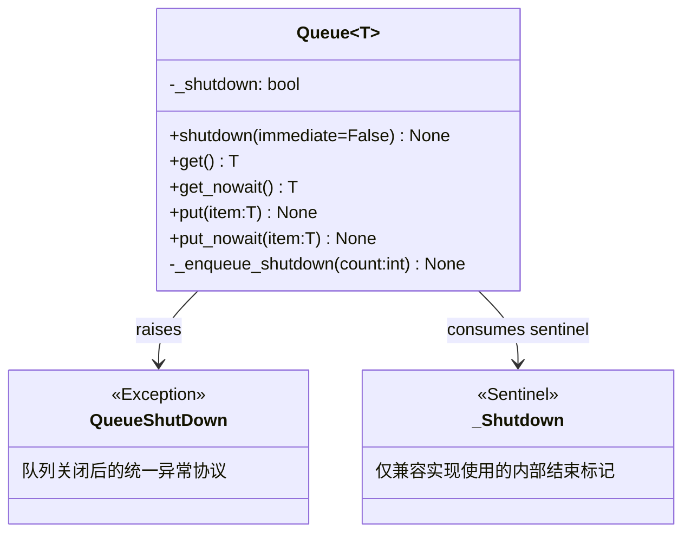
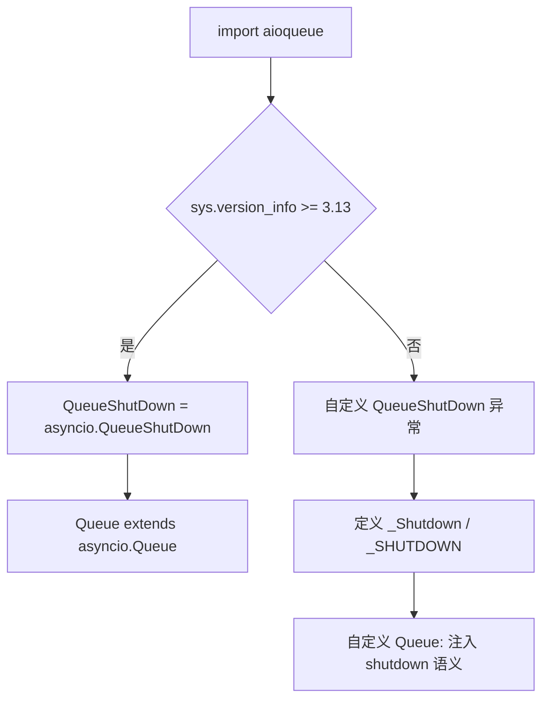
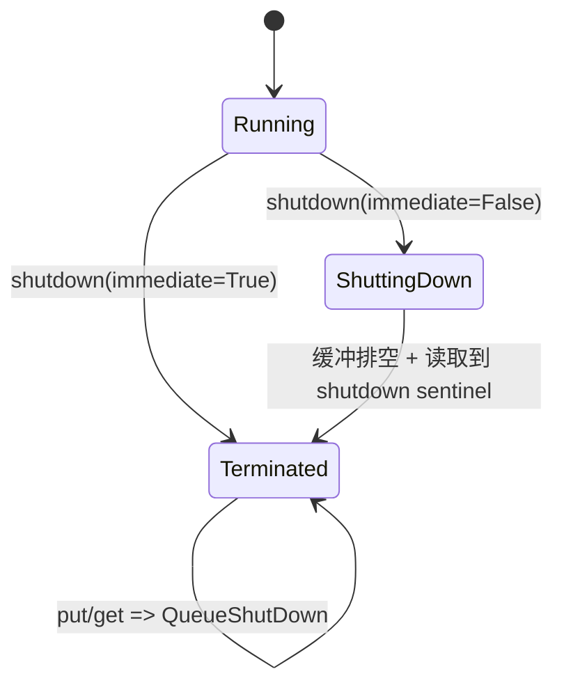
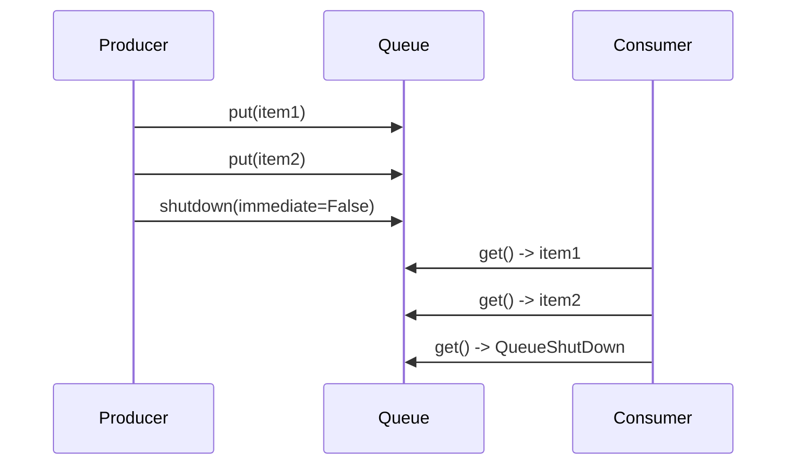
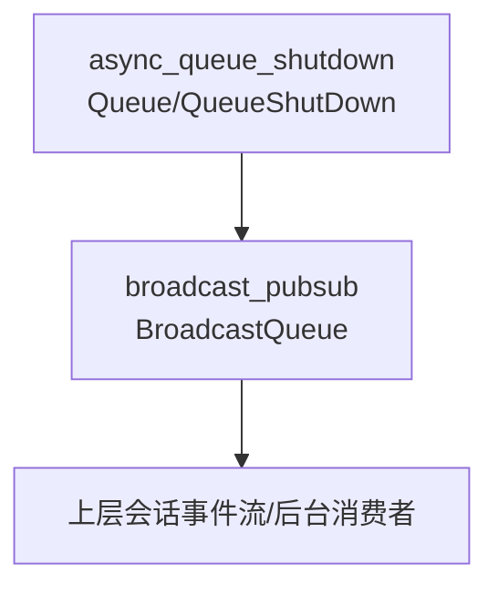

# async_queue_shutdown

## 概述：为什么需要一个“可关闭的异步队列”

`async_queue_shutdown` 模块对应实现文件 `src/kimi_cli/utils/aioqueue.py`，核心目标是在 `asyncio.Queue` 之上提供一致的 **shutdown 生命周期语义**。在纯 `asyncio.Queue` 模型里，队列天然擅长“传递数据”，但不擅长“传递结束信号”：消费者经常会卡在 `await get()`，生产者也可能在系统收尾阶段继续写入，导致退出顺序混乱、任务悬挂甚至进程无法优雅停止。

这个模块通过统一异常 `QueueShutDown`（以及 Python < 3.13 下的内部哨兵 `_Shutdown`）把“队列已经关闭”变成显式控制流，而不是业务层魔法值。这样，上层代码可以用同一模式处理终止：读取端捕获 `QueueShutDown` 并退出循环，写入端在关闭后立即失败并停止生产。

从设计哲学上看，它并不是要发明新队列，而是做一层兼容抽象：在 Python 3.13+ 对齐标准库 `asyncio.QueueShutDown`，在旧版本补齐语义缺口。其价值是**跨版本 API 一致性**，让调用方不需要散落版本判断。

---

## 核心组件与职责

模块树标注的核心组件是：

- `src.kimi_cli.utils.aioqueue.QueueShutDown`
- `src.kimi_cli.utils.aioqueue._Shutdown`

从运行行为上，还应把同文件中的 `Queue[T]` 视为关键实现体。三者关系如下。



`QueueShutDown` 是面向调用方的公共契约；`_Shutdown` 是兼容分支内部细节，不应暴露给业务逻辑直接依赖。

---

## 架构设计：双分支实现与统一外观

模块在导入时按 Python 版本选择实现路径。



这个结构的关键收益是：上层模块总是导入同名符号（`Queue`, `QueueShutDown`），而不关心运行时 Python 小版本。对维护者而言，兼容代码被隔离在单模块内，减少语义漂移风险。

---

## 组件详解（含参数、返回值、行为副作用）

> 以下重点解释 Python < 3.13 的分支，因为该分支完整体现了 shutdown 机制。Python 3.13+ 分支主要是语义委托给标准库。

### `QueueShutDown`

`QueueShutDown` 是一个异常类型，表示“队列处于关闭生命周期，当前操作不再有效”。它不是普通错误，更接近控制流信号。调用方应在消费者循环中捕获它并结束任务，而不是将其直接作为故障报警。

返回值与参数不适用；副作用是改变调用栈控制流。

### `_Shutdown`

`_Shutdown` 是内部哨兵类型，模块创建单例 `_SHUTDOWN = _Shutdown()`。在 shutdown 阶段，队列会把该哨兵压入内部缓冲；读取端若取到哨兵，立即转换为 `QueueShutDown`。这样避免了用 `None` 或字符串结束标记造成的业务类型冲突。

### `Queue.__init__(self) -> None`

构造时调用父类初始化并设置 `self._shutdown = False`。初始状态下队列行为与普通 `asyncio.Queue` 一致。

- 参数：无
- 返回：`None`
- 副作用：初始化内部生命周期标记

### `Queue.shutdown(self, immediate: bool = False) -> None`

这是生命周期切换入口。

- 参数 `immediate=False`：保留当前缓冲中的业务元素，让消费者先消费后退出。
- 参数 `immediate=True`：先清空底层缓冲区，再触发关闭信号，强调快速停机。

执行过程：

1. 若已关闭（`self._shutdown` 为真）直接返回（幂等）。
2. 标记 `_shutdown=True`。
3. 若 `immediate=True`，执行 `self._queue.clear()` 丢弃积压数据。
4. 读取内部等待者 `_getters` 数量，至少注入一个 shutdown 哨兵。
5. 通过 `_enqueue_shutdown(count)` 确保等待中的 `get()` 能被唤醒并终止。

- 返回：`None`
- 重要副作用：
  - 后续 `put/put_nowait` 将抛 `QueueShutDown`
  - 可能丢弃未消费数据（`immediate=True`）
  - 读取协程最终收到终止信号

### `Queue._enqueue_shutdown(self, count: int) -> None`

内部方法，向队列写入 `count` 个 `_SHUTDOWN`。当 `put_nowait` 遇到 `QueueFull` 时，它会清空底层队列后重试，确保至少有关闭信号成功入队。

这反映了关闭阶段的优先级：**可退出性高于消息保留性**。

### `Queue.get(self) -> T`

读取逻辑有两级判断：

1. 若已关闭且队列为空，立即抛 `QueueShutDown`。
2. 否则等待父类 `get()`；如果得到 `_Shutdown` 哨兵，抛 `QueueShutDown`；否则返回业务项 `T`。

- 参数：无
- 返回：业务元素 `T`
- 异常：`QueueShutDown`
- 副作用：消费队列中的一个元素（或哨兵）

### `Queue.get_nowait(self) -> T`

非阻塞读取版，关闭语义与 `get` 一致。调用方要区分两类异常：

- `QueueShutDown`：生命周期终止
- `asyncio.QueueEmpty`：只是当前无数据（未必关闭）

### `Queue.put(self, item: T) -> None`

写入前若发现 `_shutdown=True`，立刻抛 `QueueShutDown`。未关闭时按父类语义阻塞写入。

### `Queue.put_nowait(self, item: T) -> None`

非阻塞写入版，同样在关闭后抛 `QueueShutDown`；未关闭时可能抛 `asyncio.QueueFull`。

---

## 运行时流程：状态与交互

### 队列状态机



`Running` 与普通队列一致。进入 `ShuttingDown` 后，写入立即禁用；读取端可继续消费既有数据，最终收到终止异常。`immediate=True` 会跳过“消化历史数据”，直接进入快速终止路径。

### 生产者-消费者时序



该时序说明“默认 shutdown”不是强制马上停止读取，而是**禁止新写入 + 允许清空旧数据 + 保证终止可达**。

---

## 与系统其他模块的关系

`async_queue_shutdown` 位于 `utils` 基础层，最直接依赖方是广播队列模块（见 [broadcast_pubsub.md](broadcast_pubsub.md)）。`BroadcastQueue` 为每个订阅者持有一个 `Queue`，发布时 fan-out 写入，关闭时统一调用 `queue.shutdown()` 并清空订阅集合。



因此，这个模块虽然体量小，却处于“全局退出路径”的关键位置：如果 shutdown 语义不稳定，问题会放大到广播、会话更新、后台任务收敛等多个子系统。

---

## 使用方式与实践建议

### 1) 消费者循环（标准模式）

```python
from src.kimi_cli.utils.aioqueue import Queue, QueueShutDown

async def consume(q: Queue[str]) -> None:
    while True:
        try:
            item = await q.get()
        except QueueShutDown:
            break
        handle(item)
```

这里 `QueueShutDown` 被当作“正常结束信号”，不是异常日志噪音。

### 2) 生产者侧关闭容错

```python
async def produce(q: Queue[str], msg: str) -> None:
    try:
        await q.put(msg)
    except QueueShutDown:
        # 下游已关闭，停止继续生产
        return
```

这能避免在收尾阶段反复报错。

### 3) 选择关闭策略

```python
q.shutdown()                 # 优雅：尽量消费完队列
q.shutdown(immediate=True)   # 快速：允许丢弃积压
```

如果业务强调“不丢任务”，应优先默认模式，并在更上层配合任务等待与确认机制。

---

## 边界条件、错误场景与已知限制

兼容实现使用了 `asyncio.Queue` 的内部成员（如 `_queue`, `_getters`）。这在当前 CPython 可行，但属于实现耦合点。未来 Python 内部实现变化时，可能需要调整该模块。建议用行为测试（尤其是 shutdown 与阻塞唤醒路径）做回归保障。

`shutdown(immediate=True)` 的语义具有破坏性：它会清空缓冲并可能丢数据。它适用于应急停止，不适合需要严格消费完整性的业务路径。

`shutdown()` 本身不等待消费者任务结束；它只负责发出终止信号。若需要“所有消费者都收敛后再退出”，应在调用层配合 `TaskGroup`/`gather` 等显式等待。

此外，`QueueShutDown` 与 `QueueEmpty/QueueFull` 表示不同维度：前者是生命周期结束，后者是瞬时容量状态。错误处理应分别建模，避免混淆。

---

## 扩展与维护建议

若后续希望增加监控、关闭原因、统计埋点，建议采用包装层或适配层实现，不要改变 `Queue` 的核心异常契约。当前最关键不变量是：

1. 关闭后写入必失败（抛 `QueueShutDown`）。
2. 阻塞读取方最终可退出（不会永久悬挂）。

只要保持这两条，模块就能持续为系统提供可靠的异步收尾基础能力。
