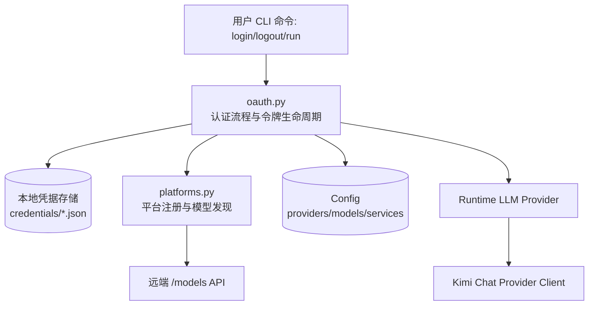
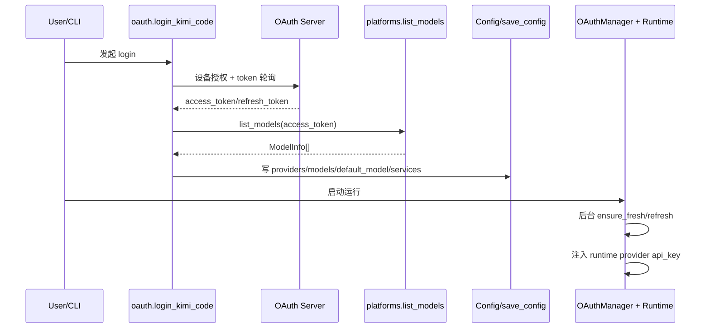
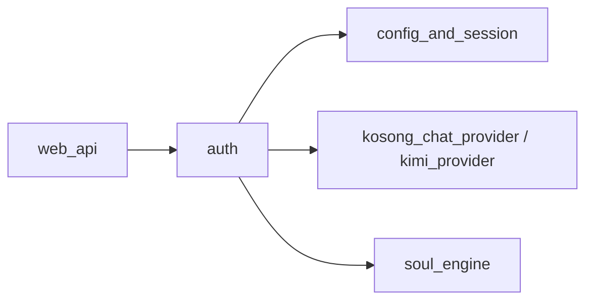

# auth 模块文档

## 1. 模块介绍

`auth` 模块负责 Kimi CLI 中“身份认证 + 托管平台接入”的核心闭环：用户通过 OAuth 设备授权完成登录，系统持久化令牌并自动刷新，再将认证结果映射为可用的 provider、model 与服务配置（如 search/fetch）。从职责上看，它不是单纯的“登录工具函数集合”，而是连接 **用户身份状态、模型目录发现、配置落盘、运行时 API key 注入** 的关键中枢。

这个模块存在的根本原因是：CLI 与 Web 应用不同，天然缺少完整交互式登录页面；同时模型平台又需要短期 access token + 长期 refresh token 的生命周期治理。`auth` 通过 OAuth Device Authorization Grant 解决“无内嵌浏览器”的登录难题，并通过后台刷新与并发竞争处理，保障长会话运行时的稳定性。

在系统中，`auth` 与以下模块有紧密关系：

- 与配置体系（[config_and_session.md](config_and_session.md)）协同，负责写入/清理 managed provider 与模型。
- 与聊天提供器体系（[kosong_chat_provider.md](kosong_chat_provider.md)、[kimi_provider.md](kimi_provider.md)）协同，在运行时动态注入 token。
- 与核心运行时（[soul_engine.md](soul_engine.md)）协同，保证 agent 会话期间 token 可持续可用。

---

## 2. 架构总览

这张图展示了 `auth` 的主路径：用户触发认证动作后，`oauth.py` 与 OAuth 服务交互，令牌写入本地凭据存储；随后通过 `platforms.py` 拉取可用模型并回写配置。运行阶段，`OAuthManager` 会把有效 access token 注入到 runtime 内的 chat provider 客户端，避免请求因 token 过期而失败。

### 2.1 关键设计原则

1. **配置一致性优先**：登录会重建受管模型列表，登出会完整清理，避免脏配置残留。  
2. **持久化令牌优先于内存缓存**：刷新前后均尽量读取持久化状态，降低多会话竞争风险。  
3. **失败隔离**：单次刷新失败、单平台模型拉取失败不会直接让整个系统崩溃。  
4. **向后兼容迁移**：支持从历史 keyring 存储惰性迁移到文件存储。

---

## 3. 子模块划分与职责

`auth` 当前可以清晰拆分为两个子模块：

### 3.1 OAuth 流程与令牌生命周期子模块

- 文档：[`oauth_flow_and_token_lifecycle.md`](oauth_flow_and_token_lifecycle.md)
- 代表核心组件：`src.kimi_cli.auth.oauth.OAuthToken`

该子模块负责完整认证体验：发起设备码授权、轮询 token、持久化凭据、登出清理、会话期刷新与运行时 token 注入。它的重点在于“长期可运行性”而非一次性登录成功率，因此实现了刷新锁、后台刷新上下文、并发会话 refresh-token 竞争规避等机制。对维护者来说，这部分是最需要关注边界行为（过期、401、文件损坏、并发刷新）的代码区域。

### 3.2 平台注册与模型同步子模块

- 文档：[`platform_registry_and_model_sync.md`](platform_registry_and_model_sync.md)
- 代表核心组件：`src.kimi_cli.auth.platforms.Platform`

该子模块负责维护受控平台注册表、managed key 约定与模型列表同步。其核心价值在于把“模型目录维护”从手工配置转为自动发现与自动收敛，减少默认模型失效、能力标签过期、平台切换污染等问题。它不直接处理 OAuth 协议细节，但会消费 OAuth 令牌结果作为模型发现的认证材料。

---

## 4. 组件关系与调用链

这个时序说明 `auth` 的两个子模块并非并列孤立：OAuth 结果直接驱动平台模型同步，而平台同步结果（managed provider/model）又会反过来影响运行时 token 注入目标（是否是 Kimi managed provider）。

---

## 5. 与其他模块的集成点

`auth` 模块在整体系统中的位置可以理解为“认证控制平面”：

- 向下依赖：HTTP 客户端、公用日志、共享目录工具。
- 向上服务：LLM provider 解析、runtime 请求执行、CLI/Web 操作入口。

在 `web_api` 场景中，认证状态通常表现为后端会话可用性与权限状态；在 CLI 场景中，认证状态更多表现为默认模型可用性与请求是否成功。两者最终都依赖 `auth` 维护的同一份凭据与配置语义。

---

## 6. 使用与运维建议（高层）

首次接入或排障时，建议按以下顺序验证：先确认默认配置路径限制，再检查凭据文件是否存在且可解析，然后验证模型列表是否成功同步，最后观察运行时是否持续刷新 token。若出现“能登录但运行中偶发 401”，通常需要重点检查多会话竞争刷新场景和本地凭据覆盖情况。

扩展新平台时，不建议在 `oauth.py` 中硬编码更多平台逻辑，而应优先在 `platforms.py` 增加平台注册与模型映射，再通过统一 managed key 机制接入；这样可以保持认证流程与平台注册逻辑解耦。

---

## 7. 限制与注意事项（高层）

当前实现主要围绕 Kimi Code 的 OAuth 与平台约定优化，尽管具备一定抽象能力，但仍存在平台特定分支（例如运行时 provider 类型断言、能力推断规则硬编码）。另外，token 文件虽有权限收敛措施，但本质仍是本地明文存储，应结合系统级安全策略（目录权限、账户隔离、磁盘加密）使用。

---

## 8. 文档导航

以下两个文件为本次 `auth` 模块拆分生成的子模块文档，建议按顺序阅读；主文档只保留总览与跨模块关系，具体实现细节请以下述子文档为准：

- OAuth 认证、令牌持久化、刷新、登出与运行时注入详解：[`oauth_flow_and_token_lifecycle.md`](oauth_flow_and_token_lifecycle.md)
- 平台注册表、模型发现、managed key 与配置收敛详解：[`platform_registry_and_model_sync.md`](platform_registry_and_model_sync.md)
- 配置系统背景：[`config_and_session.md`](config_and_session.md)
- Provider 抽象与 Kimi Provider：[`kosong_chat_provider.md`](kosong_chat_provider.md), [`kimi_provider.md`](kimi_provider.md)
