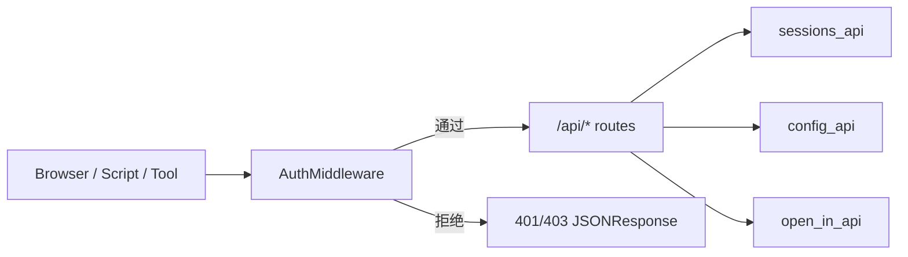
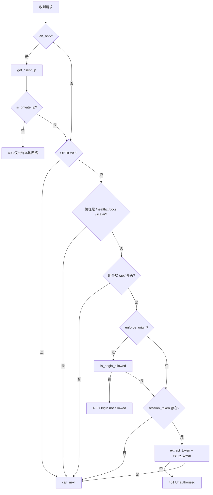

# auth_and_security 模块文档

`auth_and_security` 模块对应 `src/kimi_cli/web/auth.py`，是 Kimi CLI Web API 的第一道安全入口。它的核心不是“用户体系认证”（例如 OAuth 登录），而是面向本地/内网 Web 控制面的**请求级防护**：在请求进入任何 `/api/*` 业务路由之前，统一执行来源校验、会话令牌校验与网络范围限制。

这个模块存在的根本原因是把安全策略从业务路由中剥离出来。`sessions_api`、`config_api`、`open_in_api` 等路由只关心业务本身，而 `AuthMiddleware` 负责“谁可以进来”。这种分层使策略具备一致性、可审计性和可扩展性，也能显著降低“某个新接口忘记加鉴权”的风险。

从系统关系看，它是 `web_api` 的子模块之一，实际由 `src/kimi_cli/web/app.py` 在应用启动时注入中间件。也就是说，`auth_and_security` 的行为并不独立运行，而是与 Web 应用装配参数、环境变量和部署方式共同决定最终安全边界。

---

## 1. 模块职责与设计边界

`auth_and_security` 提供三类安全能力，并通过一个中间件按顺序串联：

1. **LAN-only 网络边界限制**：可选地仅允许私网/回环/链路本地地址访问。
2. **Origin 来源限制**：可选地限制浏览器来源站点。
3. **Bearer Token 会话校验**：可选地要求请求携带正确会话令牌。

需要特别强调的是：这个模块不负责持久化用户身份，不涉及 OAuth 授权码流程，也不签发 JWT。若你需要 OAuth 令牌生命周期与平台账号同步，应该阅读 [auth.md](auth.md) 与 [oauth_flow_and_token_lifecycle.md](oauth_flow_and_token_lifecycle.md)。本模块仅针对 Web API 入口层做“轻量但强约束”的访问控制。

---

## 2. 在系统中的位置



`AuthMiddleware` 位于路由前。业务路由不需要重复处理 token 解析、origin 匹配等横切逻辑。这样做让安全策略“天然覆盖所有 API”，而不是依赖开发者在每个 handler 中自觉调用工具函数。

此外，`app.py` 中的 `create_app()` 通过参数和环境变量注入该中间件：

- `session_token`
- `allowed_origins`
- `enforce_origin`
- `lan_only`

这意味着安全策略可由部署层统一配置，不需要修改业务代码。

---

## 3. 核心组件详解

虽然模块树只把 `AuthMiddleware` 视为核心组件，但源码中一组辅助函数共同组成完整的安全路径。下面按“作用、参数、返回值、行为细节”说明。

### 3.1 `DEFAULT_ALLOWED_ORIGIN_REGEX`

```python
re.compile(r"^https?://(localhost|127\.0\.0\.1)(:\d+)?$")
```

这是默认 Origin 白名单规则。当 `allowed_origins is None` 时，模块不会放开全部来源，而是回退到仅允许 `localhost` 与 `127.0.0.1`（可带端口）。这个默认值体现“本地优先、最小暴露”的安全基线。

### 3.2 `timing_safe_compare(a: str, b: str) -> bool`

该函数调用 `hmac.compare_digest` 进行常量时间比较。它主要用于令牌校验，避免普通字符串比较在理论上可能带来的时序侧信道问题。

- 参数：两个字符串 `a`、`b`
- 返回：是否完全相等
- 副作用：无

### 3.3 `parse_bearer_token(value: str | None) -> str | None`

从 `Authorization` 头提取 Bearer token。

- 若 header 缺失或为空，返回 `None`
- 若 scheme 不是 `Bearer`（大小写不敏感），返回 `None`
- 若 token 去空白后为空，返回 `None`
- 否则返回 token 文本

该函数不验证 token 格式，只做提取与基本合法性筛选。

### 3.4 `normalize_allowed_origins(value: str | None) -> list[str]`

将逗号分隔字符串标准化为列表，供配置层使用。

- 处理逻辑：`split(',')` → `strip()` → 去掉末尾 `/` → 丢弃空项
- 输入 `None` 或空字符串时返回空列表 `[]`

注意这不是“安全判定函数”，只是输入清洗函数。真正判定由 `is_origin_allowed` 完成。

### 3.5 `is_origin_allowed(origin: str, allowed_origins: Iterable[str] | None) -> bool`

来源判定核心函数，语义非常关键：

- `allowed_origins is None`：启用默认 localhost 正则
- `allowed_origins` 为空集合：显式拒绝所有来源
- 非空集合：若含 `"*"` 则全部允许，否则执行精确匹配

函数内部会对 `origin` 去掉尾部 `/`，与标准化配置保持一致。

### 3.6 `extract_token_from_request(request: Request) -> str | None`

按优先级提取 token：

1. 先读 `Authorization: Bearer ...`
2. 若无，且请求方法是 `GET`，再读 query 参数 `token`
3. 否则返回 `None`

这个“仅 GET 允许 query token”的限制是一个安全折中：便于浏览器打开链接时附带 token，同时避免把写操作令牌放在 URL 中。

### 3.7 `verify_token(provided: str | None, expected: str) -> bool`

令牌验证函数。

- `provided` 为空直接失败
- 非空时使用 `timing_safe_compare`

此函数本身不抛异常，始终返回布尔值，便于中间件分支处理。

### 3.8 `is_private_ip(ip: str) -> bool`

用于 LAN-only 模式下的地址判定，支持 IPv4/IPv6。接受以下地址类型：

- 私网地址（`is_private`）
- 回环地址（`is_loopback`）
- 链路本地地址（`is_link_local`）

非法 IP 字符串会被捕获并返回 `False`。

### 3.9 `get_client_ip(request: Request, trust_proxy: bool = False) -> str | None`

客户端 IP 提取函数。

- 当 `trust_proxy=True` 时优先取 `X-Forwarded-For` 首个地址
- 否则取 `request.client.host`
- 无法获取时返回 `None`

当前 `AuthMiddleware` 在调用时使用默认参数（不信任代理头）。这对直连部署更安全，但在反向代理场景下可能无法识别真实客户端。

---

## 4. `AuthMiddleware` 深入解析

### 4.1 构造参数

`AuthMiddleware(app, session_token, allowed_origins, enforce_origin, lan_only=False)` 的参数意义如下：

- `app: ASGIApp`：下游应用
- `session_token: str | None`：期望的会话令牌。为 `None` 表示不启用 token 校验
- `allowed_origins: Iterable[str] | None`：Origin 策略输入
- `enforce_origin: bool`：是否启用 Origin 校验
- `lan_only: bool`：是否启用 LAN-only 网络限制

构造时会把 `allowed_origins` 转为 list（若非 `None`），避免外部可迭代对象在运行期变化导致策略不稳定。

### 4.2 请求处理流程



这个流程体现出两个设计点：第一，LAN-only 检查是全局的，连静态文件和文档页也受影响；第二，Origin 与 Token 校验仅作用于 `/api/*`，减少对静态资源和文档访问的干扰。

### 4.3 响应行为

中间件失败分支统一返回 `JSONResponse`，错误体格式稳定：

- `403` + `{"detail": "Access denied: only local network access is allowed"}`
- `403` + `{"detail": "Origin not allowed"}`
- `401` + `{"detail": "Unauthorized"}`

稳定错误结构使前端和调用方更容易编写统一错误处理逻辑。

---

## 5. 与 `web/app.py` 的装配关系（配置来源）

`auth_and_security` 的策略参数主要由 `create_app()` 与 `run_web_server()` 提供。常见环境变量如下：

- `KIMI_WEB_SESSION_TOKEN`
- `KIMI_WEB_ALLOWED_ORIGINS`
- `KIMI_WEB_ENFORCE_ORIGIN`
- `KIMI_WEB_LAN_ONLY`

`create_app()` 会读取这些变量并注入 `AuthMiddleware`。`run_web_server()` 在不同运行模式下会自动设置这些变量，例如：

- 公网 host 且未禁用鉴权时，自动生成随机 `session_token`
- 公网模式会更倾向启用 origin 限制
- `lan_only=True` 时会开启局域网访问边界

因此，开发者看到的最终行为可能来自“代码参数 + 环境变量 + 启动模式”三者叠加，而非单点配置。

---

## 6. 使用示例

### 6.1 手动挂载中间件

```python
from fastapi import FastAPI
from kimi_cli.web.auth import AuthMiddleware, normalize_allowed_origins

app = FastAPI()
origins = normalize_allowed_origins("http://localhost:5173,http://127.0.0.1:3000")

app.add_middleware(
    AuthMiddleware,
    session_token="my-session-token",
    allowed_origins=origins,
    enforce_origin=True,
    lan_only=False,
)
```

### 6.2 请求携带令牌

推荐 Header 方式：

```http
GET /api/sessions HTTP/1.1
Authorization: Bearer my-session-token
Origin: http://localhost:5173
```

GET 请求也支持 query token（兼容浏览器直接打开 URL）：

```http
GET /api/sessions?token=my-session-token HTTP/1.1
Origin: http://localhost:5173
```

---

## 7. 边界条件、错误场景与运维注意事项

### 7.1 Origin 头缺失不一定会被拒绝

即便 `enforce_origin=True`，当前逻辑是“有 Origin 就校验，无 Origin 则跳过该项”。这符合大量非浏览器客户端调用习惯，但也意味着不能把它当作唯一 CSRF 防线。

### 7.2 `allowed_origins=None` 与 `[]` 语义不同

- `None`：使用默认 localhost 正则
- `[]`：拒绝所有来源

如果配置层把二者混淆，行为会完全不同。

### 7.3 代理部署中的 IP 识别

当前中间件 LAN-only 判断不信任 `X-Forwarded-For`。如果服务部署在 Nginx/Traefik 后面，`request.client.host` 可能是代理地址，导致 LAN-only 结果与预期不一致。此时应在网关层补充限制，或扩展中间件支持受信代理列表。

### 7.4 Token 在 URL 中的泄露风险

虽然 GET query token 被支持，但 URL 可能出现在浏览器历史、日志、代理记录中。生产场景建议优先使用 `Authorization` header。

### 7.5 `*` 通配符会完全放开来源

`allowed_origins` 包含 `"*"` 会让 Origin 检查始终通过。该配置应仅在明确评估风险后使用。

---

## 8. 扩展建议

如果你要扩展此模块，建议遵循当前“纯函数判定 + 中间件编排”的结构：

- 在函数层新增可测试的独立判定逻辑
- 在中间件中维持清晰、固定顺序
- 为每个拒绝分支提供稳定状态码与错误信息

典型可扩展方向包括：

1. 增加 `trust_proxy` 与受信代理 CIDR 配置。
2. 为 Origin 匹配增加子域通配规则（如 `*.example.com`）。
3. 增加按路径粒度的策略（例如 `/api/admin/*` 更严格）。

扩展时应优先保持向后兼容，尤其是 `None`/`[]` 语义与错误码语义。

---

## 9. 相关阅读

- Web API 总体结构与路由装配：[`web_api.md`](web_api.md)
- 会话相关接口：[`sessions_api.md`](sessions_api.md)
- 配置相关接口：[`config_api.md`](config_api.md)
- Open-In 相关接口：[`open_in_api.md`](open_in_api.md)
- 认证域（OAuth / 平台账号）能力：[`auth.md`](auth.md)
