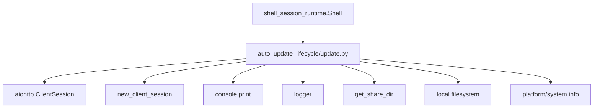
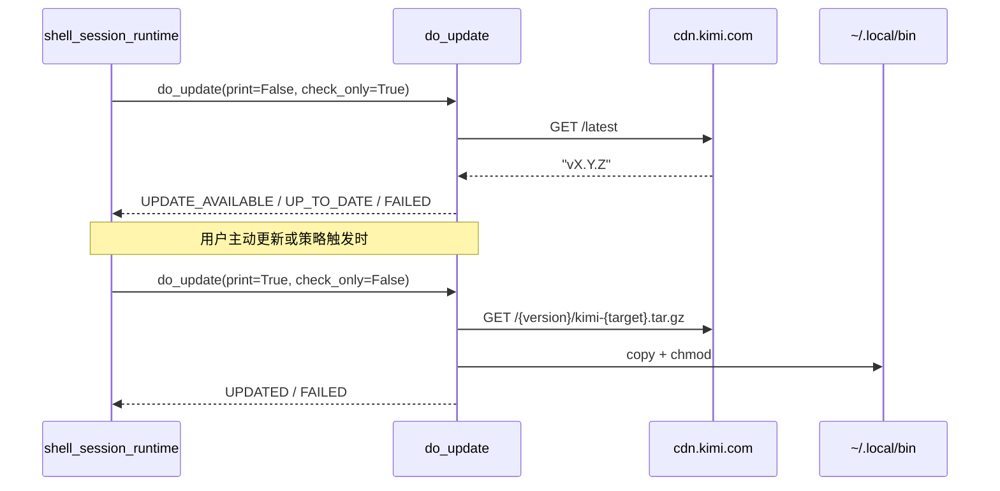
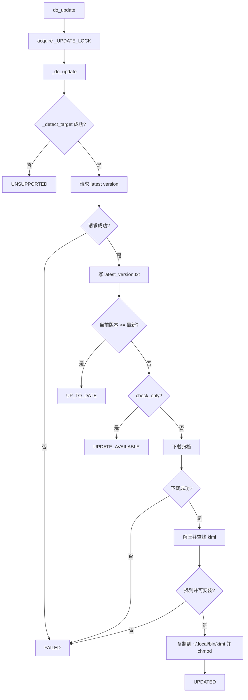
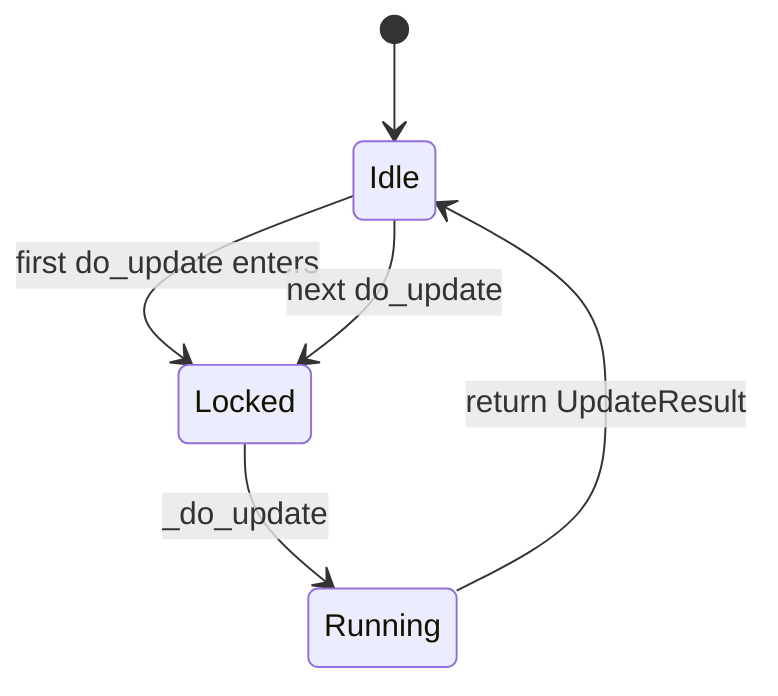

# auto_update_lifecycle 模块文档

## 1. 模块概述

`auto_update_lifecycle` 对应源码 `src/kimi_cli/ui/shell/update.py`，是 Kimi Code CLI 在交互会话中的“自更新生命周期管理器”。它负责从官方 CDN 检查最新版本、比较当前版本与远端版本、按平台下载对应二进制压缩包、解压并安装到本地可执行目录，并将结果以统一状态枚举返回给上层运行时。

这个模块存在的核心价值是把“更新机制”从主会话控制逻辑里解耦。`shell_session_runtime`（见 [shell_session_runtime.md](shell_session_runtime.md)）只需要调用 `do_update(...)` 并根据 `UpdateResult` 做 UI 提示，而不需要关心平台检测、网络错误、下载流处理、文件权限设置等底层细节。这样可以让更新能力保持独立可维护，并减少会话主循环的复杂度。

从系统位置看，它隶属于 `ui_shell` 子系统，但本质是一个基础设施模块：上游由 Shell 生命周期触发，下游依赖网络、文件系统与进程环境（操作系统 / CPU 架构）。

---

## 2. 设计目标与设计取舍

该模块围绕三个设计目标构建。第一是**安全串行化**：通过全局异步锁避免并发更新导致安装路径竞争。第二是**跨平台最小覆盖**：只支持明确验证过的平台组合（Darwin/Linux + x86_64/aarch64），其余平台直接拒绝并返回 `UNSUPPORTED`。第三是**用户可感知状态**：无论调用方是否选择打印，内部都通过统一结果枚举表达成功、失败、可升级等状态。

在实现取舍上，它选择了“直接下载发布二进制 + 覆盖安装”的简单模型，而非包管理器集成或增量更新。这显著降低了实现复杂度，但也带来一些限制：安装目录固定、缺少签名校验、更新回滚能力有限。模块更偏向“CLI 自维护可执行文件”的实用方案。

---

## 3. 核心组件详解

虽然模块树中标注的核心组件是 `UpdateResult`，但从维护视角看，本文件的重要能力由枚举、辅助函数与主流程函数共同构成。

### 3.1 `UpdateResult`

`UpdateResult` 是更新流程对外暴露的稳定契约，定义如下状态：

- `UPDATE_AVAILABLE`：发现新版本（仅检查模式下返回）
- `UPDATED`：已完成下载、解压、安装
- `UP_TO_DATE`：当前版本已不低于最新版本
- `FAILED`：流程失败（网络、下载、解压、安装等）
- `UNSUPPORTED`：当前 OS/架构不受支持

该枚举被上层 UI 与控制流程直接消费，是判断后续提示策略的关键分支依据。

### 3.2 常量与全局状态

模块定义了更新来源与安装目标等关键常量：

```python
BASE_URL = "https://cdn.kimi.com/binaries/kimi-cli"
LATEST_VERSION_URL = f"{BASE_URL}/latest"
INSTALL_DIR = Path.home() / ".local" / "bin"
LATEST_VERSION_FILE = get_share_dir() / "latest_version.txt"
```

其中 `LATEST_VERSION_FILE` 用于缓存最近一次检查得到的版本号，供欢迎页等 UI 场景读取并提示（参见 [shell_session_runtime.md](shell_session_runtime.md) 中欢迎信息相关说明）。

此外，`_UPDATE_LOCK = asyncio.Lock()` 是并发保护核心，确保任意时刻只有一个更新协程进入真实更新流程。

### 3.3 `semver_tuple(version: str) -> tuple[int, int, int]`

该函数用于把版本字符串转换成可比较的三元组。行为规则是：

1. 支持前缀 `v`（如 `v1.2.3`）自动剥离。
2. 通过正则 `^(\d+)\.(\d+)(?:\.(\d+))?` 提取 major/minor/patch。
3. 若 patch 缺失（如 `1.2`），按 `0` 补齐。
4. 若无法匹配，返回 `(0, 0, 0)`。

返回值用于当前版本与远端版本大小比较。需要注意，这不是完整语义化版本解析器：预发布标签（如 `1.2.3-beta`）不会被完整语义处理。

### 3.4 `_detect_target() -> str | None`

该函数根据 `platform.system()` 与 `platform.machine()` 生成发布目标字符串，格式为 `<arch>-<os_name>`，例如 `x86_64-unknown-linux-gnu`。

支持范围：

- 架构：`x86_64/amd64/AMD64`、`arm64/aarch64`
- 系统：`Darwin`、`Linux`

不支持时会记录错误日志并返回 `None`，上层据此返回 `UpdateResult.UNSUPPORTED`。

### 3.5 `_get_latest_version(session) -> str | None`

该函数通过 `aiohttp` 会话请求 `LATEST_VERSION_URL`，读取纯文本版本号。若发生 `aiohttp.ClientError`，会记录异常并返回 `None`。它只负责“读取远端版本”，不做安装逻辑。

### 3.6 `do_update(*, print: bool = True, check_only: bool = False) -> UpdateResult`

这是模块对外主入口。它不会直接执行更新，而是先进入 `_UPDATE_LOCK`，再调用 `_do_update(...)`。这一层的职责是提供并发安全包装。

参数含义：

- `print`：是否向终端输出提示（通过 `console.print`）
- `check_only`：是否仅检查版本，不执行下载安装

返回值总是 `UpdateResult`，调用方可以忽略文本输出，仅靠状态驱动行为。

### 3.7 `_do_update(*, print: bool, check_only: bool) -> UpdateResult`

这是完整生命周期实现。流程分为平台检查、版本检查、条件分支、下载、解压、安装、收尾提示六段。

关键步骤如下：

1. 读取当前版本 `kimi_cli.constant.VERSION`。
2. 调用 `_detect_target()`；失败则返回 `UNSUPPORTED`。
3. 建立 `new_client_session()`，获取 `latest_version`。
4. 将远端版本写入 `LATEST_VERSION_FILE`。
5. 使用 `semver_tuple` 比较版本。
   - 当前 >= 最新：返回 `UP_TO_DATE`
   - 仅检查模式且有更新：返回 `UPDATE_AVAILABLE`
6. 构建下载 URL：`{BASE_URL}/{latest_version}/kimi-{latest_version}-{target}.tar.gz`
7. 下载 tar.gz 到临时目录（分块写入）。
8. 解压归档并递归查找名为 `kimi` 的二进制。
9. 拷贝到 `~/.local/bin/kimi`，并设置可执行位。
10. 输出重启提示并返回 `UPDATED`。

任何下载/解压/安装阶段的异常会返回 `FAILED`。

---

## 4. 架构关系与依赖说明

### 4.1 模块依赖图



该图展示了 `update.py` 是一个“被动调用模块”：它不主动运行，而是由上层会话控制器触发。其外部依赖主要分成网络 IO、文件 IO、平台检测与日志/控制台输出四类。

### 4.2 与上层会话运行时的关系



在交互产品层面，推荐将“检查更新”和“执行更新”分开：前者后台弱提示，后者在用户确认后执行。

---

## 5. 更新生命周期流程

### 5.1 主流程图



这个流程体现了“先判断、后动作”的原则：所有可能的早退条件都发生在重操作（下载/写入）之前。

### 5.2 并发控制流程



虽然逻辑简单，但这个锁非常关键。没有它时，两个并发更新可能同时写同一目标文件，导致二进制损坏或权限状态不一致。

---

## 6. 参数、返回值与副作用清单

### 6.1 调用参数建议

对于 `do_update`，常见策略是：启动时 `check_only=True, print=False`；用户主动执行时 `check_only=False, print=True`。前者适合静默探测，后者适合显式交互。

```python
from kimi_cli.ui.shell.update import do_update, UpdateResult

# 后台检查
result = await do_update(print=False, check_only=True)
if result == UpdateResult.UPDATE_AVAILABLE:
    ...  # 触发 toast 或徽标提醒

# 用户确认后执行
result = await do_update(print=True, check_only=False)
if result == UpdateResult.UPDATED:
    print("请重启 CLI")
```

### 6.2 主要副作用

调用更新流程会产生以下副作用：

- 网络请求：访问 `https://cdn.kimi.com/binaries/kimi-cli/...`
- 文件写入：更新 `LATEST_VERSION_FILE`
- 临时目录：创建并清理 `TemporaryDirectory`
- 安装覆盖：写入 `~/.local/bin/kimi`
- 权限变更：为目标二进制添加执行权限位
- 终端输出：当 `print=True` 时输出状态消息

---

## 7. 错误处理、边界条件与限制

### 7.1 错误处理策略

模块采用“捕获并降级为 `UpdateResult`”的策略，大多数失败不会抛给调用方，而是返回 `FAILED`。这有利于上层统一处理，但也意味着调用方若需要详细失败原因，应结合日志系统观察（`logger.exception` 已记录堆栈）。

### 7.2 关键边界条件

- **版本字符串异常**：`semver_tuple` 解析失败会变成 `(0,0,0)`，可能导致比较结果偏保守。
- **平台不匹配**：Windows 或非常见架构会直接 `UNSUPPORTED`。
- **归档结构变化**：当前通过遍历查找名为 `kimi` 的文件；若发布包命名变更，更新将失败。
- **权限问题**：若对 `~/.local/bin` 无写权限，安装阶段失败。
- **PATH 问题**：即使安装成功，若 `~/.local/bin` 不在 `PATH`，用户可能仍调用旧版本。

### 7.3 安全与工程限制

当前实现有几个维护者需要关注的限制：

1. 使用 `tar.extractall(tmpdir)`，理论上依赖归档可信，未做路径穿越额外校验。
2. 未进行下载内容签名/校验和验证，完整性主要依赖 HTTPS 与发布链路可信性。
3. 没有原子替换与回滚机制；安装失败时可能保留旧文件，也可能留下不完整状态（取决于失败点）。

如果未来要增强供应链安全，建议补充发布签名验证和安全解压策略。

---

## 8. 配置与运行建议

模块本身配置面较少，主要通过调用参数和环境策略控制。结合上层会话模块，常见建议如下：

- 在会话启动时做“仅检查”并用非阻塞提示通知用户。
- 将“真正更新”放在明确用户操作后执行，避免中断当前工作流。
- 更新成功后明确提示“重启生效”，因为当前进程不会热替换自身可执行文件。

在 shell 运行时中，通常还会配合 `KIMI_CLI_NO_AUTO_UPDATE` 关闭自动更新后台检查（该环境变量控制逻辑位于上层，详见 [shell_session_runtime.md](shell_session_runtime.md)）。

---

## 9. 扩展点与演进方向

若需要扩展该模块，可优先考虑以下方向：

- 增加平台支持（如 Windows），扩展 `_detect_target` 映射策略。
- 引入校验和/签名验证，增强下载完整性与可信性。
- 使用原子写入（临时文件 + rename）提升安装可靠性。
- 增加回滚策略：安装失败时恢复旧二进制。
- 抽象下载源配置（镜像、私有 CDN）以支持企业部署场景。

扩展时建议保持 `UpdateResult` 枚举语义稳定，避免破坏上层调用契约。

---

## 10. 与其他文档的关联

为了避免重复阅读，建议配合以下文档：

- 会话主循环与自动更新触发时机： [shell_session_runtime.md](shell_session_runtime.md)
- 交互提示/输入层（包括 toast 机制）： [interactive_prompt_and_attachments.md](interactive_prompt_and_attachments.md)
- 键盘事件与中断交互背景： [keyboard_input_listener.md](keyboard_input_listener.md)

这些模块共同构成“更新检查 -> 用户可见提示 -> 会话控制行为”的完整链路。


---

## 11. 维护与测试建议（面向贡献者）

在持续演进这个模块时，建议把测试分成三层。第一层是纯函数单元测试，重点覆盖 `semver_tuple` 与 `_detect_target` 的输入组合，例如 `v1.2.3`、`1.2`、非法字符串、不同 `platform.machine()` 别名映射。第二层是网络行为测试，可以通过 mock `aiohttp.ClientSession` 验证 `_get_latest_version` 在 2xx、4xx/5xx、连接失败场景下的返回值与日志行为。第三层是端到端更新流程测试，使用临时目录替代真实 `INSTALL_DIR`，并构造最小 tar.gz 包来验证“下载→解压→查找二进制→安装→chmod”链路。

如果未来要重构实现（例如引入签名校验或原子替换），推荐保持 `do_update(...)->UpdateResult` 这个外部契约不变，把新行为封装在内部步骤函数中。这样可以确保 [shell_session_runtime.md](shell_session_runtime.md) 以及其他潜在调用方不需要同步修改逻辑分支，从而降低升级成本。
