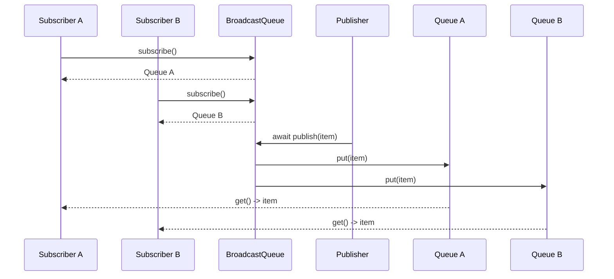
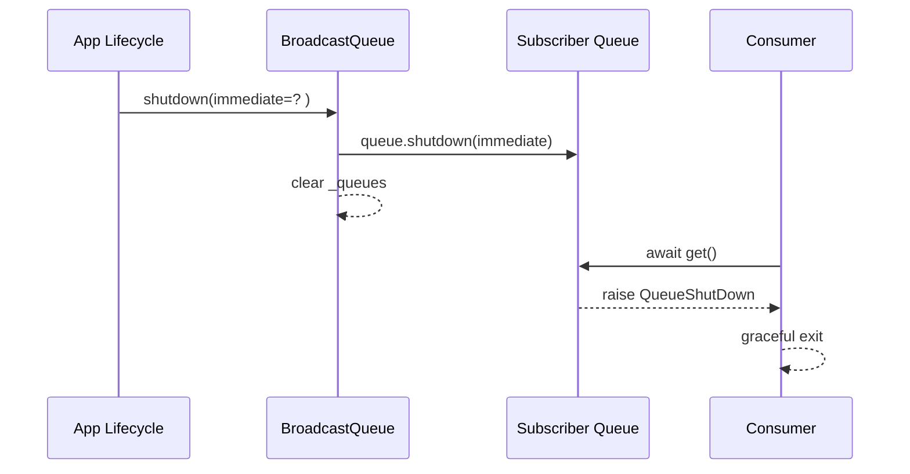

# broadcast_pubsub

## 概述

`broadcast_pubsub` 模块对应 `src/kimi_cli/utils/broadcast.py`，核心组件是 `BroadcastQueue[T]`。它提供了一个非常轻量、明确的发布-订阅（Pub/Sub）机制：一个发布者把消息发到广播队列后，**所有当前订阅者**都会各自收到同一份消息副本（准确地说，是同一个对象引用被写入每个订阅队列）。

这个模块存在的主要原因，是在系统内部经常会出现“同一事件需要被多个异步消费者并行感知”的场景。与“一个队列多个消费者竞争同一条消息”的 work-queue 模式不同，`BroadcastQueue` 解决的是 fan-out 问题：每个订阅者都要收到事件，而不是只被其中一个消费者拿走。

在项目分层中，它位于 `utils` 基础设施层，构建在 `aioqueue` 之上，复用了后者的 shutdown 语义（详见 [aioqueue_shutdown_semantics.md](aioqueue_shutdown_semantics.md)）。因此，`broadcast_pubsub` 的职责非常聚焦：管理订阅者队列集合，并把发布消息复制投递到每个订阅队列。

---

## 设计动机与适用场景

`BroadcastQueue` 的设计强调“小而稳定”：不做主题路由、不做消息持久化、不做重试/确认协议，只提供最核心的广播能力。这种取舍很适合 CLI runtime、会话事件分发、UI 状态同步、内部信号传播等“进程内异步事件分发”场景。

当你需要以下语义时，它通常是合适选择：发布事件后，当前在线的所有订阅协程都应该收到；后加入的订阅者不需要追历史；系统结束时可以统一关闭所有订阅通道，让消费者收到 `QueueShutDown` 并退出。

如果你的需求包括“离线补偿、消息持久化、跨进程分发、按 topic 过滤、精确一次投递”等高级能力，这个模块并不覆盖，应在更高层引入专用消息系统或在其外层做封装。

---

## 核心架构与组件关系

`BroadcastQueue` 内部只有一个关键状态：`self._queues: set[Queue[T]]`。每次 `subscribe()` 创建一个新的 `Queue[T]`，并把它放进集合；`publish()`/`publish_nowait()` 会遍历该集合，对每个队列执行一次 `put`；`shutdown()` 对所有队列调用 `queue.shutdown()` 后清空集合。

```mermaid
graph TD
    P[Publisher] --> B[BroadcastQueue[T]]
    B --> Q1[Subscriber Queue A\nQueue[T]]
    B --> Q2[Subscriber Queue B\nQueue[T]]
    B --> Q3[Subscriber Queue C\nQueue[T]]
    Q1 --> C1[Consumer A]
    Q2 --> C2[Consumer B]
    Q3 --> C3[Consumer C]
    B -.depends on.-> AQ[aioqueue.Queue\nwith QueueShutDown semantics]
```

上图可以看出，发布者并不直接面对消费者，而是通过 `BroadcastQueue` 维护的“每订阅者一个独立队列”完成隔离。这样每个消费者按自己的速度消费，不会互相竞争同一条消息，也不会因为某个消费者调用 `get()` 抢走其他消费者本该收到的事件。

---

## 与 `aioqueue` 的依赖关系

`BroadcastQueue` 使用的是 `kimi_cli.utils.aioqueue.Queue`，而非裸 `asyncio.Queue`。这意味着订阅队列具备统一的关闭语义：

- 关闭后写入会抛 `QueueShutDown`
- 消费者在读取时会通过 `QueueShutDown` 感知终止
- `shutdown(immediate=True)` 可以触发更激进的立即中止行为

因此在广播模块里，`shutdown()` 的真正价值不仅是“清理集合”，更是向所有订阅消费者广播生命周期结束信号。

---

## `BroadcastQueue[T]` 详解

### 类型与职责

`BroadcastQueue[T]` 是一个泛型类，`T` 表示广播消息类型。它自身不定义消息结构，也不做序列化；调用方可传任意 Python 对象。模块只关心“把 item 投递到所有当前订阅队列”。

### `__init__(self) -> None`

构造函数初始化一个空集合 `_queues`。该集合保存当前有效订阅队列对象。

参数与返回值都很简单：无参数、无返回。副作用是创建内部可变状态。

### `subscribe(self) -> Queue[T]`

该方法创建一个新的 `Queue[T]` 实例，将其加入 `_queues`，并返回给调用方。调用方通常会把返回的队列交给某个消费者协程循环读取。

这个接口体现了“订阅即分配私有通道”的设计：每次订阅都得到独立队列，消息不会在订阅者之间竞争。

### `unsubscribe(self, queue: Queue[T]) -> None`

该方法把指定队列从 `_queues` 集合移除。实现使用 `set.discard`，所以即便该队列不在集合里也不会抛错，这让取消订阅是幂等且容错的。

注意，`unsubscribe` 只做“从广播目标集合剔除”，并不会自动关闭该队列。如果调用方仍在消费该队列，队列可能继续保有此前已投递但未消费的数据；是否需要显式 `queue.shutdown()` 取决于上层生命周期策略。

### `publish(self, item: T) -> None`（异步）

`publish` 通过 `asyncio.gather(*(queue.put(item) for queue in self._queues))` 并发地向所有订阅队列执行 `put`。方法本身是异步的，只有当所有 `put` 完成后才返回。

参数是待广播的 `item`；返回值为 `None`。关键副作用是把同一条消息投递给每个当前订阅者。

实现层面有两个值得理解的点。第一，它是“全量等待”语义：慢订阅者会拉长本次发布耗时，因为发布者会等待所有 `put` 完成。第二，若某个队列 `put` 抛异常（例如该队列已 shutdown），`gather` 会传播异常并导致当前发布失败；调用方应考虑是否在上层包裹异常处理策略。

### `publish_nowait(self, item: T) -> None`

该方法同步遍历 `_queues` 并调用 `queue.put_nowait(item)`，不等待任何协程切换，适合低延迟或“尽力而为”的路径。

参数是 `item`，返回 `None`。副作用与 `publish` 相同，但异常传播更直接：若任一订阅队列不可写（例如已 shutdown 或队列满，取决于底层配置），异常会立即冒泡并中断后续队列投递。

### `shutdown(self, immediate: bool = False) -> None`

该方法遍历全部订阅队列并执行 `queue.shutdown(immediate=immediate)`，随后 `self._queues.clear()`。

参数 `immediate` 透传到底层 `Queue`，控制是否立即清空排队消息并加速终止；返回 `None`。副作用非常关键：

1. 当前所有订阅通道进入关闭态，消费者最终会收到 `QueueShutDown`。
2. 广播器内部不再持有任何订阅引用，后续发布不会触达旧订阅。

---

## 关键流程

### 订阅与发布流程



该流程体现了广播语义的核心：发布一次，所有在线订阅者都收到。订阅者彼此消费进度独立，不会互相抢占消息。

### 关闭传播流程



关闭时，`BroadcastQueue` 自身不直接管理消费者任务，而是依赖队列异常语义通知消费者退出。这种分层使广播模块保持简洁，也让消费者能在捕获异常后执行自己的清理逻辑。

---

## 使用示例

### 基本用法

```python
import asyncio
from kimi_cli.utils.broadcast import BroadcastQueue
from kimi_cli.utils.aioqueue import QueueShutDown

bus = BroadcastQueue[str]()

async def consumer(name: str):
    q = bus.subscribe()
    try:
        while True:
            msg = await q.get()
            print(f"{name} got: {msg}")
    except QueueShutDown:
        print(f"{name} stopped")
    finally:
        bus.unsubscribe(q)

async def main():
    tasks = [
        asyncio.create_task(consumer("A")),
        asyncio.create_task(consumer("B")),
    ]

    await bus.publish("hello")
    bus.publish_nowait("world")

    await asyncio.sleep(0.1)
    bus.shutdown()
    await asyncio.gather(*tasks)

asyncio.run(main())
```

这个模式里，订阅发生在消费者内部，并在 `finally` 做 `unsubscribe`，可以有效避免订阅泄漏。系统结束时统一 `shutdown()`，消费者通过 `QueueShutDown` 正常退出。

### 带资源管理封装的用法（建议）

在工程中，推荐把订阅/退订包装成上下文管理模式，避免遗漏 `unsubscribe`：

```python
from contextlib import asynccontextmanager

@asynccontextmanager
async def subscription(bus: BroadcastQueue[T]):
    q = bus.subscribe()
    try:
        yield q
    finally:
        bus.unsubscribe(q)
```

这样可以把生命周期约束显式化，减少长期运行场景中的内存和状态膨胀风险。

---

## 配置与行为说明

该模块本身几乎没有配置项，唯一行为开关是 `shutdown(immediate: bool)`。因此“配置”更多体现在使用策略，而不是类字段。

通常你需要在系统层回答两个策略问题。第一，发布路径是用 `publish` 还是 `publish_nowait`：前者更可控，适合希望感知回压/错误的路径；后者更快，但异常与部分投递风险更直接。第二，关闭时是否 `immediate=True`：若系统追求快速停止可启用；若希望尽量让已入队消息被消费，应使用默认的非立即模式。

---

## 边界条件、错误与限制

`BroadcastQueue` 很简洁，但在真实并发环境里有一些关键注意事项。

首先，它不是线程安全容器，默认假设运行在同一个事件循环上下文。如果跨线程操作同一个实例，行为不可预测。其次，`_queues` 是可变集合；在遍历发布时若并发发生 `subscribe/unsubscribe`，可能出现 “set changed size during iteration” 的运行时错误（取决于时序）。如果你的场景存在高并发订阅变更，建议在外层加锁或采用“快照迭代”（例如先复制 `list(self._queues)` 再遍历）的自定义封装。

再者，`publish` 的 `asyncio.gather` 使用默认行为：任一子任务异常会向上传播。对于“广播尽量送达”语义，这可能不符合预期，你可能需要在调用侧捕获并记录异常，或扩展出 `return_exceptions=True` 的变体。`publish_nowait` 则会在首个异常处中断迭代，可能导致部分订阅者已收到、部分未收到。

还有一点容易忽视：广播投递的是对象引用而不是深拷贝。若 `item` 是可变对象并在后续被修改，不同消费者观察到的内容可能受时序影响。对不可变消息体或显式复制策略更安全。

最后，本模块不提供历史消息回放。新订阅者只会接收订阅之后的消息；如果你需要 replay 功能，应在上层叠加持久化/快照机制。

---

## 扩展建议

如果你要扩展这个模块，建议保持现有 API 的极简稳定性，把复杂能力放在包装层。常见扩展方向包括：增加 topic 过滤、增加订阅指标（订阅数、每订阅 backlog）、增加失败隔离（某订阅失败不影响整体发布）、增加生命周期钩子（on_subscribe/on_unsubscribe）等。

实现扩展时，优先保证两个不变量：其一，广播语义不退化（每个在线订阅者都应有机会收到消息）；其二，shutdown 语义与 `aioqueue` 保持一致（消费者可靠退出）。只要这两点不破坏，上层模块迁移成本就会很低。

---

## 与其他模块文档的关系

`broadcast_pubsub` 依赖并复用 `aioqueue` 的关闭语义，因此异常与终止行为不在本文重复展开。建议结合阅读 [aioqueue_shutdown_semantics.md](aioqueue_shutdown_semantics.md) 以完整理解 `QueueShutDown`、`shutdown(immediate)` 和消费者退出模式。
