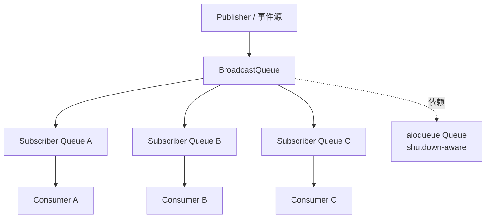
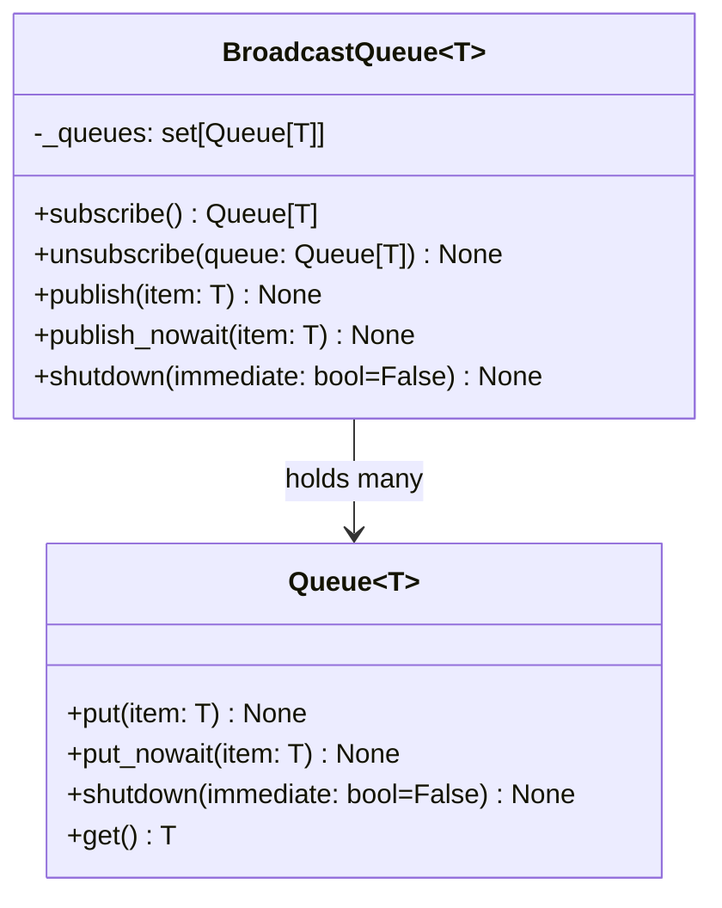
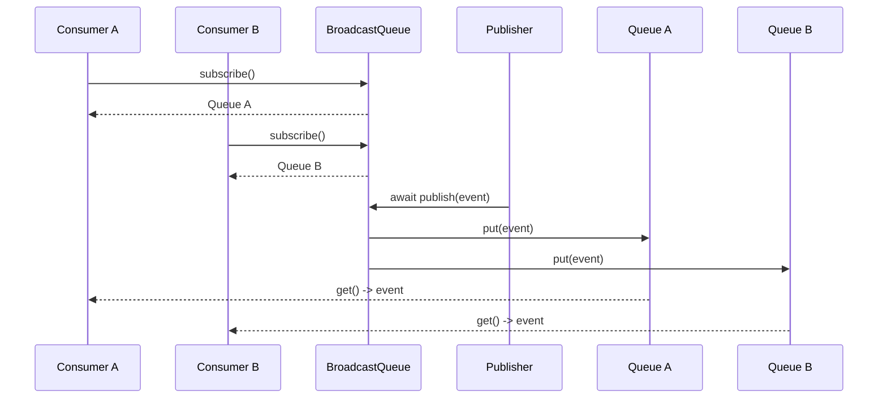
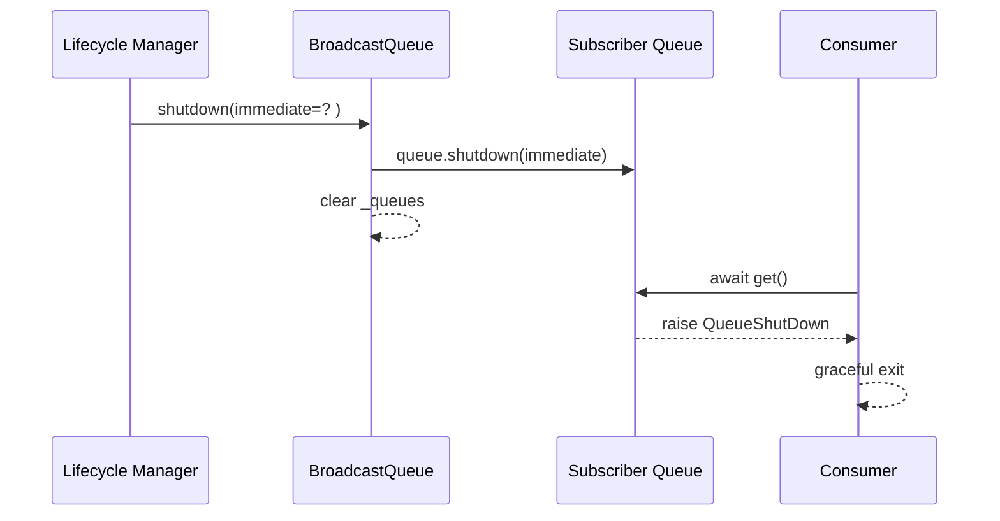

# broadcast_pubsub_queue

## 引言：模块定位、存在价值与设计取舍

`broadcast_pubsub_queue` 模块对应实现文件 `src/kimi_cli/utils/broadcast.py`，核心组件是 `BroadcastQueue[T]`。它提供的是一种**进程内、事件循环内**的轻量广播队列：当发布者发送一条消息时，所有当前已订阅者都会收到这条消息。

这个模块存在的根本原因，是为了区分两类完全不同的并发通信语义。传统 work queue 的语义是“多消费者竞争同一任务”，一条消息只会被某个消费者取走；而本模块的语义是“事件 fan-out”，同一条消息要发给每个订阅者。对于会话事件同步、UI 状态更新、后台监听器并行观察等场景，广播语义是更自然也更安全的模型。

从设计上看，`BroadcastQueue` 刻意保持极简。它不负责 topic 路由、不做持久化、不做重试确认，也不处理跨进程分发；它只管理订阅队列集合并执行批量投递。这种约束让它作为 `utils` 层基础件足够稳定、易预测，并可以与上层策略解耦。

---

## 在系统中的位置与依赖关系

`BroadcastQueue` 位于 `utils` 模块族中，直接依赖 `kimi_cli.utils.aioqueue.Queue`。因此它天然继承了底层可关闭队列的生命周期语义（例如 `QueueShutDown`、`shutdown(immediate=...)`），不会重复发明终止协议。建议先理解 [aioqueue_shutdown_semantics.md](aioqueue_shutdown_semantics.md)，再阅读本模块以获得完整心智模型。



这个结构的关键意义是“每个订阅者独立队列”。消费者之间不会互相抢消息，也不会因某个消费者调用 `get()` 而影响其他订阅者可见性。

---

## 架构与内部数据结构

`BroadcastQueue[T]` 的内部状态非常集中：`self._queues: set[Queue[T]]`。所有行为都围绕这个集合展开。



使用 `set` 而不是 `list` 有两个直接收益：

- 取消订阅时可以 O(1) 级别 `discard`。
- 同一个队列对象不会被重复添加。

但它也带来一个并发修改约束：在遍历 `_queues` 发布时，如果同时发生订阅变更，可能触发 `RuntimeError: Set changed size during iteration`。这一点在“边界条件”章节会详细说明。

---

## 核心组件详解：`BroadcastQueue[T]`

### `__init__(self) -> None`

构造函数初始化一个空订阅集合 `_queues`。没有参数，返回 `None`。副作用是创建可变内部状态，后续所有订阅和发布都作用于该集合。

### `subscribe(self) -> Queue[T]`

该方法创建新的 `Queue[T]`，加入 `_queues` 并返回给调用方。每调用一次都会生成一个独立订阅通道。

这意味着订阅者通常要持有自己专属的队列并自行消费，例如放入一个独立协程里持续 `await q.get()`。这个设计避免了竞争消费问题，也让每个订阅者可按自己的速率处理消息。

**参数与返回：**

- 参数：无
- 返回：新建的 `Queue[T]`
- 副作用：`_queues` 新增一个元素

### `unsubscribe(self, queue: Queue[T]) -> None`

该方法将指定订阅队列从集合中移除，使用 `set.discard`，因此即使目标队列不在集合里也不会报错。它是幂等的。

需要特别注意：`unsubscribe` 只影响“未来是否继续接收新广播”，不会自动关闭该队列。如果该队列中已有未消费数据，消费者仍可继续读取；如果你希望消费者立即退出，需结合底层 `queue.shutdown()` 或由上层生命周期统一管理。

**参数与返回：**

- 参数：`queue`，要移除的订阅队列
- 返回：`None`
- 副作用：可能减少 `_queues` 中元素

### `publish(self, item: T) -> None`（异步）

`publish` 使用 `asyncio.gather(*(queue.put(item) for queue in self._queues))` 并发向所有订阅队列写入，并等待全部 `put` 完成后返回。

它体现的是“全量等待”的发布语义：当前发布调用会被最慢的目标队列影响。对于需要背压感知、错误显式传播的路径，这种行为通常是有价值的。

**参数与返回：**

- 参数：`item`，待广播消息
- 返回：`None`（协程完成）
- 副作用：向所有当前订阅队列写入同一条消息引用
- 可能异常：任一 `queue.put(...)` 的异常会经 `gather` 传播

### `publish_nowait(self, item: T) -> None`

`publish_nowait` 直接循环调用 `queue.put_nowait(item)`，不进行 `await`。它适合低延迟、同步路径、或“调用点不方便异步等待”的场景。

但其异常行为更“短路”：一旦某个队列抛错（例如关闭或容量限制），循环会中断，后续队列可能未收到消息。因此它更像性能优先接口，而非强鲁棒广播接口。

**参数与返回：**

- 参数：`item`
- 返回：`None`
- 副作用：尝试向每个订阅队列非阻塞写入
- 可能异常：`QueueShutDown`、`QueueFull`（取决于底层队列状态）

### `shutdown(self, immediate: bool = False) -> None`

`shutdown` 对所有当前订阅队列执行 `queue.shutdown(immediate=immediate)`，随后清空 `_queues`。这相当于把广播器生命周期结束信号统一向订阅端扇出。

`immediate` 参数透传到底层队列，含义由 `aioqueue` 定义：默认偏优雅退出，`True` 偏快速停止（可能丢弃未消费消息）。

**参数与返回：**

- 参数：`immediate`，是否立即终止
- 返回：`None`
- 副作用：全部订阅队列进入关闭态；广播器忘记所有订阅引用

---

## 关键流程与时序

### 1）订阅与广播



这个流程体现了本模块最核心的契约：**发布一次，在线订阅者全部可见**。

### 2）关闭传播



`BroadcastQueue` 不直接管理消费者任务本身，它只通过底层队列异常语义通知消费者结束。这让控制边界清晰：总线负责信号传播，消费者负责自身资源清理。

---

## 使用与扩展示例

### 基本使用范式

```python
import asyncio
from kimi_cli.utils.broadcast import BroadcastQueue
from kimi_cli.utils.aioqueue import QueueShutDown

bus = BroadcastQueue[str]()

async def consumer(name: str):
    q = bus.subscribe()
    try:
        while True:
            msg = await q.get()
            print(f"{name} <- {msg}")
    except QueueShutDown:
        print(f"{name} exit")
    finally:
        bus.unsubscribe(q)

async def main():
    t1 = asyncio.create_task(consumer("A"))
    t2 = asyncio.create_task(consumer("B"))

    await bus.publish("hello")
    bus.publish_nowait("world")

    await asyncio.sleep(0.1)
    bus.shutdown()
    await asyncio.gather(t1, t2)

asyncio.run(main())
```

这个模式的重点是把 `unsubscribe` 放进 `finally`，保证异常和取消路径也能回收订阅。

### 建议的封装：订阅上下文管理

```python
from contextlib import asynccontextmanager
from kimi_cli.utils.broadcast import BroadcastQueue

@asynccontextmanager
async def open_subscription(bus: BroadcastQueue[T]):
    q = bus.subscribe()
    try:
        yield q
    finally:
        bus.unsubscribe(q)
```

当项目里订阅点很多时，这种封装能显著减少“漏退订”导致的长期状态膨胀。

---

## 行为约束、错误条件与已知限制

该模块代码很短，但运行时语义有几个必须提前知道的限制。

首先，它默认假设同一事件循环上下文，不提供跨线程同步保证。如果在不同线程并发调用同一 `BroadcastQueue`，行为不可预测。

其次，`_queues` 在发布时直接被遍历。如果同一时间发生 `subscribe/unsubscribe`，理论上可能触发集合迭代修改错误。对于“高频动态订阅+高频发布”场景，建议在外层加锁，或在自定义包装中采用快照迭代（如 `for q in list(self._queues)`）。

再次，`publish` 的 `gather` 默认会传播首个异常；这意味着一次发布可能因为单个订阅队列失败而整体失败。`publish_nowait` 则在首个异常处中断，可能造成部分订阅者已收到、部分未收到。若业务追求“尽量送达且隔离失败”，需要上层自定义容错策略。

还需要注意消息对象语义：投递的是**同一个对象引用**，不是深拷贝。若 `item` 是可变对象且发布后继续被修改，不同消费者看到的内容可能受调度时序影响。生产环境通常建议使用不可变消息结构或在发布前复制。

最后，本模块没有历史回放能力。新订阅者只会看到订阅之后的消息；如需 replay，应在上层增加日志/缓存组件。

---

## 何时选择它，何时不该选择它

当你需要进程内事件扇出、多个观察者并行消费、并希望复用统一 shutdown 语义时，`BroadcastQueue` 是合适选择。

如果你需要按 topic 路由、跨进程或跨机器投递、消息持久化、消费确认、重试、离线补偿等能力，这个模块不是目标方案，应切换到专用消息中间件或在外层构建完整事件总线。

---

## 维护建议与扩展方向

建议保持 `BroadcastQueue` API 极简，把复杂策略放在包装层。可扩展方向包括：

- 加入订阅指标（活跃订阅数、每订阅积压）
- 失败隔离发布（单订阅失败不影响其他订阅）
- 可选快照迭代，降低并发修改风险
- 生命周期 hook（`on_subscribe` / `on_unsubscribe`）

扩展时应保持两个核心不变量：一是广播语义不退化（在线订阅者都应有接收机会）；二是关闭语义与 `aioqueue` 保持一致（消费者能可靠退出）。
