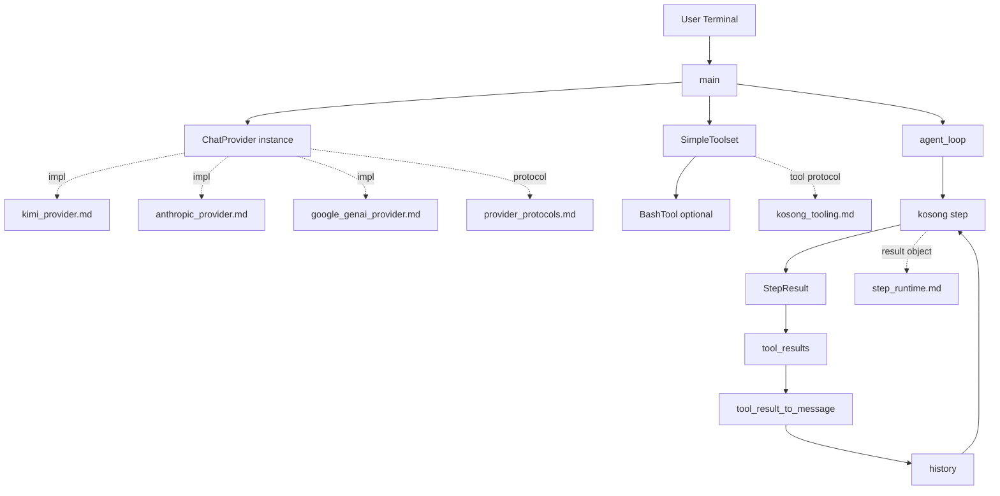
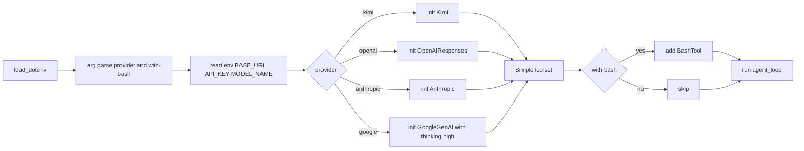
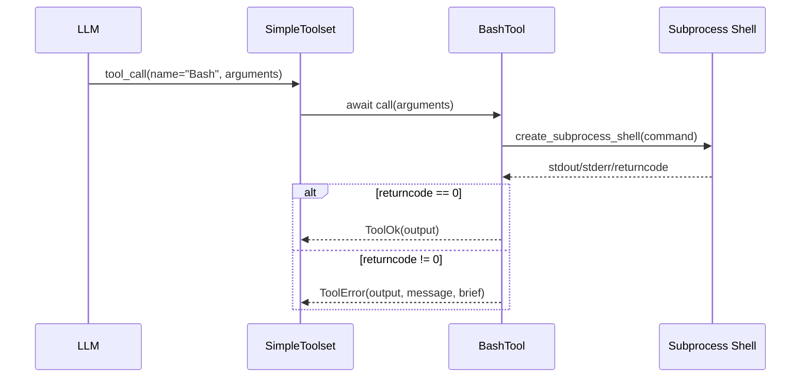
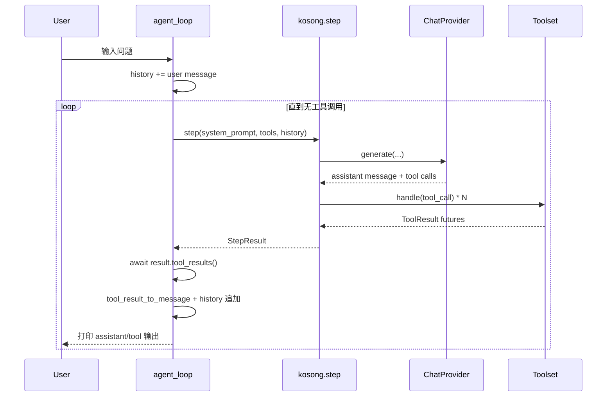
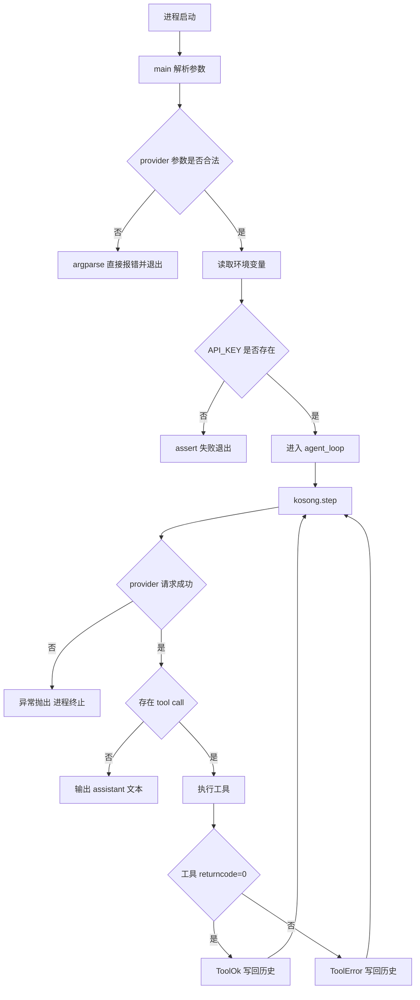
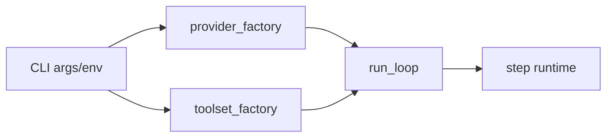

# cli_entrypoint 模块文档

`cli_entrypoint` 对应实现位于 `packages/kosong/src/kosong/__main__.py`，它是 `kosong_core` 的命令行入口示例/最小可运行代理（agent）壳层。这个模块的目标不是提供复杂业务能力，而是把 `kosong.step(...)`、`ChatProvider`、`Toolset` 三个核心抽象串起来，形成一个可直接交互的 REPL（read-eval-print loop）流程，帮助开发者验证模型调用、工具调用和多轮历史拼接是否工作正常。

从设计上看，它体现了 `kosong` 框架的典型运行模式：

1. 在入口阶段完成 provider 与工具集装配。
2. 进入循环读取用户输入。
3. 每轮调用 `kosong.step(...)` 生成 assistant 响应并触发工具调用。
4. 将工具结果再写回历史，继续推进直到本轮没有新的 tool call。

因此，`cli_entrypoint` 是理解整个系统行为的“最短路径”：它代码量小，但覆盖了聊天生成、工具执行、错误回传、历史管理、环境变量配置等关键机制。

---

## 1. 模块定位与系统关系

在模块树中，`cli_entrypoint` 属于 `kosong_core` 子模块，核心组件是 `BashToolParams`，但实际入口文件还包含 `BashTool`、`agent_loop`、`main` 等关键函数/类。它与系统其他模块关系如下：



这个结构说明：`cli_entrypoint` 本身不实现推理模型，也不实现通用工具协议；它负责把这些模块“编排”在一起。若你要理解底层协议细节，请分别参考：

- `ChatProvider` 协议与流式生成：[`provider_protocols.md`](provider_protocols.md)
- `Toolset` / `CallableTool2` / `ToolReturnValue`：[`kosong_tooling.md`](kosong_tooling.md)
- `StepResult` 语义与工具结果收敛：[`step_runtime.md`](step_runtime.md)

---

## 2. 启动流程总览

`__main__.py` 最后直接执行 `asyncio.run(main())`，意味着该模块被当作脚本运行时会立刻进入异步主流程。



该流程的重点是“配置驱动 + 运行时分派”：同一套 agent 循环复用，不同 provider 仅在初始化分支中切换。

---

## 3. 核心组件详解

### 3.1 `BashToolParams`

```python
class BashToolParams(BaseModel):
    command: str
```

`BashToolParams` 是 `BashTool` 的参数模型，基于 Pydantic `BaseModel`。它只定义了一个字段：`command`，表示要执行的 shell 命令。这个模型的价值在于：

- 它会被 `CallableTool2` 自动导出为 JSON Schema，供模型在 tool call 参数生成时参考。
- 在工具实际调用前，参数会被严格校验；如果类型不匹配，会返回工具校验错误（而不是抛出未处理异常）。

由于只有 `str` 约束，不包含白名单、长度限制、命令审计，这也意味着安全边界完全由调用环境负责（见“风险与限制”章节）。

---

### 3.2 `BashTool`

`BashTool` 继承 `CallableTool2[BashToolParams]`，是一个异步可调用工具。其类属性如下：

- `name = "Bash"`
- `description = "Execute a bash command."`
- `params = BashToolParams`

`__call__(self, params: BashToolParams) -> ToolReturnValue` 的内部过程：

1. 使用 `asyncio.create_subprocess_shell(params.command, ...)` 启动 shell 子进程。
2. 捕获 `stdout`、`stderr`。
3. 将二者解码、`strip` 并拼接为 `output_text`。
4. 若退出码 `0` 返回 `ToolOk(output=output_text)`。
5. 否则返回 `ToolError`，包含错误码信息与简短说明。

这里返回的是 `ToolReturnValue` 体系对象，而不是直接抛异常，符合 `Toolset.handle` 的契约要求。



**副作用与注意点：**

- 直接执行系统命令，具备高风险副作用（删改文件、网络访问、资源占用等）。
- 当前实现无超时控制；阻塞命令可能导致长时间等待。
- `subprocess_shell` 允许 shell 特性（重定向、管道、命令替换），也放大了注入风险。

---

### 3.3 `agent_loop(chat_provider, toolset)`

这是交互主循环，负责维护会话历史与多轮工具回填。

函数签名：

```python
async def agent_loop(chat_provider: ChatProvider, toolset: Toolset)
```

核心机制分两层循环：

- **外层循环**：读取用户输入，处理 `exit/quit`，将用户消息追加到 `history`。
- **内层循环**：反复执行 `kosong.step(...)`，直到当前 assistant 消息不再包含 tool calls。

每次 `step` 后处理顺序是：

1. `result = await kosong.step(...)`
2. `tool_results = await result.tool_results()`（等待并收敛所有工具结果）
3. 取 `assistant_message = result.message`
4. 将每个 `ToolResult` 转成 `Message(role="tool", ...)`
5. 把 assistant 与 tool 消息都写回 `history`
6. 打印 assistant/tool 文本内容
7. 若 `result.tool_calls` 为空则结束内层循环

这种设计确保模型能够“看见”工具执行结果并继续推理，直到收敛。

---

### 3.4 `tool_result_to_message(result: ToolResult) -> Message`

该函数负责协议桥接：将工具执行结果转换为聊天历史中的 tool message。

```python
def tool_result_to_message(result: ToolResult) -> Message:
    return Message(
        role="tool",
        tool_call_id=result.tool_call_id,
        content=result.return_value.output,
    )
```

关键点在于 `tool_call_id` 会保留下来，用于将 tool response 与对应 tool call 关联。对多工具并发调用场景，这种映射非常重要。

---

### 3.5 `main()`

`main` 负责运行前配置、provider 分派、工具装配。

#### 参数解析

- 位置参数 `provider`：`kimi | openai | anthropic | google`
- 开关参数 `--with-bash`：是否注册 `BashTool`

#### 环境变量约定

按 provider 名称动态读取：

- `${PROVIDER}_BASE_URL`
- `${PROVIDER}_API_KEY`
- `${PROVIDER}_MODEL_NAME`

例如 `provider=openai` 会读取 `OPENAI_BASE_URL / OPENAI_API_KEY / OPENAI_MODEL_NAME`。

Google 分支额外兼容 `GEMINI_API_KEY`。

#### Provider 分支行为

- `kimi`：默认 `https://api.moonshot.ai/v1`，默认模型 `kimi-k2-turbo-preview`
- `openai`：默认 `https://api.openai.com/v1`，默认模型 `gpt-5`
- `anthropic`：默认 `https://api.anthropic.com`，默认模型 `claude-sonnet-4-5`，并设置 `default_max_tokens=50_000`
- `google`：默认模型 `gemini-3-pro-preview`，并调用 `.with_thinking("high")`

API Key 缺失时使用 `assert` 直接失败，这让错误尽早暴露，但也意味着它是“开发友好、生产较粗糙”的处理方式。

---

## 4. 一次完整交互的数据流



可见 `history` 是状态核心，既承载用户输入，也承载 assistant 响应与 tool 响应。下一轮 `step` 的行为受历史完整性直接影响。

---

## 5. 使用方式与配置示例

最小运行命令：

```bash
python -m kosong kimi
```

启用 Bash 工具：

```bash
python -m kosong openai --with-bash
```

配套 `.env` 示例：

```dotenv
OPENAI_API_KEY=sk-xxxx
OPENAI_MODEL_NAME=gpt-5
OPENAI_BASE_URL=https://api.openai.com/v1
```

Kimi 示例：

```dotenv
KIMI_API_KEY=...
# 可选
KIMI_MODEL_NAME=kimi-k2-turbo-preview
KIMI_BASE_URL=https://api.moonshot.ai/v1
```

Google 示例（兼容变量名）：

```dotenv
GOOGLE_API_KEY=...
# 或 GEMINI_API_KEY=...
GOOGLE_MODEL_NAME=gemini-3-pro-preview
```

---

## 6. 扩展与二次开发

### 扩展 Provider

如果你要新增 provider（例如 `xai`），最直接方式是在 `main()` 的 `match provider` 增加分支，并接入对应实现类。建议同步更新：

- `parser.add_argument(... choices=[...])`
- 环境变量命名约定
- 默认 `base_url/model`

更可维护的做法是把分支逻辑抽成“provider 工厂映射表”，减少 `match` 膨胀。

### 扩展 Tool

可仿照 `BashTool`：

```python
from pydantic import BaseModel
from kosong.tooling import CallableTool2, ToolOk, ToolReturnValue

class EchoParams(BaseModel):
    text: str

class EchoTool(CallableTool2[EchoParams]):
    name = "Echo"
    description = "Echo input text"
    params = EchoParams

    async def __call__(self, params: EchoParams) -> ToolReturnValue:
        return ToolOk(output=params.text)
```

然后在启动时注入：

```python
toolset = SimpleToolset()
toolset += EchoTool()
```

`SimpleToolset` 会校验 `__call__` 的返回类型注解是否为 `ToolReturnValue`，不符合时在注册阶段就会抛出 `TypeError`，这能提前发现工具实现错误。

---

## 7. 边界条件、错误处理与已知限制

`cli_entrypoint` 是教学/演示友好的入口，但有若干运行时约束需要注意：

- **API Key 缺失处理依赖 `assert`**。在 Python `-O` 优化模式下，`assert` 可能被移除，不适合作为严肃生产校验。
- **无网络重试与退避**。`ChatProvider.generate` 可能抛连接、超时、状态码异常；该入口未做显式捕获，异常会直接中断进程。
- **Bash 工具安全风险高**。没有命令白名单、沙箱、权限降级、超时、资源限制。
- **历史无限增长**。`history` 不做压缩/截断，长会话会增大 token 消耗并拖慢响应。
- **同步 `input()` 调用**。在异步函数中使用阻塞输入仅适合本地 CLI，不适合高并发服务化场景。
- **工具输出直传模型**。stderr/stdout 不做结构化分级，可能引入噪声提示或敏感信息外泄。

如果你在生产环境复用此入口思路，建议结合 `soul_engine` 的上下文管理与压缩机制、`config_and_session` 的配置治理能力，以及更严格的工具安全策略。

---

## 8. 设计取舍总结

`cli_entrypoint` 的核心价值是“极简而完整地展示 agent 执行闭环”。它故意保留了一些粗粒度实现（如 `assert`、无重试、无历史治理），以换取更低理解门槛和更清晰的主流程。对于学习 `kosong` 框架，它是非常好的起点；对于生产系统，它更像一个应被“重构继承”的参考实现。

如果你准备继续深入，建议下一步阅读：

- [`step_runtime.md`](step_runtime.md)：理解 `StepResult.tool_results()` 的收敛语义
- [`kosong_tooling.md`](kosong_tooling.md)：理解工具注册、参数校验与返回协议
- [`provider_protocols.md`](provider_protocols.md)：理解 provider 抽象与错误模型
- [`kimi_provider.md`](kimi_provider.md)、[`anthropic_provider.md`](anthropic_provider.md)、[`google_genai_provider.md`](google_genai_provider.md)：查看具体 provider 配置差异


---

## 9. 运行时错误路径与恢复建议

在真实环境中，`cli_entrypoint` 的失败通常发生在三个阶段：初始化阶段（参数与环境变量不完整）、推理阶段（provider 网络或鉴权失败）、工具阶段（本地命令执行失败）。该模块的实现选择了“尽快失败”而不是“自动恢复”，因此它更适合作为开发者调试入口，而不是具备自治恢复能力的生产守护进程。



上图对应的关键结论是：工具失败并不会中断循环，它会作为 `ToolError` 进入历史，随后交由模型决定如何补救；但 provider 级别异常通常会直接使进程退出。若你希望获得更稳定的 CLI 体验，通常会在 `agent_loop` 的 `kosong.step(...)` 调用外围增加 `try/except`，并对可恢复错误做重试或降级提示。

例如可以增加一个轻量包装：捕获网络超时、429、5xx 后提示用户“稍后重试”，并允许继续会话而不是退出进程。此类增强建议放在入口层实现，不应侵入 `step_runtime` 或 provider 协议本身，以保持分层清晰。

---

## 10. 可维护性与扩展建议（面向长期演进）

当 `cli_entrypoint` 被用于团队内部原型平台时，最常见的演进是：provider 增多、工具增多、会话状态治理要求提高。当前文件是单体式入口，这种形态在初期非常直接，但会在分支数量增长后迅速变得难以维护。一个更稳妥的做法是把入口拆分为三个可替换层：`provider_factory`、`toolset_factory`、`run_loop`。



这种拆分的价值在于你可以独立测试每个层次：

- `provider_factory` 只验证参数到 provider 实例的映射是否正确；
- `toolset_factory` 只验证工具注册、权限策略和可见性；
- `run_loop` 只验证消息历史与 step 收敛行为。

此外，若后续要接入 WebSocket/API 服务端，`run_loop` 可以复用，而交互输入输出（现在依赖 `input/print`）可以替换成网络消息收发层。这也是该模块最值得保留的设计资产：它把“交互 IO”与“agent 推进逻辑”保持了相对松耦合。
