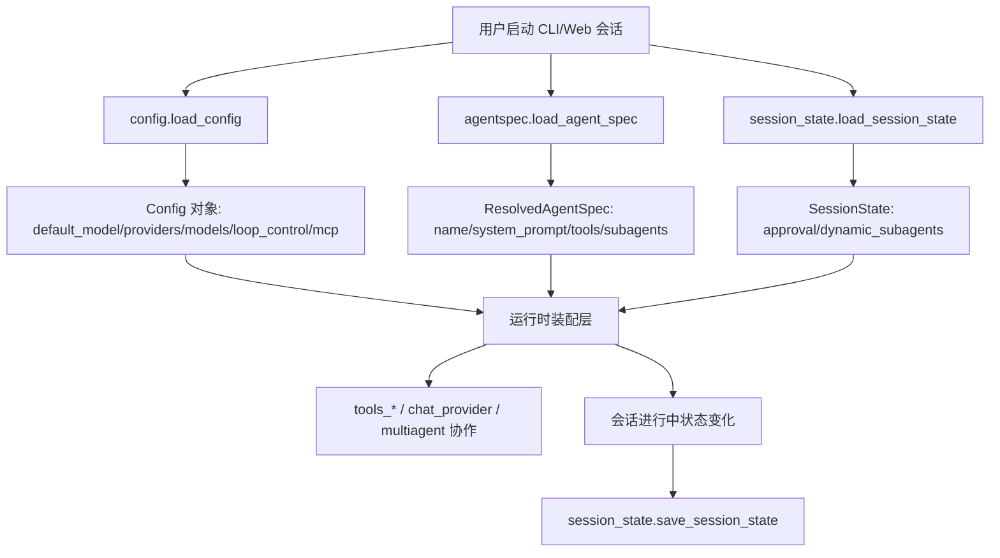
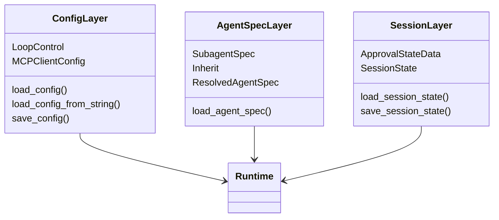
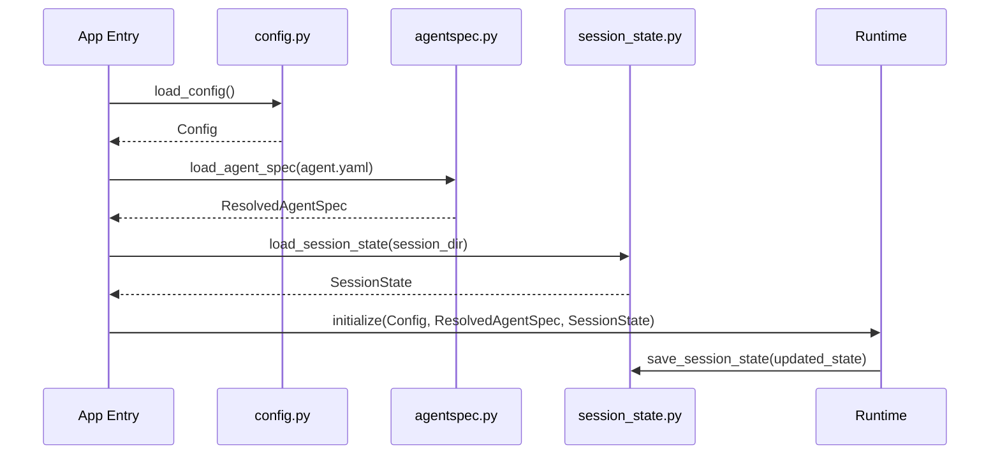
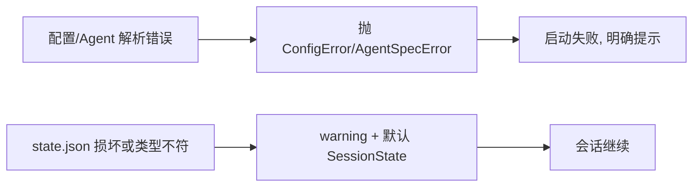

# config_and_session 模块文档

`config_and_session` 是 Kimi CLI 中负责“启动前约束”和“会话级状态连续性”的基础模块域。它由三块能力组成：

1. 配置建模与加载（`src/kimi_cli/config.py`）
2. 会话状态持久化（`src/kimi_cli/session_state.py`）
3. Agent 静态规格解析与继承（`src/kimi_cli/agentspec.py`）

这三块能力共同解决了一个典型 CLI/Agent 系统问题：**如何在运行前拿到可验证的全局配置，在运行中保存可恢复的会话状态，并以声明式方式定义可扩展的 Agent 行为**。如果缺少该模块域，系统会面临配置散落、会话无法恢复、Agent 定义难以复用等问题。

从设计理念上看，`config_and_session` 采用“强校验 + 软恢复”的组合策略：

- 对全局配置与 Agent 规格采取 fail-fast（尽早验证、尽早报错）；
- 对会话状态文件采取容错回退（损坏时回默认状态，优先保证可用性）。

这种策略把错误分层处理：结构性错误在启动阶段暴露，运行期临时状态异常尽量不阻断交互。

---

## 1. 模块架构总览

上图展示了该模块域在系统中的位置：`Config`、`ResolvedAgentSpec`、`SessionState` 分别代表“全局静态配置”“Agent 静态定义”“会话动态状态”，三者在运行时装配层汇合，再驱动工具、模型与多代理协作。会话结束或阶段性变更时，动态状态回写到 `state.json`，形成闭环。

---

## 2. 组件关系与职责边界

该关系图强调了边界：

- **ConfigLayer** 只关心“配置文件生命周期与校验契约”；
- **AgentSpecLayer** 只关心“YAML 规格如何解析成可执行 Agent 定义”；
- **SessionLayer** 只关心“会话过程态如何安全保存与恢复”。

它们不互相替代：`Config` 不应承担会话瞬时状态，`SessionState` 不应承载全局模型/provider 配置，`AgentSpec` 不应承担运行时事件数据。这种分离降低了耦合，也使每个文件格式（TOML/JSON/YAML）保持单一职责。

---

## 3. 子模块功能索引（高层）
### 3.1 configuration_loading_and_validation

该子模块负责定义 `Config` 及其嵌套模型，并提供读取、保存、字符串解析与历史迁移能力。核心组件 `LoopControl` 约束 agent loop 行为边界（步数、重试、上下文预留），`MCPClientConfig` 约束 MCP 工具调用超时策略。其关键价值在于把“可运行配置”变成强类型契约，并在启动前完成引用一致性校验（如 model -> provider 对应关系）。详细机制与字段语义请阅读：[configuration_loading_and_validation.md](configuration_loading_and_validation.md)。

### 3.2 session_state_persistence

该子模块负责会话目录中 `state.json` 的读写，核心组件 `ApprovalStateData` 表示审批策略状态（如 yolo 开关与自动批准动作集合）。读取路径采用容错回退策略：文件损坏不会中断会话，而是回到默认状态；写入路径使用原子写入，减少异常中断造成的半写文件风险。它为“可恢复会话体验”提供基础，尤其适合交互式 CLI。详细说明请阅读：[session_state_persistence.md](session_state_persistence.md)。

### 3.3 agent_spec_resolution

该子模块负责解析 `agent.yaml`，并支持通过 `extend` 实现规格继承。核心组件 `SubagentSpec` 定义固定子代理入口，`Inherit` 是继承哨兵值，用于区分“未覆盖”与“显式赋值为空”。最终产物 `ResolvedAgentSpec` 已完成路径绝对化、继承展开和必填校验，可直接被运行时装配使用。详细合并规则、错误路径和扩展方法请阅读：[agent_spec_resolution.md](agent_spec_resolution.md)。

---

## 4. 关键数据流与流程

### 4.1 启动与恢复流程

此流程体现出三类状态对象的生命周期差异：

- `Config`：跨会话长期稳定，位于共享目录；
- `ResolvedAgentSpec`：启动时解析，运行中通常只读；
- `SessionState`：会话内频繁变化，按会话目录持久化。

### 4.2 错误处理策略分层

这个分层很关键：启动契约错误必须阻断（避免带病运行），会话过程态错误优先恢复（避免可用性崩溃）。

---

## 5. 如何使用、配置与扩展

开发者接入时，推荐把 `config_and_session` 看成初始化三步：

1. 调用 `load_config()` 获取全局行为边界；
2. 调用 `load_agent_spec()` 获取当前 Agent 的静态定义；
3. 调用 `load_session_state()` 获取会话过程态；
4. 运行中状态变化后，调用 `save_session_state()` 持久化。

在扩展方面，建议遵循：

- 配置字段扩展优先通过新增 Pydantic 子模型并挂入 `Config`；
- Agent 字段扩展要同步定义继承合并语义（覆盖或 merge）；
- Session 字段扩展需提供默认值，并配合 `version` 设计迁移路径。

这样可以保持兼容性与可维护性，避免“新增字段导致旧文件不可读”的回归。

---

## 6. 与其他模块的协作位置

`config_and_session` 并不直接执行模型调用或工具行为，但它决定这些模块能否被正确初始化：

- 与 `kosong_chat_provider` / `kosong_contrib_chat_providers`：提供 provider/model 配置基础；
- 与 `tools_multiagent`：通过 Agent 规格中的 `subagents` 与工具集合影响任务分派能力；
- 与 `wire_protocol` / `web_api`：会话恢复与配置更新接口最终都落到该模块域的数据结构；
- 与认证域 `auth`：`oauth` 在配置中仅保存引用，真实令牌管理由认证模块处理。

因此，该模块是“运行前控制面（control plane）”的一部分，而不是“运行时执行面（data plane）”。

---

## 7. 重点风险与注意事项

维护或二次开发时，最需要关注以下问题：

- `Config` 的引用完整性（default model 与 provider 对应）必须始终在加载时可验证；
- `AgentSpec` 继承链可能出现环，当前实现未内建循环检测；
- `SessionState` 的容错回退会隐藏部分数据损坏，需要上层监控日志；
- 原子写入可以避免半写，但不能天然解决多进程并发覆盖；
- 敏感信息（如 api_key）虽然在模型展示层被保护，但保存到配置文件时仍是明文，需要文件权限和外部密钥策略配合。

---

## 8. 参考阅读

- 子模块详解：
  - [configuration_loading_and_validation.md](configuration_loading_and_validation.md)
  - [session_state_persistence.md](session_state_persistence.md)
  - [agent_spec_resolution.md](agent_spec_resolution.md)
- 相关模块：
  - [kosong_chat_provider.md](kosong_chat_provider.md)
  - [provider_protocols.md](provider_protocols.md)
  - [cli_entrypoint.md](cli_entrypoint.md)

---

## 9. 本模块最新子文档入口（以本次生成为准）

为避免与历史文档命名混淆，`config_and_session` 当前应优先参考以下三份子模块文档（均已生成）：

- [config_management.md](config_management.md)
- [session_state_management.md](session_state_management.md)
- [agent_spec_resolution.md](agent_spec_resolution.md)

若你在目录中看到同主题的旧命名文件（如 `configuration_loading_and_validation.md`、`session_state_persistence.md`），请以上述三份为主。