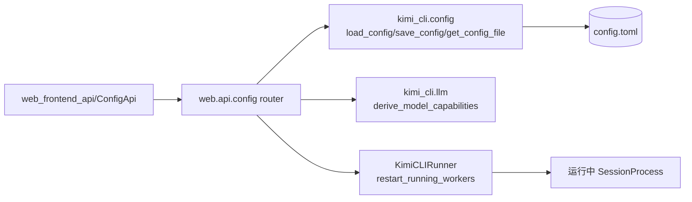
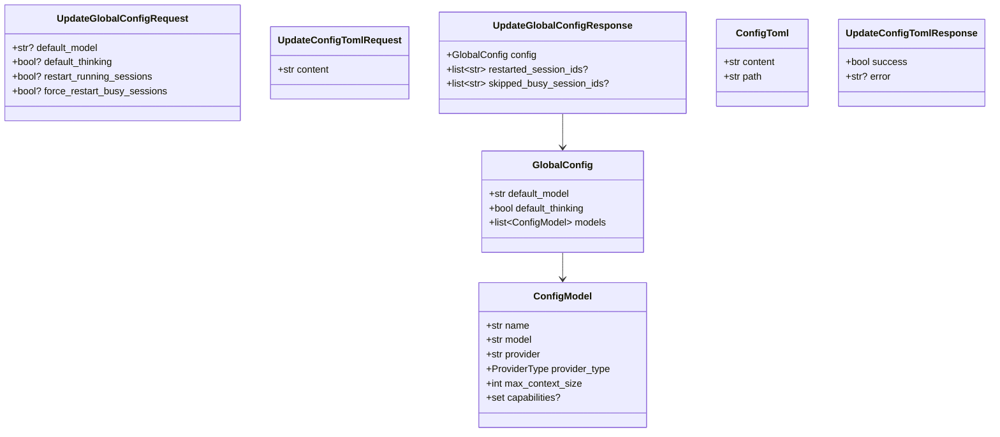
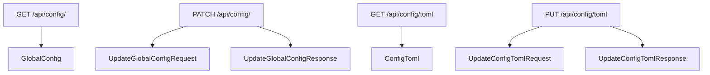
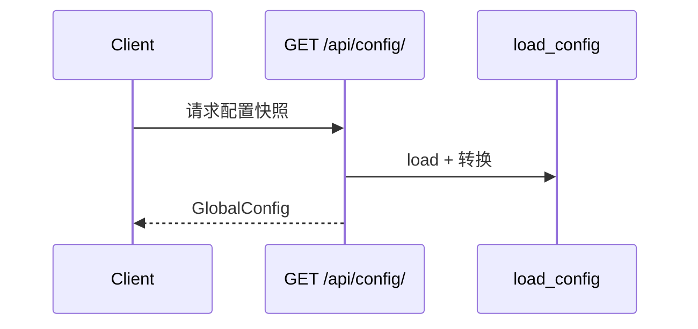
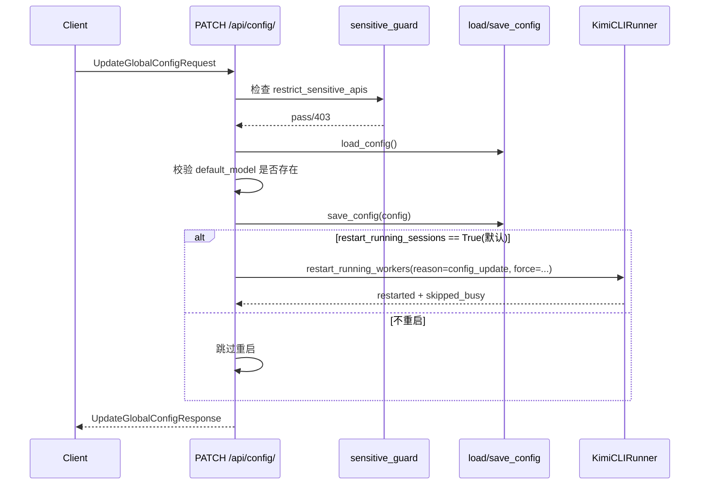

# config_api 模块文档

`config_api` 对应后端实现 `src/kimi_cli/web/api/config.py`，是 `web_api` 子系统中负责“全局配置读取与变更”的控制面接口。这个模块的核心目标不是替代本地配置文件机制，而是在 Web 管理界面场景下，把 `kimi-cli` 的关键配置能力（例如 `default_model`、`default_thinking`、`config.toml` 原文）以安全、可校验、可观测的 HTTP API 暴露出来。

从系统设计上看，`config_api` 解决的是一个典型问题：CLI 配置本质上是文件（TOML/JSON）驱动，但 Web 客户端需要结构化接口进行读写和即时反馈。该模块通过 Pydantic 请求/响应模型 + 配置加载校验函数 + 会话运行器重启机制，把“文件变更”升级为“受约束的服务操作”。这样做有两个直接收益：第一，前端可以在不理解完整 TOML 细节的情况下完成常见配置调整；第二，配置改动可以同步触发运行中会话的 worker 重启，让新配置尽快生效。

---

## 1. 模块定位与系统关系

在 `web_api` 体系里，`config_api` 与 `sessions_api` 分别承担“控制面配置”和“会话面生命周期”两条主线：

- `config_api`：读写全局配置、应用变更、控制是否重启运行中会话。
- `sessions_api`：管理具体会话对象、状态流、历史与文件操作（详见 [sessions_api.md](sessions_api.md)）。

底层配置结构和校验规则由配置模块提供，`config_api` 不重复定义配置语义，而是复用 `load_config / save_config / load_config_from_string`，详细配置模型请参考 [configuration_loading_and_validation.md](configuration_loading_and_validation.md)。



这张图表示 `config_api` 是一个编排层：向下调用配置读写和运行器重启能力，向上输出稳定的 HTTP 契约。

---

## 2. 对外数据模型（API Contract）

尽管本模块在模块树中标记的核心组件是 `UpdateConfigTomlRequest` 与 `UpdateGlobalConfigRequest`，但要正确理解接口行为，需要把相关响应模型一起看成一个契约集合。



### 2.1 `UpdateGlobalConfigRequest`

该请求模型用于 `PATCH /api/config/`。它支持“部分更新”，即所有字段都可选；只有传入非 `None` 的字段才会被应用。

- `default_model`：新的默认模型键（必须存在于 `config.models`）。
- `default_thinking`：新的默认思考模式布尔值。
- `restart_running_sessions`：是否在保存配置后重启运行中会话，默认行为是 `True`（即即使字段缺省，也会尝试重启）。
- `force_restart_busy_sessions`：是否强制重启 busy 会话。缺省等价于 `False`。

### 2.2 `UpdateConfigTomlRequest`

该请求模型用于 `PUT /api/config/toml`，只有一个字段 `content`，表示完整 TOML（或 JSON）配置文本。接口会先调用 `load_config_from_string` 验证，再写入磁盘文件。也就是说它不是“盲写文本”，而是“校验后写入”。

---

## 2.3 组件级语义说明（按代码对象）

为了便于维护者从源码直接定位行为，这里将 `src/kimi_cli/web/api/config.py` 中的主要对象按“输入模型、输出模型、内部函数、路由函数”四类串起来解释。

`UpdateGlobalConfigRequest` 之所以把字段都设计为可选，是因为它承担的是 PATCH 语义：调用方只提交想改的字段，未提交的字段完全保持原值。这个模型里最容易误解的是 `restart_running_sessions`。它在请求体中虽然是可选值，但在服务端逻辑中具有“缺省即 True”的业务默认行为，因此如果前端不想重启会话，必须显式传 `false`。

`UpdateConfigTomlRequest` 只有一个 `content` 字段，代表完整文本，而不是差量 patch。该设计让验证逻辑可以一次性覆盖全部配置引用关系（模型、provider、默认项等），避免局部编辑导致的中间不一致状态。代价是调用端需要自己管理“编辑前内容”的并发一致性。

`_build_global_config()` 是一个视图构建器。它不会返回完整底层配置，而是返回前端需要的“展示快照”：`default_model`、`default_thinking` 和可用模型列表。该函数有明确副作用边界：只读配置、不写磁盘、不改运行态。它对脏配置采用“降噪策略”——如果模型引用的 provider 缺失，则跳过该模型，这使 UI 列表更稳定，但也会隐藏一部分错误信息，因此排障时要结合原始 TOML。

`_get_runner()` 是 FastAPI 的依赖注入桥接函数，本身逻辑简单，但系统意义很大：它把 `config_api` 与运行时控制器 `KimiCLIRunner` 连接起来，使配置变更可以传播到正在运行的 worker。换句话说，`config_api` 不是纯配置 CRUD，而是“配置 + 运行态协调”的入口。

`_ensure_sensitive_apis_allowed()` 是敏感操作闸门。它读取 `request.app.state.restrict_sensitive_apis` 并在受限模式下直接抛出 `403`。这个函数被写操作以及读取原始 TOML 的操作复用，保证策略一致，避免“某个端点忘记加鉴权/限制”的维护风险。

`get_global_config()` 的返回值稳定且幂等；调用多少次都不会改变系统状态。`update_global_config()` 则同时具有持久化副作用（`save_config`）和运行态副作用（可选重启会话），因此它的调用应被视为运维动作而不是普通读取动作。

`get_config_toml()` 返回的是原始文本和文件路径。路径返回看似简单，但在多平台部署或容器部署里对排障非常实用，前端可以明确告知用户“当前实例实际读写的是哪个文件”。`update_config_toml()` 的副作用仅限文件系统写入，不包含会话重启；其错误通过响应体 `success=false` 暴露，而不是抛 HTTP 4xx/5xx，这一点对前端错误处理分支非常关键。

---

## 2.4 路由-模型映射速查



这个映射图的价值在于帮助前后端快速对齐：前端只要依据这五个模型就能完成配置页读写闭环，不需要直接接触底层 `kimi_cli.config` 的复杂结构。

---

## 3. 核心内部函数与路由实现细节

## 3.1 `_build_global_config()`：从完整配置构建前端快照

这个函数先 `load_config()`，再遍历 `config.models` 生成可供前端展示的 `ConfigModel` 列表。核心细节有两个：

第一，它会检查模型引用的 provider 是否存在。若 `provider` 在 `config.providers` 中找不到，该模型会被静默跳过（`continue`），不会出现在返回结果里。这避免了前端拿到无效 provider_type 的半残模型。

第二，它会调用 `derive_model_capabilities(model)` 推导能力集，并在能力为空时返回 `None` 而非空集合，以保持响应简洁。

## 3.2 `_get_runner(req)`：从 app.state 注入 `KimiCLIRunner`

`update_global_config` 通过 `Depends(_get_runner)` 取运行器实例，依赖 `FastAPI app.state.runner` 预先挂载。这个注入点是配置变更后“作用于运行时”的关键桥梁。

## 3.3 `_ensure_sensitive_apis_allowed(request)`：敏感接口总闸

若 `request.app.state.restrict_sensitive_apis == True`，函数直接抛 `403`，提示 “Sensitive config APIs are disabled in this mode.”。这对部署在公共/受限模式的 Web 服务尤其重要，能禁止通过 HTTP 修改全局配置。

---

## 4. API 流程与交互

## 4.1 读取全局配置：`GET /api/config/`

该路由直接返回 `_build_global_config()` 结果，属于只读快照接口，不涉及敏感写操作开关，也不会影响运行中会话。



## 4.2 更新默认模型/思考模式：`PATCH /api/config/`

这是模块的核心写接口。完整过程如下：



关键行为说明：

- 如果 `default_model` 不存在，立即返回 `400`。
- 如果 `restart_running_sessions` 未传，默认当作 `True`。
- 重启失败异常不会在本函数中逐个展开；`restart_running_workers` 内部使用 `gather(return_exceptions=True)`，接口主要返回“尝试重启了哪些会话、跳过了哪些 busy 会话”。

## 4.3 读取原始配置文件：`GET /api/config/toml`

该路由属于敏感读操作，需要通过 `_ensure_sensitive_apis_allowed`。如果文件不存在，返回空内容和目标路径；如果存在，读取 UTF-8 文本原样返回。

## 4.4 更新原始配置文件：`PUT /api/config/toml`

接口行为是“验证优先”：

1. 调用 `load_config_from_string(request.content)` 做结构与引用合法性检查。
2. 检查通过后写入 `get_config_file()` 指向路径（自动创建父目录）。
3. 成功返回 `{ success: true }`；失败捕获异常并返回 `{ success: false, error: ... }`，同时写 warning 日志。

注意此接口不会自动重启运行会话；如果你希望新配置即时影响当前 session，应再调用 `PATCH /api/config/` 或由上层流程显式触发重启策略。

---

## 5. 关键设计决策与原因

`config_api` 采用“结构化更新”和“原文更新”双轨设计：`PATCH /api/config/` 面向高频、可控的少量字段；`PUT /api/config/toml` 面向高级用户的一次性全量编辑。这样既降低普通前端操作复杂度，又保留完整配置编辑能力。

此外，模块把“是否允许敏感读写”做成统一网关函数，而不是在每个路由分散判断，提升了策略一致性。会话重启则通过 runner 统一执行，避免 API 层直接触碰 session 进程细节，实现关注点分离。

---

## 6. 使用示例

### 6.1 获取配置快照

```bash
curl -X GET http://localhost:8000/api/config/
```

示例响应：

```json
{
  "default_model": "kimi-code",
  "default_thinking": false,
  "models": [
    {
      "name": "kimi-code",
      "model": "kimi-for-coding",
      "provider": "moonshot",
      "provider_type": "openai",
      "max_context_size": 128000,
      "capabilities": ["thinking", "image_in", "video_in"]
    }
  ]
}
```

### 6.2 更新默认模型并重启运行中会话

```bash
curl -X PATCH http://localhost:8000/api/config/ \
  -H "Content-Type: application/json" \
  -d '{
    "default_model": "kimi-code",
    "default_thinking": true,
    "restart_running_sessions": true,
    "force_restart_busy_sessions": false
  }'
```

### 6.3 读取与回写 `config.toml`

```bash
curl -X GET http://localhost:8000/api/config/toml
```

```bash
curl -X PUT http://localhost:8000/api/config/toml \
  -H "Content-Type: application/json" \
  -d '{"content": "default_model = \"kimi-code\"\ndefault_thinking = true\n"}'
```

---

## 7. 边界条件、错误与运维注意事项

## 7.1 常见错误语义

- `403 Forbidden`：服务处于 `restrict_sensitive_apis` 模式，敏感配置接口被禁用。
- `400 Bad Request`：`PATCH` 请求中 `default_model` 不存在。
- `200 + success=false`：`PUT /toml` 校验或写入失败，错误文本在 `error` 字段。

## 7.2 一致性与并发注意

当前实现没有显式文件锁。若多个客户端同时写 `config.toml`，后写入者会覆盖先写入结果（last write wins）。在多客户端环境中，建议由上层增加版本号/ETag 或串行化写入策略。

## 7.3 模型显示与真实配置不一致的可能性

`_build_global_config()` 会跳过 provider 缺失的模型，因此某些“脏配置中的模型条目”在前端列表里可能不可见。这是有意的保护行为，但也意味着排障时应直接检查原始 `config.toml`。

## 7.4 原文更新不自动重启会话

`PUT /api/config/toml` 只保证“文件已写且可解析”，不保证“当前运行 worker 已加载新配置”。这是一个常见误区。若期望即时生效，应结合会话重启机制。

---

## 8. 扩展建议

如果要为 `config_api` 增加新字段（例如新增全局开关），建议优先走 `PATCH /api/config/` 路线：在请求模型增加可选字段、在处理函数做最小验证、复用 `save_config` 持久化，并保持“默认不破坏现有行为”的策略。

如果要增加复杂配置编辑能力（如局部 TOML patch），建议不要直接在文本层做字符串操作，而应基于 `load_config_from_string` + 结构化模型变更后再序列化，避免破坏配置合法性。

---

## 9. 与其他文档的关系

- 配置模型、字段语义、加载/保存细节：见 [configuration_loading_and_validation.md](configuration_loading_and_validation.md)
- 会话管理与运行时状态 API：见 [sessions_api.md](sessions_api.md)
- Web 层通用数据契约：见 [data_models.md](data_models.md)

`config_api` 本质上是这些基础能力在 Web 端的编排出口：它不重新发明配置系统，而是把配置系统以可运营接口形式交付给前端与运维流程。
