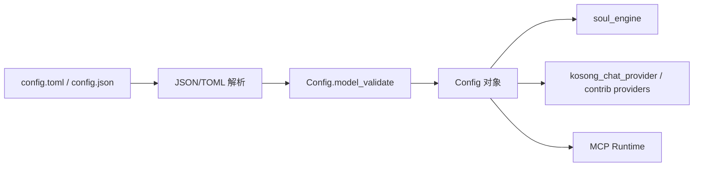
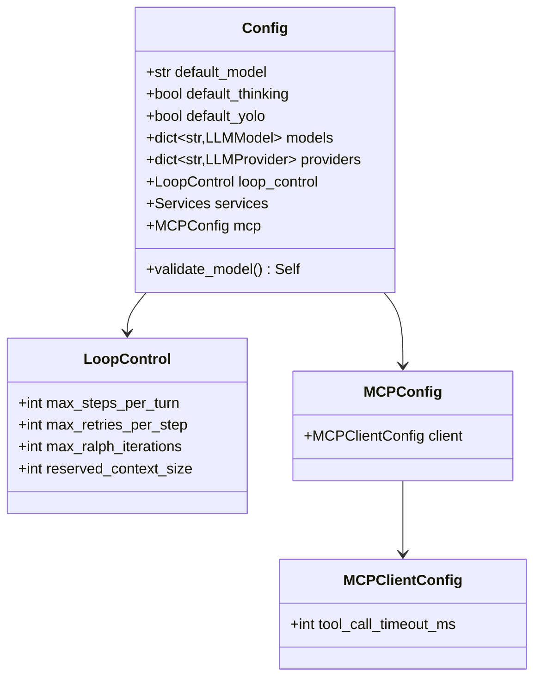
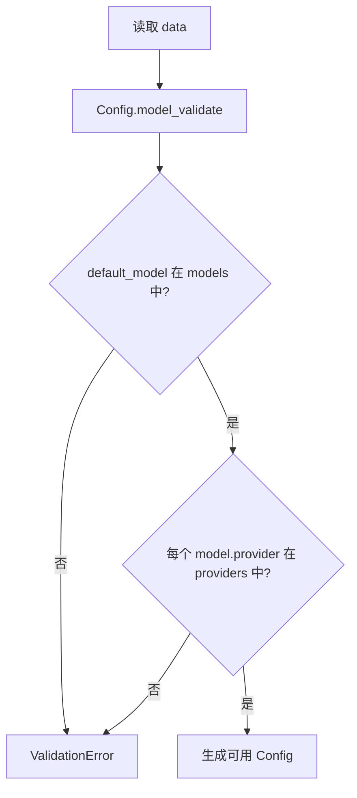
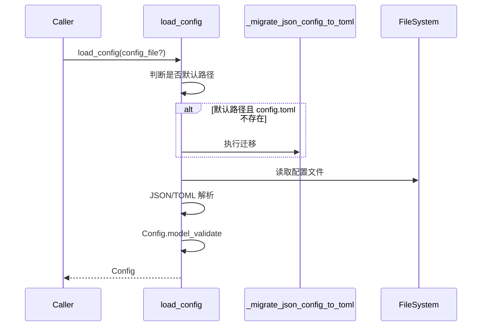

# config_management 模块文档

`config_management` 对应实现文件 `src/kimi_cli/config.py`，是 `config_and_session` 领域中负责“全局配置契约”的子模块。它的职责并不只是读取 `config.toml`，而是通过 Pydantic 数据模型把配置文件提升为可验证、可迁移、可序列化的系统控制面。对于首次接触该代码的开发者，最重要的理解是：**运行时很多行为（默认模型、Provider 连接、Agent 循环边界、MCP 超时）都在这里被定义并提前校验**，因此它是系统启动链路中的 fail-fast 入口。

在模块树中，本模块与 [session_state_persistence.md](session_state_persistence.md) 和 [agent_spec_resolution.md](agent_spec_resolution.md) 共同构成 `config_and_session`。其中 `config_management` 管“长期静态配置”，`session_state` 管“会话动态状态”，`agentspec` 管“代理声明式定义”。这种分工避免了状态混杂，让配置演进和恢复策略可以独立维护。

---

## 1. 为什么需要这个模块

在一个同时支持 CLI、Web API、工具调用和多 Provider LLM 接入的系统里，如果没有统一配置层，常见问题会很快出现：默认模型找不到、模型引用了不存在的 provider、新旧格式共存导致升级失败、敏感字段输出行为不一致等。`config_management` 通过统一 schema（`Config` 及其子模型）和统一入口函数（`load_config`/`save_config`）解决这些问题，并将错误尽可能前置到加载阶段。



这个数据流说明了本模块的系统定位：它并不执行模型推理或工具逻辑，而是为这些执行模块提供“可信输入”。

---

## 2. 架构与组件关系

虽然当前子模块树把核心组件标注为 `LoopControl` 与 `MCPClientConfig`，但二者是被 `Config` 聚合后对外生效的，因此理解它们时必须放在整体结构中看。



从设计上看，这种嵌套结构体现了“可扩展命名空间”思想：`mcp.client.tool_call_timeout_ms` 比把字段直接平铺在顶层更利于后续扩展（例如未来增加 `mcp.server`、`mcp.retry` 等配置而不破坏兼容）。

---

## 3. 核心组件详解

## 3.1 `LoopControl`

`LoopControl` 是 Agent 执行循环的防护配置，控制每一轮可执行步数、单步失败后的重试上限、Ralph 模式迭代，以及上下文压缩触发阈值相关余量。它直接影响系统的稳定性、成本和响应时延。

字段行为如下：

- `max_steps_per_turn`：默认 `100`，约束 `ge=1`。同时使用 `AliasChoices("max_steps_per_turn", "max_steps_per_run")` 兼容旧字段名，这意味着历史配置中的 `max_steps_per_run` 仍可被读取。
- `max_retries_per_step`：默认 `3`，约束 `ge=1`。可防止失败步骤无限重试。
- `max_ralph_iterations`：默认 `0`，约束 `ge=-1`。`-1` 表示无限额外迭代，属于高风险设置，通常只建议在可控环境下使用。
- `reserved_context_size`：默认 `50_000`，约束 `ge=1000`。用于“为模型输出预留 token”，当 `context_tokens + reserved_context_size >= max_context_size` 时，会触发压缩相关策略（具体压缩行为见 [conversation_compaction.md](conversation_compaction.md)）。

`LoopControl` 自身没有自定义方法，但它依赖 Pydantic 的字段约束在加载时就能失败，从而避免运行到中途才出现非预期循环行为。

## 3.2 `MCPClientConfig`

`MCPClientConfig` 当前只有一个字段：

- `tool_call_timeout_ms: int = 60000`

这个值控制 MCP 工具调用的超时窗口（毫秒）。在高延迟外部工具或远端 MCP server 场景中，它是稳定性与吞吐之间的权衡参数：超时过短会引发误失败，超时过长会拉高单步阻塞时间。由于该字段位于 `mcp.client` 命名空间下，后续扩展重试、并发限制、取消策略时可保持结构一致。

---

## 4. 关键内部机制

## 4.1 关联一致性校验（`Config.validate_model`）

`Config` 在 `@model_validator(mode="after")` 中执行引用完整性检查：

1. 如果设置了 `default_model`，该键必须存在于 `models`。
2. 每个 `models[*].provider` 必须存在于 `providers`。

这两条规则确保“配置图”闭合，避免运行时才发现默认模型或 provider 缺失。



## 4.2 加载流程（`load_config`）

`load_config` 的行为可概括为：定位文件 -> 必要时迁移旧格式 -> 解析 -> 校验 -> 返回对象。若文件不存在，它会创建默认配置并写回磁盘。



异常映射策略是该函数的可维护性关键：

- JSON 语法错误会包装为 `ConfigError("Invalid JSON ...")`
- TOML 语法错误会包装为 `ConfigError("Invalid TOML ...")`
- 结构/约束错误会包装为 `ConfigError("Invalid configuration file ...")`

调用方因此可以统一捕获 `ConfigError`，而不必关心底层解析器细节。

## 4.3 文本加载（`load_config_from_string`）

该函数适用于测试、Web API 参数预检、动态注入配置等场景。实现策略是“先尝试 JSON，再尝试 TOML”。如果两者都失败，错误消息会同时包含 JSON 与 TOML 的失败信息，便于定位输入文本问题。

## 4.4 保存与序列化（`save_config`）

`save_config` 会先创建父目录，然后执行 `config.model_dump(mode="json", exclude_none=True)`，再按目标后缀决定写 JSON 或 TOML。这里 `SecretStr` 字段依赖 `field_serializer` 被转换为可持久化字符串；也就是说，**保存后的配置文件中 API key 仍是明文**，需要配合文件权限和外部凭据治理策略。

## 4.5 历史迁移（`_migrate_json_config_to_toml`）

该函数用于从旧版 `config.json` 迁移到 `config.toml`，并把原文件重命名为 `config.json.bak`。迁移不是简单拷贝，而是“读取旧 JSON -> 按新 `Config` 校验 -> 写 TOML”，这样能在升级时及时发现历史配置中的结构错误。

---

## 5. 使用方式与示例

### 5.1 基础加载

```python
from kimi_cli.config import load_config

config = load_config()
print(config.loop_control.max_steps_per_turn)
print(config.mcp.client.tool_call_timeout_ms)
```

### 5.2 传入自定义路径

```python
from pathlib import Path
from kimi_cli.config import load_config

config = load_config(Path("./my_config.toml"))
```

### 5.3 从字符串做预校验

```python
from kimi_cli.config import load_config_from_string

candidate = """
[loop_control]
max_steps_per_turn = 80

[mcp.client]
tool_call_timeout_ms = 45000
"""

cfg = load_config_from_string(candidate)
```

### 5.4 `loop_control` 与 `mcp` 配置片段（TOML）

```toml
[loop_control]
max_steps_per_turn = 120
max_retries_per_step = 3
max_ralph_iterations = 0
reserved_context_size = 50000

[mcp.client]
tool_call_timeout_ms = 60000
```

---

## 6. 扩展与二次开发建议

扩展 `config_management` 时，推荐遵循“新增字段可选、分层命名、保持 validator 语义稳定”的原则。比如为 MCP 增加并发控制，建议新增到 `MCPClientConfig` 而不是平铺到顶层 `Config`，并通过默认值保证旧配置无需立刻修改。

如果新增了会影响引用关系的字段（例如模型路由策略），应在 `Config` 的 `model_validator` 中补充一致性检查。这样可以保持 fail-fast 特性，防止错误渗透到运行期。

---

## 7. 边界条件、错误场景与限制

该模块在工程实践中最常见的“坑”主要有以下几类：

- 配置文件不存在时，`load_config` 会自动创建默认文件。这对首次启动友好，但在只读文件系统会触发 I/O 异常。
- `save_config` 不捕获底层写入异常，权限不足、磁盘满、路径非法会直接向上传播。
- `default_model` 留空是允许的；一旦设置非空，必须在 `models` 中可解析。
- `max_ralph_iterations = -1` 表示无限迭代，若上层没有额外退出机制，可能导致长时间运行。
- `reserved_context_size` 最小值是 `1000`，配置过小会被拒绝，过大可能导致过早触发压缩。
- API key 会在保存时以明文落盘；`SecretStr` 仅影响内存/展示，不是加密机制。
- JSON -> TOML 迁移只在“默认路径 + 新文件不存在”时触发；显式传入自定义路径不会自动迁移。

---

## 8. 与其他模块的关系（避免重复阅读）

本文件聚焦配置管理本身。若你希望继续理解完整运行链路，建议按以下顺序阅读：

1. [config_and_session.md](config_and_session.md)：先看领域级整体分工。
2. [configuration_loading_and_validation.md](configuration_loading_and_validation.md)：同一实现文件的更全面配置 schema 说明（含 provider/model/services 等）。
3. [session_state_persistence.md](session_state_persistence.md)：理解会话状态如何容错恢复。
4. [agent_spec_resolution.md](agent_spec_resolution.md)：理解 agent 声明与继承如何落到运行时。

通过这四份文档组合阅读，可以完整覆盖“启动配置 -> 代理装配 -> 会话恢复 -> 运行执行”的控制面路径。
