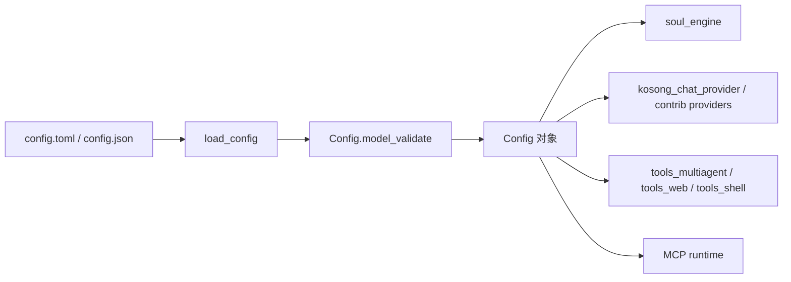
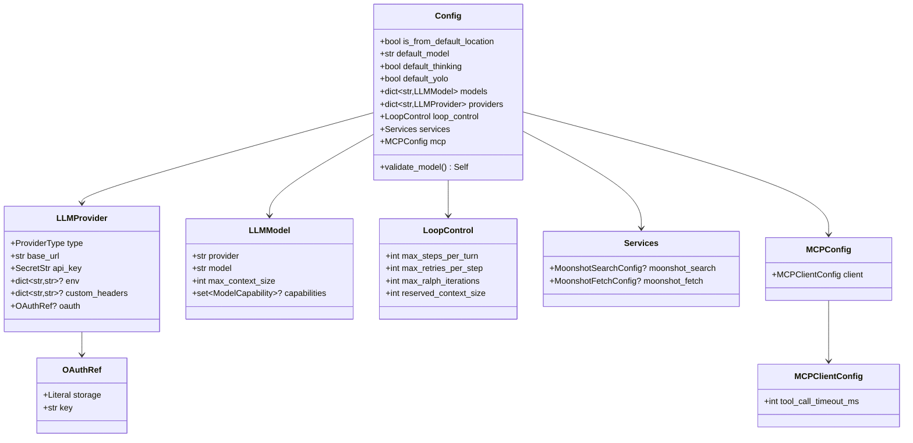
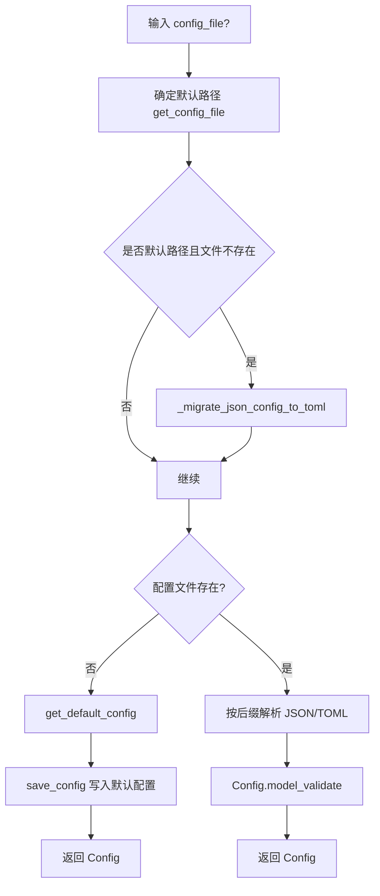
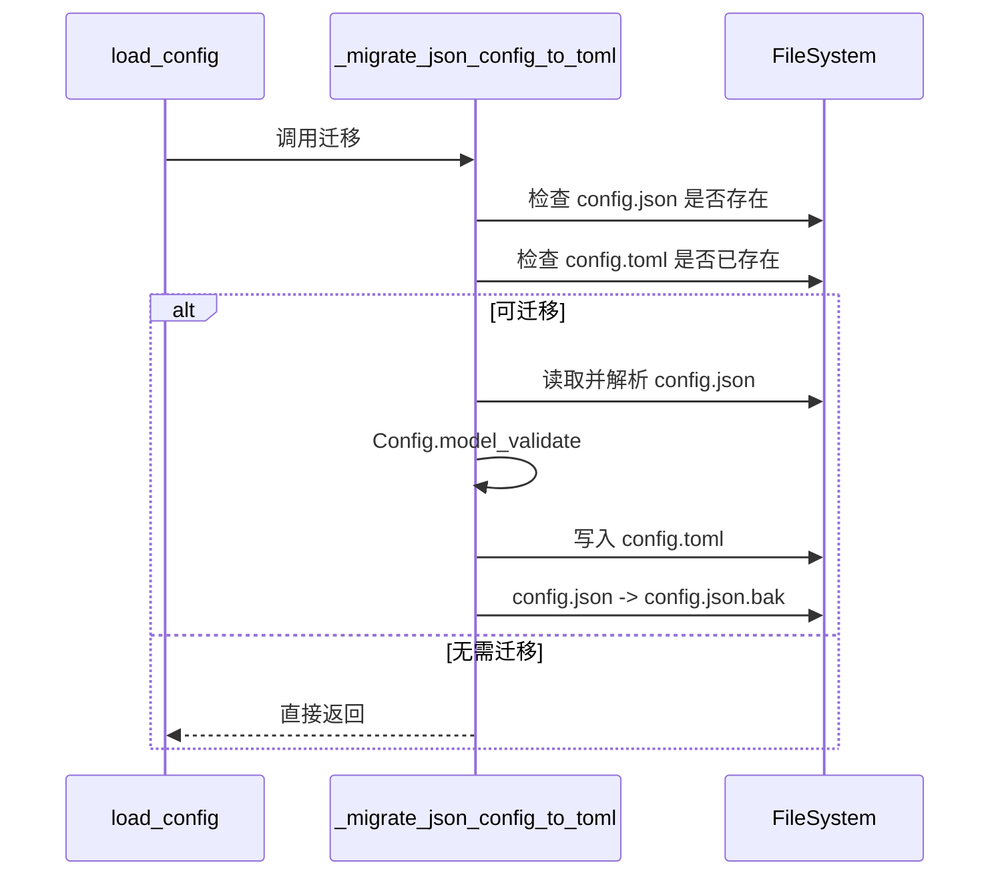

# configuration_loading_and_validation

`configuration_loading_and_validation` 模块（对应实现文件 `src/kimi_cli/config.py`）负责 **Kimi CLI 的配置建模、加载、校验、持久化与兼容迁移**。它是整个系统启动路径中的基础设施模块：在应用初始化时，其他运行时模块（如 `soul_engine`、`tools_*`、`web_api`）通常依赖它提供的 `Config` 对象来决定默认模型、Provider 连接方式、循环执行上限、MCP 超时策略等关键行为。

从设计上看，这个模块并不只是“读一个文件”，而是通过 Pydantic 模型把配置系统提升为一个可验证、可演进的数据契约层。该设计有三个核心目标：第一，配置必须在启动早期被严格验证，避免在运行时深处暴露难以定位的问题；第二，敏感字段（如 `api_key`）在序列化时有明确策略；第三，支持历史配置格式（`config.json`）向新格式（`config.toml`）平滑迁移，降低升级成本。

---

## 1. 模块职责与系统定位

在 `config_and_session` 大域中，本模块聚焦于“配置加载与校验”，与会话状态持久化和 agent 规格解析共同构成运行前置条件：

- 本模块：定义配置结构 + 读取/写入 + 迁移 + 验证。
- `session_state_persistence`：处理会话过程态（建议参考 [session_state_persistence.md](session_state_persistence.md)）。
- `agent_spec_resolution`：处理子代理定义与继承（建议参考 [agent_spec_resolution.md](agent_spec_resolution.md)）。



该流程图体现了该模块在系统中的“入口”角色：外部文件先被解析，再通过模型约束生成强类型配置对象，随后被各运行模块消费。这个设计使得配置错误在启动时即可暴露，而不是延迟到模型调用或工具执行阶段。

---

## 2. 数据模型总览（Schema Layer）

`src/kimi_cli/config.py` 通过多个 `BaseModel` 组合成分层配置结构，最外层是 `Config`，内部再嵌套 Provider、Model、Loop 控制、服务配置与 MCP 配置。



这个结构体现了两个设计原则：

第一，**运行配置与认证引用分离**。`OAuthRef` 只存“引用”（`storage` + `key`），而不直接存 token；这降低了将长期凭据硬编码进配置文件的风险。

第二，**模型配置与 provider 配置解耦但可关联校验**。`LLMModel.provider` 只是字符串引用，真正的一致性由 `Config.validate_model()` 统一检查，这样既保留灵活性，又能保证配置图完整。

---

## 3. 核心组件详解

### 3.1 `LoopControl`

`LoopControl` 是代理执行循环的保护阀，控制“每轮最多走多少步”“单步失败最多重试几次”“Ralph 模式额外迭代次数”“预留上下文 token”。它本质上是系统稳定性的策略配置，而不仅是参数集合。

关键字段与行为：

- `max_steps_per_turn`：默认 `100`，最小 `1`。通过 `AliasChoices("max_steps_per_turn", "max_steps_per_run")` 同时兼容旧字段名，属于向后兼容策略。
- `max_retries_per_step`：默认 `3`，最小 `1`，用于约束工具调用/步骤失败后的恢复尝试次数。
- `max_ralph_iterations`：默认 `0`，允许 `-1`（无限），用于 Ralph 模式的额外循环控制。
- `reserved_context_size`：默认 `50000`，最小 `1000`，用于在接近 `max_context_size` 时触发自动压缩（compaction）前的安全余量。

该模型没有自定义方法，但其字段约束通过 Pydantic 在加载阶段即生效。一旦配置超出边界（如 `max_retries_per_step=0`），会在 `ValidationError` 阶段被拒绝。

### 3.2 `MCPClientConfig`

`MCPClientConfig` 是当前模块暴露给 `configuration_loading_and_validation` 子域的另一个核心组件，当前仅包含：

- `tool_call_timeout_ms: int = 60000`

这个字段定义 MCP 工具调用超时（毫秒）。设计上它被嵌入 `MCPConfig.client`，意味着未来可以在 `mcp` 下扩展更多维度（如重试、并发、握手策略），而无需破坏顶层结构。

### 3.3 `Config`（聚合根）

`Config` 是最终对外使用的数据对象，包含默认行为、模型/provider 映射、循环策略、服务配置与 MCP 配置。它最关键的逻辑在 `@model_validator(mode="after") validate_model()`：

1. 若设置了 `default_model`，则该名称必须存在于 `models` 字典中。
2. 每个 `LLMModel.provider` 必须在 `providers` 中可解析。

这两个规则保证了配置引用关系闭合，避免运行时出现“默认模型不存在”或“模型引用了未定义 provider”的晚期故障。

### 3.4 `load_config()`

`load_config()` 负责从文件系统加载配置，是 CLI 与服务端路径最常调用的入口函数。

主要流程：



异常处理策略非常明确：

- JSON 语法问题 → `ConfigError("Invalid JSON ...")`
- TOML 语法问题 → `ConfigError("Invalid TOML ...")`
- 结构/字段校验问题 → `ConfigError("Invalid configuration file ...")`

此外，函数会设置 `config.is_from_default_location`（`exclude=True`，不落盘）用于标记来源，这对上层逻辑判断“用户是否显式指定配置路径”很有价值。

### 3.5 `load_config_from_string()`

该函数用于从内存字符串加载配置，常见于测试、Web API 动态预检或临时配置注入场景。

行为特点：

- 空字符串直接抛 `ConfigError("Configuration text cannot be empty")`。
- 先尝试按 JSON 解析；失败后再尝试 TOML。
- 若 JSON 与 TOML 都失败，会把两个错误拼接进同一条 `ConfigError`，提升排障效率。
- 最终同样通过 `Config.model_validate()` 做结构与关联校验。

### 3.6 `save_config()`

`save_config(config, config_file)` 负责将 `Config` 写回文件，内部会：

1. 自动创建父目录 `mkdir(parents=True, exist_ok=True)`。
2. 使用 `model_dump(mode="json", exclude_none=True)`，确保 `SecretStr` 经 `field_serializer` 转换后可写。
3. 根据后缀选择输出格式：`.json` 写 JSON，其他默认写 TOML。

这个函数没有显式捕获 I/O 异常，因此权限错误、磁盘错误会直接向上冒泡；上层调用方若需要更稳定提示，应自行兜底。

### 3.7 `_migrate_json_config_to_toml()`

这是一次性兼容迁移逻辑，仅在 `load_config()` 且使用默认路径、默认 TOML 不存在时触发。



值得注意的是，迁移过程并非“原样拷贝”，而是“先按新模型校验，再落盘新格式”，因此可以在升级期间提前发现历史脏配置。

---

## 4. 配置加载与验证的关键设计点

### 4.1 强校验优先于容错运行

模块选择在配置入口处强约束，而不是带着无效配置进入后续流程。这会让首次启动失败更“显性”，但长期可维护性更高，因为错误上下文仍然在“配置层”，而非散落在模型调用或工具执行中。

### 4.2 格式兼容策略：JSON + TOML + 历史迁移

当前读路径支持 JSON 与 TOML，写路径默认随文件后缀输出。默认配置文件路径使用 TOML，同时保留对历史 `config.json` 的自动迁移。这个设计既提供升级平滑性，也让新安装环境统一到 TOML。

### 4.3 敏感字段序列化策略

`LLMProvider.api_key`、`Moonshot*Config.api_key` 使用 `SecretStr`，并通过 `@field_serializer(..., when_used="json")` 在导出时写入实际值。换言之，敏感信息不会在模型 `repr` 中明文暴露，但会在保存配置时写入文件。生产环境若需要更强安全策略，应配合外部密钥管理（例如 `oauth` 引用）并限制文件权限。

---

## 5. 与其他模块的依赖关系

从代码可见本模块直接依赖：

- `kimi_cli.llm`：`ProviderType`、`ModelCapability`，用于 provider/model 的类型约束。
- `kimi_cli.share.get_share_dir`：决定默认配置文件目录。
- `kimi_cli.exception.ConfigError`：统一对外错误类型。
- `kimi_cli.utils.logging.logger`：加载、保存、迁移日志。

同时，本模块输出的 `Config` 会被运行层广泛消费，尤其影响：

- 模型选择与 Provider 初始化（可参考 [kosong_chat_provider.md](kosong_chat_provider.md)、[kosong_contrib_chat_providers.md](kosong_contrib_chat_providers.md)）。
- 代理循环策略（可参考 [soul_engine.md](soul_engine.md)）。
- MCP 工具调用超时（与工具生态联动，可参考 [tools_multiagent.md](tools_multiagent.md) 与相关 MCP 文档）。

---

## 6. 使用示例

### 6.1 从默认路径加载并读取核心字段

```python
from kimi_cli.config import load_config

config = load_config()
print(config.default_model)
print(config.loop_control.max_steps_per_turn)
print(config.mcp.client.tool_call_timeout_ms)
```

### 6.2 从字符串预检配置（适合 API 场景）

```python
from kimi_cli.config import load_config_from_string, ConfigError

text = """
default_model = "kimi-main"

[providers.main]
type = "openai"
base_url = "https://api.example.com/v1"
api_key = "sk-xxx"

[models.kimi-main]
provider = "main"
model = "kimi-k2"
max_context_size = 128000
"""

try:
    cfg = load_config_from_string(text)
except ConfigError as e:
    print("invalid config:", e)
```

### 6.3 程序化修改并保存

```python
from kimi_cli.config import load_config, save_config

cfg = load_config()
cfg.loop_control.max_retries_per_step = 5
cfg.mcp.client.tool_call_timeout_ms = 120000
save_config(cfg)
```

---

## 7. 常见错误、边界条件与运维注意事项

该模块最容易踩坑的地方通常不在“语法”，而在“引用一致性”和“行为预期”：

1. 当 `default_model` 非空但 `models` 中没有同名条目时，`Config.validate_model()` 会报错。
2. 当某个模型引用了不存在的 provider，也会在加载阶段失败。
3. `load_config()` 对不存在文件会自动生成默认配置；如果调用方期望“缺失即报错”，需要在上层额外判断。
4. `load_config_from_string()` 采用“先 JSON 后 TOML”策略，若文本在 JSON 层面触发特定错误信息，再在 TOML 层继续失败，最终报错会合并两种异常，信息较长但更完整。
5. `save_config()` 不拦截 I/O 异常，部署在只读目录时会直接抛系统异常。
6. `reserved_context_size` 仅做最小值约束，不会自动与某个具体模型 `max_context_size` 做静态比较；这意味着配置组合虽合法，运行时仍可能因策略不匹配导致过早压缩或可用上下文不足。
7. OAuth 相关字段是“引用”而不是 token 容器；仅配置 `oauth` 并不会自动完成 token 拉取，需由上层认证模块协作（参考 [auth.md](auth.md)）。

---

## 8. 可扩展性建议

如果需要扩展该模块，推荐遵循现有模式：

- 新增配置域时，优先定义独立 `BaseModel`，再挂载到 `Config`，避免顶层字段膨胀。
- 对兼容字段改名，使用 `AliasChoices` 保持老配置可读。
- 对跨字段一致性要求，集中写在 `Config` 或子模型的 `model_validator`，不要分散在调用方。
- 对安全相关字段，继续使用 `SecretStr` + 序列化策略，明确“内存显示”和“落盘行为”的差异。

---

## 9. 参考文档

- 配置与会话总体：`config_and_session`（建议阅读相关模块文档）
- 会话状态： [session_state_persistence.md](session_state_persistence.md)
- Agent 规格： [agent_spec_resolution.md](agent_spec_resolution.md)
- 提供方抽象： [kosong_chat_provider.md](kosong_chat_provider.md)
- 运行引擎： [soul_engine.md](soul_engine.md)
- 认证体系： [auth.md](auth.md)

该模块是系统“可运行性”的第一道门。理解它的最佳方式是把它视作 **启动期契约验证器 + 配置生命周期管理器**，而不仅仅是一个配置文件读写工具。