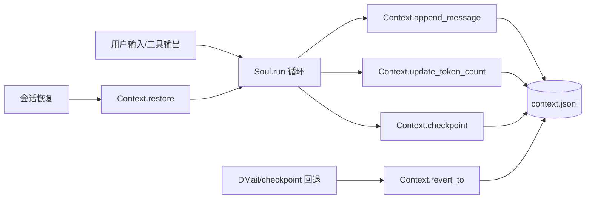
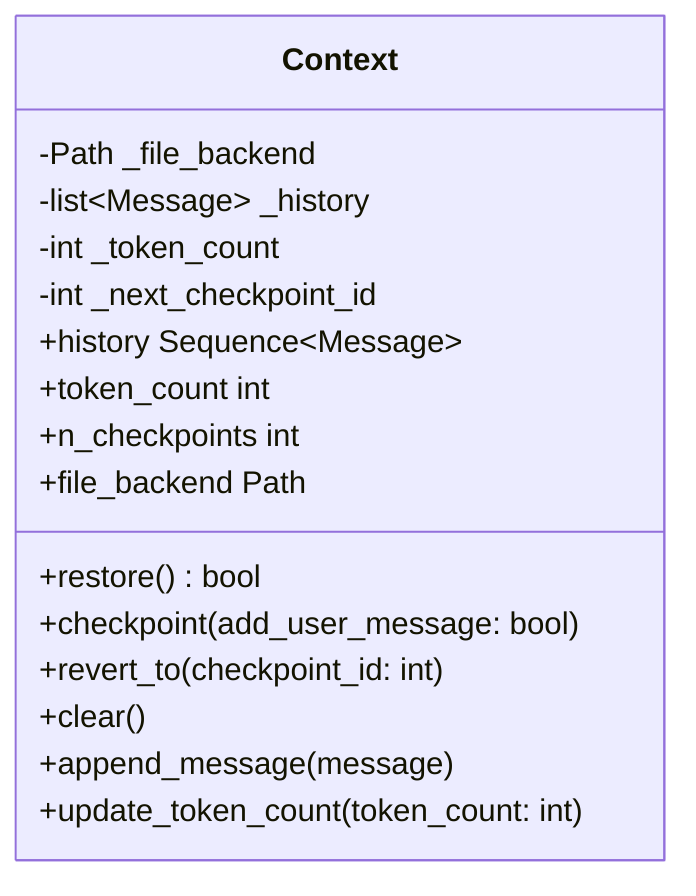
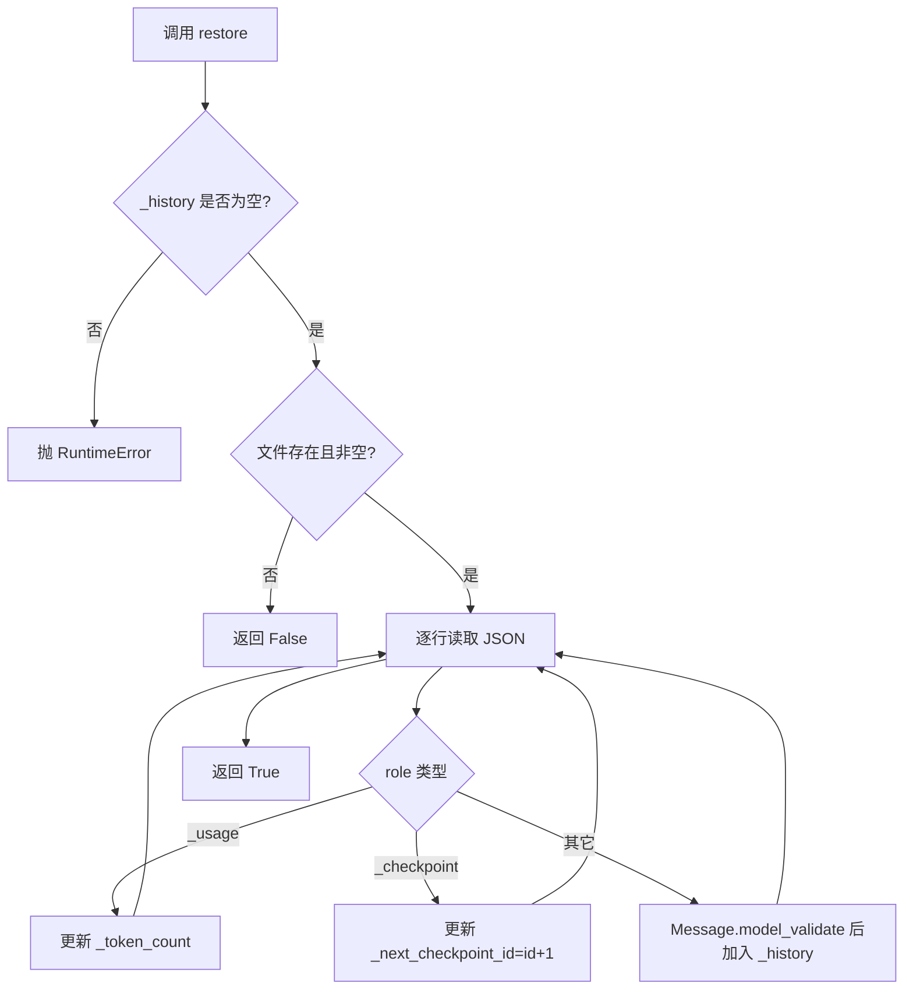
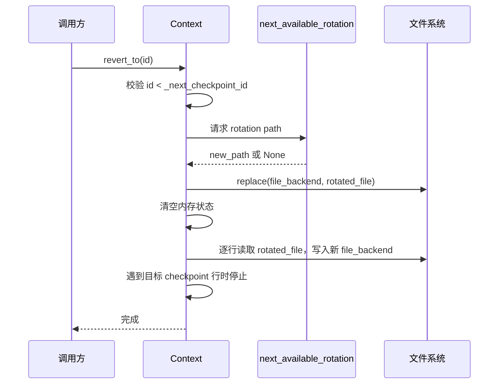
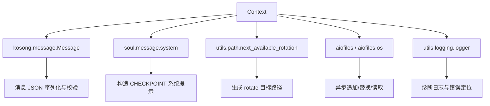

# context_persistence 模块文档

## 1. 模块定位与设计动机

`context_persistence` 是 `soul_engine` 中负责“会话上下文落盘、恢复与时间点回退”的基础模块，其核心实现只有一个类：`Context`。虽然实现体量不大，但它承载了 Agent 会话连续性的关键约束：在进程重启、长会话中断、用户触发回退（time travel）等场景下，系统必须能够把历史消息、token 统计与检查点（checkpoint）状态稳定地保存到文件，并在需要时恢复到某个确定状态。

这个模块存在的根本原因，是将“运行中的对话状态”与“内存中的临时对象”解耦。`Soul` 的运行循环会不断追加消息、更新 token 使用量、插入 checkpoint；如果仅依赖内存，一旦进程退出就会丢失状态，也无法支持 `DMail` 这类依赖 checkpoint id 的能力。`Context` 通过 JSONL（line-delimited JSON）形式把状态序列化到 `file_backend`，并提供恢复、回滚和清空操作，让上层可以把会话管理做成可重放、可撤销、可审计的持久化流程。

从系统职责分层看，`Context` 不负责“如何生成消息”，也不负责“如何压缩上下文”或“如何驱动模型调用”；它只负责消息与元信息的持久化状态机。与其它模块的关系建议参考：运行编排见 [`soul_runtime.md`](soul_runtime.md)，会话压缩见 [`conversation_compaction.md`](conversation_compaction.md)，时间回邮消息语义见 [`time_travel_messaging.md`](time_travel_messaging.md)。

---

## 2. 在整体系统中的位置



这张图反映了 `Context` 的边界：它位于运行循环与文件后端之间，承接状态写入与恢复。运行时每步都可能写入消息或 usage；在用户要求回退时，`revert_to` 会重建“截断后的上下文文件”；在新会话启动时，`restore` 将文件重建回内存视图（`_history`、`_token_count`、`_next_checkpoint_id`）。

---

## 3. 数据模型与文件格式约定

`Context` 的持久化格式是逐行 JSON，每一行表示一个事件记录。记录被分成三类：普通消息行（可被 `Message.model_validate` 解析）、`_usage` 元信息行、`_checkpoint` 元信息行。模块通过 `role` 字段判别类型，因此 `role` 在此不仅是 LLM message role，也被扩展为内部控制记录标签。



文件中的典型行示例如下：

```json
{"role":"user","content":[{"type":"text","text":"你好"}]}
{"role":"assistant","content":[{"type":"text","text":"你好，我可以帮你做什么？"}]}
{"role":"_usage","token_count":1472}
{"role":"_checkpoint","id":0}
{"role":"user","content":[{"type":"text","text":"<system>CHECKPOINT 0</system>"}]}
```

这里有一个很重要的实现约束：`_usage` 与 `_checkpoint` 会被当作控制记录，不进入 `history`；只有普通消息行会进入 `_history`。因此调用方看到的 `history` 是“对话消息视图”，不是“完整事件日志视图”。

---

## 4. 核心组件 `Context` 深入解析

## 4.1 初始化：`__init__(file_backend: Path)`

构造函数接收一个文件路径作为唯一持久化后端，并初始化三个内存状态：`_history`（消息列表）、`_token_count`（最新 token 计数）、`_next_checkpoint_id`（下一个 checkpoint id，初始为 0）。`_next_checkpoint_id` 的语义是“将被分配的下一个 id”，而不是“当前最后一个 id”，这个差异决定了 `n_checkpoints` 实际返回的是“总 checkpoint 数量”。

副作用方面，构造函数本身不触盘、不创建文件，也不自动恢复；恢复行为必须显式调用 `restore()`，这使生命周期控制交给上层编排。

## 4.2 恢复：`restore() -> bool`

`restore` 是把文件状态重放到内存状态的入口。返回 `True` 表示成功从非空文件恢复，返回 `False` 表示无可恢复内容（文件不存在或为空）。

内部流程可以概括为：先做前置检查，再逐行解析。若 `_history` 已非空则直接报错 `RuntimeError("The context storage is already modified")`，这是一个明确的“防二次恢复”保护，避免把同一文件重复 replay 导致消息重复。



参数与返回值方面，这个方法无输入参数，返回布尔值用于上层区分“恢复了已有状态”还是“本次从空状态开始”。副作用包括更新内存状态，但不会修改文件内容。

需要注意，`restore` 假设文件中每个非空行都是合法 JSON 且结构可解析。如果出现损坏行，`json.loads` 或 `Message.model_validate` 会抛异常并中止恢复；当前实现没有容错跳过机制。

## 4.3 只读属性：`history` / `token_count` / `n_checkpoints` / `file_backend`

这些属性用于暴露内部状态。`history` 的返回类型是 `Sequence[Message]`，从类型层面引导调用方按只读视角使用，但底层返回的是同一个 list 对象引用，因此“强约束只读”更多是约定而非彻底防护。`token_count` 返回最新 usage 值；`n_checkpoints` 返回 `_next_checkpoint_id`；`file_backend` 返回后端路径。

在扩展时应避免在模块外直接修改返回的可变对象，否则会绕过落盘流程导致内存与文件不一致。

## 4.4 创建检查点：`checkpoint(add_user_message: bool)`

`checkpoint` 负责生成一个单调递增的检查点 id，并写入一行 `{"role":"_checkpoint","id":...}` 到文件。写入后可选地追加一条 user message：`<system>CHECKPOINT {id}</system>`。这条消息是通过 `system(...)` 包装后作为 `Message(role="user", ...)` 追加的。

这一设计有两个目的。第一，`_checkpoint` 行用于机器可解析回退边界；第二，可选的系统包装消息用于把 checkpoint 信息显式带入模型上下文，让模型在后续 reasoning 中“知道自己处于哪个阶段”。

参数 `add_user_message` 控制是否写入这条显式消息。无返回值。副作用包括：更新 `_next_checkpoint_id`、向文件追加至少 1 行、可能向 `_history` 追加 1 条消息（取决于参数）。

## 4.5 回退：`revert_to(checkpoint_id: int)`

`revert_to` 是模块最关键也最“有破坏性”的操作：它将当前上下文回退到指定 checkpoint 之前的状态，并旋转（rotate）原文件作为历史备份。

语义上，传入的 `checkpoint_id` 是“要回退到的 checkpoint 本身”，而实现行为是“删除该 checkpoint 及其之后的所有内容”。也就是说，目标 checkpoint 对应的 `_checkpoint` 行不会保留在新文件中。



参数方面，`checkpoint_id` 从 0 开始计数。异常方面有两类：若 id 不存在抛 `ValueError`；若找不到可用 rotation 路径（例如父目录不存在）抛 `RuntimeError`。副作用包括文件重命名、新文件重写、内存状态重建。

一个容易忽略的细节是：重建时 `_token_count` 会被重放过程中的最后一条 `_usage` 覆盖，因此回退后 token 值是“截断点之前最近一次写入值”，不是实时重算值。

## 4.6 清空：`clear()`

`clear` 可以理解为“无条件清空上下文并保留备份”，实现路径与 `revert_to` 类似，也会先 rotate 旧文件，但不重放任何内容，而是直接 `touch` 一个空的新后端文件并重置内存状态。

文档字符串指出它“近似 `revert_to(0)`，但不依赖第一个 checkpoint 一定存在”，这对尚未打 checkpoint 的新会话尤为重要。异常与 rotate 失败场景同 `revert_to`，会抛 `RuntimeError`。

## 4.7 追加消息：`append_message(message: Message | Sequence[Message])`

该方法同时支持单条 `Message` 和消息序列。内部会规范化为列表后，先扩展 `_history`，再逐条写入 JSONL 文件（`exclude_none=True`）。

这种“先内存后文件”的顺序使方法在绝大多数成功路径下表现直观，但也意味着如果文件写入中途失败，内存可能已包含新增消息而文件不完整，产生短暂不一致。当前实现没有事务回滚，调用方应通过上层异常处理决定是否重建状态。

## 4.8 更新 token：`update_token_count(token_count: int)`

`update_token_count` 会覆盖当前 `_token_count` 并追加一条 `_usage` 行到文件。它不是增量累加，而是“最新值快照写入”。

这种日志式覆盖便于恢复：`restore` 只需读取最后一次 `_usage` 即可得出最新 token 计数。同时也允许审计某次会话中 token 使用增长轨迹。

---

## 5. 典型使用方式

下面给出一个常见的生命周期示例，展示如何在会话启动时恢复、运行中写入、出错时回退。

```python
from pathlib import Path
from kosong.message import Message
from kimi_cli.soul.context import Context

async def run_session():
    ctx = Context(Path("./session.context.jsonl"))

    restored = await ctx.restore()
    if not restored:
        # 首次会话可选地打一个起始 checkpoint
        await ctx.checkpoint(add_user_message=False)

    await ctx.append_message(Message(role="user", content=[{"type": "text", "text": "你好"}]))
    await ctx.update_token_count(120)
    await ctx.checkpoint(add_user_message=True)

    # ... 运行若干步骤后决定回退
    await ctx.revert_to(0)
```

如果你需要彻底清空而不是回到某个 checkpoint，优先使用 `clear()`，因为它不依赖 checkpoint 已存在。

```python
await ctx.clear()
```

在扩展实现时，推荐把 `Context` 的调用集中在单一执行协程中，避免多个协程并发写同一 `file_backend`。

---

## 6. 与其他模块的协作关系

`Context` 与 `soul_runtime` 的关系是“状态后端”与“运行编排器”的关系。`run_soul` 负责任务生命周期和 UI/Wire 协调，而 `Context` 负责把对话状态变成可恢复日志。换句话说，`run_soul` 处理“这次怎么跑”，`Context` 处理“跑过什么”。

与 `time_travel_messaging` 的关系则更直接：`DMail` 中携带 `checkpoint_id`，而这个 id 的来源和合法性判定依赖 `Context.n_checkpoints` 与 `revert_to`。因此 checkpoint id 的稳定性是该跨时消息机制可用的前提。

与 `conversation_compaction` 的协作通常发生在高上下文占用场景：压缩前后都应通过 `append_message`/`update_token_count` 维护一致记录，必要时在压缩前后设置 checkpoint，便于回退验证。关于压缩算法本身不在本模块职责内，请参考 [`conversation_compaction.md`](conversation_compaction.md)。

---

## 7. 设计取舍、边界条件与已知限制

本模块选择了非常直接的 JSONL append-only 记录方式，优点是实现简单、可读性高、恢复逻辑可线性重放；代价是文件可能持续增长，长会话下 restore 成本线性上升。系统通常需要结合 compaction 或会话轮转策略降低文件体积。

错误处理方面，当前实现对文件损坏和并发竞争的容错较弱。例如如果上下文文件被外部进程改写为非法 JSON，`restore` 会直接失败；如果两个协程同时调用 `append_message`，可能出现行交错或状态竞态。这意味着 `Context` 更适合“单 writer”模型，而不是多 writer 并发模型。

另外，`restore` 只允许在 `_history` 为空时执行。这是故意的安全阀，防止重复 replay 造成重复消息，但也要求调用方在生命周期上谨慎：一旦开始写入，就不要再对同一实例执行 restore；若需要重载，应创建新实例或先显式重置。

`revert_to` 的语义也需特别注意：目标 checkpoint 会被删除，而不是保留。这与某些系统“回到该快照并保留快照标记”的直觉不同，调用方如果希望回退后立即重新标记，可在回退成功后再次调用 `checkpoint()`。

最后，`next_available_rotation` 通过预留文件路径保证 rotate 唯一性，但它依赖父目录存在；目录缺失时会返回 `None`，最终导致 `RuntimeError`。生产环境应在会话初始化时确保 `file_backend.parent` 已创建。

---

## 8. 可扩展点与实现建议

如果你计划扩展 `Context`，最安全的方向是“增加新类型控制记录，但保持向后兼容解析”。例如新增 `{"role":"_meta", ...}` 记录时，应在 `restore` 和 `revert_to` 重放逻辑中显式处理，否则会落入 `Message.model_validate` 分支导致解析失败。

若要提升可靠性，可以考虑引入写前日志或临时文件 + 原子替换策略，降低“内存更新成功但落盘失败”的不一致窗口。若要提升性能，可把 restore 改为带索引恢复，或在固定间隔输出状态快照，以避免每次都线性 replay。

如果目标是支持多协程写入，建议在 `Context` 内部增加异步锁（如 `asyncio.Lock`）并统一所有写操作路径；更进一步可把写入职责抽象成单独 writer 任务，通过队列串行化事件。

---

## 9. 关键依赖与协作契约

`Context` 本身并不依赖复杂基础设施，但它对几个外部组件有非常明确的协作契约。`Message`（来自 `kosong.message`）是消息序列化/反序列化的统一模型，`Context` 通过 `model_dump_json()` 与 `model_validate()` 保证文件记录与运行时对象一致；`system()`（来自 `soul.message`）用于构造 checkpoint 提示消息，确保注入内容符合系统消息块约定；`next_available_rotation()`（来自 `utils.path`）负责生成不冲突的轮转文件名，是 `revert_to` 与 `clear` 的安全前提；`aiofiles` / `aiofiles.os` 则提供异步文件 I/O，使上下文写入可以融入异步运行循环而不阻塞主流程。



这张依赖图的重点在于：`Context` 将“状态语义”与“基础能力”分离。消息结构由 `Message` 决定，路径轮转策略由 `next_available_rotation` 决定，I/O 模型由 `aiofiles` 决定，因此在扩展本模块时，优先保持这些边界不变，通常比在 `Context` 内部堆叠更多逻辑更稳妥。

## 10. 运维与调试建议

在真实运行环境中，`context_persistence` 最常见的问题不是业务逻辑错误，而是文件系统层面的偶发异常。建议在会话初始化阶段主动检查 `file_backend.parent` 的存在性与可写权限，并在每次 `revert_to` / `clear` 后记录 rotate 后的文件路径，便于事后审计和问题追踪。

当出现“恢复失败”时，排查顺序建议从文件完整性开始：先检查 JSONL 是否存在被截断的半行，再检查是否引入了未被 `restore` 识别的新控制记录类型。若你在上层引入并发调用（例如多个任务共用同一 `Context`），请优先验证是否存在写入交错；必要时将所有写操作集中到单协程串行执行。


---

## 11. 小结


`context_persistence` 用一个简洁的 `Context` 类实现了会话状态的持久化闭环：可恢复、可打点、可回退、可清空。它通过 JSONL 事件日志把运行态从内存解耦出来，为 `soul_engine` 提供了可持续会话与 time-travel 能力的基础设施。理解这个模块时最关键的是掌握三点：第一，控制记录（`_usage`/`_checkpoint`）与普通消息分层；第二，回退通过 rotate + 截断重放实现；第三，当前实现默认单 writer、弱容错，调用方需在生命周期与并发上遵守契约。
