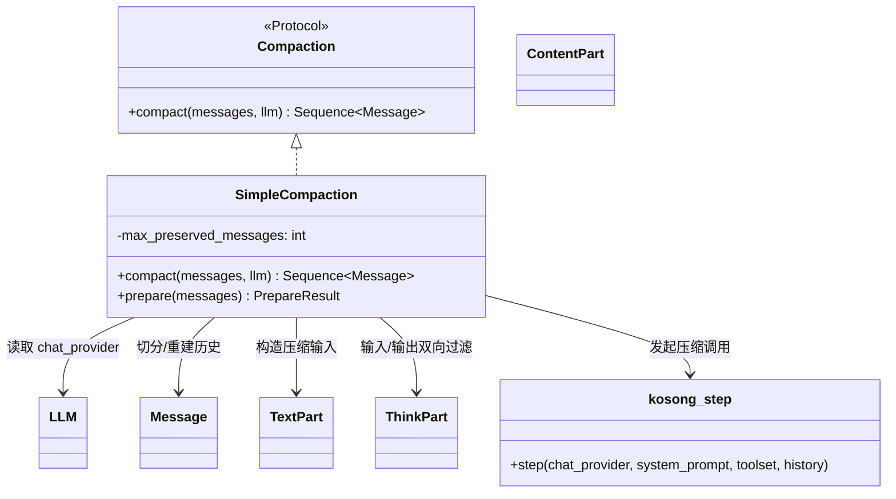
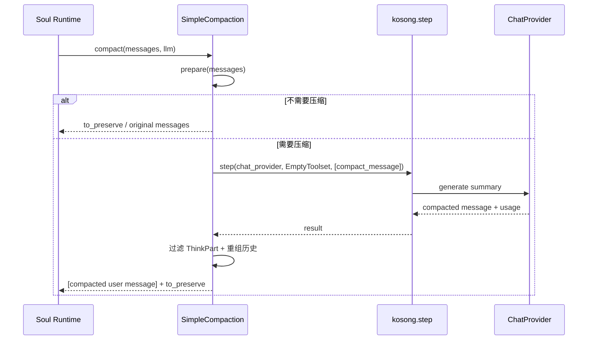
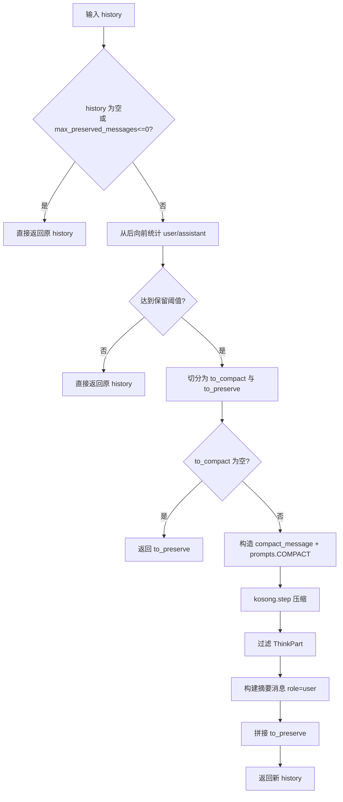

# conversation_compaction 模块文档

## 模块定位与存在价值

`conversation_compaction` 对应 `src/kimi_cli/soul/compaction.py`，是 `soul_engine` 中专门处理“长会话上下文收缩”的策略模块。它解决的核心问题并不是“如何回答用户问题”，而是“在历史消息持续增长时，如何在上下文窗口、成本和可用语义之间取得平衡”。在长链路任务（例如多轮代码修改、连续工具调用、复杂问答）中，如果不做上下文压缩，推理输入会越来越长，最终触发窗口上限、延迟上升或 token 成本失控。

该模块的设计非常克制：先定义一个稳定的协议接口 `Compaction`，再提供一个默认实现 `SimpleCompaction`。默认实现不做本地算法压缩，而是复用既有 LLM 调用基础设施（`kosong.step`）执行摘要式压缩。这样做的设计收益是：调用方只关心“给我一个新消息序列”，无需了解压缩实现细节；同时后续可以无痛替换为更复杂策略（token-aware、结构化摘要、多层压缩）而不破坏运行时主流程。

在系统关系上，它是 [soul_runtime.md](soul_runtime.md) 与 [context_persistence.md](context_persistence.md) 之间的“缓冲层”：上游不断累积历史，下游需要可控输入，compaction 负责把冗长旧历史重写为更短的可消费上下文。

---

## 核心组件详解

### `Compaction` 协议

`Compaction` 是一个 `@runtime_checkable` 的 `Protocol`：

```python
async def compact(self, messages: Sequence[Message], llm: LLM) -> Sequence[Message]
```

它定义了模块唯一必需能力：输入原始历史消息和当前 `LLM`，输出一组新的历史消息。这里最重要的不是函数本身，而是“稳定契约”：`Soul` 或其他调用者只依赖协议，不依赖实现类。`runtime_checkable` 让它除静态类型检查外，还可在运行时进行协议兼容判断，便于插件化注入。

参数与返回语义如下：

- `messages: Sequence[Message]`：完整历史输入，可能包含 `system/user/assistant/tool` 等角色消息，以及多种 `ContentPart`。
- `llm: LLM`：用于访问 `llm.chat_provider`，执行一次压缩模型调用。
- 返回值 `Sequence[Message]`：新的历史序列，可能是原样返回，也可能是“压缩摘要 + 最近原消息”的重组结果。

异常语义由底层 provider 决定。源码注释明确指出可能抛出 `ChatProviderError`（来自聊天提供方链路）。

### `SimpleCompaction` 默认实现

`SimpleCompaction` 是当前模块唯一实现，使用“保留最近对话 + 压缩旧前缀”的策略。构造函数：

```python
def __init__(self, max_preserved_messages: int = 2) -> None
```

`max_preserved_messages` 不是“总消息条数阈值”，而是“最近 `user/assistant` 角色消息保留数量”。这点非常关键：`tool` 或 `system` 消息不会增加该计数，但会随切分结果一起进入保留段或压缩段。

---

## 内部算法与执行机制

### `prepare(messages)`：切分与压缩输入构造

`prepare()` 是策略核心，返回 `PrepareResult(compact_message, to_preserve)`：

1. 当 `messages` 为空，或 `max_preserved_messages <= 0` 时，不压缩，直接返回原消息为 `to_preserve`。
2. 否则从后向前扫描消息，统计 `role in {"user", "assistant"}` 的条目。
3. 当计数达到阈值时记录切分点 `preserve_start_index`。
4. `to_compact = history[:preserve_start_index]`，`to_preserve = history[preserve_start_index:]`。
5. 若 `to_compact` 为空，仍不压缩（避免无意义调用）。
6. 若需要压缩，构造一条新的 `compact_message(role="user")`，把每条待压缩消息序列化为：
   - `## Message N`
   - `Role: <role>`
   - `Content:`
   - 原始内容块（过滤 `ThinkPart`）
7. 最后在 `compact_message` 末尾附加 `prompts.COMPACT`，提示模型执行上下文压缩。

这套机制的含义是：模块不直接摘要对象结构，而是先把历史“显式编排”为可读文本+原内容块，再交由模型处理。

### `compact(messages, llm)`：调用 LLM 并重组历史

`compact()` 先调用 `prepare()` 决定是否压缩：

- 若 `compact_message is None`，直接返回 `to_preserve`。
- 若需要压缩，调用：

```python
result = await kosong.step(
    chat_provider=llm.chat_provider,
    system_prompt="You are a helpful assistant that compacts conversation context.",
    toolset=EmptyToolset(),
    history=[compact_message],
)
```

实现细节中有三点值得关注：

第一，`EmptyToolset()` 明确禁用工具调用，防止压缩任务意外进入工具链。第二，若 `result.usage` 存在，会记录 input/output token 到日志，便于成本观测。第三，输出重组时再次过滤 `ThinkPart`，并在最前面插入一段系统提示内容（通过 `system(...)` 生成 `ContentPart`），然后把压缩结果封装成一条 `Message(role="user")`，再拼接 `to_preserve`。

最终输出结构是：

```text
[ 压缩摘要消息(role=user) ] + [ 最近保留的原始消息序列 ]
```

---

## 架构、依赖与数据流



这张图反映出该模块是“策略编排层”而不是“推理执行层”。模型通信、重试、provider 兼容性等职责位于 [kosong_chat_provider.md](kosong_chat_provider.md) 与 [kosong_core.md](kosong_core.md) 对应能力中。



时序图体现了一个重要边界：`SimpleCompaction` 不做 provider 级错误恢复，异常默认向上传播给运行时。



---

## 对外使用方式

最常见用法是在推理前判断历史是否过长，然后触发 compaction：

```python
from kimi_cli.soul.compaction import SimpleCompaction

compaction = SimpleCompaction(max_preserved_messages=2)
new_history = await compaction.compact(messages=history, llm=llm)
```

如果你在 `Soul` 主循环中集成，一般会将 `new_history` 替换原历史，再继续后续 `step`。建议将 compaction 触发条件与 token 预算联动，而不是固定轮次触发。

---

## 可配置行为与扩展策略

当前显式配置项只有 `max_preserved_messages`，但其行为影响很大：

- 值越小：压缩更激进，成本更低，但近期细节可能损失。
- 值越大：近期语义更完整，但压缩收益下降。

扩展时建议保留 `Compaction` 协议不变，自定义实现类即可。一个最小替换示例：

```python
from typing import Sequence
from kosong.message import Message
from kimi_cli.llm import LLM

class NoopCompaction:
    async def compact(self, messages: Sequence[Message], llm: LLM) -> Sequence[Message]:
        return messages
```

实践中更有价值的扩展方向包括：按 token 精确切分、结构化摘要模板（任务目标/约束/已完成/未决项）、失败后自动降级、压缩质量评估与回放抽检。

---

## 边界条件、错误条件与限制

`conversation_compaction` 的行为并非“无损压缩”，使用时需要理解以下事实。

第一，`ThinkPart` 会在输入与输出两端被过滤。这是刻意的安全与噪声控制，但会导致依赖内部思维内容的场景信息缺失。

第二，异常不会在模块内吞掉。`kosong.step` 失败（网络、provider 限流、认证问题、模型错误）时，异常向上传播，调用者需要在运行时层做重试、熔断或回退。

第三，源码内含 `TODO: set max completion tokens`，说明当前压缩调用没有专门 completion 上限保护。若输入很长、模型倾向冗长输出，仍可能产生较高成本。

第四，压缩结果被包装成 `role="user"` 消息，这是一种“语义注入”选择，可能改变后续模型对发言归属的理解。如果你的策略强依赖严格 role 语义，应该考虑替代封装方式。

第五，该实现没有事实一致性校验。摘要可能遗漏边界条件、参数默认值或中间决策，在高精度任务中建议配合结构化约束与关键字段回查。

---

## 与其他模块文档的阅读路径

为了避免重复，建议按以下顺序联读：先看 [soul_runtime.md](soul_runtime.md) 理解 compaction 在会话生命周期中的触发点；再看 [context_persistence.md](context_persistence.md) 理解压缩前后历史如何存取与回放；最后看 [kosong_chat_provider.md](kosong_chat_provider.md) 与 [kosong_core.md](kosong_core.md) 理解底层调用语义、usage 数据与错误来源。

---

## 维护者速记

`conversation_compaction` 可以被看作“上下文重写器”：它通过协议隔离策略、通过默认实现复用现有 LLM 栈、通过保留近邻消息降低语义损失。若你要改它，优先保持 `Compaction` 接口稳定，把复杂度放在实现类内部，这样对 `Soul` 主流程的兼容性最好。