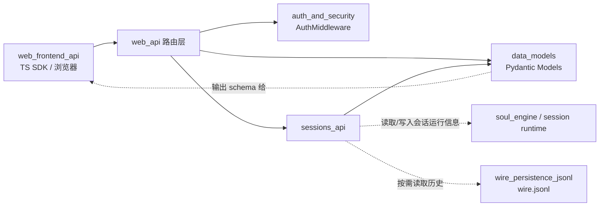
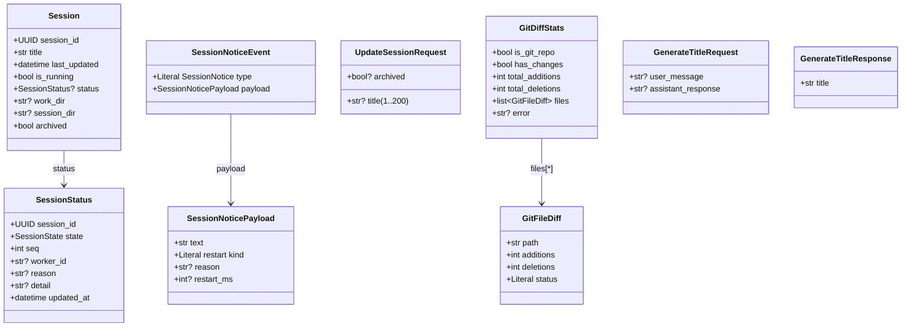
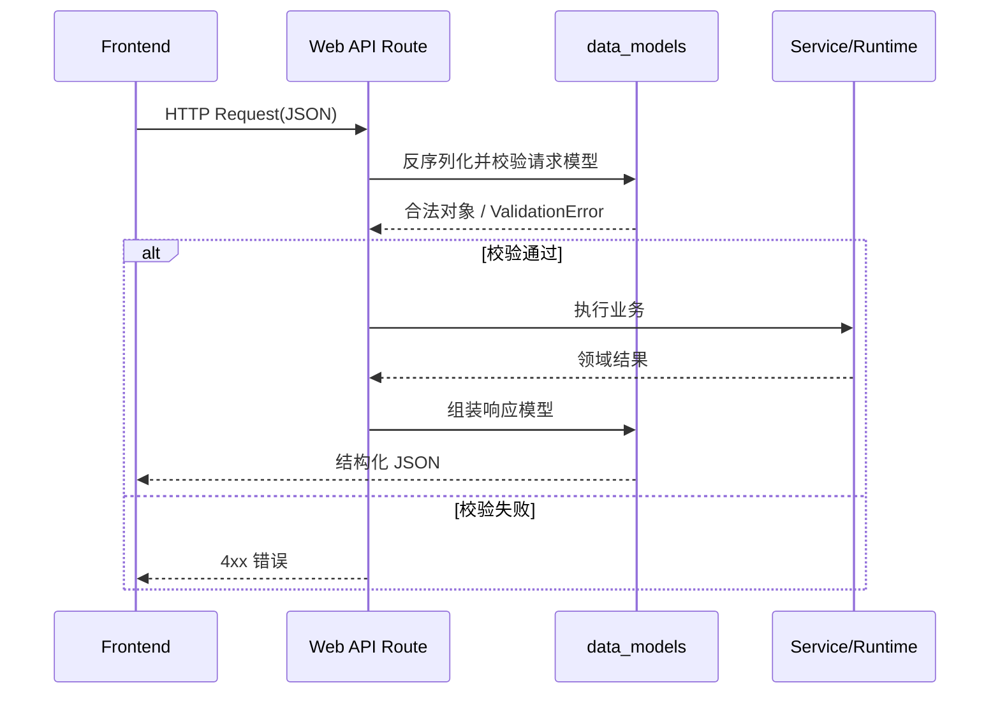
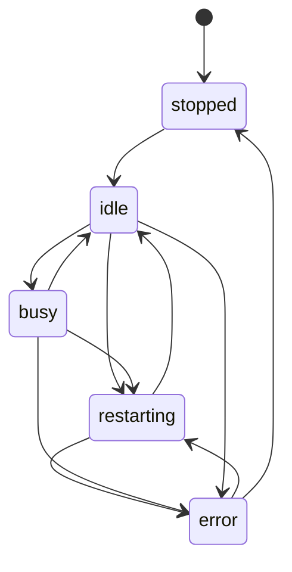

# data_models 模块文档

## 概述：这个模块做什么、为什么存在

`data_models`（实现位于 `src/kimi_cli/web/models.py`）是 `web_api` 子系统的**数据契约层**。它不处理路由分发、不做鉴权，也不直接执行会话运行逻辑；它专门定义 Web UI 与后端 API 之间交换的数据结构，并借助 Pydantic 统一完成类型约束、输入校验和序列化。

在这个项目里，很多能力都跨层协作：会话运行状态来自 runtime，历史消息来自 wire 持久化，前端通过 OpenAPI/SDK 消费接口。如果没有一个稳定的数据模型层，路由实现会变成“随手拼 dict”，前端也会因为字段漂移而频繁联调失败。`data_models` 的价值，就是把这些对象固化成明确的 schema，让“字段含义、可空性、枚举范围、校验规则”成为可维护、可演进的系统资产。

从模块树看，它是 `web_api` 下的基础子模块，并被 `sessions_api`、部分状态推送逻辑、以及前端 API 客户端间接依赖。建议把它当成“协议中心”，而不是“业务中心”。业务可以变化，但协议应尽量稳定。

---

## 架构位置与依赖关系



这张图的重点是：`data_models` 位于 API 的“边界层”位置。路由层在入站时用它校验请求体，在出站时用它规范响应体。运行时和持久化层可以继续保持内部结构，不需要直接暴露给前端。

如果你正在看会话创建/分叉等 API 请求体，请参考 [sessions_api.md](sessions_api.md)；如果你在排查历史回放与 `wire.jsonl`，请参考 [wire_persistence_jsonl.md](wire_persistence_jsonl.md)。本文聚焦于 `web/models.py` 中定义的通用模型。

---

## 模型总览与组合关系



从职责上可以分成四组：会话状态（`Session`/`SessionStatus`/`SessionNoticeEvent`）、会话更新输入（`UpdateSessionRequest`）、Git 摘要（`GitDiffStats`/`GitFileDiff`）、以及标题生成（`GenerateTitleRequest`/`GenerateTitleResponse`）。这套分组基本覆盖了 Web UI 会话页的主数据面。

---

## 核心组件详解

## 1) `SessionStatus`

`SessionStatus` 描述“某个会话在某个时刻的运行状态快照”。

`state` 使用 `SessionState = Literal["stopped", "idle", "busy", "restarting", "error"]`，这意味着后端只允许上述 5 种状态值。前端可以据此做稳定映射（例如颜色、按钮可用性、提示文案），不会因为自由字符串导致分支爆炸。

`seq` 是一个很关键但容易忽略的字段。它是单调递增序号，用于处理状态更新乱序问题。网络抖动下，前端可能先收到较新的状态，再收到较旧状态；如果不比较 `seq`，界面会“回跳”。

字段说明：
- `session_id: UUID`：状态所属会话。
- `state: SessionState`：运行态枚举。
- `seq: int`：单调序号（越大越新）。
- `worker_id: str | None`：处理该会话的 worker 标识。
- `reason: str | None`：状态切换原因。
- `detail: str | None`：调试细节。
- `updated_at: datetime`：快照时间。

示例：

```json
{
  "session_id": "2f87f9c2-4e4d-4e8d-b5ad-2eb9e0d6f52a",
  "state": "restarting",
  "seq": 108,
  "worker_id": "worker-a1",
  "reason": "config updated",
  "detail": "reload default_model",
  "updated_at": "2026-02-27T10:30:12.120000Z"
}
```

## 2) `Session`

`Session` 是 Web UI 的会话主对象，聚合“展示元数据 + 运行态摘要”。

这里有一个设计取舍：同时保留 `is_running`（布尔）和 `status`（结构化对象）。`is_running` 适合会话列表的快速展示；`status` 适合详情页或状态面板。二者不是严格冗余关系，调用方应允许 `status` 为空但 `is_running` 有值。

字段说明：
- `session_id: UUID`：会话主键。
- `title: str`：会话标题（通常由历史推导或用户更新）。
- `last_updated: datetime`：会话最后更新时间。
- `is_running: bool=False`：是否运行中。
- `status: SessionStatus | None=None`：运行态详情（可缺省）。
- `work_dir: str | None=None`：工作目录。
- `session_dir: str | None=None`：会话目录。
- `archived: bool=False`：是否归档。

## 3) `SessionNoticePayload` / `SessionNoticeEvent`

这组模型用于前端通知事件。当前 `kind` 仅允许 `"restart"`，`type` 固定为 `"SessionNotice"`，典型用于事件总线中做 discriminator。

这是一种可扩展事件壳：即使目前只有 restart 通知，后续新增 `maintenance`、`quota_warning` 等也可以沿用相同包装结构，保持兼容。

字段说明：
- `SessionNoticePayload.text`：展示文案。
- `SessionNoticePayload.kind`：通知类型（当前仅 `restart`）。
- `SessionNoticePayload.reason`：触发原因。
- `SessionNoticePayload.restart_ms`：预估重启耗时。
- `SessionNoticeEvent.type`：事件类型标签（固定值）。
- `SessionNoticeEvent.payload`：通知载荷。

## 4) `UpdateSessionRequest`

这个模型表达“部分更新（PATCH）语义”。字段都可选，`None` 表示“本次请求不改这个字段”。

`title` 有显式边界：`min_length=1`、`max_length=200`。这阻止了空标题和极端长标题进入系统，从而减少前端渲染与存储层异常。

字段说明：
- `title: str | None`：新标题。
- `archived: bool | None`：归档状态切换。

典型服务端应用方式：

```python
if req.title is not None:
    session.title = req.title
if req.archived is not None:
    session.archived = req.archived
```

## 5) `GitFileDiff` / `GitDiffStats`

这组模型描述工作目录 Git 变更摘要，供 UI 展示“本地改动概览”。

`GitFileDiff` 表示单文件维度；`GitDiffStats` 是仓库/目录级聚合。一个关键点是：`GitDiffStats` 允许 `error` 与统计字段共存，保证返回结构稳定，即使采集失败前端也能按同一 schema 渲染错误态。

字段说明：
- `GitFileDiff.path`：文件路径。
- `GitFileDiff.additions`：新增行数。
- `GitFileDiff.deletions`：删除行数。
- `GitFileDiff.status`：`added | modified | deleted | renamed`。
- `GitDiffStats.is_git_repo`：是否 Git 仓库。
- `GitDiffStats.has_changes=False`：是否有未提交更改。
- `GitDiffStats.total_additions=0`：总新增。
- `GitDiffStats.total_deletions=0`：总删除。
- `GitDiffStats.files=[]`：文件列表。
- `GitDiffStats.error=None`：错误信息。

## 6) `GenerateTitleRequest` / `GenerateTitleResponse`

该模型用于“自动生成会话标题”。请求中的 `user_message` 和 `assistant_response` 都是可选；如果都不提供，后端会尝试从 `wire.jsonl` 自动读取上下文。

这让接口同时支持两种调用模式：
1. 显式传入文本片段（上层业务自己决定上下文）。
2. 只传空请求，让后端回溯历史（降低调用方复杂度）。

字段说明：
- `GenerateTitleRequest.user_message: str | None`
- `GenerateTitleRequest.assistant_response: str | None`
- `GenerateTitleResponse.title: str`

---

## 处理流程：入站校验与出站规范化



这个过程体现了模型层的真正价值：路由层不必手写大量 `if` 校验，也不必手写 JSON 拼装逻辑。模型使入参与出参都“类型化”。

---

## 状态流转语义（基于 `SessionState`）



注意：这张状态图是语义上的推荐理解，而不是代码里硬编码的状态机。`models.py` 只定义“允许出现的状态值”，并不直接约束转移合法性。转移规则通常在 runtime/service 层实现。

---

## 使用示例

### 示例 1：构建 `Session` 响应

```python
from datetime import datetime, UTC
from uuid import uuid4
from kimi_cli.web.models import Session, SessionStatus

sid = uuid4()
status = SessionStatus(
    session_id=sid,
    state="idle",
    seq=7,
    updated_at=datetime.now(UTC),
)

payload = Session(
    session_id=sid,
    title="重构计划讨论",
    last_updated=datetime.now(UTC),
    is_running=True,
    status=status,
    work_dir="/workspace/project-a",
    session_dir="/workspace/.kimi/sessions/abc",
)
```

### 示例 2：最小标题生成请求

```python
from kimi_cli.web.models import GenerateTitleRequest

# 交给后端自动从 wire.jsonl 推断上下文
req = GenerateTitleRequest()
```

### 示例 3：显式标题生成上下文

```python
req = GenerateTitleRequest(
    user_message="请帮我优化这个接口",
    assistant_response="建议先收敛 DTO，再加回归测试。",
)
```

---

## 边界条件、错误场景与限制

第一，`UpdateSessionRequest.title=""` 会触发校验错误（因为 `min_length=1`）。如果你的产品语义需要“清空标题”，应显式设计单独字段或约定，不要复用空字符串。

第二，`GenerateTitleRequest` 即使两个字段都为空也可通过模型校验，但业务仍可能失败，例如会话历史不存在、`wire.jsonl` 缺失、或读取权限不足。这类失败应由 API/service 层返回可解释错误。

第三，`Session.status` 是可空字段。前端必须写空值分支，不能假设每条会话都附带实时状态。

第四，`GitDiffStats.is_git_repo=False` 与 `error!=None` 含义不同：前者通常是“正常非 Git 目录”，后者是“采集过程失败”。UI 上应该分开展示。

第五，`GitDiffStats.files` 在代码中采用 `Field(default=[])`。在 Pydantic 场景通常可工作，但从工程一致性角度，后续若重构建议优先 `default_factory=list`，可读性更强，也避免团队误解可变默认值语义。

---

## 扩展与演进建议

当你要扩展该模块时，建议先定义协议，再改业务：先在 `models.py` 增加字段/模型，确认默认值与可空性策略，再去修改路由和前端消费逻辑。

如果新增枚举值（例如 `SessionState` 增加新状态、`SessionNoticePayload.kind` 增加新通知类型），请同步更新前端状态映射和 SDK 类型声明，避免“后端已发出、前端不识别”的灰色故障。

对于向后兼容，新增字段优先给默认值（`None` 或安全默认），并保证旧客户端发送旧请求时不报错。若需要破坏性变更，建议通过版本化接口而非直接覆盖字段语义。

---

## 与其他文档的关系

- 会话 API 入参（创建、分叉）和路由行为：见 [sessions_api.md](sessions_api.md)
- Web API 全局结构：见 [web_api.md](web_api.md)
- 鉴权与安全边界：见 [auth_and_security.md](auth_and_security.md)
- 历史消息持久化与回放（标题生成回退依赖）：见 [wire_persistence_jsonl.md](wire_persistence_jsonl.md)
- 前端 SDK 调用侧：见 [web_frontend_api.md](web_frontend_api.md)

---

## 总结

`data_models` 虽然代码体量不大，但它是 `web_api` 的协议基石。它把会话、状态、通知、Git 统计与标题生成等核心对象沉淀为稳定 schema，直接决定了前后端协作成本与 API 演进质量。维护这个模块时，最重要的不是“字段越多越好”，而是“语义清晰、兼容可控、边界明确”。