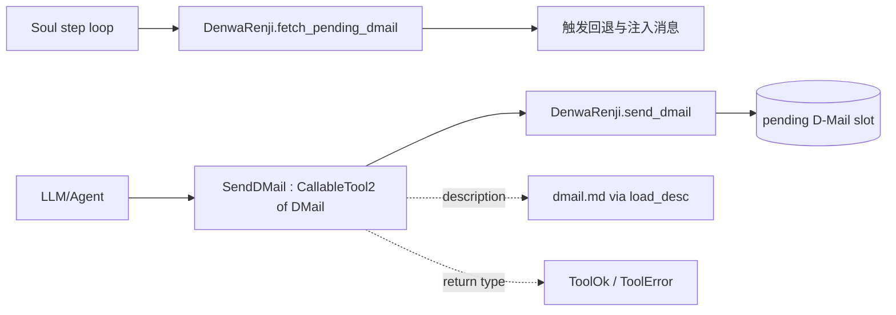
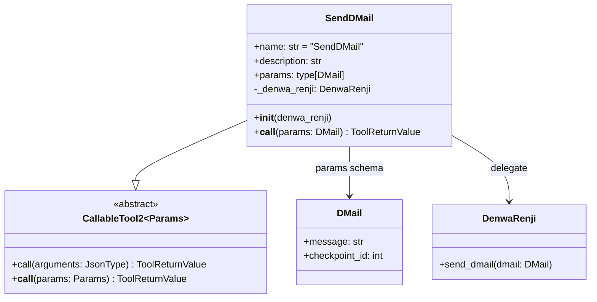
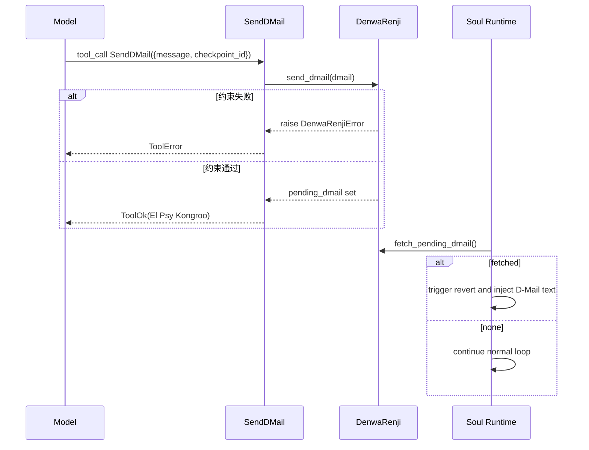

# dmail_time_travel_signal 模块文档

## 1. 模块简介与设计动机

`dmail_time_travel_signal` 模块对应实现位于 `src/kimi_cli/tools/dmail/__init__.py`，核心组件是 `SendDMail`。这个模块的职责不是直接执行“时间回溯”，而是把 Agent 的“回到某个历史 checkpoint 并给过去自己留消息”的意图，以标准 Tool 调用的方式安全地登记到运行时。

它存在的原因可以概括为两点。第一，复杂任务中经常会出现“后知后觉”的情况：模型在读完大量无关内容、尝试多轮失败后，才发现应当回到更早分叉点重新推进。第二，系统希望把这种“回退控制信号”纳入统一的 tool 协议（参数校验、错误返回、可观测日志），而不是让运行时硬编码特殊分支。`SendDMail` 因此扮演了一个桥接层：向上暴露为可调用工具，向下委托给 `DenwaRenji` 做约束检查与暂存。

从分层上看，它属于 `tools_misc`，但实际语义强依赖 `time_travel_messaging`（`DenwaRenji` / `DMail`）与 `soul_runtime` 的 step loop。想理解完整闭环，建议同时阅读 [`time_travel_messaging.md`](time_travel_messaging.md) 与 [`soul_runtime.md`](soul_runtime.md)。

---

## 2. 架构位置与依赖关系



上图体现了一个重要事实：`SendDMail` 只负责“登记请求”，并不直接做 `Context.revert_to(...)`。真正回退是在后续 `Soul` 处理 pending dmail 时完成。也就是说，工具调用成功并不等于上下文已经立即被重写。



`SendDMail` 利用了 `CallableTool2` 的通用能力：自动参数校验、统一返回结构、工具元数据导出。业务层只需要关心把 `DMail` 送入 `DenwaRenji`，并把异常翻译成 `ToolError`。

---

## 3. 核心组件详解：`SendDMail`

### 3.1 类型签名与静态字段

`SendDMail` 定义如下语义约束：

- `name = "SendDMail"`：工具注册名。LLM 侧调用时依赖该名字匹配。
- `description = load_desc(.../dmail.md)`：工具说明从 Markdown 文件加载（支持 Jinja2 模板渲染）。这让 prompt 描述与代码解耦。
- `params = DMail`：参数模型直接复用 `time_travel_messaging` 中的 `DMail`（`message` + `checkpoint_id`）。

这种写法的价值是把“协议定义”保持单一来源。工具 schema 与运行时消息结构都使用同一个 Pydantic model，减少字段漂移风险。

### 3.2 构造函数 `__init__(denwa_renji: DenwaRenji)`

构造函数只做依赖注入，把运行时维护的 `DenwaRenji` 实例保存到 `self._denwa_renji`。这意味着：

1. `SendDMail` 自身不持有 checkpoint 计数，也不存储 pending 消息；
2. 它是无业务状态的薄封装，状态全部集中在 `DenwaRenji`；
3. 测试时可通过注入 mock/fake `DenwaRenji` 覆盖成功与失败路径。

### 3.3 调用函数 `async __call__(params: DMail) -> ToolReturnValue`

这是工具的业务入口，逻辑非常短，但语义点很多。

首先，函数调用 `self._denwa_renji.send_dmail(params)`。如果底层抛出 `DenwaRenjiError`（例如 checkpoint 不存在、已有 pending dmail），会被捕获并转换为 `ToolError`，返回给工具框架。`ToolError` 内容包含：

- `output=""`（不给模型输出正文）
- `message="Failed to send D-Mail. Error: ..."`
- `brief="Failed to send D-Mail"`

如果没有抛错，则返回 `ToolOk`。这里的返回文案刻意“反直觉”：

- `message` 是 *“If you see this message, the D-Mail was NOT sent successfully...”*
- `brief` 是 *“El Psy Kongroo”*

这个设计不是 bug，而是策略性提示：它提醒模型不要把这条 `ToolOk.message` 视为对用户的最终确认，因为后续流程仍可能因审批拒绝、step 中断等原因导致整体事务不生效。换句话说，`ToolOk` 代表“登记动作成功执行到当前阶段”，不是“最终世界线已切换”。

---

## 4. 参数、返回值与副作用

### 4.1 输入参数 `DMail`

`SendDMail` 的参数模型来自 `src.kimi_cli.soul.denwarenji.DMail`：

```python
class DMail(BaseModel):
    message: str
    checkpoint_id: int = Field(ge=0)
```

`checkpoint_id` 需要是已有 checkpoint 的编号。最终合法性不仅依赖 `ge=0`，还依赖 `DenwaRenji` 当前持有的 `_n_checkpoints` 上限。

### 4.2 返回值 `ToolReturnValue`

函数总是返回 `ToolReturnValue` 子类：

- 成功：`ToolOk(is_error=False, ...)`
- 失败：`ToolError(is_error=True, ...)`

这与 `kosong_tooling` 约定一致，便于运行时统一处理、展示和日志记录。

### 4.3 副作用

`SendDMail` 本身无 I/O，但有间接状态副作用：成功时会让 `DenwaRenji` 的 `_pending_dmail` 从 `None` 变为 `DMail`。这个状态稍后会被 `Soul` 消费并清空。

---

## 5. 端到端执行流程



在运行语义上，`SendDMail` 与 `Soul` 之间存在“延迟生效”关系：工具调用阶段只是写入信号，真正上下文改写在后处理阶段发生。对维护者来说，这解释了为什么工具层必须返回结构化状态，而不是直接抛出控制流异常给最外层。

---

## 6. 使用方式与集成示例

### 6.1 在 toolset 中注册

```python
from kimi_cli.soul.denwarenji import DenwaRenji
from kimi_cli.tools.dmail import SendDMail

# 通常由运行时创建并在整个会话生命周期复用
renji = DenwaRenji()

# 注入到工具实例
send_dmail = SendDMail(denwa_renji=renji)

# 再交给 Toolset / Soul 的工具注册流程
# toolset.register(send_dmail.base, send_dmail.call)  # 伪代码
```

### 6.2 模型侧调用参数示例

```json
{
  "message": "已验证该大文件只有第 120~180 行相关，请只读取该区段并继续。",
  "checkpoint_id": 3
}
```

消息内容建议写成“给过去自己的行动指令 + 已知事实摘要”，而不是给最终用户的解释性文本。`dmail.md` 也明确强调了这一点。

---

## 7. 错误条件、边界与常见陷阱

`SendDMail` 的错误来源主要来自 `DenwaRenji`，但在工具层会统一表现为 `ToolError`。典型失败包括：

- 当前已有一条 pending dmail（一次只能挂起一条）；
- `checkpoint_id` 为负数（通常在 Pydantic 层就会被拦截）；
- `checkpoint_id` 超出当前 checkpoint 范围。

一个非常容易误解的点是：**工具返回 `ToolOk` 仍不代表最终一定发生了回退**。如果后续步骤中存在审批型工具被拒绝，运行时可能中断并清理 pending dmail，导致这次信号不被应用。这也是成功消息文案看起来“唱反调”的根本原因。

另一个关键限制是系统当前只回退对话上下文，不回退文件系统与外部副作用。发送 D-Mail 时必须在 `message` 里清楚说明“哪些实际改动已经存在”，否则过去的自己可能重复执行写操作或做出错误假设。相关背景可参考 [`time_travel_messaging.md`](time_travel_messaging.md)。

---

## 8. 可扩展性与维护建议

从实现风格看，`SendDMail` 是典型“薄工具适配器”。扩展时应尽量维持这个边界：

- 工具层继续负责协议转换（参数/异常/返回值）；
- 业务约束放在 `DenwaRenji`；
- 回退执行放在 `Soul` 与 `Context`。

如果未来要增加能力（例如多 D-Mail 队列、优先级、审计元数据），优先修改 `DMail`/`DenwaRenji` 契约，再让 `SendDMail` 透传，而不要在工具层堆积状态逻辑。这样可以保持模块职责清晰，避免工具实现与运行时控制流互相缠绕。

从测试角度，建议至少覆盖三类用例：成功登记、约束失败转 `ToolError`、以及“成功登记但后续未生效”的集成场景。最后一类虽然不属于 `SendDMail` 单元逻辑，却是用户感知最强的行为差异。
