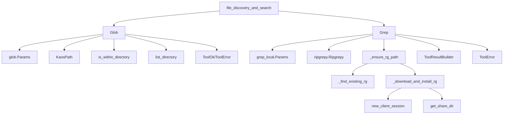
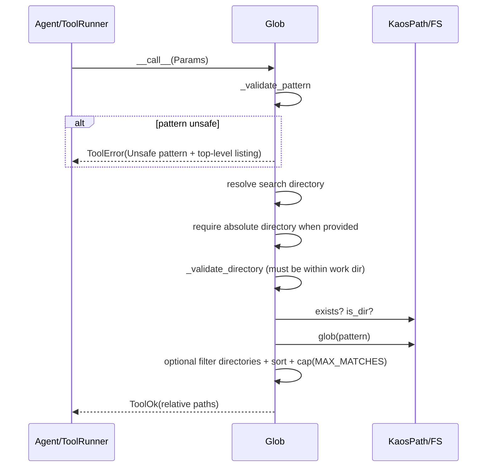
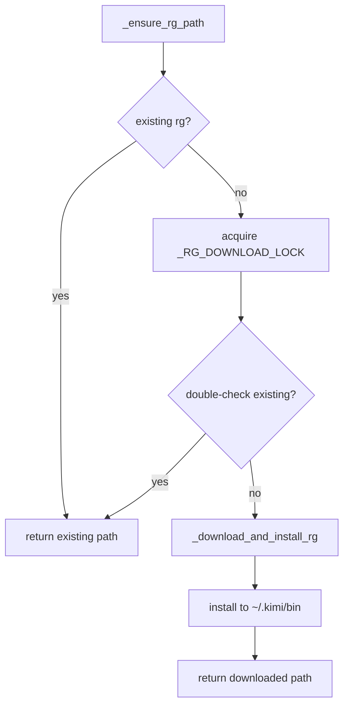
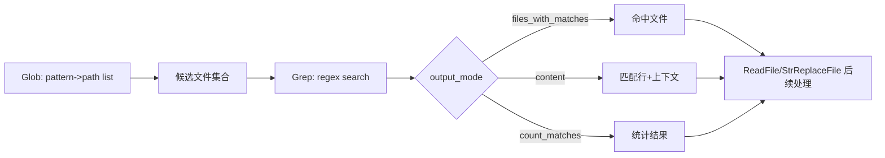
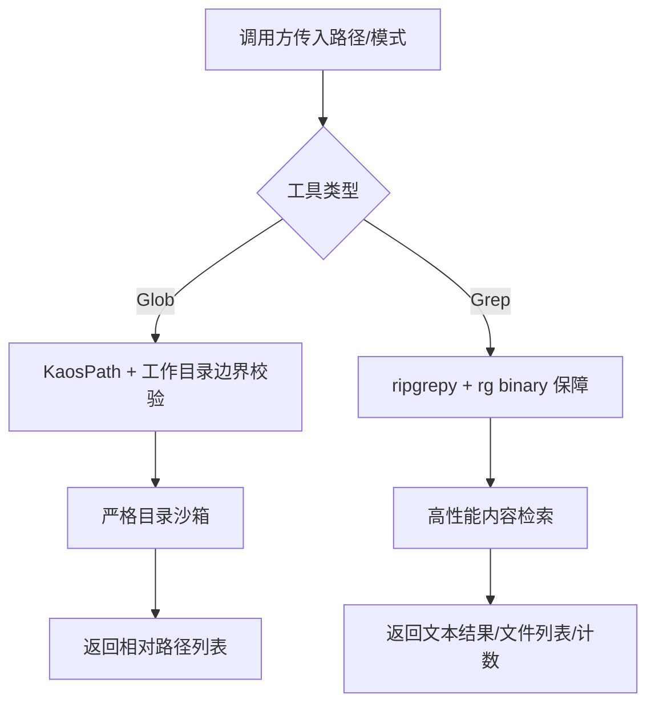

# file_discovery_and_search 模块文档

## 模块概述

`file_discovery_and_search` 模块对应 `src/kimi_cli/tools/file/glob.py` 与 `src/kimi_cli/tools/file/grep_local.py`，为 agent 提供两类互补能力：**文件路径发现**（`Glob`）与**文件内容检索**（`Grep`）。前者回答“有哪些文件/目录符合模式”，后者回答“哪些文件内容匹配正则/匹配内容是什么”。

这个模块存在的核心价值，是把原本分散在 shell 命令（`find`, `ls`, `rg`）中的能力封装成统一工具协议（`CallableTool2` + `ToolReturnValue`），让上层运行时（例如 `soul_engine`）能以稳定、结构化方式调用，并在 UI/日志层获得一致的成功/失败语义。与 [text_reading.md](text_reading.md)、[file_writing.md](file_writing.md)、[string_replacement.md](string_replacement.md) 组合后，它构成了典型工作流：先发现范围，再定位内容，再读取与编辑。

---

## 代码位置与核心组件

- `src/kimi_cli/tools/file/glob.py`
  - `Params`（Glob 参数模型）
  - `Glob`（文件/目录模式匹配工具）
- `src/kimi_cli/tools/file/grep_local.py`
  - `Params`（Grep 参数模型）
  - `Grep`（基于 ripgrep 的本地文本检索工具）

另外，`grep_local.py` 还包含 ripgrep 二进制管理函数（如 `_ensure_rg_path`、`_download_and_install_rg`），这些函数虽然不是“核心组件”列表的一部分，但对 `Grep` 的可用性至关重要。

---

## 设计目标与整体策略

该模块并不是对 shell 命令的简单包装，而是带有明显的工程取舍。

`Glob` 的设计偏向“**安全边界明确**”：强制目录在工作区内、限制高风险模式（`**` 开头），并对结果数量设置上限（`MAX_MATCHES=1000`），防止一次调用造成不可控的大范围扫描。

`Grep` 的设计偏向“**可移植与高性能**”：优先使用现有 `rg`，缺失时自动下载平台匹配二进制，确保在不同部署环境下都能运行。同时通过 `output_mode`、`glob`、`type`、上下文行参数、`head_limit` 组合，实现从“快速找文件”到“查看匹配上下文”的多层检索。

这种分工使 agent 可以先用低成本的路径筛选缩小候选，再做内容匹配，显著降低 token 与 IO 成本。

---

## 架构与组件关系



上图说明了该模块的“二层结构”：工具层（`Glob`/`Grep`）负责参数解释和结果返回；支撑层负责路径安全（`Glob`）或运行时依赖保障（`Grep` 的 ripgrep 获取与安装）。

---

## `glob.py` 详解

### `glob.Params`

`glob.Params` 是 `pydantic.BaseModel`，定义三项输入：`pattern`、`directory`、`include_dirs`。

`pattern` 是标准 glob 模式字符串；`directory` 允许指定搜索根目录，默认 `None` 时使用当前会话工作目录；`include_dirs` 控制返回结果是否包含目录，默认 `True`。该模型本身只做类型层约束，真正的安全策略在 `Glob` 运行时执行。

### `Glob`

`Glob` 继承 `CallableTool2[Params]`，工具名固定为 `Glob`，描述文本来自 `glob.md` 模板并注入 `MAX_MATCHES`。构造时从 `BuiltinSystemPromptArgs` 读取 `KIMI_WORK_DIR`，这决定了它的搜索沙箱边界。

#### `_validate_pattern(pattern)`

这个方法专门拦截以 `"**"` 开头的模式。原因不是语法错误，而是策略限制：这类模式往往触发大范围递归，容易扫入 `node_modules` 等巨型目录，造成性能问题和无效上下文。拦截时，工具会调用 `list_directory(self._work_dir)`，把工作目录顶层列表作为 `ToolError.output` 返回，帮助调用方改写更具体模式。

#### `_validate_directory(directory)`

该方法将目录 `canonical()` 后，使用 `is_within_directory` 判断是否位于工作目录内。若越界，直接返回 `ToolError`。这意味着 `Glob` 与部分读写工具不同，它**不允许搜索工作目录外部**，即便给的是绝对路径也不行。

#### `__call__(params)` 执行流程



返回成功时，`output` 是按行拼接的相对路径列表（相对于搜索根目录）；`message` 描述匹配数与是否发生截断。失败时返回 `ToolError`，包含可读 `brief` 和详细 `message`。

#### 行为细节与副作用

`Glob` 不做写操作，副作用仅为文件系统读取（目录遍历、属性检查）。值得注意的是，它在统计总匹配数后才做 `MAX_MATCHES` 截断，因此 `message` 可以反映真实命中规模，但输出只返回前 N 项，且按排序后的顺序返回，保证可重复性。

---

## `grep_local.py` 详解

### `grep_local.Params`

`grep_local.Params` 提供了比 `Glob` 更复杂的检索控制。核心字段可按功能理解为四组：

- 检索核心：`pattern`, `path`, `glob`, `type`
- 输出形态：`output_mode`（`content` / `files_with_matches` / `count_matches`）
- 上下文与显示：`-B`, `-A`, `-C`, `-n`, `head_limit`
- 匹配策略：`-i`（忽略大小写）, `multiline`

其中 `-B/-A/-C/-n/-i` 通过 Pydantic alias 暴露，便于与命令行语义对齐。

### ripgrep 二进制保障机制

`Grep` 的关键特性之一是“无需预装 rg 也可运行”。它通过 `_ensure_rg_path()` 实现惰性保障：

1. `_find_existing_rg()` 依次查找 `~/.kimi/bin`、包内 `deps/bin`、系统 `PATH`。
2. 若未找到，进入 `_RG_DOWNLOAD_LOCK`，避免并发下载重复。
3. `_download_and_install_rg()` 根据 OS/Arch 组合下载压缩包，解压 `rg` 到 share 目录并加执行位。



这个机制保证了首次运行成本可接受，同时让后续调用复用本地缓存二进制。

### `Grep.__call__(params)` 内部流程

`Grep` 使用 `ripgrepy.Ripgrepy` 构造查询，再按参数链式设置选项，最后 `run()` 执行并取 `result.as_string`。它通过 `ToolResultBuilder` 统一封装输出。

流程上有三个关键点：

第一，参数到 ripgrep 选项的映射是“条件启用”。例如 `before_context/after_context/context/line_number` 仅在 `output_mode="content"` 时生效。第二，`head_limit` 在工具层对文本结果进行行截断，而不是交给 ripgrep 内核。第三，空结果返回 `ok(message="No matches found")`，而不是错误。

### 输出模式行为

- `content`：返回匹配内容行，可叠加 `-B/-A/-C/-n`
- `files_with_matches`：返回命中文件路径
- `count_matches`：返回匹配计数

如果传入未识别的 `output_mode`，当前代码不会抛参数错误，而是退化为 ripgrep 默认输出行为（通常类似内容模式）。这属于实现上的“宽容处理”，但也可能造成调用方误判。

### 错误处理

整个调用包裹在通用 `try/except`。包括下载失败、平台不支持、rg 执行失败、参数组合问题等，都会转为：

- `brief = "Failed to grep"`
- `message = "Failed to grep. Error: ..."`

这保证协议一致性，但会丢失细粒度错误分类。

---

## Glob 与 Grep 的协同数据流



推荐实践是先用 `Glob` 做结构过滤，再用 `Grep` 做内容筛选。这样比直接全仓库 grep 更可控，尤其在大型 monorepo 下更明显。

---

## 与系统其他模块的关系

该模块从 `tools_file` 入口统一导出，详见 [file_module_entrypoint.md](file_module_entrypoint.md)。

运行时执行由工具框架承载（`CallableTool2`、`ToolError` 等），相关基础约定见 [kosong_tooling.md](kosong_tooling.md)。在 agent 生命周期中，这些工具通常由 `soul_engine` 的执行循环调用，见 [soul_engine.md](soul_engine.md)。

如果你需要“读取命中文件并定位上下文”，请联动 [text_reading.md](text_reading.md)；如果需要“检索后批量修改”，可联动 [string_replacement.md](string_replacement.md)。

---

## 使用示例

### 1) `Glob`：查找 Python 文件（不返回目录）

```python
from kimi_cli.tools.file.glob import Glob, Params

tool = Glob(builtin_args)
ret = await tool(Params(
    pattern="src/**/*.py",
    directory="/abs/workdir/project",
    include_dirs=False,
))
```

### 2) `Grep`：按文件类型检索函数名

```python
from kimi_cli.tools.file.grep_local import Grep, Params

tool = Grep()
ret = await tool(Params(
    pattern=r"def\\s+load_config",
    path=".",
    type="py",
    output_mode="content",
    line_number=True,
    context=2,
    head_limit=50,
))
```

### 3) `Grep`：只拿命中文件清单

```python
ret = await tool(Params(
    pattern="TODO|FIXME",
    path="/workspace/repo",
    glob="*.{py,ts,tsx}",
    output_mode="files_with_matches",
    ignore_case=True,
))
```

---

## 配置项与运行时影响

这个模块没有独立 TOML 配置对象，但其行为受到以下运行时环境影响：

- `KIMI_WORK_DIR`：`Glob` 的目录边界基准。
- `KIMI_SHARE_DIR`：`Grep` 下载并缓存 ripgrep 的目录（默认 `~/.kimi`）。
- 运行平台（OS/CPU）：决定 ripgrep 目标包；不支持的平台会报错。
- 网络可达性：首次下载 ripgrep 依赖 HTTP 下载源。

在离线或受限网络环境中，建议预先把 `rg` 放到系统 PATH 或 `~/.kimi/bin`，避免运行时下载失败。

---

## 边界条件、错误场景与已知限制

### `Glob` 相关

- 禁止 `pattern` 以 `**` 开头；这是策略限制，不是 glob 语法限制。
- `directory` 一旦显式传入，必须是绝对路径。
- 搜索目录必须位于工作目录内；越界直接拒绝。
- 结果最多返回 1000 条，超出会被截断。
- `include_dirs=False` 时会额外进行 `is_file()` 判定，可能增加 IO 成本。

### `Grep` 相关

- 代码注释已明确：该实现**未使用 `KaosPath`**，因此没有与 `Glob` 同等级的目录沙箱约束。
- `path` 字段描述倾向“绝对路径”，但代码并未强制，`"."` 默认也被接受。
- `output_mode` 不是强枚举，非法值会落入默认行为而非立刻报错。
- `head_limit` 是后处理截断，可能与 ripgrep 原生统计语义不完全一致。
- 首次调用可能触发下载，带来额外延迟与网络失败风险。
- 下载 URL 使用 `http://`，在某些环境可能被代理/策略拦截。

---

## 扩展建议

如果你要扩展该模块，建议沿着现有“参数模型 + 工具实现 + 统一返回”的模式演进。

在 `Glob` 侧，可考虑加入可配置忽略目录（如 `node_modules`, `.git`）与结果分页能力，而不是仅靠固定 `MAX_MATCHES`。在 `Grep` 侧，可优先补齐参数层枚举校验与路径边界策略，让行为与 `Glob` 更一致；同时将 `head_limit` 下推到更接近 ripgrep 的执行层，以减少二次处理偏差。

如果你引入新检索工具（例如 semantic search），建议在 [file_module_entrypoint.md](file_module_entrypoint.md) 中统一导出，保持 `tools_file` 对外 API 稳定。

---

## 相关文档

- [file_module_entrypoint.md](file_module_entrypoint.md)
- [text_reading.md](text_reading.md)
- [file_writing.md](file_writing.md)
- [string_replacement.md](string_replacement.md)
- [kosong_tooling.md](kosong_tooling.md)
- [soul_engine.md](soul_engine.md)

## 组件级 API 速查（实现语义）

### `Glob.__call__(params: Params) -> ToolReturnValue`

该方法的返回值始终是 `ToolOk` 或 `ToolError`。成功时，`output` 为多行文本，每行是相对于 `directory`（或默认工作目录）的路径；`message` 为可读摘要（命中数、是否截断）。失败时，`brief` 用于上层快速归类，`message` 给出详细原因，部分场景（如不安全 pattern）还会通过 `output` 携带辅助信息（工作目录顶层列表）。

从实现上看，`Glob` 并不对 glob 语法做完整静态校验，而是把语义校验拆成三步：模式安全校验、目录边界校验、目录存在性/类型校验。只有这三步全部通过，才会真正执行 `dir_path.glob(pattern)`。因此它的安全性更多是“运行前门禁”而非“解析期约束”。

### `Grep.__call__(params: Params) -> ToolReturnValue`

`Grep` 的调用路径分为“执行准备”和“检索执行”两段。执行准备阶段最关键的是 `_ensure_rg_path()`：它决定当前环境是否可以运行 ripgrep。检索执行阶段则是把 `Params` 映射到 `ripgrepy` 链式调用，然后 `run()` 获取文本输出并做可选截断。

与 `Glob` 不同，`Grep` 成功结果默认不额外构造结构化字段，而是将 ripgrep 文本原样（或截断后）写入 `output`。这让它和命令行直觉一致，但也意味着调用方若要做机器可解析处理，通常需要再做一次文本解析。

---

## 参数协同与典型调用策略

在大型仓库里，推荐把 `Glob` 和 `Grep` 视为两阶段过滤器。第一阶段使用 `Glob` 解决“空间收敛”，例如把搜索范围限定到 `src/**` 或某些语言目录；第二阶段使用 `Grep` 解决“语义命中”，例如函数名、配置键、错误码等正则模式。这样做的优势不只是速度，还包括可解释性：每一步输出都可以直接展示给用户，说明为什么最终锁定这些文件。

当你只需要“哪些文件值得进一步读取”时，应优先用 `Grep(output_mode="files_with_matches")`，再串联 [text_reading.md](text_reading.md) 进行定点读取。若你直接使用 `content` 模式做大范围搜索，输出体积可能迅速膨胀，即便有 `head_limit` 也可能截断掉真正关键的后续命中。

---

## 行为一致性与差异（Glob vs Grep）



这两个工具最大的工程差异在于边界控制：`Glob` 强依赖 `KaosPath` 与工作目录内约束，而 `Grep` 当前实现直接把 `path` 交给 ripgrep，未复用同级别沙箱策略。这并不意味着 `Grep` 不安全，而是它把安全责任更多留给调用方（或更上层调度器）。如果你在安全敏感场景（如多租户）使用该模块，建议在工具注册层增加统一路径校验中间层。

---

## 可维护性建议（面向后续开发者）

如果后续要继续演进 `file_discovery_and_search`，优先级最高的是统一参数约束语义。当前 `Glob` 对目录合法性定义非常严格，而 `Grep` 对 `path` 与 `output_mode` 则较宽松，长期会导致“同一模块下调用体验不一致”。一个可行方案是：在 `Params` 层引入更强的枚举和路径验证，在不破坏兼容性的前提下逐步收敛行为。

第二个建议是把“结果截断”从简单行截断提升为结构化分页（例如 offset + limit + has_more），这会明显改善前端和 agent 的二次交互能力。当前 `head_limit` 虽易用，但会混合“数据内容”与“提示语句”，对自动化消费并不理想。

