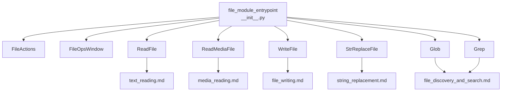
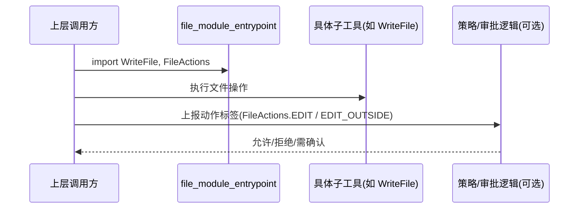

# file_module_entrypoint 模块文档

## 模块概述

`file_module_entrypoint` 对应 `src/kimi_cli/tools/file/__init__.py`，它是整个文件工具子系统（`tools_file`）的统一入口与命名聚合层。这个模块本身并不承担复杂的文件读写逻辑，而是通过“轻量类型定义 + 子工具导出（re-export）”的方式，把文件相关能力整合成一个稳定、易导入的 API 面。对于调用方（例如 agent runtime、tool registry、或上层 CLI/web 编排逻辑）来说，它的价值在于：只需要依赖一个入口模块，就可以拿到完整的文件工具集合，而不必感知每个子模块的具体文件路径。

从设计上看，这个入口模块承担三类职责。第一，定义文件操作语义枚举 `FileActions`，把“读文件、编辑文件、越界编辑”这类行为标签标准化，避免系统中出现随意的字符串常量。第二，预留 `FileOpsWindow` 作为“文件操作窗口”概念载体，表达未来可能实现的操作历史、审计窗口、上下文裁剪等能力。第三，通过 `__all__` 与显式导入，将 `ReadFile`、`WriteFile`、`StrReplaceFile`、`Glob`、`Grep`、`ReadMediaFile` 统一暴露，形成稳定的导出边界。

---

## 代码位置与核心组件

- 文件：`src/kimi_cli/tools/file/__init__.py`
- 核心组件：
  - `FileOpsWindow`
  - `FileActions`
- 同模块导出工具：
  - `ReadFile`（来自 `text_reading`）
  - `WriteFile`（来自 `file_writing`）
  - `StrReplaceFile`（来自 `string_replacement`）
  - `Glob` / `Grep`（来自 `file_discovery_and_search`）
  - `ReadMediaFile`（来自 `media_reading`）

---

## 设计动机与存在意义

在一个多工具系统里，文件相关功能天然会拆成多个实现模块：文本读取、媒体读取、写入、替换、搜索、枚举等。如果上层代码直接从这些模块逐个导入，不仅会引入路径耦合，还会导致依赖面不稳定：一旦子模块重构路径，调用方全部受影响。`file_module_entrypoint` 的存在正是为了解决这个问题。

该模块提供了一个“语义稳定层”。对外，它看起来像一个单点入口；对内，它允许实现细节继续拆分和演进。也就是说，子模块可以独立迭代，而入口模块维持兼容导出与统一命名。这种模式在大型代码库中非常常见，尤其适合 CLI agent 场景下的工具注册与动态发现。

---

## 组件详解

## `FileOpsWindow`

`FileOpsWindow` 当前是一个占位类（placeholder），只有文档字符串 `"Maintains a window of file operations."`，没有字段、方法和运行时代码。虽然实现尚未落地，但它在架构层面已经表达了一个重要方向：系统希望显式建模“文件操作窗口”而不是把每次文件动作当作孤立事件。

从语义推断，`FileOpsWindow` 未来可能承担以下能力：维护近期文件操作序列、限制上下文窗口大小、供审批/审计模块读取、支持冲突检测或回滚辅助。在当前版本中，它没有参数、没有返回值、没有副作用，也不会在运行时触发任何行为。

由于该类尚未实现，开发者在扩展时应把它视为“契约锚点”而非可用服务。如果你需要窗口功能，应该先在该类中补充最小可用接口，再由 `ReadFile`/`WriteFile`/`StrReplaceFile` 等工具接入。

### 建议扩展接口（非现有实现）

```python
class FileOpsWindow:
    def add(self, action: FileActions, path: str, timestamp: float) -> None: ...
    def recent(self, limit: int = 20) -> list[dict]: ...
    def clear(self) -> None: ...
```

上面仅是说明性示例，帮助理解该类型的定位，不代表当前代码已提供这些方法。

## `FileActions`

`FileActions` 继承自 `enum.StrEnum`，定义了三种字符串枚举值：

- `READ = "read file"`
- `EDIT = "edit file"`
- `EDIT_OUTSIDE = "edit file outside of working directory"`

它的核心作用是把文件行为分类标准化，避免在策略判断、审批记录、日志归档、遥测统计中出现同义不同写或拼写漂移。因为是 `StrEnum`，它同时具备枚举可比性和字符串可序列化友好性，在 JSON、日志、数据库文本字段里都比较易用。

### 参数、返回值与副作用说明

`FileActions` 是类型定义而不是函数：

- 参数：无。
- 返回值：无（使用方式是读取枚举成员）。
- 副作用：无直接副作用；但它会影响上层系统如何解释和展示一次文件操作。

### 使用示例

```python
from kimi_cli.tools.file import FileActions


def classify_edit(path: str, working_dir: str) -> FileActions:
    if path.startswith(working_dir):
        return FileActions.EDIT
    return FileActions.EDIT_OUTSIDE
```

在审批流或安全控制中，`EDIT_OUTSIDE` 通常意味着更高风险等级，可触发二次确认。

---

## 导出机制与 API 边界

该模块末尾通过延迟位置导入（文件底部导入）把各子工具汇总，并用 `__all__` 约束公共导出集合：

```python
__all__ = (
    "ReadFile",
    "ReadMediaFile",
    "Glob",
    "Grep",
    "WriteFile",
    "StrReplaceFile",
)
```

这种写法带来两个效果：一是调用方可以通过 `from kimi_cli.tools.file import ReadFile` 等统一方式导入；二是文档与自动补全工具更容易识别“受支持公共 API”。需要注意，`FileActions` 和 `FileOpsWindow` 虽未出现在 `__all__` 中，但依然可通过模块属性访问（例如 `import kimi_cli.tools.file as f; f.FileActions`）。

---

## 架构关系图



这张图体现了入口模块与各子工具的“聚合而不内嵌”关系：`file_module_entrypoint` 本身不实现读写搜索算法，只负责把这些实现模块提升为统一 API 面，并附带轻量语义类型。

---

## 依赖与交互流程



实际执行逻辑发生在子工具中，但动作语义可以通过 `FileActions` 进入策略系统，从而把“技术操作”转化为“可治理行为”。这也是入口模块虽小但重要的原因。

---

## 与系统其他模块的关系

`file_module_entrypoint` 位于 `tools_file` 之内，属于工具层的文件能力总入口。在更大系统里，它常与如下模块协同：

- 与 `soul_engine`：作为 agent 可调用工具之一，参与任务执行回路。
- 与 `config_and_session`：受工作目录、审批策略、会话状态影响，尤其是越界编辑场景。
- 与 `wire_protocol`：在远程/前后端交互模式下，文件工具调用及结果可能被序列化传输。
- 与 `tools_shell`、`tools_web`、`tools_misc`：共同组成统一工具生态。

关于这些模块的细节，请分别参阅对应文档，如 [soul_engine.md](soul_engine.md)、[config_and_session.md](config_and_session.md)、[wire_protocol.md](wire_protocol.md)。

---

## 使用方式

最常见的使用方式是把它当作单一导入入口。

```python
from kimi_cli.tools.file import ReadFile, WriteFile, StrReplaceFile, Glob, Grep, ReadMediaFile
from kimi_cli.tools.file import FileActions
```

在框架代码中，可以基于该入口构建工具注册表，避免散落导入：

```python
FILE_TOOLS = [ReadFile(), WriteFile(), StrReplaceFile(), Glob(), Grep(), ReadMediaFile()]
```

如果你在做行为审计或风险分级，建议统一使用 `FileActions` 而不是手写字符串，以获得更稳定的跨模块语义。

---

## 行为约束、边界情况与注意事项

当前模块最容易被误解的点是：它“看起来像完整文件工具实现”，但实际上它是入口层。很多错误归因会发生在这里，例如把读写失败当成入口模块故障。排查时应优先定位具体子工具实现。

已知约束与潜在 gotchas：

- `FileOpsWindow` 目前未实现。任何依赖其状态管理能力的代码都需要自行扩展，否则会产生“类型存在但行为缺失”的错觉。
- `FileActions` 只定义了三种动作，语义粒度较粗。如果你需要区分“创建/覆盖/删除/重命名”，应在保持兼容前提下扩展枚举并同步策略层。
- `__all__` 不包含 `FileActions` 和 `FileOpsWindow`，在 `from ... import *` 场景下它们不会被导入。显式导入可规避该问题。
- 底部导入顺序使用 `# noqa: E402` 抑制风格告警，这是有意设计（为了先定义类型后聚合导入）。如重构为顶部导入，要评估循环依赖风险。

---

## 扩展建议

当你需要扩展文件工具能力时，建议遵循“子模块实现 + 入口聚合导出”的现有模式。先在独立模块实现工具，再在 `file_module_entrypoint` 中导入并加入 `__all__`，这样可以保持对外 API 一致。

新增动作语义时，请同步更新以下三个层面：入口枚举（`FileActions`）、策略判定层（审批/权限/日志）、以及文档与遥测映射，避免出现语义定义和运行行为不一致。

---

## 相关文档

- [tools_file.md](tools_file.md)
- [text_reading.md](text_reading.md)
- [file_writing.md](file_writing.md)
- [string_replacement.md](string_replacement.md)
- [file_discovery_and_search.md](file_discovery_and_search.md)
- [media_reading.md](media_reading.md)
- [soul_engine.md](soul_engine.md)
- [config_and_session.md](config_and_session.md)
- [wire_protocol.md](wire_protocol.md)
