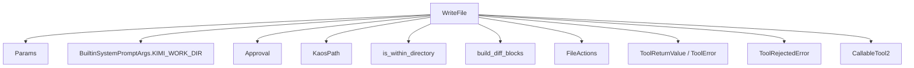
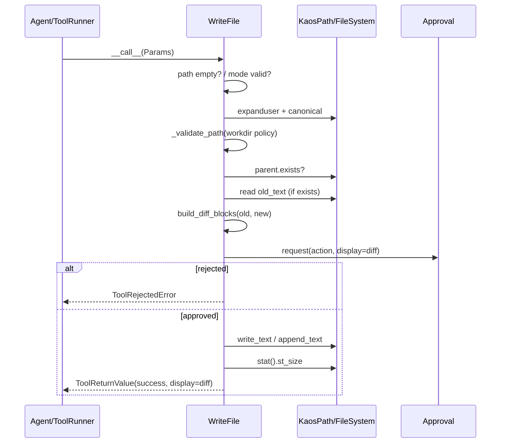
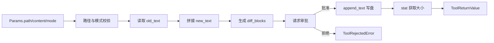

# file_writing 模块文档

## 模块概述

`file_writing` 模块对应实现文件 `src/kimi_cli/tools/file/write.py`，核心职责是向 agent 暴露一个**可控、可审批、可审阅差异**的文件写入工具。它不是一个“直接把字符串写进磁盘”的薄封装，而是把写入操作放进了完整的工具治理链路：路径安全校验、作用域识别（工作目录内/外）、变更 diff 生成、用户审批、最终写入与统一返回结构。

这个模块存在的主要原因，是在 agent 自动执行环境中，文件写入属于高风险动作。与只读操作相比，写操作会改变真实状态，可能覆盖用户代码、污染配置、甚至写入工作目录外敏感路径。`WriteFile` 通过显式审批和行为分类（`FileActions.EDIT` / `FileActions.EDIT_OUTSIDE`）把“写入”变成一个有边界、有可见性、可被拒绝的动作，从而在效率和安全之间取得平衡。

从 `tools_file` 子系统视角看，`file_writing` 与 [text_reading.md](text_reading.md) 和 [string_replacement.md](string_replacement.md) 形成一个典型闭环：先读、再改、再写（或替换）。如果你要理解文件工具整体入口与导出关系，请先读 [file_module_entrypoint.md](file_module_entrypoint.md)。

---

## 代码位置与核心组件

- 文件：`src/kimi_cli/tools/file/write.py`
- 核心组件：
  - `Params`
  - `WriteFile`

---

## 设计动机与实现策略

`WriteFile` 的设计并不追求最“短路径”的写盘，而是优先保证 agent 行为对用户可解释。具体策略体现在三个层面。第一，参数层使用 `Pydantic` 模型固定输入结构，把路径、内容、写入模式收敛为明确字段。第二，执行层在真正写入前先读取旧内容并构建 diff，使审批界面能展示“将要发生什么变化”。第三，策略层把写入动作交给 `Approval` 队列，由用户或会话策略决定是否放行。

这意味着该模块的核心价值不仅是“写成功”，更是“在写之前就让系统知道将改什么，并给用户 veto 权限”。这对交互式 CLI agent、长期会话和自动化修复场景非常关键。

---

## 核心组件详解

## `Params`

`Params` 继承 `BaseModel`，定义了 `WriteFile` 的输入契约。它看似简单，但约束了该工具的可调用边界。

### 字段说明

1. `path: str`

该字段表示目标文件路径。字段描述明确提示：当写入工作目录外文件时，应使用绝对路径。注意，这不仅是文案建议，`WriteFile._validate_path` 会在运行时强制检查相关规则。

2. `content: str`

要写入文件的文本内容。`overwrite` 模式下会替换整个文件内容；`append` 模式下会拼接到文件末尾。

3. `mode: Literal["overwrite", "append"] = "overwrite"`

写入模式，支持：

- `overwrite`：覆盖写入（相当于重写文件）
- `append`：追加写入（保留原内容）

虽然类型层已经用 `Literal` 限定了合法值，`WriteFile.__call__` 里仍保留了运行时二次校验，这是防御式编程的一部分，可避免某些绕过模型层调用时产生不明确行为。

### 参数验证与业务验证分层

`Params` 负责“结构合法性”（字段类型与可选值），`WriteFile` 负责“执行合法性”（路径安全、父目录存在、审批是否通过）。这种分层使错误信息更清晰：模型错误与系统策略错误被分开处理。

---

## `WriteFile`

`WriteFile` 继承 `CallableTool2[Params]`，是一个异步工具实现。它的输出类型是 `ToolReturnValue` 体系：成功返回 `ToolReturnValue(is_error=False, ...)`，失败返回 `ToolError` 或其子类。

### 类属性与元信息

- `name = "WriteFile"`
- `description = load_desc(Path(__file__).parent / "write.md")`
- `params = Params`

其中 `description` 来自外部 markdown 文件，便于提示词与工具代码解耦；`params` 用于自动生成 schema，服务于工具调用协议与校验流程（详见 [kosong_tooling.md](kosong_tooling.md)）。

### 构造函数

```python
__init__(self, builtin_args: BuiltinSystemPromptArgs, approval: Approval)
```

构造阶段注入两项关键依赖：

- `builtin_args.KIMI_WORK_DIR`：当前工作目录边界，用于路径策略判断。
- `approval`：审批服务，用于写入前请求用户确认。

这使 `WriteFile` 不需要自行管理策略状态，工具逻辑保持集中。

### `_validate_path(self, path: KaosPath) -> ToolError | None`

这是路径安全校验函数，核心规则是：

- 将输入路径 canonical 化为 `resolved_path`。
- 如果 `resolved_path` 不在工作目录内，并且原始路径又不是绝对路径，则拒绝。

换句话说，**工作目录外写入是允许的，但必须显式使用绝对路径**。这避免了通过相对路径（例如 `../../...`）隐式越界带来的歧义和风险。

### `__call__(self, params: Params) -> ToolReturnValue`

这是实际执行入口，完整流程可以拆成 8 个阶段。

#### 阶段 1：空路径快速失败

如果 `params.path` 为空字符串，直接返回 `ToolError(brief="Empty file path")`，避免进入后续文件系统操作。

#### 阶段 2：路径展开与安全校验

工具会执行：

- `KaosPath(params.path).expanduser()`：展开 `~`。
- `_validate_path(...)`：执行工作目录边界规则。
- `p = p.canonical()`：将目标路径标准化。

#### 阶段 3：父目录存在性检查

写入前要求 `p.parent` 已存在。若父目录不存在，返回 `Parent directory not found`。这意味着 `WriteFile` **不会自动创建目录树**。

#### 阶段 4：模式校验

尽管 `Params.mode` 已是 `Literal`，代码仍检查 `params.mode in ["overwrite", "append"]`。如果不合法，返回 `Invalid write mode`。

#### 阶段 5：读取旧内容并构建预览 diff

- 若文件已存在，读取 `old_text = await p.read_text(errors="replace")`
- 构造 `new_text`：
  - `overwrite`：`params.content`
  - `append`：`(old_text or "") + params.content`
- 调用 `build_diff_blocks(path, old_text or "", new_text)` 生成 `DisplayBlock` 列表

这个阶段是模块的关键：即使最终用户拒绝写入，也可以先看到拟议变更。

#### 阶段 6：确定动作类型并请求审批

动作类型根据目标路径是否在工作目录内决定：

- 工作目录内：`FileActions.EDIT`
- 工作目录外：`FileActions.EDIT_OUTSIDE`

随后调用：

```python
await self._approval.request(
    self.name,
    action,
    f"Write file `{p}`",
    display=diff_blocks,
)
```

若审批拒绝，返回 `ToolRejectedError`。

#### 阶段 7：执行写入

使用 `match` 分派写入逻辑：

- `overwrite` → `await p.write_text(params.content)`
- `append` → `await p.append_text(params.content)`

#### 阶段 8：返回成功结果

写入完成后读取 `st_size`，并返回成功消息，例如：

- `File successfully overwritten. Current size: 1234 bytes.`
- `File successfully appended to. Current size: 5678 bytes.`

同时把之前生成的 `diff_blocks` 放入 `display` 字段，供 UI 或审计层展示。

---

## 架构与依赖关系



`WriteFile` 是一个薄编排层：它把路径语义（`KaosPath`）、策略语义（`Approval` + `FileActions`）、展示语义（`build_diff_blocks`）与工具协议语义（`CallableTool2` / `ToolReturnValue`）串起来。这样每层职责清晰，单点变更不会牵连整个写入流程。

---

## 交互时序



这个时序里最值得注意的点是：审批发生在真正写盘之前，并且审批展示的是“计算后的差异”而不是原始参数。这对降低误操作非常有效。

---

## 数据流（以 append 模式为例）



这里有一个现实工程取舍：为了展示 append 的完整 diff，工具会读取旧文件并构建新文本。对于超大文件，这一步会带来额外内存和计算成本（见下文“限制与注意事项”）。

---

## 返回值与错误模型

### 成功返回

成功时返回 `ToolReturnValue`，关键字段：

- `is_error=False`
- `output=""`（该工具主要通过 `message` 与 `display` 传达结果）
- `message="File successfully ..."`
- `display=diff_blocks`

### 失败返回

失败以 `ToolError` 族表示，常见 `brief` 包括：

- `Empty file path`
- `Invalid path`
- `Parent directory not found`
- `Invalid write mode`
- `Failed to write file`
- `Rejected by user`（`ToolRejectedError`）

### 异常兜底

`__call__` 最外层包裹 `try/except Exception`，任何未预期异常都会被转换成 `ToolError(brief="Failed to write file")`，从而保证上层总能收到结构化响应。

---

## 使用方式

在框架内通常由工具运行器自动调用，但在测试或扩展时可以直接实例化。

```python
from kimi_cli.tools.file.write import WriteFile, Params

wf = WriteFile(builtin_args=builtin_args, approval=approval)
ret = await wf(Params(path="./notes.txt", content="hello\n", mode="overwrite"))

if ret.is_error:
    print(ret.brief, ret.message)
else:
    print(ret.message)
```

也可以通过 `CallableTool2.call` 传入字典（会先做 schema 校验）：

```python
ret = await wf.call({
    "path": "./notes.txt",
    "content": "new line\n",
    "mode": "append"
})
```

如果你在实现批量任务，建议先用读取工具确认目标内容，再调用写入工具，最后用替换工具做精修；可参考 [text_reading.md](text_reading.md) 与 [string_replacement.md](string_replacement.md)。

---

## 配置与行为影响因素

`WriteFile` 可配置项不多，但运行行为会受以下上下文影响：

- `KIMI_WORK_DIR`：决定路径边界与动作分类。
- `Approval` 状态：`yolo` / auto-approve 会直接影响是否弹审批。
- 路径是否绝对：影响工作目录外写入是否被拒绝。

其中审批系统的详细机制（请求队列、会话级自动批准、拒绝流）可参考 [soul_engine.md](soul_engine.md) 及相关审批模块文档。

---

## 边界条件、错误条件与已知限制

`file_writing` 虽然稳健，但仍有一些值得开发者特别注意的工程细节。

第一，模块不创建父目录。路径合法但父目录缺失会直接报错，这在新建嵌套目录写文件时很常见。调用方需要先确保目录存在，或借助 shell 工具先 `mkdir -p`。

第二，append 模式同样会先读取旧文件并构造完整 `new_text` 用于 diff。这在大文件场景下会放大内存占用和 CPU 成本；如果未来要支持超大文件追加，建议引入“截断 diff”或“仅展示尾部窗口”的策略。

第三，当前代码里有 `TODO: check if the path may contain secrets`，说明路径敏感信息检测尚未实现。也就是说，它目前依赖审批机制来兜底高风险写入，而不是在工具层完成完整的秘密路径防护。

第四，审批调用要求存在工具调用上下文。`Approval.request` 在非工具调用上下文可能抛出 `RuntimeError`，但 `WriteFile` 会把它兜底为 `Failed to write file`。这会让最终错误信息偏“执行失败”而不是“上下文错误”，调试时要留意。

第五，路径包含关系判断依赖 canonical 结果与纯路径语义比较。若你的部署环境存在复杂挂载点或非标准路径映射，应额外验证“目录内/外”判定是否符合预期。

---

## 扩展建议

如果要扩展 `file_writing`，优先遵循现有分层边界，不要把所有逻辑塞进 `__call__`。

一个常见扩展方向是新增模式，例如 `create_if_missing` 或 `atomic_overwrite`。推荐做法是先扩展 `Params.mode`，再在执行分支补充原子写临时文件与 rename 逻辑，同时保留 diff + approval 流程。

另一个方向是增强安全策略，例如增加路径黑名单/白名单、敏感文件后缀拦截、或基于 `FileActions` 的风险分级审批。此时建议把策略判断抽到独立函数，避免与 I/O 代码耦合。

如果你希望在 UI 端展示更可读变更，可以扩展 `build_diff_blocks` 的上下文窗口或分块策略，但要确保 `display` 结构仍兼容工具协议。

---

## 与其他模块的关系（避免重复阅读）

- 文件工具入口与导出：见 [file_module_entrypoint.md](file_module_entrypoint.md)
- 文本读取行为与限制：见 [text_reading.md](text_reading.md)
- 字符串替换编辑：见 [string_replacement.md](string_replacement.md)
- 工具抽象与返回类型：见 [kosong_tooling.md](kosong_tooling.md)
- 运行时/会话与审批生态：见 [soul_engine.md](soul_engine.md)、[config_and_session.md](config_and_session.md)

---

## 与上层 `tools_file` 入口的集成位置

在运行时，`WriteFile` 不会直接被业务代码“手动发现”，而是由文件工具入口模块统一注册并暴露给工具调用层。也就是说，`file_writing` 的职责是提供单一、可靠的写入能力，而工具选择、调用编排、以及与其他文件工具（例如读、替换、搜索）的协同，是由 [tools_file.md](tools_file.md) 和 [file_module_entrypoint.md](file_module_entrypoint.md) 所描述的更高层机制完成。

这种“能力模块（write.py）+ 入口聚合模块（file.__init__）”的拆分，使维护工作更加稳定：当你只调整写入策略（例如审批文案、越界规则、diff 展示）时，不需要同步修改所有工具注册逻辑；反过来，入口层调整也不会直接干扰写盘实现。


## 小结

`file_writing` 的本质不是“写文件 API”，而是“受治理的文件变更执行器”。它把路径边界、变更可视化、审批与写盘串成一个可审计流程，适合 agent 系统中的高风险动作管理。对于维护者而言，最重要的理解点是：安全与可解释性是这个模块的一等公民，性能与便捷性（例如大文件 append）目前是次级目标，后续优化应在不破坏这一原则的前提下进行。
