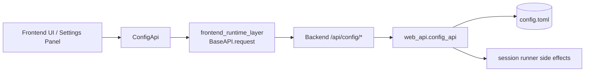
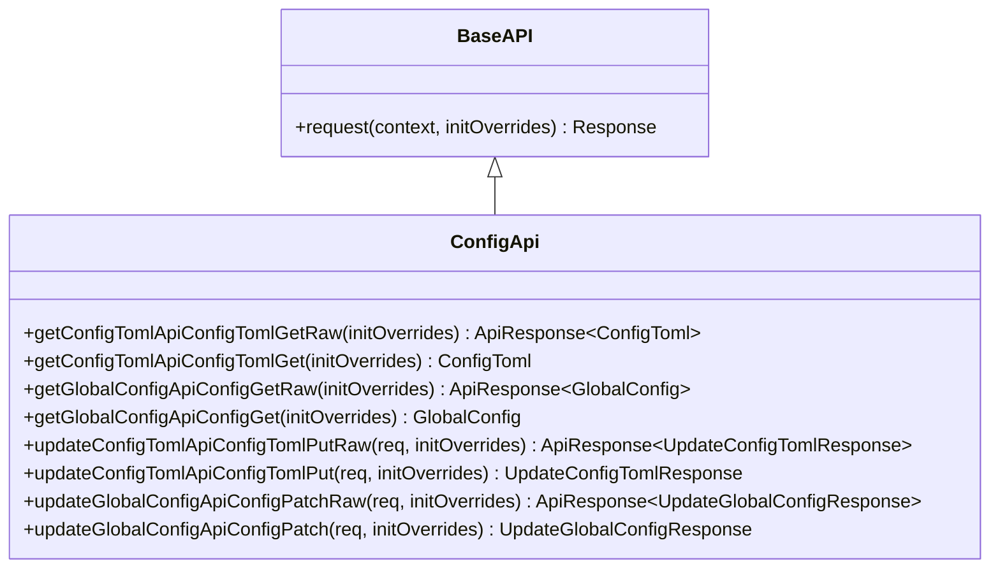
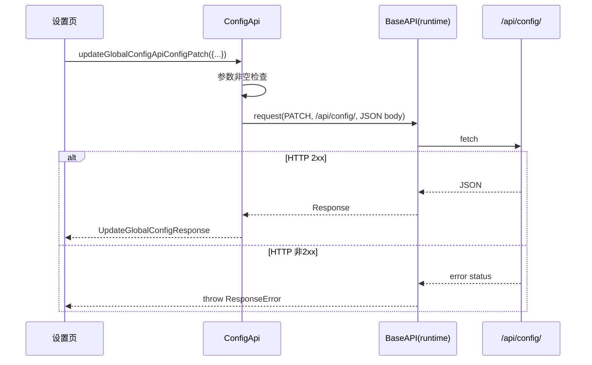

# frontend_config_api_client

## 模块简介

`frontend_config_api_client` 对应 `web/src/lib/api/apis/ConfigApi.ts`，是 Web 前端访问配置相关后端接口的类型化客户端封装。它的核心职责是把“配置读取与配置更新”这类 HTTP 调用，收敛为一个稳定、可复用、带 TypeScript 类型的 API 类：`ConfigApi`。

这个模块存在的原因并不只是“少写几行 fetch”。在实际工程里，配置接口通常具有较高敏感性和较强副作用（例如变更默认模型、可能触发运行中会话重启、修改 `config.toml` 原文）。如果每个调用点都手写请求路径、请求体和错误处理，极易出现字段命名错误、序列化不一致、状态判断遗漏。`ConfigApi` 通过 OpenAPI 生成代码统一这些行为：固定 endpoint、固定 JSON 映射、固定参数校验、固定返回类型，从而降低前端与后端契约漂移风险。

从模块树关系看，它是 `web_frontend_api` 下的配置子客户端，依赖 `frontend_runtime_layer` 的 `BaseAPI` 请求执行机制，并与后端 `config_api`（`web_api` 子模块）形成一一对应的调用面。若你需要后端业务语义与配置策略本身，请参考 [config_api.md](config_api.md) 和 [configuration_loading_and_validation.md](configuration_loading_and_validation.md)；本文聚焦前端客户端侧行为。

---

## 模块定位与架构关系



这张图体现了 `ConfigApi` 的边界：它负责“前端怎么调用”，不负责“后端怎么生效”。也就是说，是否触发会话重启、敏感接口是否允许访问、配置校验细节，都由后端决定；前端客户端只负责按契约发送和解析。

---

## 核心组件详解

## `ConfigApi`

`ConfigApi` 是一个继承 `runtime.BaseAPI` 的自动生成类。类本身较薄，主要由 4 组方法组成，每组都遵循统一模式：

1. `xxxRaw(...)`：返回 `runtime.ApiResponse<T>`，可访问 `raw: Response` 与 `value()`。
2. `xxx(...)`：调用对应 Raw 方法并直接返回解包后的 `T`。

这种“双层 API”设计很关键。业务代码通常用非 Raw 便捷方法；当你需要响应头、状态码、调试信息或自定义错误分支时，再用 Raw 方法。



---

## 请求参数包装接口

`ConfigApi.ts` 中定义了两个请求包装类型，而不是直接把业务体作为函数首参。这是 OpenAPI 生成器常见风格，目的是为将来扩展多参数（path/query/body）保留一致签名结构。

### `UpdateConfigTomlApiConfigTomlPutRequest`

该接口只有一个字段：`updateConfigTomlRequest: UpdateConfigTomlRequest`。其中 `UpdateConfigTomlRequest` 的核心字段是 `content: string`，表示新的完整 TOML 文本。

### `UpdateGlobalConfigApiConfigPatchRequest`

该接口只有一个字段：`updateGlobalConfigRequest: UpdateGlobalConfigRequest`。后者支持可选字段，如 `defaultModel`、`defaultThinking`、`restartRunningSessions`、`forceRestartBusySessions`。

需要注意：`updateGlobalConfigRequest` 本身必填，但对象内部字段大多可选。这意味着“空对象 `{}`”在语法上是允许的，语义上等价于“请求后端按默认策略处理（通常可能仍触发某些默认行为）”。

---

## 方法级别行为说明

## 1) `getConfigTomlApiConfigTomlGetRaw` / `getConfigTomlApiConfigTomlGet`

这组方法对应 `GET /api/config/toml`，用于读取后端返回的原始配置文件内容快照，返回类型 `ConfigToml`（`content` + `path`）。

内部执行过程：构造空 query/header，调用 `this.request`，再用 `ConfigTomlFromJSON` 把响应 JSON 映射为前端类型。

副作用方面，该调用本身是只读请求；但由于此接口在后端可能被敏感策略保护，若后端禁用敏感配置 API，前端会收到非 2xx 并由 runtime 抛出 `ResponseError`。

## 2) `getGlobalConfigApiConfigGetRaw` / `getGlobalConfigApiConfigGet`

这组方法对应 `GET /api/config/`，返回 `GlobalConfig` 快照，包含：

- `defaultModel`
- `defaultThinking`
- `models: ConfigModel[]`

值得关注的一点是字段命名自动转换：后端常用 snake_case（如 `default_model`），前端模型通过 `GlobalConfigFromJSON` 转成 camelCase（如 `defaultModel`）。这由生成模型层完成，调用方无需手动映射。

## 3) `updateConfigTomlApiConfigTomlPutRaw` / `updateConfigTomlApiConfigTomlPut`

这组方法对应 `PUT /api/config/toml`，用于提交新的配置文本。

方法先执行参数非空检查：如果 `requestParameters.updateConfigTomlRequest == null`，立即抛出 `runtime.RequiredError`，请求不会发出。通过检查后，方法会设置 `Content-Type: application/json`，并用 `UpdateConfigTomlRequestToJSON` 序列化 body。

返回 `UpdateConfigTomlResponse`，其字段通常包含 `success` 和可选 `error`。这里有一个实战陷阱：后端可能返回 HTTP 200 但 `success: false`（代表业务层失败被包在响应体里）。因此前端不能只靠“没有抛异常”判断成功，还要检查 `success` 字段。

## 4) `updateGlobalConfigApiConfigPatchRaw` / `updateGlobalConfigApiConfigPatch`

这组方法对应 `PATCH /api/config/`，用于部分更新默认模型与思考开关等全局行为。

与上一组一样，它会先检查 `updateGlobalConfigRequest` 是否为空对象引用（null/undefined），否则抛 `RequiredError`。随后设置 JSON 请求头并序列化 body。

返回值是 `UpdateGlobalConfigResponse`，其中除了更新后的 `config` 快照，还可能包含 `restartedSessionIds` 与 `skippedBusySessionIds`。这些字段反映后端在配置变更后对运行会话的处理结果，前端可据此做提示信息。

---

## 端到端调用流程



这个流程说明了一个关键事实：`ConfigApi` 没有内建“按状态码分支返回 union 类型”的逻辑。非 2xx 都是异常路径，只有 2xx 才进入类型解码路径。

---

## 与模型层的协作关系

`ConfigApi` 大量依赖 `../models/index` 导出的 `FromJSON/ToJSON` 函数。它们不仅负责类型转换，还负责命名风格桥接与可选值处理。例如：

- `GlobalConfigFromJSON`：`default_model` -> `defaultModel`
- `UpdateGlobalConfigRequestToJSON`：`defaultModel` -> `default_model`
- 可选字段为 `undefined` 时，序列化后可能不出现或为 `undefined` 值（最终由 `JSON.stringify` 决定省略）

此外，`ConfigApi.ts` 导入了 `HTTPValidationError` 相关类型和转换函数，但在本文件中未直接使用。这是生成器为完整 schema 引用保留的常见结果，不代表逻辑错误。

---

## 实际使用示例

## 基础初始化

```ts
import { Configuration } from '../lib/api/runtime';
import { ConfigApi } from '../lib/api/apis/ConfigApi';

const config = new Configuration({
  basePath: 'http://127.0.0.1:8000',
  credentials: 'include',
});

const configApi = new ConfigApi(config);
```

## 读取全局配置并展示

```ts
const global = await configApi.getGlobalConfigApiConfigGet();
console.log(global.defaultModel, global.defaultThinking);
console.table(global.models.map(m => ({ name: m.name, provider: m.provider })));
```

## 更新默认模型

```ts
const result = await configApi.updateGlobalConfigApiConfigPatch({
  updateGlobalConfigRequest: {
    defaultModel: 'kimi-code',
    defaultThinking: true,
    restartRunningSessions: true,
    forceRestartBusySessions: false,
  },
});

console.log('updated model =', result.config.defaultModel);
console.log('restarted =', result.restartedSessionIds ?? []);
```

## 更新 `config.toml` 并检查业务成功位

```ts
const resp = await configApi.updateConfigTomlApiConfigTomlPut({
  updateConfigTomlRequest: {
    content: tomlText,
  },
});

if (!resp.success) {
  throw new Error(resp.error ?? 'Update config.toml failed');
}
```

## 使用 Raw 方法读取底层响应

```ts
const rawResp = await configApi.getConfigTomlApiConfigTomlGetRaw();
console.log(rawResp.raw.status, rawResp.raw.headers.get('content-type'));
const payload = await rawResp.value();
```

---

## 错误条件、边界行为与限制

首先，参数缺失错误发生在“发请求之前”。如果你把 `updateGlobalConfigRequest` 或 `updateConfigTomlRequest` 传成 `null/undefined`，会抛 `RequiredError`，这与后端校验错误是两条不同链路。

其次，HTTP 非 2xx 会抛 `ResponseError`，不会返回 `HTTPValidationError` 类型对象。换言之，虽然模型层定义了 `HTTPValidationError`，但你要在 `catch` 中自行读取 `error.response.json()` 解析后端错误体。

第三，`UpdateGlobalConfigRequest` 的字段是可选的，并且允许 `null`。这在语义上可能与“字段缺省”不同，具体由后端解释；调用方应尽量明确传值，避免把 `null` 当作“不更新”而引发歧义。

第四，路径里同时存在 `/api/config/` 与 `/api/config/toml`。前者带尾斜杠，后者不带。生成客户端已固定正确路径，但若你在外层手写拼接或代理改写规则，需要注意尾斜杠兼容性。

第五，文件头注明该类为自动生成代码，不建议手改。扩展方式应优先选择：

- 在 OpenAPI 规范层新增/修改字段，然后重新生成。
- 在业务层封装 `ConfigApi`（例如 `ConfigService`）做二次抽象。
- 通过 `Configuration` 与 middleware 注入通用行为，而不是改生成文件。

---

## 可扩展实践建议

如果你的前端有更复杂的配置交互（草稿保存、冲突检测、变更审计），建议在 `ConfigApi` 外围再封一层领域服务，把以下逻辑集中处理：

- 响应标准化：把 `ResponseError`、`FetchError`、`success:false` 合并为统一错误对象。
- 字段策略：禁止发送语义不明确的 `null`，统一使用“省略字段”表示不更新。
- 变更提示：利用 `restartedSessionIds` 与 `skippedBusySessionIds` 生成用户可理解提示。

这样可以让 UI 组件保持纯展示，不直接承载协议细节。

---

## 相关文档

- 运行时与错误模型： [frontend_runtime_layer.md](frontend_runtime_layer.md)
- 后端配置接口语义： [config_api.md](config_api.md)
- Web API 总体模型： [web_api.md](web_api.md)、[data_models.md](data_models.md)
- 同层其它前端客户端： [frontend_default_api_client.md](frontend_default_api_client.md)

---

## 总结

`frontend_config_api_client` 本质上是“配置域 HTTP 契约的前端执行器”。它通过 `ConfigApi` 把 endpoint、参数校验、JSON 映射和返回类型标准化，降低了配置相关功能的接入成本与维护成本。正确使用它的关键在于理解三件事：Raw/非 Raw 双方法模式、runtime 的异常语义（非 2xx 抛错）、以及业务成功与 HTTP 成功并非总是同一概念。掌握这三点后，开发者即使不熟悉该仓库，也能安全地接入、调试并扩展配置功能。