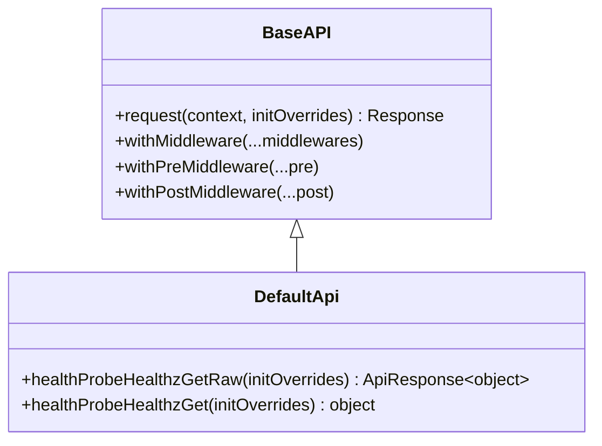
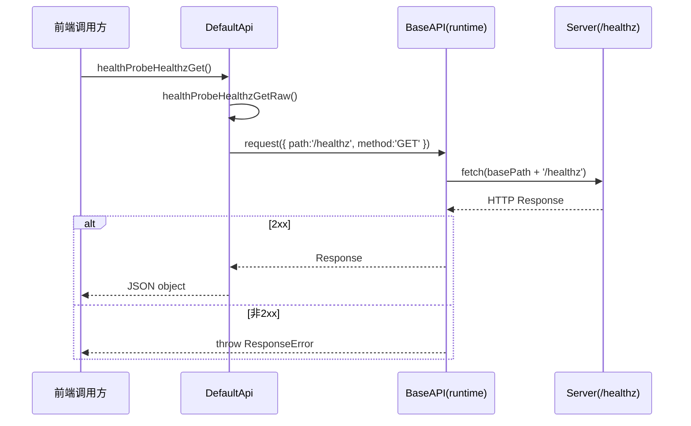

# frontend_default_api_client

## 模块简介

`frontend_default_api_client` 对应 `web/src/lib/api/apis/DefaultApi.ts`，是前端 OpenAPI 客户端中的“基础系统接口”封装层。在当前代码中，这个模块只暴露了一个健康检查接口（`GET /healthz`），但它的意义并不只是“请求一次健康状态”这么简单。它承担了前端与后端 Web 服务之间最基础的连通性验证职责，常用于应用启动探测、状态页轮询、反向代理连通性检查，以及在出现功能性 API 错误前先判断“服务是否存活”。

从设计上看，`DefaultApi` 继承了统一运行时基类 `BaseAPI`，因此它本身实现非常薄，重点放在 endpoint 路径、HTTP 方法和响应解包上，而把 URL 拼接、请求头合并、`fetch` 调用、中间件链、错误抛出策略等能力下沉给 `frontend_runtime_layer`。这符合 OpenAPI Generator 的典型架构：业务 API 类保持声明式、可再生，运行时机制集中复用。

如果你已经阅读过 [frontend_runtime_layer.md](frontend_runtime_layer.md)，可以把 `DefaultApi` 理解为“在运行时引擎上挂载的一个最小业务客户端”。本文将重点解释该模块本身的职责边界、方法语义、调用流程与可扩展实践。

---

## 模块在系统中的位置


这个调用链说明了该模块的核心定位：它是前端“探活入口”，而不是业务数据入口。真正的数据型接口（sessions/config/open-in/work-dirs）在各自模块中定义；`DefaultApi` 更像是一个最先被调用、最常用于守护流程的系统状态探针。这样分层的好处是，前端可以在执行复杂业务请求前，先用一个低成本 endpoint 判断后端是否可达。

与模块树对应关系如下：

- 本模块：`frontend_default_api_client`（`DefaultApi`）
- 依赖模块：`frontend_runtime_layer`（`BaseAPI`, `ApiResponse`, `JSONApiResponse`）
- 后端语义来源：`web_api` 中健康检查 endpoint（具体后端实现细节见 [web_api.md](web_api.md)）

---

## 核心组件：`DefaultApi`

`DefaultApi` 是一个由 OpenAPI Generator 自动生成的 TypeScript 类，继承 `runtime.BaseAPI`。由于继承关系，它天然具备以下能力：可配置 `basePath`、可插入中间件、可覆盖单次请求初始化参数、可统一处理非 2xx 错误。`DefaultApi` 自己只增加了 `healthProbeHealthzGetRaw` 与 `healthProbeHealthzGet` 两个方法，分别面向“原始响应包装访问”和“解包后业务值访问”。

### 类定义与继承关系



在这个继承结构里，`DefaultApi` 的方法只是把请求上下文（path、method、headers、query）组织好，然后调用父类 `request()` 执行。也就是说，`DefaultApi` 的“行为上限”由 runtime 决定；理解 runtime 的错误模型和中间件模型，是正确使用本模块的前提。

---

## 方法详解

## `healthProbeHealthzGetRaw(initOverrides?)`

这个方法是“底层版本”接口。它会发起 `GET /healthz` 请求，并返回 `runtime.ApiResponse<{ [key: string]: any }>`。返回值保留了两层信息：

1. `raw: Response`，可以读取状态码、响应头等底层信息。
2. `value()`，异步解析 JSON 后得到对象。

方法内部逻辑非常直接：构造空 query、空 header，设置 `urlPath = '/healthz'`，然后调用 `this.request(...)`。由于 `BaseAPI.request()` 仅接受 2xx 响应为成功，所以如果后端返回 503、500 或其它非 2xx，将抛出 `ResponseError`，而不是返回 `ApiResponse`。

### 参数

- `initOverrides?: RequestInit | runtime.InitOverrideFunction`

它允许你在单次请求上临时覆盖 fetch 参数。例如插入 `signal` 以支持超时取消、注入调试头、覆盖 credentials 等。

### 返回值

- `Promise<runtime.ApiResponse<{ [key: string]: any }>>`

这是“原始响应包装器”。适用于你需要同时访问 HTTP 元信息与 JSON 内容的场景。

### 示例

```ts
import { DefaultApi } from './lib/api/apis/DefaultApi';

const api = new DefaultApi();
const resp = await api.healthProbeHealthzGetRaw();

console.log(resp.raw.status);              // 例如 200
console.log(resp.raw.headers.get('date')); // 可读取 header
console.log(await resp.value());           // JSON 对象
```

---

## `healthProbeHealthzGet(initOverrides?)`

这个方法是“高层便捷版本”接口。它内部调用 `healthProbeHealthzGetRaw()`，随后执行 `response.value()`，直接返回解析后的 JSON 对象。对于多数前端业务代码，这是更常用的方法，因为你通常只关心健康检查结果本身，而不是底层 `Response`。

### 参数

- 与 Raw 版本一致：`initOverrides?: RequestInit | runtime.InitOverrideFunction`

### 返回值

- `Promise<{ [key: string]: any }>`

类型是通用字典对象，表明 OpenAPI 文档并未为该 endpoint 建立严格 schema（至少在当前生成结果中是如此）。

### 示例

```ts
const api = new DefaultApi(configuration);
const health = await api.healthProbeHealthzGet();

if (health?.status === 'ok') {
  console.log('backend alive');
}
```

---

## 请求执行过程（端到端）



该流程里有一个常被忽略的关键点：`DefaultApi` 不做状态码兼容处理，也不会吞掉异常。只要响应不是 2xx，就会直接进入异常路径。因此，健康检查通常应当放在 `try/catch` 内，以便将“服务不可用”转化为前端可展示状态，而不是让异常冒泡到全局错误边界。

---

## 配置与使用模式

虽然 `DefaultApi.ts` 本身看起来很轻量，但它的可配置能力来自父类构造时传入的 `Configuration`。这使得你可以按环境、部署形态或测试需求切换行为。

## 基础配置示例

```ts
import { Configuration } from './lib/api/runtime';
import { DefaultApi } from './lib/api/apis/DefaultApi';

const config = new Configuration({
  basePath: 'http://127.0.0.1:8000',
  credentials: 'include',
  headers: { 'X-Client': 'web-ui' },
});

const defaultApi = new DefaultApi(config);
const health = await defaultApi.healthProbeHealthzGet();
```

## 单次请求覆盖（`initOverrides`）

```ts
const health = await defaultApi.healthProbeHealthzGet(async ({ init }) => ({
  ...init,
  signal: AbortSignal.timeout(1500),
  headers: {
    ...(init.headers || {}),
    'X-Trace-Id': crypto.randomUUID(),
  },
}));
```

## 利用中间件做探活日志

```ts
const apiWithLog = defaultApi
  .withPreMiddleware(async ({ url, init }) => {
    console.debug('[healthz:req]', url, init.method);
    return { url, init };
  })
  .withPostMiddleware(async ({ response }) => {
    console.debug('[healthz:resp]', response.status);
    return response;
  });

await apiWithLog.healthProbeHealthzGet();
```

---

## 设计取舍与扩展建议

当前 `DefaultApi` 返回类型是 `{ [key: string]: any }`，这在生成客户端里属于“宽类型”策略，优点是兼容后端响应字段变化，缺点是前端缺少编译期约束。如果你希望提高类型安全，建议从 OpenAPI 规范层补充 health response schema（例如定义 `HealthResponse`），然后重新生成客户端。这样 `healthProbeHealthzGet()` 会得到稳定类型，而不是 `any` 字典。

此外，虽然该模块只有一个 endpoint，但非常适合作为“全局网络策略试验场”。例如你可以先在它上面验证：

- 自定义超时控制是否生效；
- 认证头注入中间件是否按预期工作；
- 错误监控（Sentry / APM）是否捕获到 `ResponseError`；
- 反向代理路径改写后 `basePath` 是否正确。

在确认机制正确后，再推广到其他 API 客户端模块，能显著降低联调风险。

---

## 边界行为、错误条件与限制

本模块虽然简单，但在生产环境里仍有一些关键注意事项。

首先，`BaseAPI.request()` 对非 2xx 响应统一抛错，因此健康检查的“失败”会体现为异常，而不是返回一个带失败状态的对象。调用方必须显式处理异常分支，否则可能把“服务暂时不可用”误当成未处理程序错误。

其次，`healthProbeHealthzGet()` 默认把响应当 JSON 解析。如果后端错误配置为纯文本返回（例如网关直接返回 HTML 错误页且误落在 2xx），`response.value()` 会在 JSON 解析阶段抛异常。遇到这类环境问题时应使用 Raw 版本先检查 `content-type` 与 `raw.text()`。

第三，方法内部没有传 query/header 参数，这通常是健康检查 endpoint 的预期行为；但如果你的部署链路需要额外头部（如租户标识、网关注入），请通过全局 `Configuration.headers` 或 `initOverrides` 注入，而不是修改生成代码。

第四，文件顶部明确标注“auto generated, do not edit manually”。任何直接改动都可能在下次生成时丢失。正确做法是修改 OpenAPI 描述、生成模板，或在外层封装自定义客户端。

---

## 与相关文档的关系

为了避免重复，以下主题建议阅读对应文档：

- 运行时机制（`BaseAPI`、中间件、错误模型、响应包装）：[frontend_runtime_layer.md](frontend_runtime_layer.md)
- 后端 Web 接口域模型与 API 总览：[web_api.md](web_api.md)、[data_models.md](data_models.md)
- 其他前端 API 客户端：`frontend_config_api_client`、`frontend_sessions_api_client`、`frontend_open_in_api_client`、`frontend_work_dirs_api_client`（各自独立文档）

---

## 总结

`frontend_default_api_client` 是一个“薄而关键”的模块。它以最小代码量提供了前端对后端存活状态的标准化访问入口，并通过继承 runtime 层能力获得了完整的请求配置、中间件扩展与错误处理机制。对于不熟悉该代码库的开发者而言，可以把它当作理解整个前端 OpenAPI 客户端体系的第一站：先掌握 `DefaultApi` 的调用模式与失败语义，再迁移到更复杂的业务 API，会更高效且更少踩坑。
