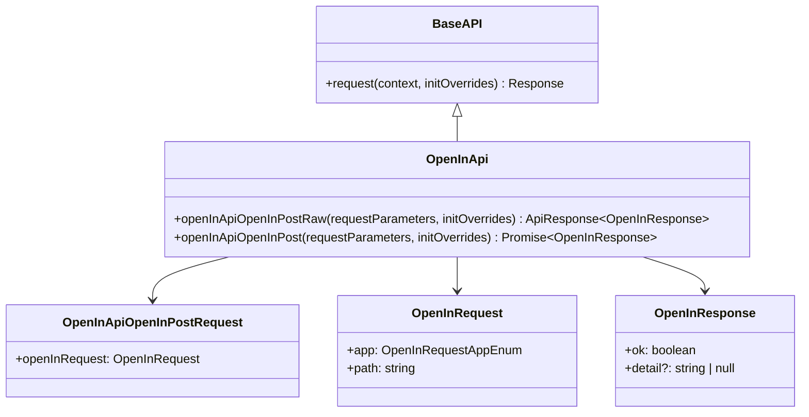
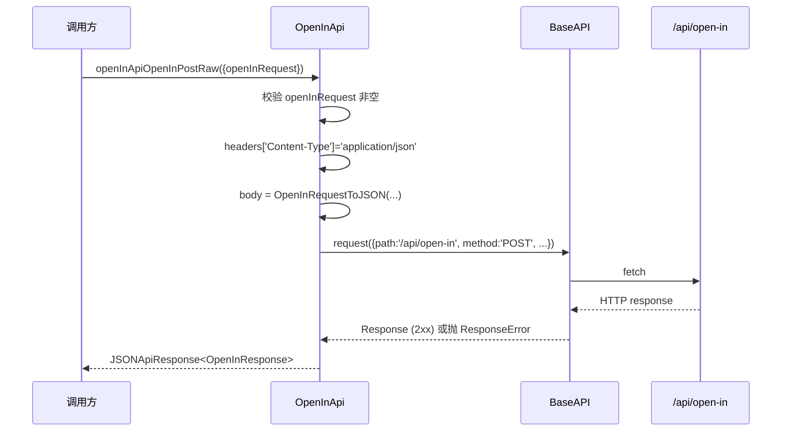
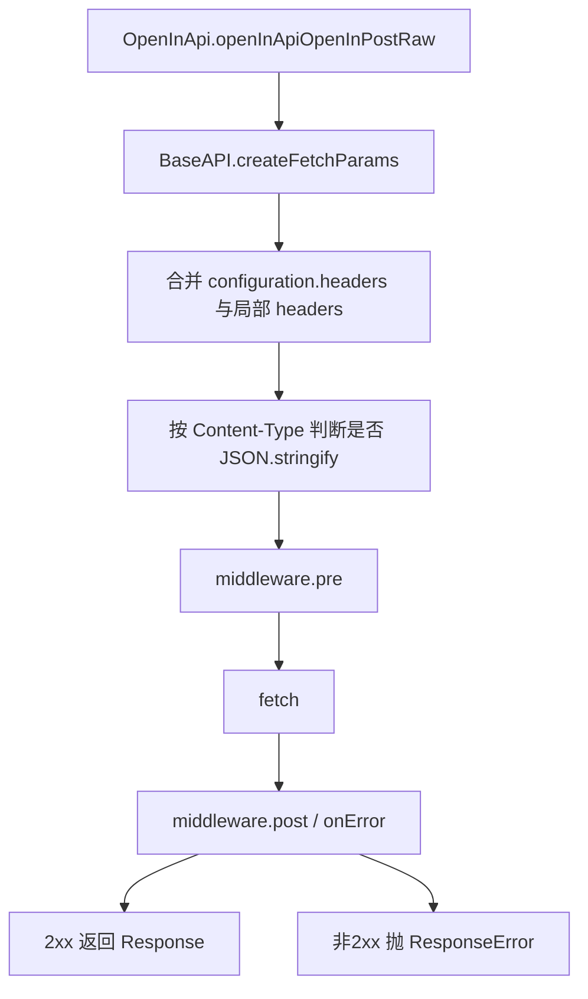

# frontend_open_in_api_client

## 模块简介

`frontend_open_in_api_client` 对应前端生成客户端文件 `web/src/lib/api/apis/OpenInApi.ts`，核心组件是 `OpenInApi` 类。这个模块的职责非常专一：为前端提供一个类型化、可复用、可配置的接口，用于调用后端 `POST /api/open-in`，从而触发“在本地应用中打开某个路径”的能力。

它存在的意义并不只是“省去手写 fetch”，而是把一个与宿主机行为强相关、错误边界复杂（平台限制、路径可用性、应用安装状态）的接口，封装进统一的 OpenAPI 客户端运行时。这样 UI 层可以专注于交互和状态管理，而把请求构造、参数校验、序列化和错误抛出机制交给统一基础设施处理。

从模块树看，它属于 `web_frontend_api` 子模块，依赖 `frontend_runtime_layer`（`BaseAPI`、`JSONApiResponse`、`RequiredError` 等），并与后端 `open_in_api` 一一对应。后端行为语义（macOS 限制、命令执行分支等）请参考 [open_in_api.md](open_in_api.md)；本文重点解释前端客户端侧的设计与使用。

---

## 在系统中的定位


这条链路体现了模块边界：`OpenInApi` 只负责把输入变成标准 HTTP 请求并解析响应，不负责任何系统命令执行。真正副作用发生在后端宿主机，因此前端调用成功并不等于“前端机器本地应用被打开”，而是“后端服务所在机器执行成功”。这是此模块最容易被误解的点之一。

---

## 核心组件结构

`OpenInApi.ts` 中结构很小，但设计模式与整个生成客户端一致：



`OpenInApi` 继承 `BaseAPI`，所以共享统一请求管线、middleware、错误模型。模块只有一个 endpoint，对外暴露两层方法：

- `openInApiOpenInPostRaw(...)`：返回 `ApiResponse<OpenInResponse>`，保留原始 `Response`。
- `openInApiOpenInPost(...)`：便捷封装，直接返回 `OpenInResponse`。

---

## 请求模型与响应模型

### `OpenInRequest`

请求体来自 `web/src/lib/api/models/OpenInRequest.ts`，包含两个字段：`app` 和 `path`。其中 `app` 被限制为枚举值：`finder | cursor | vscode | iterm | terminal | antigravity`。这与后端 `Literal[...]` 保持一致，能在前端阶段减少非法入参。

示例：

```ts
import { OpenInRequestAppEnum } from '@/lib/api/models/OpenInRequest';

const body = {
  app: OpenInRequestAppEnum.Vscode,
  path: '/Users/alice/project/src/index.ts',
};
```

### `OpenInResponse`

响应体来自 `web/src/lib/api/models/OpenInResponse.ts`，结构为：

- `ok: boolean`（成功标记）
- `detail?: string | null`（可选附加信息）

实践上，成功通常返回 `{ ok: true }`。错误场景多数不会返回 `ok: false`，而是直接由运行时抛异常（例如 HTTP 400/500）。因此调用方应把“是否抛异常”作为主要失败判断，而不是仅检查 `ok` 字段。

---

## `OpenInApi` 内部执行机制

### 1) `openInApiOpenInPostRaw(...)`

这是底层方法，完整负责参数校验、请求构造、序列化和响应封装。

执行流程如下：



关键实现点：

- 若 `openInRequest` 为 `null/undefined`，会在本地立即抛 `runtime.RequiredError`，不会发起网络请求。
- 请求头固定设置 `Content-Type: application/json`。
- 请求体通过 `OpenInRequestToJSON` 生成，避免手写序列化不一致。
- 成功响应封装为 `new runtime.JSONApiResponse(response, OpenInResponseFromJSON)`。

### 2) `openInApiOpenInPost(...)`

这是业务调用最常用的方法。它只是：

1. 调用 `openInApiOpenInPostRaw(...)`；
2. 对返回执行 `await response.value()`；
3. 返回强类型 `OpenInResponse`。

它简化了 95% 场景下的调用代码，除非你要读取 `status`、`headers` 或原始 body，否则应优先用这个方法。

---

## 与运行时层的关系（`frontend_runtime_layer`）

`OpenInApi` 自身代码很薄，很多行为由 `runtime.BaseAPI` 决定：



这意味着你可以通过 `Configuration` 和 middleware 全局影响此模块行为，例如：注入认证头、日志埋点、错误重试（注意幂等性）、请求追踪 ID 等。更多运行时机制建议参考 [frontend_runtime_layer.md](frontend_runtime_layer.md)。

---

## 典型使用方式

### 基础调用

```ts
import { Configuration } from '@/lib/api/runtime';
import { OpenInApi } from '@/lib/api/apis/OpenInApi';
import { OpenInRequestAppEnum } from '@/lib/api/models/OpenInRequest';

const api = new OpenInApi(new Configuration({
  basePath: 'http://127.0.0.1:8000',
}));

await api.openInApiOpenInPost({
  openInRequest: {
    app: OpenInRequestAppEnum.Finder,
    path: '/Users/alice/project/README.md',
  },
});
```

### 带 initOverrides 的单次请求控制

```ts
await api.openInApiOpenInPost(
  {
    openInRequest: { app: OpenInRequestAppEnum.Terminal, path: '/Users/alice/project' },
  },
  {
    signal: abortController.signal,
    // credentials/headers 也可在此覆盖
  }
);
```

### 使用 Raw 方法读取原始响应

```ts
const rawResp = await api.openInApiOpenInPostRaw({
  openInRequest: { app: OpenInRequestAppEnum.Vscode, path: '/Users/alice/project' },
});

console.log(rawResp.raw.status);   // 例如 200
console.log(await rawResp.value());
```

---

## 配置与扩展建议

在工程实践中，`OpenInApi` 通常不会单独实例化太多次，而是与其他 API 客户端共用一个 `Configuration`，确保 `basePath`、headers、credentials、一致的 middleware 策略保持统一。若系统已有 API 工厂层，建议把该模块接入统一工厂，避免环境切换时遗漏配置。

如果你需要扩展“打开应用”能力（例如新增 `zed`、`sublime`），前端侧通常只需要两步：先更新后端 OpenAPI 文档，再重新生成前端模型与 API 客户端。不要手改生成文件，否则后续 regenerate 会覆盖改动。

---

## 错误处理、边界条件与限制

### 参数错误

`openInRequest` 缺失时会抛 `RequiredError`。这是本地同步错误，适合在调用层直接捕获并视为编程错误（而非用户操作错误）。

### HTTP 非 2xx

后端返回 4xx/5xx 时，`BaseAPI.request` 会抛 `ResponseError`。常见原因包括：

- 平台不是 macOS（后端返回 400）；
- 路径不存在（400）；
- 应用未安装或命令执行失败（500）；
- 鉴权失败（如部署时启用鉴权策略）。

### 网络错误

fetch 失败会抛 `FetchError` 或底层异常，取决于 middleware 是否接管。应在 UI 层将其展示为“服务不可达/网络异常”。

### 类型与语义限制

尽管 `OpenInResponse` 包含 `ok` 字段，但失败通常通过抛错表达，不应依赖 `{ ok: false }` 作为统一失败信号。

另外，这个接口有“宿主机语义”：Web 前端发出的路径最终在后端机器解析。如果你的前后端不在同一台机器，本地路径很可能无效，这是产品集成阶段最常见误区。

---

## 与其他模块的协作关系

`frontend_open_in_api_client` 与 `frontend_sessions_api_client`、`frontend_config_api_client` 在技术结构上相同，都是 OpenAPI 生成的 typed client，底层共享 runtime。若你已经熟悉 [frontend_sessions_api_client.md](frontend_sessions_api_client.md) 的 Raw/非 Raw 双层调用模型，那么这个模块几乎零学习成本。

在业务层面，它通常与会话文件浏览能力配合使用：用户在前端看到路径后点击“Open in VS Code/Finder”，由本模块发请求，后端执行系统命令。会话文件读取与路径选择逻辑见 [frontend_sessions_api_client.md](frontend_sessions_api_client.md) 与 [sessions_api.md](sessions_api.md)。

---

## 维护者注意事项

此文件和源代码均由 OpenAPI Generator 风格主导。维护时应遵循“改规范、再生成”的流程，而不是手工修改 `OpenInApi.ts`。如果你发现字段命名、错误 schema、响应类型不理想，正确修复位置是后端 OpenAPI schema 及生成配置。

对于前端应用开发者来说，推荐把该模块视为“纯传输层”：

1. 在上层封装统一错误翻译（例如将 `ResponseError` 映射为用户可读消息）；
2. 在 UI 层对 `app` 和 `path` 做预校验；
3. 对远程部署场景明确提示“open-in 在服务端机器执行”。

这样可以显著减少误报和支持成本。
