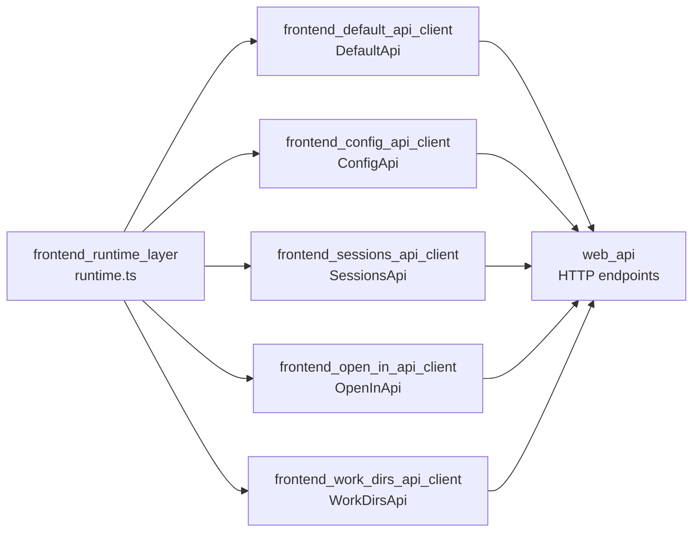
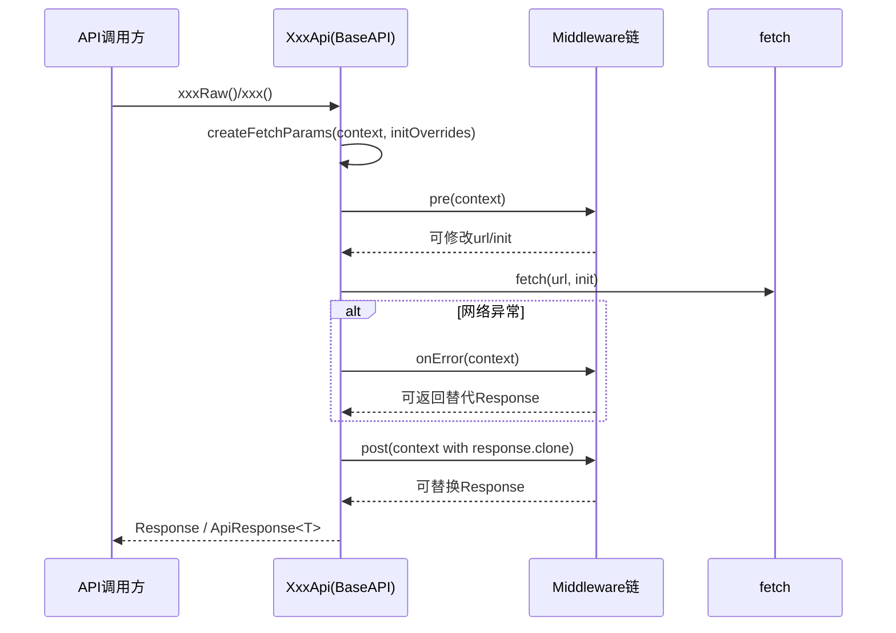
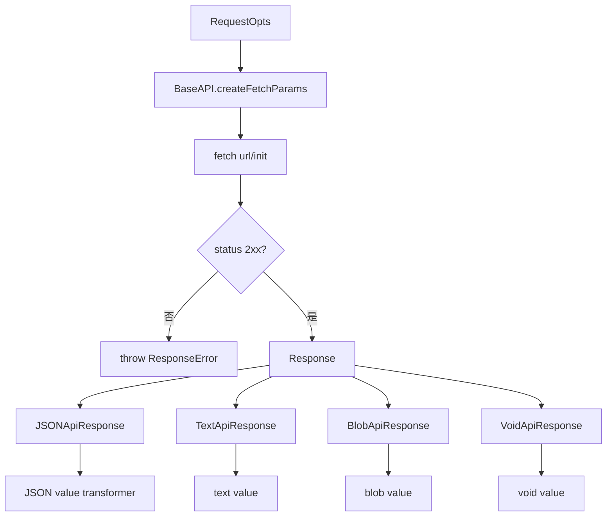

# frontend_runtime_layer

## 模块简介

`frontend_runtime_layer` 是 `web_frontend_api` 中所有前端 API Client 的运行时基础设施层，对应代码文件为 `web/src/lib/api/runtime.ts`。这个模块并不直接定义业务接口（例如 sessions/config/open-in 的具体 endpoint），而是提供了“如何发请求、如何序列化、如何处理错误、如何扩展中间件、如何把 Response 转成不同数据类型”的统一机制。简而言之，它是 OpenAPI 生成客户端中的“传输与响应抽象内核”。

从架构职责上看，这一层解决了三个关键问题。第一，它通过 `Configuration` 与 `BaseAPI` 把网络层细节（basePath、headers、credentials、fetch 实现、中间件链）集中管理，避免每个 API 类重复实现。第二，它通过 `ApiResponse` 族（`JSONApiResponse`、`TextApiResponse`、`VoidApiResponse`、`BlobApiResponse`）实现“原始响应与类型值解包”分离，让上层在需要时可同时访问 `raw` 和 `value()`。第三，它把失败路径标准化为 `ResponseError`、`FetchError` 与 `RequiredError`，使调用方能稳定区分“HTTP 非 2xx”“网络异常”“参数缺失”三类错误。

在你提供的模块树中，`frontend_runtime_layer` 是 `frontend_default_api_client`、`frontend_config_api_client`、`frontend_sessions_api_client`、`frontend_open_in_api_client`、`frontend_work_dirs_api_client` 的共同依赖基础。这意味着对 runtime 层的理解，直接决定了你如何正确使用所有前端 API 客户端。

---

## 模块定位与系统关系



这个关系图说明：业务 API 类只负责“拼 endpoint + 组装参数 + 选择响应包装器”，真正的请求构建、拦截链、异常语义、内容序列化都在 runtime 层完成。你可以把 API 类理解成 declarative 的 endpoint 描述器，而 runtime 层才是 imperative 的执行引擎。

如果你需要接口业务语义（例如 `Session`、`UpdateConfigTomlRequest`、`OpenInRequest`）请参考：[sessions_api.md](sessions_api.md)、[config_api.md](config_api.md)、[open_in_api.md](open_in_api.md)、[data_models.md](data_models.md)、[web_api.md](web_api.md)。本文聚焦运行时机制，不重复业务字段定义。

---

## 核心组件详解

## `VoidApiResponse`

`VoidApiResponse` 用于表示“调用成功但调用方不关心响应体”的场景。它持有 `raw: Response`，并提供统一接口 `value(): Promise<void>`。在实现中，`value()` 固定返回 `undefined`，不会尝试解析 JSON/Text/Blob。

这类包装在两种情况下非常有价值：其一，后端语义上是 204/空响应；其二，虽然有响应体，但前端调用链只关心状态副作用（例如成功即可）。它与 `JSONApiResponse` 的差异不在“请求阶段”，而在“消费阶段”：请求过程一致，差异仅体现在 `value()` 如何解码。

### 构造与行为

```ts
export class VoidApiResponse {
  constructor(public raw: Response) {}

  async value(): Promise<void> {
    return undefined;
  }
}
```

- 参数：`raw`，原始 `fetch` 响应对象。
- 返回：`value()` 返回 `Promise<void>`。
- 副作用：无额外 I/O；不会读取 body stream。

### 使用示例

```ts
const rawResponse = await api.request(...); // 假设可访问
const wrapped = new VoidApiResponse(rawResponse);
await wrapped.value(); // => undefined
```

实践上，OpenAPI 生成代码通常在 endpoint 方法中直接返回对应 `ApiResponse` 子类；业务调用者多数使用简化方法（非 `Raw` 方法），因此 `VoidApiResponse` 常被“隐式”使用。

---

## `BlobApiResponse`

`BlobApiResponse` 面向二进制响应（下载文件、媒体流快照、非 JSON 内容的 blob 消费）。它同样持有 `raw: Response`，但 `value()` 会调用 `raw.blob()` 返回 `Promise<Blob>`。

### 构造与行为

```ts
export class BlobApiResponse {
  constructor(public raw: Response) {}

  async value(): Promise<Blob> {
    return await this.raw.blob();
  }
}
```

- 参数：`raw`，原始响应。
- 返回：`Blob`。
- 副作用：会消费 response body stream；同一个 body 只能读取一次（除非使用 clone）。

### 使用示例：前端下载

```ts
const resp = await someApi.downloadSomethingRaw(...); // 返回 ApiResponse<Blob> 或自行封装
const blob = await resp.value();
const url = URL.createObjectURL(blob);

const a = document.createElement('a');
a.href = url;
a.download = 'result.bin';
a.click();
URL.revokeObjectURL(url);
```

如果你的生成 API 方法当前返回的是 `TextApiResponse`/`JSONApiResponse`，但后端实际返回二进制，那么需要在生成模板或接口定义上对 content-type 做正确声明，否则会出现类型与运行时解码不一致。

---

## 运行时基础设施（理解上述两个响应类所必需）

虽然当前模块树将核心组件标记为 `VoidApiResponse` 和 `BlobApiResponse`，但它们依赖 `BaseAPI` 的完整执行流程。以下内容是理解实际行为所必须的上下文。

## `Configuration`：全局请求行为配置

`Configuration` 封装所有可注入运行时参数，包括：
- `basePath`
- `fetchApi`
- `middleware`
- `queryParamsStringify`
- 鉴权字段（`username/password/apiKey/accessToken`）
- 全局 `headers`
- `credentials`

重点在于两个 getter 的“归一化”行为：
- `apiKey`：如果传入的是字符串，会包装为函数 `() => apiKey`。
- `accessToken`：如果传入的是字符串/Promise，会包装为异步函数。

这种设计让上层调用总能按函数调用鉴权信息，支持动态 token 刷新场景。

## `BaseAPI`：请求生命周期总控

`BaseAPI` 是所有生成 API 类的父类。请求路径由以下步骤组成：



### 关键执行点

`request()` 会在 fetch 完成后检查状态码：仅 `200-299` 视为成功，否则抛出 `ResponseError`。因此 `xxxRaw()` 方法在成功路径下总是返回包装后的 `ApiResponse`，失败路径统一抛异常。

`createFetchParams()` 负责：
1. 拼接 `basePath + path`
2. 若有 query 参数则调用 `queryParamsStringify`
3. 合并 `configuration.headers` 与 `context.headers`
4. 应用 `initOverrides`（对象或函数）
5. 根据 `Content-Type` 决定 body 序列化（JSON.stringify 或原样）

这意味着 `BlobApiResponse` 与 `VoidApiResponse` 只负责“响应解包”；真正决定请求内容是否正确的是 `createFetchParams()`。

---

## 数据流与类型流



在 `frontend_*_api_client` 中，具体选择哪种包装器由 endpoint 方法决定，例如：
- 常规 JSON endpoint：`new JSONApiResponse(...)`
- 根据响应头动态 JSON/Text：`isJsonMime(...) ? JSON : Text`
- 二进制 endpoint（若 OpenAPI 正确标注）：应选择 `BlobApiResponse`
- 无需 body 的 endpoint：可选择 `VoidApiResponse`

---

## 与其他前端 API 模块的协作方式

当前各 API 客户端（`DefaultApi`/`ConfigApi`/`SessionsApi`/`OpenInApi`/`WorkDirsApi`）都继承 `BaseAPI`，并调用 `this.request(...)`。它们的“薄层化”非常明显：

1. 参数空值检查：缺参数时抛 `RequiredError`。
2. 拼路径与 query。
3. 设置 content-type（如 `application/json` 或 `multipart/form-data`）。
4. 选择响应包装器。

这也是 runtime 层存在的核心原因：把所有“跨接口重复逻辑”抽到同一处，减少生成代码复杂度并提升一致性。

---

## 典型使用模式

## 1) 全局配置 + 基础调用

```ts
import { Configuration } from './runtime';
import { SessionsApi } from './apis/SessionsApi';

const config = new Configuration({
  basePath: 'http://127.0.0.1:5173',
  headers: { 'X-Client': 'kimi-web' },
  credentials: 'include',
});

const sessionsApi = new SessionsApi(config);
const sessions = await sessionsApi.listSessionsApiSessionsGet({ limit: 20 });
```

## 2) 中间件注入（日志 + 错误观测）

```ts
const api = new SessionsApi(config)
  .withPreMiddleware(async ({ url, init }) => {
    console.debug('[REQ]', url, init.method);
    return { url, init };
  })
  .withPostMiddleware(async ({ response }) => {
    console.debug('[RESP]', response.status);
    return response;
  });
```

## 3) 针对单次请求覆盖初始化参数

```ts
await sessionsApi.getSessionApiSessionsSessionIdGet(
  { sessionId: 'abc' },
  async ({ init }) => ({
    ...init,
    headers: { ...(init.headers || {}), 'X-Trace-Id': crypto.randomUUID() },
  })
);
```

---

## 边界行为、错误条件与常见陷阱

`frontend_runtime_layer` 的行为整体稳定，但有几个非常容易踩坑的点。

首先，`request()` 对非 2xx 一律抛 `ResponseError`，不会自动把 4xx/5xx 解析成业务对象。若你的后端把错误详情放在 JSON body 中，你必须在 `catch(ResponseError)` 中手动读取 `error.response`。

其次，`querystringSingleKey()` 对 `null/undefined` 的处理是 `String(value)`，也就是会编码成 `"null"` 或 `"undefined"` 字符串。由于 `HTTPQuery` 类型允许 `null`，这可能导致后端收到意外参数值。生产中建议在传入 query 前先清洗空值，或自定义 `queryParamsStringify`。

第三，JSON 序列化依赖请求头 `Content-Type` 是否匹配 JSON MIME。如果你 body 是对象，但忘了设置 `Content-Type: application/json`，`createFetchParams()` 不会 `JSON.stringify`，最终可能发送 `[object Object]` 或触发 fetch 层错误。

第四，`BlobApiResponse.value()` 会消费 body stream；若你还想读取 `text()` 或 `json()`，需要先 `raw.clone()` 并分别读取副本。

第五，中间件的 `post` 收到的是 `response.clone()`，这避免了中间件与主流程争抢同一 body stream，但如果中间件返回了替代 `Response`，主流程将使用它继续向下传递。替代响应必须保证语义完整（状态码、header、body）以避免后续解析异常。

第六，`withMiddleware()` 通过 `clone()` 产生浅拷贝 API 实例。`configuration` 是共享引用，不是深拷贝；如果你在外部可变修改 `configuration` 内部对象（如 headers），会影响所有实例。

---

## 可扩展性建议

如果你需要在项目里扩展 runtime 层能力，推荐按以下策略进行：

- 认证自动注入：通过 `pre` middleware 从状态容器读取最新 token 并写入 header，而不是在每次调用点手动拼接。
- 统一重试：在 `onError` middleware 中实现网络错误重试，或对特定状态码返回兜底响应。
- 可观测性：在 `pre/post/onError` 中接入 tracing、埋点与性能统计。
- Query 规范化：通过 `Configuration.queryParamsStringify` 替换默认实现，避免 `null/undefined` 字符串化问题。

这些扩展都无需修改 `frontend_*_api_client` 具体 endpoint 代码，能最大化利用 runtime 层的抽象边界。

---

## 组件速查（当前模块核心）

| 组件 | 作用 | 输入 | 输出 | 备注 |
|---|---|---|---|---|
| `VoidApiResponse` | 空结果响应包装 | `raw: Response` | `Promise<void>` | 仅保留原始响应，不解析 body |
| `BlobApiResponse` | 二进制响应包装 | `raw: Response` | `Promise<Blob>` | 调用 `raw.blob()`，消费 body stream |

---

## 总结

`frontend_runtime_layer` 的价值不在“业务接口数量”，而在“请求执行一致性”。`VoidApiResponse` 和 `BlobApiResponse` 分别覆盖了空响应与二进制响应两类常见但容易被忽略的返回形态，使生成 API 客户端可以用统一模式处理不同 content type。结合 `BaseAPI` 的中间件与错误模型，这一层为整个 `web_frontend_api` 提供了可配置、可扩展、可观测的调用底座。
