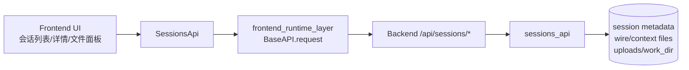
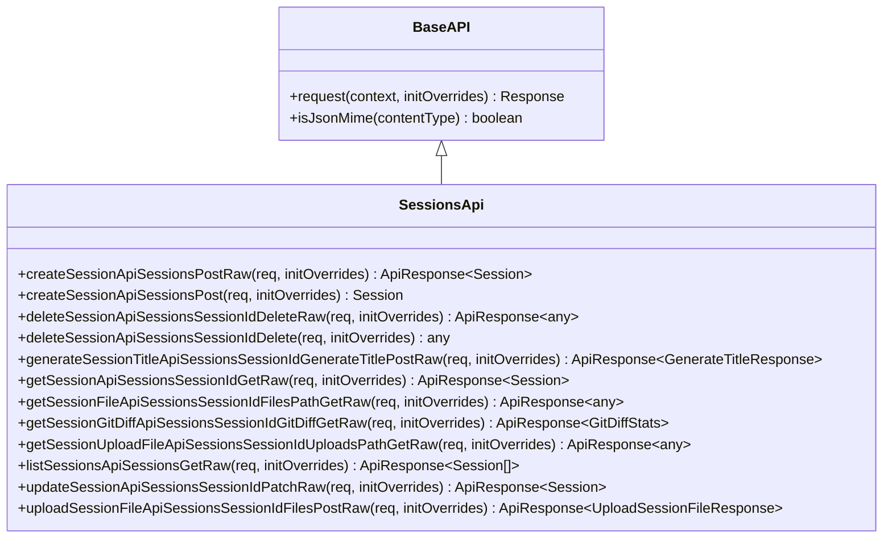
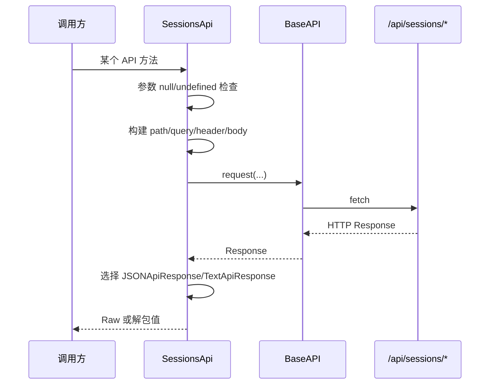
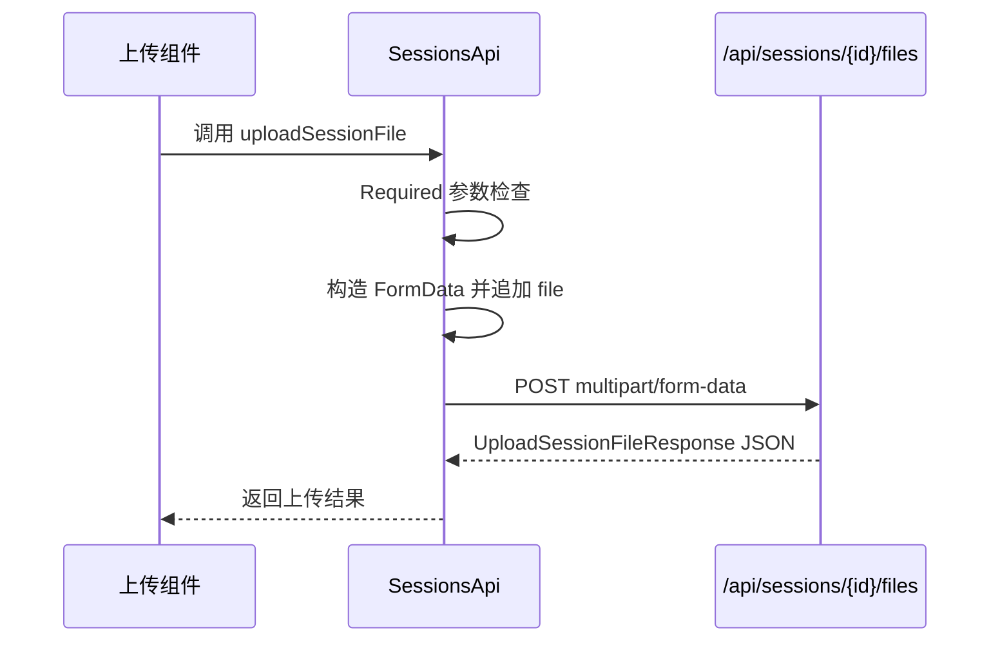

# frontend_sessions_api_client

## 模块简介

`frontend_sessions_api_client` 对应 `web/src/lib/api/apis/SessionsApi.ts`，核心组件是 `SessionsApi` 类。这个模块是前端访问“会话（session）生命周期与会话文件能力”的统一入口，覆盖了从会话创建、查询、更新、删除，到会话目录读取、上传文件、Git 变更统计、标题生成等一整套调用面。

它存在的根本价值，不是“把 fetch 封装一下”这么简单，而是把前端与后端 `sessions_api` 的契约固定为可类型检查、可复用、可再生的 API 客户端。由于会话相关接口通常跨越多个子域（会话元数据、工作目录、上传目录、AI 标题服务、Git 状态），如果在 UI 层分散手写 HTTP 请求，很容易出现路径拼接错误、参数遗漏、序列化不一致、错误处理语义漂移等问题。`SessionsApi` 通过 OpenAPI 生成代码把这些风险前置到编译期与统一运行时中。

从模块树关系看，它位于 `web_frontend_api` 子系统中，依赖 `frontend_runtime_layer`（`BaseAPI`、`JSONApiResponse`、`TextApiResponse`、`RequiredError` 等），并与后端 `web_api` 中的 `sessions_api` 形成一一对应。若你想深入后端语义（例如分叉会话的真实实现、权限与敏感路径限制、WebSocket 历史回放机制），请结合阅读 [sessions_api.md](sessions_api.md) 与 [web_api.md](web_api.md)；本文聚焦前端客户端侧行为与调用实践。

---

## 模块在系统中的定位



这条链路体现了一个关键设计：`SessionsApi` 是“前端契约层”，负责把调用参数转换成符合 OpenAPI 的 HTTP 请求；真正业务副作用（写磁盘、更新元数据、读目录、生成标题）发生在后端。也正因为如此，`SessionsApi` 的可维护性重点在于请求构造一致性、类型映射稳定性和错误语义稳定性，而不是业务规则本身。

---

## 核心组件与结构

`SessionsApi.ts` 主要由两部分组成。第一部分是请求参数接口（`...Request`），用于约束每个 endpoint 的 path/query/body 参数。第二部分是 `SessionsApi` 类本体，每个 endpoint 都提供两层方法：`xxxRaw` 与 `xxx`。



`xxxRaw` 方法返回 `ApiResponse<T>`，保留 `raw: Response` 与 `value()` 双通道；`xxx` 方法是便捷层，直接 `await response.value()` 返回业务值。多数业务代码使用便捷层即可，只有当你需要读取 header、状态码或做更细粒度调试时才需要 `Raw`。

---

## 请求生命周期与内部工作机制

在 `SessionsApi` 中，每个方法内部步骤都高度一致：先做必填参数检查，再构造 path/query/header/body，最后调用 `this.request(...)` 发起请求，并按响应类型封装为 `JSONApiResponse` 或 `TextApiResponse`。



这里有三个实践层面的关键点。第一，参数缺失是在请求发出前本地抛出 `runtime.RequiredError`，这类错误不会触发网络层。第二，非 2xx 状态由 `BaseAPI.request` 统一抛错（通常是 `ResponseError`），不会进入 JSON 解包路径。第三，个别接口采用“按响应头动态 JSON/Text”的策略，返回类型是 `any`，调用方需要自己做运行时类型守卫。

---

## 请求参数接口（`...Request`）说明

`SessionsApi.ts` 中定义了 10 个请求包装接口，用于把 endpoint 参数统一放在对象中传入。这样做的好处是签名可扩展，避免日后新增 query/path/body 参数导致调用点全部重写。

主要接口包括：

- `CreateSessionApiSessionsPostRequest`：`createSessionRequest?`
- `DeleteSessionApiSessionsSessionIdDeleteRequest`：`sessionId`
- `GenerateSessionTitleApiSessionsSessionIdGenerateTitlePostRequest`：`sessionId` + `generateTitleRequest?`
- `GetSessionApiSessionsSessionIdGetRequest`：`sessionId`
- `GetSessionFileApiSessionsSessionIdFilesPathGetRequest`：`sessionId` + `path`
- `GetSessionGitDiffApiSessionsSessionIdGitDiffGetRequest`：`sessionId`
- `GetSessionUploadFileApiSessionsSessionIdUploadsPathGetRequest`：`sessionId` + `path`
- `ListSessionsApiSessionsGetRequest`：`limit?`、`offset?`、`q?`、`archived?`
- `UpdateSessionApiSessionsSessionIdPatchRequest`：`sessionId` + `updateSessionRequest`
- `UploadSessionFileApiSessionsSessionIdFilesPostRequest`：`sessionId` + `file: Blob`

虽然这些接口多数字段名很直观，但它们并不等价于“后端必然全部必填”。例如创建会话与生成标题的 body 在客户端是可选的，这是为了匹配后端允许默认行为（例如空 body 时后端自动从首轮消息生成标题）。

---

## `SessionsApi` 方法详解

## 1) 创建会话

`createSessionApiSessionsPostRaw` / `createSessionApiSessionsPost` 对应 `POST /api/sessions/`。该方法会设置 `Content-Type: application/json`，把 `createSessionRequest` 通过 `CreateSessionRequestToJSON` 序列化后发送，返回 `Session`。

该方法 body 参数在客户端是可选的，因此你可以“空请求创建会话”，由后端采用默认工作目录策略。副作用是后端会创建新的会话目录与元数据；客户端侧无额外副作用。

示例：

```ts
const session = await sessionsApi.createSessionApiSessionsPost({
  createSessionRequest: {
    workDir: '/path/to/repo',
    createDir: false,
  },
});
```

---

## 2) 删除会话

`deleteSessionApiSessionsSessionIdDeleteRaw` / `deleteSessionApiSessionsSessionIdDelete` 对应 `DELETE /api/sessions/{session_id}`。`sessionId` 必填，缺失时立即抛 `RequiredError`。

该方法返回值是 `any`，并且会根据 `content-type` 动态走 JSON 或文本解码。这种设计提高了兼容性，但会降低静态类型安全。若你只依赖“删除成功与否”，建议以“是否抛异常”作为主判断，不要对响应体结构做强假设。

---

## 3) 生成会话标题

`generateSessionTitleApiSessionsSessionIdGenerateTitlePostRaw` / 非 Raw 版本对应 `POST /api/sessions/{session_id}/generate-title`。请求体 `generateTitleRequest` 可选，后端允许在缺省参数下自动从 `wire.jsonl` 的首轮消息推断标题。

该方法返回 `GenerateTitleResponse`，适合在会话列表中实现“自动命名”或“手动触发重新生成标题”交互。需要注意，这个接口是典型“高业务语义”接口：前端只负责调用，真正的降级策略、重试上限、是否复用已有标题由后端决定（见 [sessions_api.md](sessions_api.md)）。

---

## 4) 读取单会话

`getSessionApiSessionsSessionIdGetRaw` / 非 Raw 版本对应 `GET /api/sessions/{session_id}`，返回 `Session`。`sessionId` 必填。

这是会话详情页最常用的读取接口之一。由于 `SessionFromJSON` 负责模型映射，调用方通常能直接获得 camelCase 风格字段。

---

## 5) 读取会话工作目录文件/目录

`getSessionFileApiSessionsSessionIdFilesPathGetRaw` / 非 Raw 版本对应 `GET /api/sessions/{session_id}/files/{path}`，参数 `sessionId` 与 `path` 均必填。

该接口返回 `any`，并按响应头动态 JSON/Text 解码：如果后端返回目录列表之类 JSON，就走 `JSONApiResponse`；如果返回纯文本文件内容，就走 `TextApiResponse`。这意味着调用方必须自己判断结果结构，而不能假设固定 schema。

还要特别注意一个 URL 编码细节：方法对 `{path}` 使用 `encodeURIComponent`。如果你传入包含斜杠的相对路径（如 `src/main.py`），会被编码为 `%2F`。在多数后端框架中这通常可被还原，但在某些代理或路由配置下可能出现路径解释差异，建议联调时重点验证深层目录场景。

---

## 6) 获取会话 Git Diff 统计

`getSessionGitDiffApiSessionsSessionIdGitDiffGetRaw` / 非 Raw 版本对应 `GET /api/sessions/{session_id}/git-diff`，返回强类型 `GitDiffStats`。

这个接口常用于会话列表或详情中的“改动摘要”展示。由于返回 schema 明确，相对适合做稳定 UI 绑定。

---

## 7) 读取会话上传目录文件

`getSessionUploadFileApiSessionsSessionIdUploadsPathGetRaw` / 非 Raw 版本对应 `GET /api/sessions/{session_id}/uploads/{path}`。与工作目录文件接口类似，它同样根据 `content-type` 动态返回 JSON 或文本，类型为 `any`。

当你读取的是二进制上传文件时，要格外小心：当前生成方法并未使用 `BlobApiResponse`，因此若后端返回二进制且 `content-type` 非 JSON，客户端会按 text 解码，这可能不是你期望的行为。若产品需要稳定下载二进制附件，建议在 OpenAPI 规范中显式声明 binary 响应并重新生成客户端，或在应用层改走原生 fetch。

---

## 8) 列出会话

`listSessionsApiSessionsGetRaw` / 非 Raw 版本对应 `GET /api/sessions/`，支持可选 query：`limit`、`offset`、`q`、`archived`，返回 `Session[]`。

该方法把非空 query 字段追加到 URL，未提供字段不会写入 query。要注意 `archived` 语义由后端定义，常见约定是：`null/undefined` 返回非归档会话，`true` 返回归档会话。

示例：

```ts
const sessions = await sessionsApi.listSessionsApiSessionsGet({
  limit: 50,
  offset: 0,
  q: 'monorepo',
  archived: false,
});
```

---

## 9) 更新会话

`updateSessionApiSessionsSessionIdPatchRaw` / 非 Raw 版本对应 `PATCH /api/sessions/{session_id}`。`sessionId` 与 `updateSessionRequest` 均为必填；缺失任一会在本地抛 `RequiredError`。

该方法会发送 JSON body 并返回更新后的 `Session`。典型场景是改标题、归档/取消归档。是否允许更新、忙碌态是否拒绝等策略由后端控制。

---

## 10) 上传文件到会话

`uploadSessionFileApiSessionsSessionIdFilesPostRaw` / 非 Raw 版本对应 `POST /api/sessions/{session_id}/files`。`sessionId` 与 `file: Blob` 必填。

它会根据 `multipart/form-data` 能力选择 `FormData` 作为 body，并将文件以字段名 `file` 追加。最终返回 `UploadSessionFileResponse`。



实践中应关注文件体积与取消上传能力。该方法本身不内建进度回调，也不内建分片上传；若要支持大文件进度条，需要在调用层结合 `XMLHttpRequest` 或自定义上传通道。

---

## 与模型层和运行时层的协作

`SessionsApi` 大量依赖 `../models/index` 中的 `FromJSON/ToJSON` 函数，例如 `SessionFromJSON`、`UpdateSessionRequestToJSON`、`GitDiffStatsFromJSON`。这些函数承担了命名映射与可选字段处理职责。`SessionsApi` 本身几乎不做业务字段转换，保持了“传输层薄封装”的生成代码风格。

它还导入了 `HTTPValidationError` 相关类型与转换函数，但本文件中未直接使用，这是 OpenAPI 生成器的常见产物，通常用于保留 schema 引用完整性，并不代表逻辑问题。

关于 `BaseAPI.request` 的 2xx 判定、中间件、`initOverrides` 行为，请参考 [frontend_runtime_layer.md](frontend_runtime_layer.md)。

---

## 典型使用方式

## 基础初始化

```ts
import { Configuration } from '../lib/api/runtime';
import { SessionsApi } from '../lib/api/apis/SessionsApi';

const config = new Configuration({
  basePath: 'http://127.0.0.1:8000',
  credentials: 'include',
});

const sessionsApi = new SessionsApi(config);
```

## 会话列表 + 详情加载

```ts
const list = await sessionsApi.listSessionsApiSessionsGet({ limit: 20, offset: 0 });
if (list.length > 0) {
  const detail = await sessionsApi.getSessionApiSessionsSessionIdGet({
    sessionId: list[0].id,
  });
  console.log(detail.title, detail.workDir);
}
```

## 标题更新与自动生成结合

```ts
await sessionsApi.updateSessionApiSessionsSessionIdPatch({
  sessionId,
  updateSessionRequest: { title: '重命名后的会话标题' },
});

const generated = await sessionsApi.generateSessionTitleApiSessionsSessionIdGenerateTitlePost({
  sessionId,
});
console.log(generated.title);
```

## 上传并读取上传文件

```ts
const file = new Blob(['hello'], { type: 'text/plain' });
const uploaded = await sessionsApi.uploadSessionFileApiSessionsSessionIdFilesPost({
  sessionId,
  file,
});

const content = await sessionsApi.getSessionUploadFileApiSessionsSessionIdUploadsPathGet({
  sessionId,
  path: uploaded.filename,
});
console.log(content);
```

---

## 可扩展实践与二次封装建议

`SessionsApi` 是自动生成文件，注释里已明确“不建议手改”。如果你要扩展能力，建议通过包装层实现，而不是直接修改生成代码。一个常见做法是在应用层新增 `sessionsClient.ts`，把分页默认值、错误映射、重试策略、埋点与缓存策略放进去。

```ts
export class SessionsClient {
  constructor(private api: SessionsApi) {}

  async safeList() {
    try {
      return await this.api.listSessionsApiSessionsGet({ limit: 100, offset: 0 });
    } catch (e) {
      // 统一错误映射
      throw new Error('加载会话列表失败');
    }
  }
}
```

这种结构可以在不影响代码生成流程的前提下，增加产品级策略，并减少 UI 组件直接依赖 OpenAPI 命名风格。

---

## 边界条件、错误处理与已知限制

`SessionsApi` 在工程实践中最需要注意的不是“怎么调用”，而是“哪些行为并不由它保证”。下面这些点应在接入时明确。

- 参数缺失错误是本地同步抛出的 `RequiredError`，它与网络错误不同；调用方应在统一错误处理里区分。
- 非 2xx HTTP 由 runtime 抛异常，`xxx()` 方法不会返回错误对象。
- 多个接口返回 `any`（删除、文件读取、上传目录读取），类型安全较弱，UI 层需要做运行时判定。
- 路径参数经过 `encodeURIComponent`，深层路径在某些代理环境可能出现解释差异。
- 上传方法仅支持单文件字段 `file`，不提供并发分片、进度回调和断点续传。
- 对于二进制下载场景，当前文件读取接口偏向 JSON/Text 解码，若直接消费二进制可能不理想。
- 该文件为生成代码，重新生成后手工修改会被覆盖。

---

## 与其它文档的关系

为了避免重复，本模块文档只解释前端客户端实现与调用行为。若你需要完整系统视角，请按下面路径延伸阅读：

- 运行时机制与错误模型： [frontend_runtime_layer.md](frontend_runtime_layer.md)
- 后端会话路由与业务语义： [sessions_api.md](sessions_api.md)
- 会话/标题/GitDiff 等数据字段： [data_models.md](data_models.md)
- 后端整体 Web API 边界： [web_api.md](web_api.md)
- 同层其它客户端设计参考： [frontend_default_api_client.md](frontend_default_api_client.md)、[frontend_config_api_client.md](frontend_config_api_client.md)
