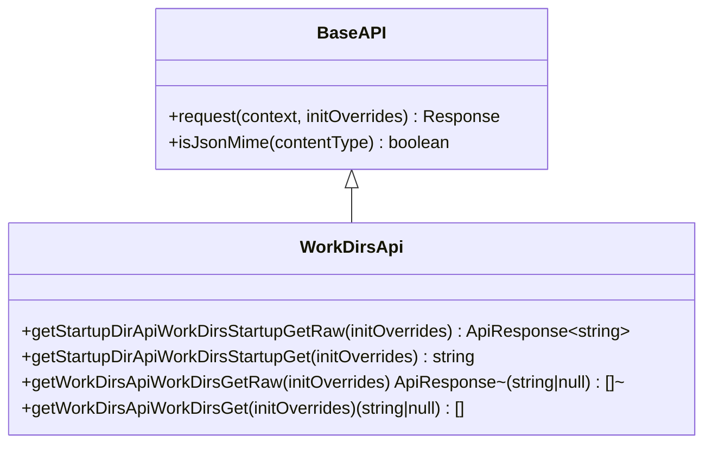
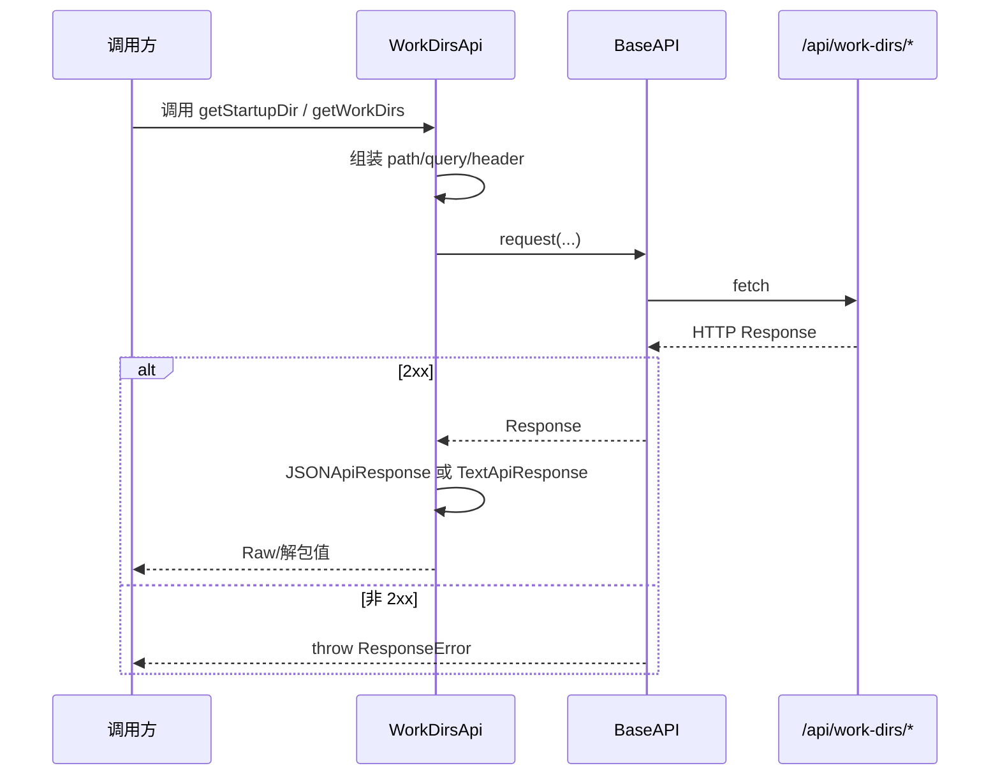

# frontend_work_dirs_api_client

## 模块简介

`frontend_work_dirs_api_client` 对应前端生成客户端文件 `web/src/lib/api/apis/WorkDirsApi.ts`，核心组件是 `WorkDirsApi`。这个模块的职责非常聚焦：为前端提供“工作目录相关只读能力”的统一访问入口，当前覆盖两个接口——读取 Kimi Web 启动目录、读取可用工作目录列表。

虽然功能看起来简单，但它在系统中承担了重要的“环境发现（environment discovery）”角色。前端在展示工作区选择器、初始化默认目录、或者引导用户切换仓库路径时，需要一个稳定、类型化、可复用的 API 客户端来避免重复手写 `fetch`。`WorkDirsApi` 通过 OpenAPI 生成机制，将后端契约固定为可编译检查的调用方法，同时复用统一运行时层的错误处理和请求配置能力。

从模块树关系来看，它属于 `web_frontend_api` 子模块，依赖 `frontend_runtime_layer`（`BaseAPI`、`ApiResponse`、`JSONApiResponse`、`TextApiResponse` 等），并与后端 `web_api` 中的工作目录相关 endpoint 对应。若你需要深入理解运行时异常模型与中间件机制，请参考 [frontend_runtime_layer.md](frontend_runtime_layer.md)；若要了解后端数据来源与权限策略，请参考 [web_api.md](web_api.md)。

---

## 模块定位与系统关系


`WorkDirsApi` 的设计定位是“轻量读接口客户端”，不承担业务决策。它负责把调用参数转成 HTTP 请求，并把响应解包为前端可用数据结构；真正的目录收集逻辑、路径规范化策略、可见性过滤（例如哪些目录可暴露给前端）都在后端。

这层边界有两个好处。第一，前端实现保持一致，不会在多个页面散落路径拼接逻辑。第二，后端策略升级时（例如目录来源从本地 metadata 扩展到多工作区注册表），前端仍可沿用同一客户端签名，降低改造成本。

---

## 核心组件：`WorkDirsApi`

`WorkDirsApi` 是一个继承 `runtime.BaseAPI` 的自动生成类，内部没有复杂状态，主要由两个 endpoint 的双层方法组成：`xxxRaw()` 和 `xxx()`。



这里的双层结构是 OpenAPI 客户端的标准模式。`Raw` 方法保留原始响应包装器（适合读取 header、调试状态码），非 `Raw` 方法则直接返回业务值（适合大多数页面逻辑）。

---

## 方法级详解

## 1) `getStartupDirApiWorkDirsStartupGetRaw`

该方法对应 `GET /api/work-dirs/startup`，用于获取 Kimi Web 进程启动时所在目录。

它的内部流程是：构造空 query、空 header，设置请求路径为 `/api/work-dirs/startup`，调用 `this.request(...)` 发起请求。响应返回后，它会根据 `content-type` 动态选择解包器：

- 若是 JSON MIME，使用 `JSONApiResponse<string>`。
- 否则使用 `TextApiResponse`（并通过 `as any` 兼容返回类型）。

这种“按 content-type 自适应”的逻辑提升了兼容性：即使后端把字符串目录以纯文本返回，客户端也能消费。

### 参数

- `initOverrides?: RequestInit | runtime.InitOverrideFunction`

用于单次请求覆盖（例如超时、自定义 header、注入 `AbortSignal`）。

### 返回值

- `Promise<runtime.ApiResponse<string>>`

注意：静态类型是 `string`，但实际解析路径可能是 `JSON` 或 `Text`，建议不要对后端 `content-type` 变更过度依赖。

### 副作用

- 客户端无持久化副作用，仅网络 I/O。

---

## 2) `getStartupDirApiWorkDirsStartupGet`

这是上一方法的便捷封装。它会调用 `getStartupDirApiWorkDirsStartupGetRaw()`，随后执行 `response.value()`，直接返回 `string`。

适合 UI 直接消费场景，例如把启动目录显示在设置页面“当前工作环境”区域。

---

## 3) `getWorkDirsApiWorkDirsGetRaw`

该方法对应 `GET /api/work-dirs/`，读取可用工作目录列表。

与 startup 接口不同，这个方法固定返回 `new runtime.JSONApiResponse<any>(response)`，也就是假设后端按 JSON 返回数组。方法签名是 `ApiResponse<Array<string | null>>`，表示列表项可能为 `string`，也可能为 `null`。

`null` 的存在是重要语义：它通常代表后端 metadata 中存在空位、不可解析项或兼容历史数据的占位值。前端使用时应做过滤或降级展示，而不是直接把每项当作可用路径。

### 参数

- `initOverrides?: RequestInit | runtime.InitOverrideFunction`

### 返回值

- `Promise<runtime.ApiResponse<Array<string | null>>>`

### 副作用

- 仅网络读取，无本地写操作。

---

## 4) `getWorkDirsApiWorkDirsGet`

该方法是列表接口的便捷版本，返回 `Promise<Array<string | null>>`。常见做法是在 UI 层立即清洗为 `string[]` 再渲染。

示例：

```ts
const dirsRaw = await workDirsApi.getWorkDirsApiWorkDirsGet();
const dirs = dirsRaw.filter((d): d is string => !!d && d.trim().length > 0);
```

---

## 请求流程与异常路径



这个流程里最关键的是：`WorkDirsApi` 本身几乎不处理错误；非 2xx、网络异常、取消请求等都由 runtime 层抛出统一异常。也就是说，业务调用方必须在应用层用 `try/catch` 做错误 UI 显示。

---

## 与其他前端 API 模块的关系

`frontend_work_dirs_api_client` 与 `frontend_sessions_api_client`、`frontend_config_api_client` 属于同一生成客户端体系，但语义侧重点不同：

- `WorkDirsApi`：环境与目录发现（只读、低副作用）。
- `SessionsApi`：会话生命周期与文件操作（高业务语义）。
- `ConfigApi`：配置读写（可能影响全局行为）。

如果你需要理解会话创建时如何消费工作目录，可联动阅读 [frontend_sessions_api_client.md](frontend_sessions_api_client.md)；如果要理解共享的请求执行内核，阅读 [frontend_runtime_layer.md](frontend_runtime_layer.md)。

---

## 使用与配置实践

## 基础初始化

```ts
import { Configuration } from '../lib/api/runtime';
import { WorkDirsApi } from '../lib/api/apis/WorkDirsApi';

const config = new Configuration({
  basePath: 'http://127.0.0.1:8000',
  credentials: 'include',
});

const workDirsApi = new WorkDirsApi(config);
```

## 常见调用模式

```ts
async function loadWorkDirContext() {
  const [startup, workDirs] = await Promise.all([
    workDirsApi.getStartupDirApiWorkDirsStartupGet(),
    workDirsApi.getWorkDirsApiWorkDirsGet(),
  ]);

  return {
    startupDir: startup,
    candidateDirs: workDirs.filter((d): d is string => !!d),
  };
}
```

## 单次请求覆盖（超时/跟踪）

```ts
const startup = await workDirsApi.getStartupDirApiWorkDirsStartupGet(({ init }) => ({
  ...init,
  signal: AbortSignal.timeout(1500),
  headers: {
    ...(init.headers || {}),
    'X-Trace-Id': crypto.randomUUID(),
  },
}));
```

---

## 扩展与二次封装建议

由于该文件是自动生成代码，建议不要直接手改 `WorkDirsApi.ts`。更稳妥的扩展方式是在业务层建立轻封装，例如 `workDirsService.ts`，集中处理空值过滤、排序、缓存与错误文案映射。

示例：

```ts
export async function listUsableWorkDirs(api: WorkDirsApi): Promise<string[]> {
  const dirs = await api.getWorkDirsApiWorkDirsGet();
  return dirs
    .filter((d): d is string => !!d && d.trim().length > 0)
    .map((d) => d.trim())
    .filter((d, i, arr) => arr.indexOf(d) === i);
}
```

这样做可以把“传输契约不稳定点”（例如返回中含 `null`）挡在服务层，避免污染页面组件逻辑。

---

## 边界条件、错误条件与已知限制

`WorkDirsApi` 代码量小，但仍有几个容易忽视的行为约束。

- 首先，`getStartupDir...Raw` 采用 JSON/Text 双解码，而 `getWorkDirs...Raw` 固定 JSON 解码。如果后端意外返回非 JSON（比如错误地返回 text/plain），后者更容易在解析阶段失败。
- 其次，`Array<string | null>` 说明返回值天然可能含空项。前端若直接用于下拉框 value，会产生空选项或 key 冲突。
- 再次，模块没有内建重试、缓存与去抖。高频调用（例如组件反复挂载）会产生重复网络请求，需要在上层配合 React Query/SWR 等缓存策略。
- 最后，错误语义依赖 runtime：参数错误、HTTP 错误、网络错误是不同异常类型。若统一当作“加载失败”处理，排障效率会下降。

---

## 维护建议

当后端新增工作目录接口（例如“设置当前目录”“校验目录可访问性”）时，推荐流程是先更新 OpenAPI 规范，再统一再生前端客户端。不要在生成文件中手工添加方法，否则下次生成会被覆盖。

如果你在联调中发现返回类型与生成类型不一致（例如后端把字符串包装成对象），应优先修正 OpenAPI schema，而不是在 UI 层做大量 `any` 兼容。

---

## 小结

`frontend_work_dirs_api_client` 是一个典型的“薄客户端、强契约”模块。它通过极少量代码把前端与后端工作目录能力连接起来，并把请求执行、错误处理和可配置行为委托给统一 runtime。正确使用它的关键不是记住两个方法名，而是理解其契约边界：这个模块负责“稳定访问”，不负责“业务解释”。在此基础上，你可以通过服务层封装和缓存策略，把它平滑接入更复杂的会话与配置流程。
