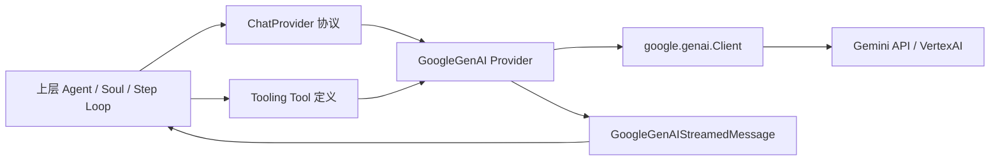
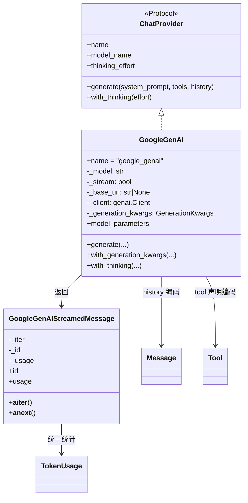
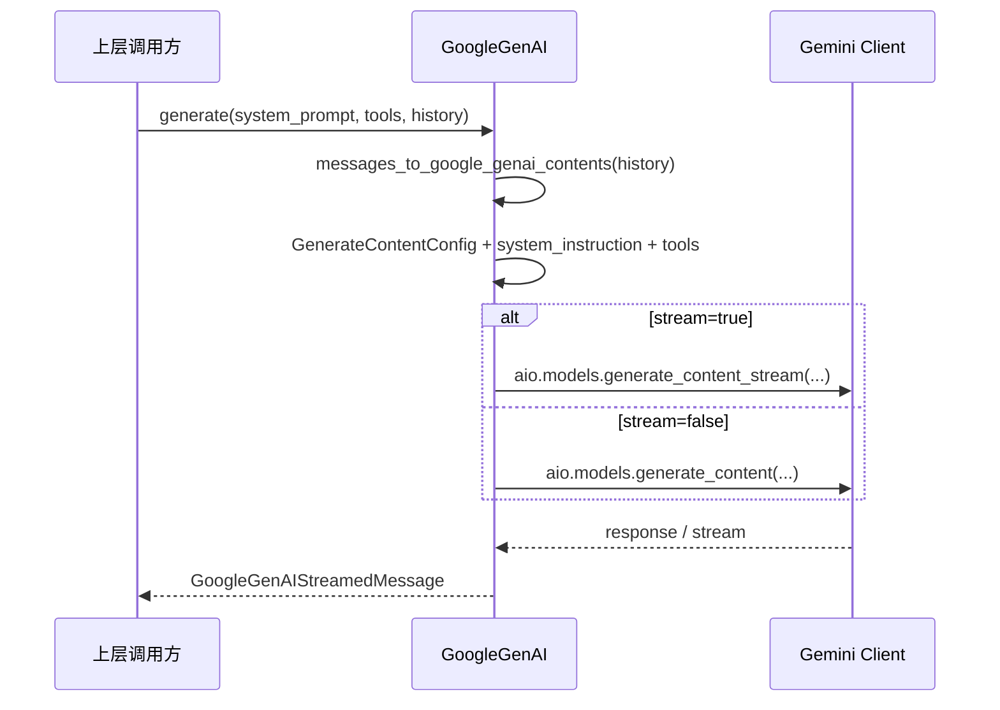
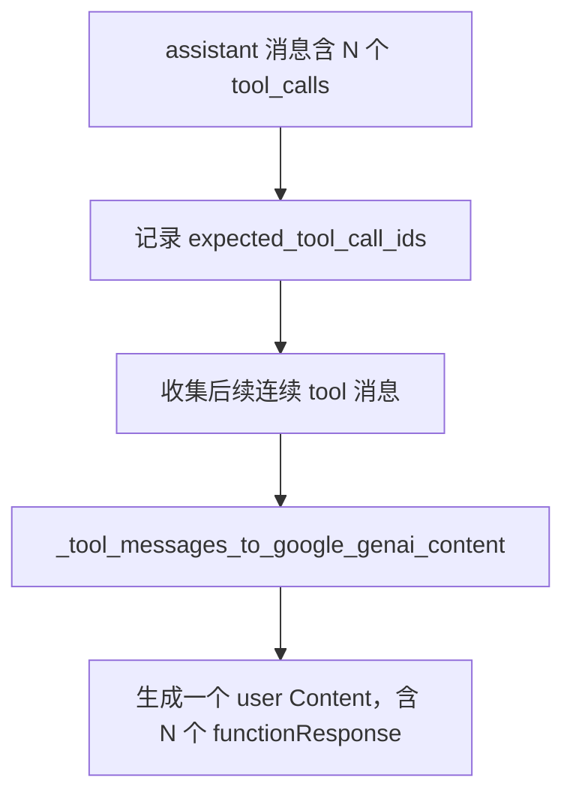
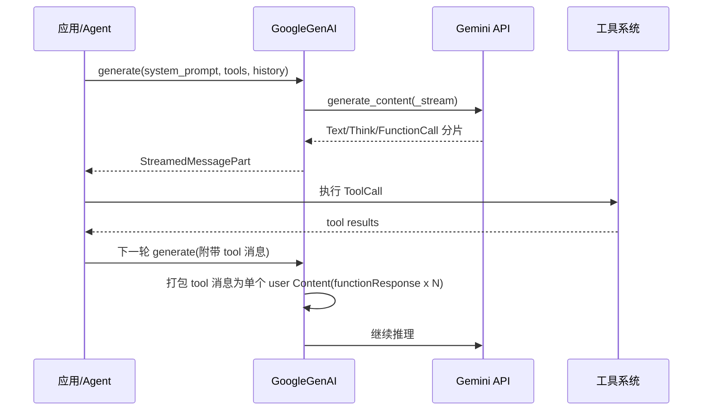
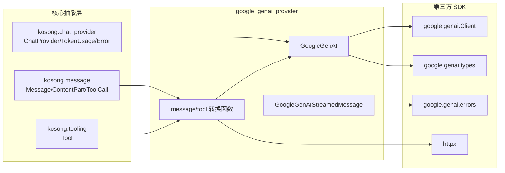

# google_genai_provider 模块文档

## 模块概述

`google_genai_provider` 是 `kosong_contrib_chat_providers` 中面向 Google Gemini（`google-genai` SDK）的适配模块，实现文件位于 `packages/kosong/src/kosong/contrib/chat_provider/google_genai.py`。这个模块的核心价值是把 `kosong` 内部统一对话协议（`Message`、`Tool`、`StreamedMessagePart`、`TokenUsage`、统一异常体系）桥接到 Gemini API 的请求/响应格式，并在流式或非流式响应中保持一致的消费体验。

从系统设计角度看，它存在的原因并不是“再封装一层 SDK”这么简单，而是为了让上层 Agent/Runner 不必感知各家模型 API 的差异。调用方只要遵循 `ChatProvider` 协议，就可以在 Anthropic、OpenAI、Google GenAI 等提供方之间切换，同时保留统一的工具调用语义、thinking 语义、token usage 统计口径和错误处理方式。关于统一协议本身，请参考 [provider_protocols.md](./provider_protocols.md)。

该模块尤其关注两个 Gemini 生态下的难点：一是工具调用与工具结果回传在 VertexAI 场景下的严格匹配规则，二是不同模型代际（如 gemini-3 与其他模型）对 thinking 配置字段的差异。模块通过消息打包策略和 `with_thinking` 语义映射，把这些差异隐藏在 provider 内部。

---

## 在系统中的位置与职责边界



这个模块承担的是“供应商协议适配器 + 流式响应解码器”职责。它不负责工具执行本身、不负责历史存储、不负责多轮编排策略，也不负责重试策略调度。这些通常由上层执行循环与工具系统完成，工具协议可参考 [kosong_tooling.md](./kosong_tooling.md)。

---

## 核心组件总览

本模块的重要类型与函数包括：

- `GoogleGenAI`
- `GoogleGenAI.GenerationKwargs`
- `GoogleGenAIStreamedMessage`
- `messages_to_google_genai_contents()`
- `message_to_google_genai()`
- `_tool_messages_to_google_genai_content()`
- `tool_to_google_genai()`
- `_image_url_part_to_google_genai()`
- `_audio_url_part_to_google_genai()`
- `_convert_error()`

其中 `GenerationKwargs` 是该模块在 `MODULE_TREE` 中声明的核心组件，它定义了调用 Gemini 时可被统一注入的生成参数集合。

---

## 组件关系与数据流



这个结构体现出清晰分层：`GoogleGenAI` 负责请求构建与参数管理，`GoogleGenAIStreamedMessage` 负责响应解码。函数级辅助方法负责消息格式转换、多模态数据处理和错误映射。

---

## `GoogleGenAI.GenerationKwargs` 详解

`GenerationKwargs` 是 `TypedDict(total=False)`，代表“可选覆盖”的生成参数。字段如下：

| 字段 | 类型 | 说明 |
|---|---|---|
| `max_output_tokens` | `int | None` | 输出 token 上限 |
| `temperature` | `float | None` | 采样温度 |
| `top_k` | `int | None` | top-k 采样 |
| `top_p` | `float | None` | nucleus 采样 |
| `thinking_config` | `ThinkingConfig | None` | Gemini thinking 配置 |
| `tool_config` | `ToolConfig | None` | 工具调用配置 |
| `http_options` | `HttpOptions | None` | 额外 HTTP 选项 |

这个设计允许 provider 以不可变风格逐步叠加配置（见 `with_generation_kwargs`），避免在并发会话下共享同一实例造成参数污染。

---

## `GoogleGenAI` 类详解

## 初始化与内部状态

构造函数签名（简化）：

```python
GoogleGenAI(
    model: str,
    api_key: str | None = None,
    base_url: str | None = None,
    stream: bool = True,
    vertexai: bool | None = None,
    **client_kwargs: Any,
)
```

初始化时会创建 `genai.Client`，并通过 `HttpOptions(base_url=base_url)` 支持自定义网关地址。`stream` 决定默认使用流式还是非流式 API，`vertexai` 用于切换 VertexAI 模式。`_generation_kwargs` 初始为空字典，通过 `with_generation_kwargs`/`with_thinking` 逐步构建。

需要注意，模块 import 阶段会检测 `google-genai` 依赖；如果缺失会立刻抛出带安装提示的 `ModuleNotFoundError`。这说明它是可选依赖，不属于最小安装集。

## `model_name`

`model_name` 直接返回 `_model`，用于日志与上层观测。

## `thinking_effort`

`thinking_effort` 把当前 `thinking_config` 映射到统一语义 `off/low/medium/high`。映射规则分两类：

1. 对 gemini-3 风格（`thinking_level`）：
   - `LOW` 或 `MINIMAL` -> `low`
   - `MEDIUM` -> `medium`
   - `HIGH` -> `high`
2. 对预算风格（`thinking_budget`）：
   - `0` -> `off`
   - `<=1024` -> `low`
   - `<=4096` -> `medium`
   - 更高 -> `high`

这不是 Gemini 字段的原样透传，而是跨 provider 的语义归一化，便于上层统一处理。

## `generate(system_prompt, tools, history)`

`generate` 是主入口：

1. 先将 `history` 通过 `messages_to_google_genai_contents` 转成 Gemini `Content[]`。
2. 构造 `GenerateContentConfig(**_generation_kwargs)`。
3. 设置 `config.system_instruction = system_prompt`。
4. 通过 `tool_to_google_genai` 把工具定义转成 Gemini `Tool[]`。
5. 根据 `_stream` 调用：
   - `generate_content_stream`（流式）
   - `generate_content`（非流式）
6. 包装为 `GoogleGenAIStreamedMessage` 返回。

出现任何异常时会统一进入 `_convert_error` 映射为 `ChatProviderError` 体系。



## `with_thinking(effort)`

该方法把统一 effort 档位映射到 Gemini thinking 配置，并返回新 provider：

- 对 `gemini-3`：优先设置 `thinking_level`。
  - `low` -> `LOW`
  - `medium` -> 当前实现临时映射到 `HIGH`（源码有 `FIXME`）
  - `high` -> `HIGH`
  - `off` -> 保持默认 thinking config（不主动禁用）
- 对其他模型：使用 `thinking_budget` 与 `include_thoughts`。
  - `off` -> `budget=0` 且 `include_thoughts=False`
  - `low/medium/high` -> `1024/4096/32000`，并 `include_thoughts=True`

这里有一个重要行为差异：`gemini-3 + off` 并不会像旧模型那样强制设为 `budget=0`，而是“使用默认 thinking config”。这可能与调用方直觉不同，属于需要重点关注的兼容点。

## `with_generation_kwargs(**kwargs)`

该方法采用浅拷贝 provider + 深拷贝 kwargs 字典的方式生成新实例，再做 `update`。它的语义是“不可变式配置叠加”，对并发安全友好，也便于把 provider 当模板复用。

## `model_parameters`

返回 `model`、`base_url`、当前 generation kwargs 的组合字典，用于 tracing/logging。它不一定完整覆盖底层 client 全部状态，但足以做问题回放。

---

## `GoogleGenAIStreamedMessage`：流/非流统一解码

`GoogleGenAIStreamedMessage` 接受两种输入：

- `GenerateContentResponse`（非流）
- `AsyncIterator[GenerateContentResponse]`（流）

内部把两者都转换成异步迭代器 `_iter`，对外统一暴露 `__aiter__/__anext__`。这保证上层消费代码不需要分流式与非流式两套分支。

## `id` 与 `usage`

- `id` 从 `response.response_id` 提取（流模式下取首次可得值）。
- `usage` 把 Gemini `usage_metadata` 映射到统一 `TokenUsage`：
  - `input_other <- prompt_token_count`
  - `output <- candidates_token_count`
  - `input_cache_read <- cached_content_token_count`
  - `input_cache_creation <- 0`（当前实现固定）

## 内容分块处理 `_process_part`

该方法是响应语义映射核心，按优先级解析 `Part`：

1. `part.thought == True` 且有文本：产出 `ThinkPart`
2. 普通 `part.text`：产出 `TextPart`
3. `part.function_call`：产出 `ToolCall`
   - 若 `name` 为空则跳过
   - `arguments` 序列化为 JSON 字符串
   - 若 `part.thought_signature` 存在，会 base64 后放入 `ToolCall.extras["thought_signature_b64"]`

这个设计让 “thinking signature” 能在 tool call 往返中保存，兼容 Gemini 的 thought signature 机制。

---

## 消息编码：从 `Message[]` 到 Gemini `Content[]`

## 为什么不能只做逐条一对一转换

Gemini（尤其 VertexAI 后端）在工具调用轮次里要求：上一个模型回合中有多少个 `functionCall`，下一个用户回合就要回传相同数量的 `functionResponse`。如果工具并行执行且顺序不稳定，简单逐条转换很容易不满足约束。

为此模块实现了“工具结果打包”策略：把同一轮多个 tool 消息合并为一个 `Content(role="user")`，其中包含 N 个 `functionResponse` parts。



## `messages_to_google_genai_contents(messages)`

该函数按顺序遍历历史消息：

- 若遇到“assistant + tool_calls”，先转 assistant 消息，再收集其后连续 `tool` 消息并打包。
- 打包时要求与 expected IDs 完整匹配（`require_all_expected=True`），否则抛错。
- 若出现孤立 `tool` 消息（前面没有紧邻 tool-calling assistant），会做 best-effort 单条转换。

这段逻辑是本模块最关键的兼容实现之一，直接决定工具链能否在 VertexAI 下稳定工作。

## `message_to_google_genai(message)`

单条消息转换规则：

- `assistant` 角色映射为 Gemini 的 `model`
- `user` 保持 `user`
- `tool` 消息禁止直接转换（强制要求走批量函数），否则抛 `ChatProviderError`

内容 part 映射：

- `TextPart` -> `Part.from_text`
- `ImageURLPart` -> `_image_url_part_to_google_genai`
- `AudioURLPart` -> `_audio_url_part_to_google_genai`
- `ThinkPart` -> 跳过（注释说明其为 synthetic）
- 其他未知 part -> 跳过

tool_calls 映射：

- `ToolCall.function.arguments` 必须是合法 JSON 且必须解析为对象（dict），否则报错。
- 构造 `FunctionCall(id, name, args)`。
- 若有 `extras.thought_signature_b64`，会解码写回 `function_call_part.thought_signature`。

---

## 工具与多模态转换函数

## `tool_to_google_genai(tool)`

把 `kosong.tooling.Tool` 转为 Gemini `Tool(function_declarations=[...])`。`parameters` 直接传 dict（由 `kosong` 层保证是 JSON Schema）。

## `_image_url_part_to_google_genai(part)`

支持两类输入：

- `data:` URL（base64 内联图像）
- 普通 URL（通过 `httpx.get` 下载）

关键行为：

- `data:` URL 必须符合 `data:<media-type>;base64,<data>`。
- 仅允许 `image/png|image/jpeg|image/gif|image/webp`。
- 普通 URL MIME 无法识别时默认 `image/png`。

## `_audio_url_part_to_google_genai(part)`

与图片类似，但白名单为音频类型：

- `audio/wav`, `audio/mp3`, `audio/aiff`, `audio/aac`, `audio/ogg`, `audio/flac`
- 普通 URL MIME 识别失败时默认 `audio/mp3`

## `_tool_result_to_response_and_parts(parts)`

把工具结果 `ContentPart[]` 分离为：

- 文本聚合到 `{"output": "..."}`
- 图片/音频变成 `FunctionResponsePart.from_uri(...)`
- 其他类型忽略

## `_tool_messages_to_google_genai_content(...)`

负责把多个 `tool` 消息打包到单个 `Content(role="user")`，并可选验证 expected IDs：

- 缺失 expected ID -> 抛错
- 多余 ID -> 抛错
- 重复 tool_call_id -> 抛错
- 缺少 `tool_call_id` -> 抛错

该函数还按 expected 顺序排序，以缓解并行工具返回顺序不确定问题。

---

## 错误映射 `_convert_error`

该函数把 `google.genai.errors` 映射到统一异常体系：

- `ClientError`（4xx） -> `APIStatusError`，并对 401/403/429 给出更明确文案
- `ServerError`（5xx） -> `APIStatusError`
- `APIError` -> `APIStatusError`
- `TimeoutError` -> `APITimeoutError`
- 其他异常 -> `ChatProviderError("Unexpected GoogleGenAI error: ...")`

这样上层可以沿用跨 provider 的重试/告警策略，而不依赖 Google SDK 专有异常类型。

---

## 端到端交互流程



---

## 使用示例

## 基础调用

```python
from kosong.contrib.chat_provider.google_genai import GoogleGenAI
from kosong.message import Message

provider = GoogleGenAI(
    model="gemini-3-pro-preview",
    api_key="YOUR_API_KEY",
    vertexai=True,
    stream=True,
)

stream = await provider.generate(
    system_prompt="你是一个严谨的开发助手",
    tools=[],
    history=[Message(role="user", content="解释一下 TCP 三次握手")],
)

async for part in stream:
    print(part)

print("id=", stream.id)
print("usage=", stream.usage)
```

## 配置 thinking

```python
p2 = provider.with_thinking("high")
# 返回新实例，不会修改 provider 本体
```

## 覆盖 generation kwargs

```python
from google.genai.types import ToolConfig

p3 = provider.with_generation_kwargs(
    temperature=0.2,
    top_p=0.95,
    max_output_tokens=4096,
    tool_config=ToolConfig(function_calling_config={"mode": "AUTO"}),
)
```

## 工具调用回合（概念示意）

```python
# 1) 模型先返回 assistant + tool_calls
# 2) 业务层执行工具得到多个 tool 消息
# 3) 下次 generate 时把 assistant + tool 消息一起传回
# provider 会自动把多个 tool 结果打包为一个 user Content(functionResponse x N)
```

---

## 边界条件、错误场景与已知限制

## 1) 可选依赖缺失

未安装 `google-genai` 时，模块导入即失败。部署时需要安装 `kosong[contrib]` 或显式安装 `google-genai`。

## 2) 工具调用参数必须是 JSON 对象

`ToolCall.function.arguments` 如果是非法 JSON，或虽合法但不是对象（例如数组/字符串），会抛 `ChatProviderError`。

## 3) tool 消息必须有 `tool_call_id`

缺失 `tool_call_id` 会立即报错，无法自动推断。

## 4) tool 响应数量与预期不一致会报错

在“assistant 发起 tool_calls -> 紧随其后的 tool 消息”场景中，若缺失或多出 ID，会抛错。这是为了满足 VertexAI 对 function response 数量匹配的约束。

## 5) 多模态 URL 下载是同步 HTTP 调用

`_image_url_part_to_google_genai` 与 `_audio_url_part_to_google_genai` 使用 `httpx.get`（同步）下载远程资源。在高并发异步场景下，这可能阻塞事件循环，属于性能风险点。

## 6) `data:` URL 支持类型有限

图片和音频都采用白名单 MIME 类型，不在列表内会报错。

## 7) `ThinkPart` 在请求侧会被跳过

`message_to_google_genai` 中 `ThinkPart` 被视为 synthetic 并忽略；若业务希望显式保留推理内容，需要理解该 provider 当前策略。

## 8) gemini-3 的 `medium` thinking 映射

当前实现把 `medium` 临时映射为 `HIGH`（源码 `FIXME`），这会导致实际推理强度高于字面预期。

---

## 扩展与维护建议

扩展该模块时，建议保持“请求编码与响应解码分离”原则。新增请求字段优先通过 `GenerationKwargs` 与 `with_generation_kwargs` 注入，避免在 `generate` 中硬编码供应商特例。新增响应 part 类型时，优先做向后兼容处理：未知类型可选择忽略或降级，而不要轻易让流式解析失败。

如果你要优化多模态性能，可以考虑把 URL 下载改为异步客户端并引入超时/大小限制，以避免同步阻塞与超大文件风险。若要增强可观测性，建议在 `model_parameters` 和错误映射中加入 trace id、请求上下文等信息（注意不要泄露敏感参数）。

---

## 依赖关系与跨模块契约



从依赖边界看，`google_genai_provider` 只依赖 `kosong` 的三类稳定契约：对话 provider 接口、消息模型、工具模型。它不会把 Google SDK 类型泄露给上层业务，这保证了上层编排器（例如 step loop 或 soul runtime）可以在 provider 间切换而不改业务代码。反过来，provider 内部可以演进 SDK 细节（例如新字段、新错误类型）而不破坏统一接口。这种“内收外放”的适配器结构，是该模块可维护性的核心来源。

---

## 与其他文档的关系（避免重复）

- 统一 provider 协议、异常与 `TokenUsage`：见 [provider_protocols.md](./provider_protocols.md)
- 工具声明与 JSON Schema、`Tool`/`ToolReturnValue`：见 [kosong_tooling.md](./kosong_tooling.md)
- 其他 provider 对比参考：
  - [anthropic_provider.md](./anthropic_provider.md)
  - [openai_legacy_provider.md](./openai_legacy_provider.md)
  - [openai_responses_provider.md](./openai_responses_provider.md)

---

## 小结

`google_genai_provider` 的本质是一个“Gemini 协议适配器”，它将 `kosong` 的统一消息与工具调用模型可靠地映射到 Google GenAI API，并通过 `GoogleGenAIStreamedMessage` 屏蔽流式与非流式差异。其最关键的工程价值在于：通过严格的工具结果打包与 ID 校验机制，保证了 VertexAI 工具回合的协议一致性；通过 thinking 映射与统一错误模型，保证了跨 provider 的可替换性和可维护性。
