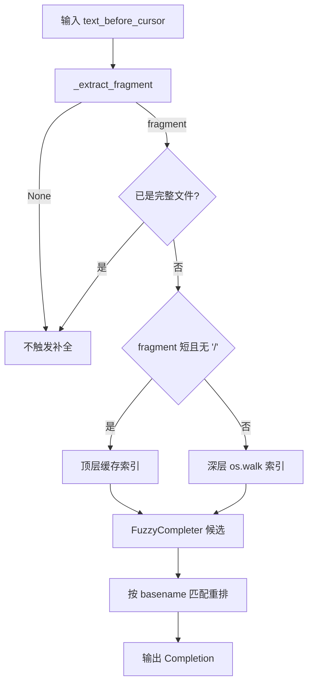
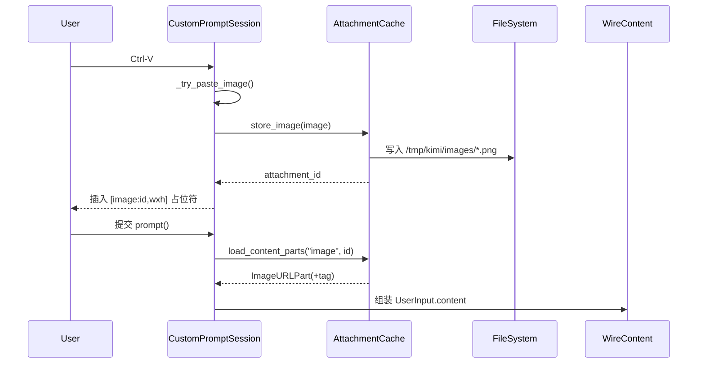

# interactive_prompt_and_attachments 模块文档

`interactive_prompt_and_attachments` 模块对应源码 `src/kimi_cli/ui/shell/prompt.py`，是 CLI 交互链路里“用户输入层”的核心。它的价值并不只是把键盘字符读出来，而是把终端输入升级为一个具备模式语义（Agent/Shell）、命令补全、文件引用补全、历史记忆、附件占位符解析、状态栏渲染和临时通知（toast）的完整交互系统。换句话说，这个模块把“输入框”变成了“会话入口”。

在系统分层中，该模块位于 `ui_shell` 子域（见 [ui_shell.md](ui_shell.md)）内部，并与会话运行层紧密协作。它向上承接用户行为（按键、粘贴、选择补全），向下输出结构化 `UserInput`，供运行时和模型调用管线继续处理。关于 Shell 会话主循环本身，请参考 [shell_session_runtime.md](shell_session_runtime.md)；关于消息内容结构（`ContentPart` / `TextPart` / `ImageURLPart`），请参考 [wire_domain_types.md](wire_domain_types.md)。

---

## 模块为什么存在：设计动机与问题域

传统 CLI 输入通常是单行字符串，但在 AI agent 场景里，输入已经变成复合对象：用户可能输入 `/slash command`、在文本中 `@` 引用本地路径、用剪贴板粘贴图片作为多模态输入，并希望随时看到上下文占用、当前模式、快捷键提示等运行态反馈。如果这些能力散落在多个模块里，会导致状态同步困难、用户体验不一致、故障排查成本高。

本模块的设计目标是把这些能力统一收拢到 `CustomPromptSession` 及其协作者中，用一个稳定 API（`await prompt()`）给上层返回一致的数据结构。它强调“交互不断流”：即使历史文件损坏、附件缓存丢失、目录扫描失败，也尽量降级而不让输入会话崩溃。

---

## 核心组件全景

虽然模块树只标记 `PromptMode` 为核心组件，但从代码行为看，以下对象共同构成关键实现：

- `PromptMode`
- `UserInput`
- `CustomPromptSession`
- `SlashCommandCompleter`
- `LocalFileMentionCompleter`
- `AttachmentCache` / `CachedAttachment`
- `toast()` / `_current_toast()`
- 历史读写辅助（`_HistoryEntry`、`_load_history_entries`、`_append_history_entry`）

下面按“职责 + 内部机制 + 参数/返回 + 副作用”展开。

---

## `PromptMode`：输入路由开关

`PromptMode` 是一个 `Enum`，定义 `AGENT` 与 `SHELL` 两种模式。`toggle()` 在二者间切换，`__str__()` 返回底层值（`"agent"` / `"shell"`）。

它的作用不止 UI 显示。该模式直接决定了当前 buffer 使用哪套 completer（Agent 模式包含 `@` 文件补全，Shell 模式只保留 slash 补全），并影响最终 `UserInput.mode`，从而让上层运行时决定请求发送路径。

---

## `UserInput`：从纯文本到富内容的提交对象

`UserInput` 是 Pydantic 模型，字段如下：

- `mode: PromptMode`：提交时输入模式。
- `command: str`：用户看到并输入的原始文本（经过基础清洗）。
- `content: list[ContentPart]`：结构化富内容，包含文本段与可能的媒体段。

`__str__` 返回 `command`，`__bool__` 基于 `command` 非空性判断。它的关键意义是把“显示文本”与“模型侧内容”解耦。例如用户输入中出现 `[image:xxx,800x600]`，最终会在 `content` 中转化为可直接用于模型调用的 `ImageURLPart`（`data:mime;base64,...`）。

---

## `SlashCommandCompleter`：面向 `/` 的命令补全

`SlashCommandCompleter` 负责 slash 命令候选生成，构造参数是 `available_commands: Sequence[SlashCommand[Any]]`。初始化时它会建立 name/alias 索引 `_command_lookup`，并组合 `WordCompleter + FuzzyCompleter`。

其行为有几个非常具体的约束。首先，只有当“当前 token 以 `/` 开头且 prompt 里没有其他前缀内容”时才触发补全；其次，即使用户通过 alias 命中，真正插入缓冲区的也始终是规范名 `/<cmd.name>`，从而避免 alias 在后续解析阶段引入歧义；最后，展示文本使用 `cmd.slash_name()`，并带 `description` 作为 `display_meta`。

`get_completions()` 返回 `Iterable[Completion]`，无异常副作用；其主要副作用体现在用户体验层，即输入 Enter 时配合键绑定可直接接受候选项。

---

## `LocalFileMentionCompleter`：`@path` 文件引用补全

`LocalFileMentionCompleter` 构造参数包含：

- `root: Path`：索引根目录。
- `refresh_interval: float = 2.0`：缓存刷新周期。
- `limit: int = 1000`：最多返回候选数量。

它不是简单 `os.walk` 全量扫，而是两段式策略。若 fragment 很短且不含 `/`，优先走顶层索引（更快，噪声更低）；当 fragment 变长或包含目录层级，再启用深层扫描。两类结果分别缓存，减少频繁输入时的 I/O 开销。

该 completer 内置较完整忽略规则，覆盖 VCS 元数据目录、常见构建缓存和语言生态产物目录（如 `node_modules`、`__pycache__`、`.venv` 等），还通过正则忽略临时/缓存类文件名。`_extract_fragment()` 会判断 `@` 的触发语义，避免在邮件地址或普通词中误触。

`get_completions()` 的返回值是路径候选，且会做二次重排：优先 basename 前缀命中，其次 basename 包含命中，最后其他模糊结果。这比纯 fuzzy 更接近“用户希望尽快看到文件名本体匹配”的体验。

### 补全策略流程图



这张图体现了该类最核心的设计哲学：在“响应速度”和“候选完整度”之间动态平衡。

---

## 历史机制：容错读取 + 追加写入 + 连续去重

历史条目模型 `_HistoryEntry` 仅含 `content: str`。加载函数 `_load_history_entries(history_file)` 会逐行读取 JSONL，并对每行做 JSON 解析与 Pydantic 校验。格式错误或校验失败都会被跳过并记录 warning，而不是中断整体加载。

会话初始化时，历史路径采用 `get_share_dir()/user-history/<md5(cwd)>.jsonl`，按工作目录隔离。写入由 `_append_history_entry(text)` 完成：空文本不写、与上一条相同则不写（仅连续去重），否则 append 一行 JSON。I/O 异常同样降级为日志 warning。

这套设计让历史文件即使部分损坏，也能“尽可能恢复可用记录”。

---

## Toast 机制：底栏短期通知队列

`toast(message, duration=5.0, topic=None, immediate=False, position="left")` 向模块级队列推送通知。内部维护左右两个队列 `_toast_queues`，每个元素是 `_ToastEntry(topic, message, duration)`。

如果指定 `topic`，新 toast 会替换同 topic 旧条目，适合“状态更新型”信息；`immediate=True` 时头插，适合高优先级提示；`duration` 会被下限钳制到 `_REFRESH_INTERVAL`，避免过短导致不可见。

`_current_toast(position)` 只返回队首元素。实际过期处理发生在 toolbar 渲染周期：每次刷新扣减 duration，归零后出队。

---

## `AttachmentCache`：附件占位符与真实媒体之间的桥

`AttachmentCache` 的默认根目录是 `/tmp/kimi`，当前只实现 `CachedAttachmentKind = "image"`。它的主要公开能力如下：

- `store_bytes(kind, suffix, payload) -> CachedAttachment | None`
- `store_image(image: PIL.Image) -> CachedAttachment | None`
- `load_bytes(kind, attachment_id) -> tuple[Path, bytes] | None`
- `load_content_parts(kind, attachment_id) -> list[ContentPart] | None`

`store_bytes` 使用 `(kind, suffix, sha256(payload))` 作为去重键，若已缓存且文件仍存在则复用；否则写入新文件。`store_image` 会先统一转为 PNG。`load_content_parts` 在 image 场景里会生成 `ImageURLPart`，然后调用 `wrap_media_part` 包装为可并入消息流的 `ContentPart` 列表，并附带 `path` 元数据。

其副作用非常明确：会在本地文件系统创建目录并写入附件文件；在失败时返回 `None` 并记录日志，不抛异常到交互主流程。

### 附件转换流程图



---

## `CustomPromptSession`：输入会话编排核心

`CustomPromptSession` 是模块主入口。构造参数如下：

```python
CustomPromptSession(
    status_provider: Callable[[], StatusSnapshot],
    model_capabilities: set[ModelCapability],
    model_name: str | None,
    thinking: bool,
    agent_mode_slash_commands: Sequence[SlashCommand[Any]],
    shell_mode_slash_commands: Sequence[SlashCommand[Any]],
)
```

`status_provider` 用于底栏状态读取，`model_capabilities` 用于功能门控（如图片输入是否可用），`thinking/model_name` 用于 prompt 与底栏标识，双命令列表分别绑定两种模式补全。

初始化阶段完成四件事：历史加载、补全器构建、键绑定注册、`PromptSession` 实例化。之后通过上下文管理器 `__enter__/__exit__` 控制后台刷新任务生命周期，周期性触发 UI invalidation。

### 按键绑定行为

- `Enter`（当补全面板存在）：优先接受当前候选，而不是直接提交。
- `Ctrl-X`：切换 `PromptMode` 并热更新当前 buffer completer。
- `Alt-Enter` 或 `Ctrl-J`：插入换行。
- `Ctrl-V`：优先尝试图片粘贴；失败后退回普通剪贴板文本粘贴。

### `prompt()` 内部处理顺序

`prompt()` 是最关键的异步方法，返回 `UserInput`。处理顺序是：异步读取文本 → 去除 null byte → surrogate 清洗（Windows 粘贴兼容）→ 追加历史 → 扫描附件占位符并重建 `content`。如果占位符无法解析成真实附件，保留原文本并告警。

### 主流程图


---

## 与其他模块的关系（避免重复说明）

本模块依赖或协同的关键模块如下：

- [shell_session_runtime.md](shell_session_runtime.md)：消费 `UserInput`，驱动会话循环。
- [wire_domain_types.md](wire_domain_types.md)：定义 `ContentPart` 体系。
- [slash_command_registry.md](slash_command_registry.md)：slash 命令来源与注册机制。
- [tools_misc.md](tools_misc.md)、[tools_file.md](tools_file.md)、[tools_shell.md](tools_shell.md)：slash 命令最终执行层。
- [soul_runtime.md](soul_runtime.md)：`StatusSnapshot` 来源，影响底栏状态显示。

本文件不重复这些模块的实现细节，建议按链接继续阅读。

---

## 典型使用方式

```python
prompt_session = CustomPromptSession(
    status_provider=lambda: soul.status_snapshot(),
    model_capabilities=current_model_capabilities,
    model_name="kimi-k2",
    thinking=True,
    agent_mode_slash_commands=agent_slash_commands,
    shell_mode_slash_commands=shell_slash_commands,
)

with prompt_session:
    user_input = await prompt_session.prompt()
    # user_input.mode -> PromptMode
    # user_input.command -> str
    # user_input.content -> list[ContentPart]
```

发送 toast：

```python
from kimi_cli.ui.shell.prompt import toast

toast("indexing workspace...", topic="index", position="left")
toast("context compacted", topic="ctx", immediate=True, position="right")
```

---

## 可扩展点与扩展建议

如果要新增附件类型（例如 `audio`、`pdf`），建议按以下路径扩展：先扩展 `CachedAttachmentKind` 与 `_parse_attachment_kind`，再在 `AttachmentCache.load_content_parts()` 中补全对应 `ContentPart` 构建逻辑，最后在输入入口增加插入占位符机制（类似 `_try_paste_image`）。在任何新类型落地前，应先确认模型 capability 门控和缺失时的降级策略。

如果要提升文件补全可扩展性，可把忽略规则与 `limit/refresh_interval` 外置为配置项，并评估异步索引器替代当前同步 `os.walk` 方案。

---

## 边界条件、错误条件与已知限制

这个模块最大的优点是容错强，但也带来一些行为边界。第一，文件补全依赖本地文件系统，权限错误或超大目录会让候选短时过旧，因为异常时会返回缓存。第二，附件缓存默认在 `/tmp/kimi`，如果被系统清理，历史输入中的占位符将无法复原为真实媒体，只能降级为文本。第三，图片粘贴不仅依赖系统剪贴板可用，还依赖模型具备 `image_in` 能力；任一条件不满足都会回退，不会自动改写为其他输入形式。第四，历史去重是“连续去重”而非“全局去重”，长期运行可能产生较大历史文件。第五，toast 队列是模块级全局状态，在未来多会话并行场景下需要重新评估隔离策略。

---

## 运维与排障建议

当用户反馈“补全不工作”时，优先确认当前 `PromptMode` 与 completer 是否匹配，再看 `@` 触发语义是否满足（例如前一字符导致 guard 拦截），最后检查目录权限与缓存刷新周期。当用户反馈“图片粘贴后发送无图”时，先看模型 capability，再检查 `/tmp/kimi/images` 是否仍存在对应文件，并关注日志中关于 placeholder 解析失败的 warning。当底栏状态不更新时，检查 `with prompt_session:` 是否正确包裹了会话生命周期，确保刷新任务已启动且未被提前取消。

总体上，这个模块应被维护为一个“高可用输入编排层”：任何增强都应优先保证不打断输入主路径，并尽量把能力沉淀为结构化 `content`，而非仅停留在字符串技巧。
