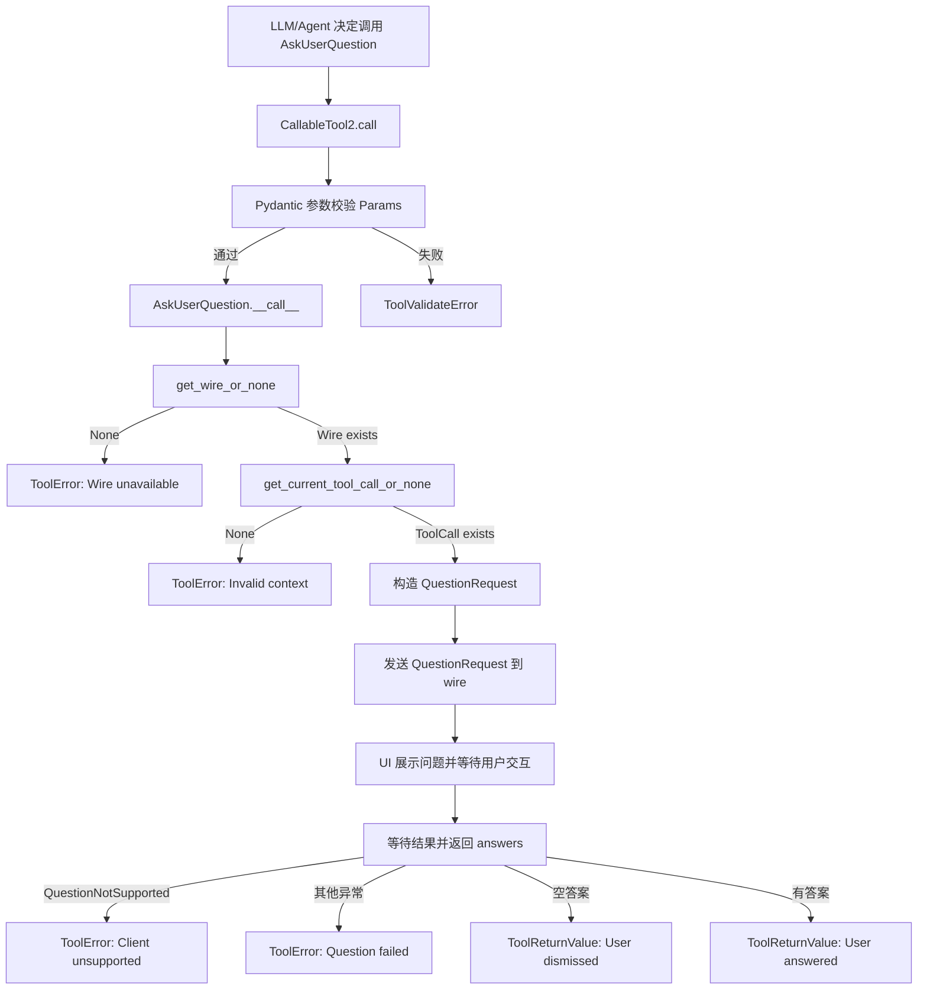
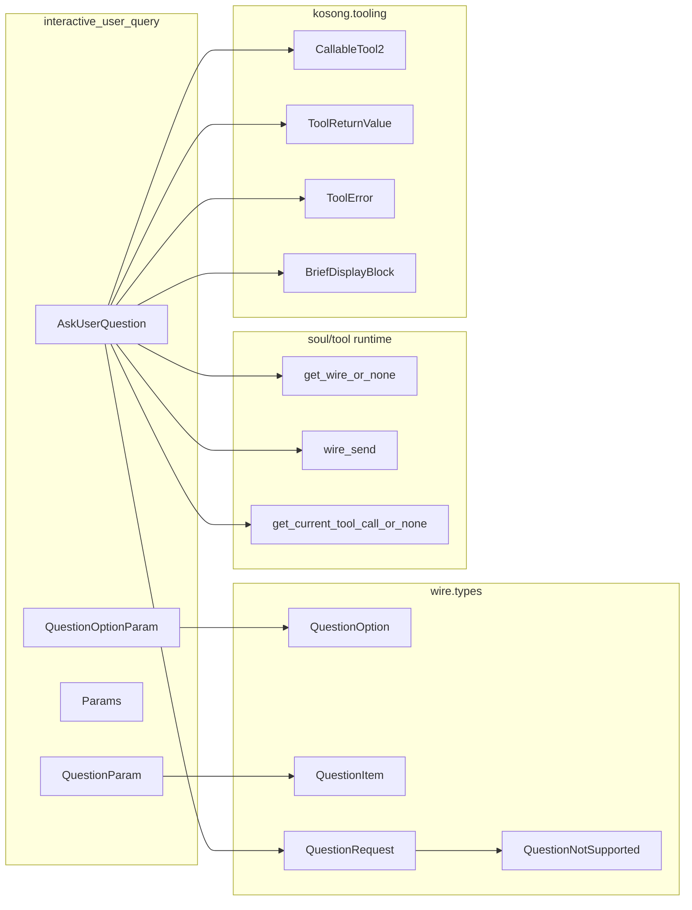
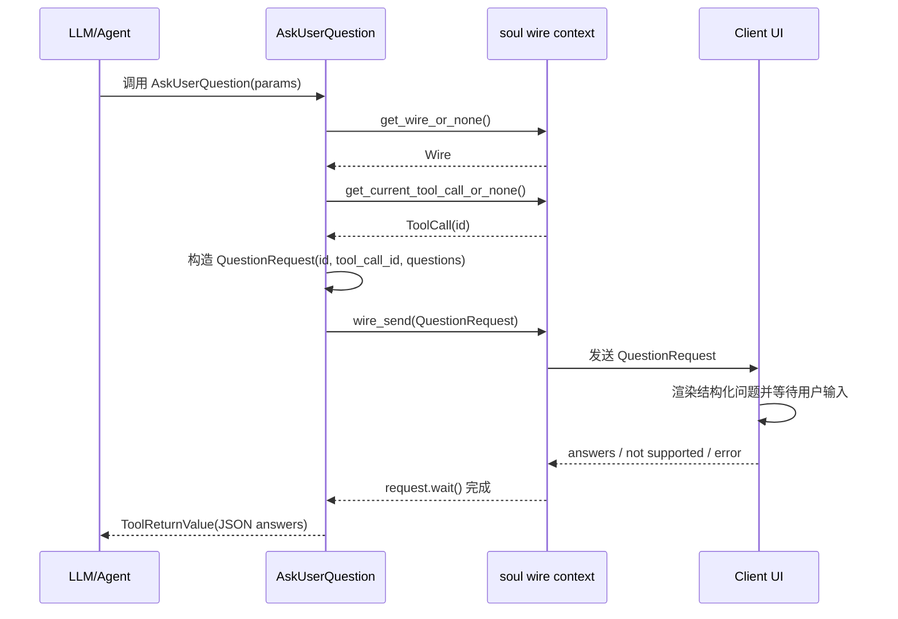

# interactive_user_query 模块文档

## 1. 模块简介：它做什么、为什么存在

`interactive_user_query` 模块对应实现文件 `src/kimi_cli/tools/ask_user/__init__.py`，核心是一个可被 Agent 调用的工具 `AskUserQuestion`。它的作用是在执行过程中，以“结构化问题 + 选项”的方式向最终用户发起澄清请求，并异步等待用户反馈，再把反馈结果返回给模型继续推理。

这个模块存在的根本原因，是解决“模型在执行中遇到多分支决策时，需要用户明确偏好”的问题。相比直接让模型在自然语言里提问，这个工具把问题结构化为带 `header`、`options`、`multi_select` 的数据对象，从而让 UI 可以稳定渲染交互控件、让协议层可以稳定传输、让运行时能够追踪一次问题请求的生命周期（发起、等待、完成、异常）。

从系统分层看，它是 `tools_misc` 下的一个工具模块，遵循 `kosong_tooling` 的 `CallableTool2` 工具协议，并通过 `soul` 提供的 `wire_send`/`get_wire_or_none` 与前端交互通道连接。换句话说，它不直接操作终端或 Web 页面，而是把“提问请求”发到 `wire`，由支持该协议的客户端 UI 负责展示和回传答案。

> 相关通用机制不在此重复展开，可参考：[`kosong_tooling.md`](./kosong_tooling.md)、[`wire_protocol.md`](./wire_protocol.md)、[`soul_engine.md`](./soul_engine.md)、[`tools_misc.md`](./tools_misc.md)

---

## 2. 架构定位与组件关系



上图描述了该模块的完整运行链路。`AskUserQuestion` 并不负责“如何渲染问题”，它负责构造标准 `QuestionRequest` 并通过 `wire` 发出请求，然后等待异步结果。UI 能否弹出交互框、是否支持该能力，取决于客户端能力与 wire 处理逻辑，因此该工具显式处理了 `QuestionNotSupported` 分支。



这个依赖图体现了一个关键设计：参数模型（`QuestionParam` 等）与传输模型（`QuestionItem`/`QuestionRequest`）分离。前者偏向“工具入参约束与提示”，后者偏向“跨边界传输与等待回调”。这种分离让工具 API 和 wire 协议各自演进时更容易保持兼容。

---

## 3. 核心组件详解

## 3.1 `QuestionOptionParam`

`QuestionOptionParam` 是单个选项的输入模型，字段为：

- `label: str`：选项显示文本，建议 1-5 个词，可在推荐项后加 `(Recommended)`。
- `description: str = ""`：该选项的简短解释，说明权衡或影响。

它本身没有 `min_length/max_length` 这类硬约束，主要依靠字段语义描述引导模型生成高质量选项文本。

## 3.2 `QuestionParam`

`QuestionParam` 表示一个问题，包含：

- `question: str`：问题正文，描述要求以问号结尾（语义约束）。
- `header: str = ""`：短标签（例如 `Auth`、`Style`）。
- `options: list[QuestionOptionParam]`：选项列表，强制 `min_length=2`、`max_length=4`。
- `multi_select: bool = False`：是否允许多选。

这里最关键的硬约束是选项数量 2~4。该约束能显著提升交互质量：太少无法表达决策空间，太多会增加认知负担。

## 3.3 `Params`

`Params` 是工具入口参数，结构为 `questions: list[QuestionParam]`，并要求问题数量在 1~4 之间。也就是说，一次工具调用可以批量询问多个相关问题，但不能无限扩张。

这个约束对应用户体验目标：尽量一次收集关键信息，但避免在单轮中抛出过多问题导致“问卷化”体验。

## 3.4 `AskUserQuestion`

`AskUserQuestion` 继承 `CallableTool2[Params]`，是模块行为中心。核心类属性如下：

```python
name: str = "AskUserQuestion"
description: str = load_desc(Path(__file__).parent / "description.md")
params: type[Params] = Params
```

其中 `description` 由 `load_desc` 动态加载 `description.md`，该文案会进入工具定义，影响模型“何时调用该工具”的决策。`description.md` 中明确强调“不要滥用提问”“不要手动加 Other 选项（系统会自动补）”等策略。

### 内部执行步骤（`__call__`）

`__call__` 的逻辑可以概括为以下阶段：

1. **检查 Wire 可用性**：调用 `get_wire_or_none()`，若为空直接返回 `ToolError("Wire unavailable")`。
2. **检查调用上下文**：调用 `get_current_tool_call_or_none()`，若为空返回 `ToolError("Invalid context")`。
3. **参数映射**：把 `Params.questions` 转换成 wire 层 `QuestionItem`/`QuestionOption`。
4. **构建请求**：创建 `QuestionRequest(id=uuid4, tool_call_id=tool_call.id, questions=...)`。
5. **发送请求**：`wire_send(request)`。
6. **等待结果**：`answers = await request.wait()`。
7. **处理异常与返回**：
   - `QuestionNotSupported` -> `ToolError("Client unsupported")`，并提示后续不要再调该工具。
   - 其他异常 -> 记录日志并返回 `ToolError("Question failed")`。
   - 空答案 -> 返回成功 `ToolReturnValue`，输出带 note 的 JSON。
   - 有答案 -> 返回成功 `ToolReturnValue`，输出 `{"answers": ...}` JSON。

### 返回值语义

该工具无论成功还是失败，都遵循 `ToolReturnValue` 协议（失败使用 `ToolError` 子类）：

- 成功时 `is_error=False`。
- `output` 为 JSON 字符串（而不是 Python dict）。
- `message` 给模型侧解释当前结果。
- `display` 包含 `BriefDisplayBlock`，用于用户侧简短状态提示（如 `User answered` / `User dismissed`）。

---

## 4. 交互与数据流（含时序）



这个时序图体现了一个典型“请求-挂起-恢复”模型：工具调用在 `await request.wait()` 处挂起，直到客户端通过同一个请求对象对应的 future 完成结果回填。这与 `ApprovalRequest`、`ToolCallRequest` 在 wire 层采用了相同模式，属于统一的异步请求范式。

---

## 5. 使用方式与示例

## 5.1 典型调用参数

```json
{
  "questions": [
    {
      "question": "Which authentication method should we implement first?",
      "header": "Auth",
      "options": [
        {
          "label": "OAuth2 (Recommended)",
          "description": "Best ecosystem compatibility and future extensibility."
        },
        {
          "label": "API Key",
          "description": "Simpler initial implementation but weaker user-level delegation."
        }
      ],
      "multi_select": false
    }
  ]
}
```

## 5.2 可能返回（用户已回答）

```json
{
  "answers": {
    "Which authentication method should we implement first?": "OAuth2 (Recommended)"
  }
}
```

## 5.3 可能返回（用户关闭/忽略）

```json
{
  "answers": {},
  "note": "User dismissed the question without answering."
}
```

## 5.4 异常返回（客户端不支持）

工具会返回 `ToolError`，`message` 包含明确指引：不要再次调用该工具，改为在普通文本回复中直接向用户提问。

---

## 6. 约束、边界条件与错误处理

该模块最重要的边界条件是运行时上下文：它必须在“有 wire、且处于 tool call 上下文”时执行。否则它虽然是一个可调用工具，但无法完成交互闭环。这也是为什么代码在开头就进行双重守卫。

另一个重要约束是“提问规模控制”：

- 每次调用最多 4 个问题；
- 每个问题 2~4 个选项；
- 用户端会自动提供 `Other`，调用方不应重复定义。

在错误处理上，模块把“功能不可用”和“执行失败”分开处理：

- `QuestionNotSupported` 属于能力不匹配，返回文案会指导模型调整后续策略；
- 其他异常视为运行失败，记录日志并返回通用失败信息。

需要注意一个设计细节：`QuestionResponse.answers` 在 wire 类型中定义为 `dict[str, str]`，多选场景是“逗号分隔字符串”而不是数组。这意味着消费方如果要做结构化解析，需要自行 split 并处理 label 中可能出现逗号的潜在歧义。

---

## 7. 可扩展点与二次开发建议

扩展该模块时，推荐优先保持与现有 wire 类型兼容。最常见的扩展方向是：增加问题级元数据（如 `required`、`default`）、改进多选返回格式、引入本地化标签等。实现时应同时评估三个面向：

1. **工具参数层**：`QuestionParam` / `Params` 的 Pydantic 约束与描述。
2. **传输协议层**：`QuestionItem` / `QuestionRequest` / `QuestionResponse` 的序列化兼容性。
3. **UI 渲染层**：客户端是否支持新字段，是否需要降级策略。

如果只改工具入参而不改 wire 与 UI，新增语义通常不会生效；反过来若 wire 新增字段但工具不产出，也无法被触发。因此它是一个跨层协同扩展点。

---

## 8. 与其他模块的关系（避免重复）

`interactive_user_query` 聚焦“如何发起结构化问题请求”。对于更通用的工具协议（参数验证、返回值封装、显示块系统），请参考 [`kosong_tooling.md`](./kosong_tooling.md)。对于 wire 消息封装、消息类型、跨端传输机制，请参考 [`wire_protocol.md`](./wire_protocol.md) 与 [`wire_domain_types.md`](./wire_domain_types.md)。对于 soul 运行循环与上下文变量（如当前 wire、当前 tool call）的生命周期，请参考 [`soul_engine.md`](./soul_engine.md)。
