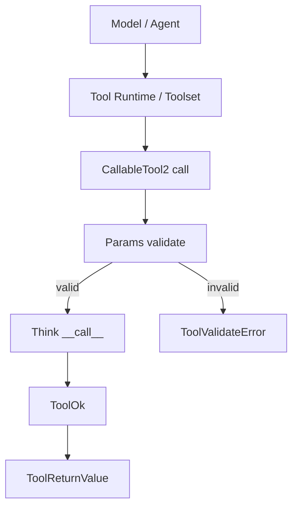
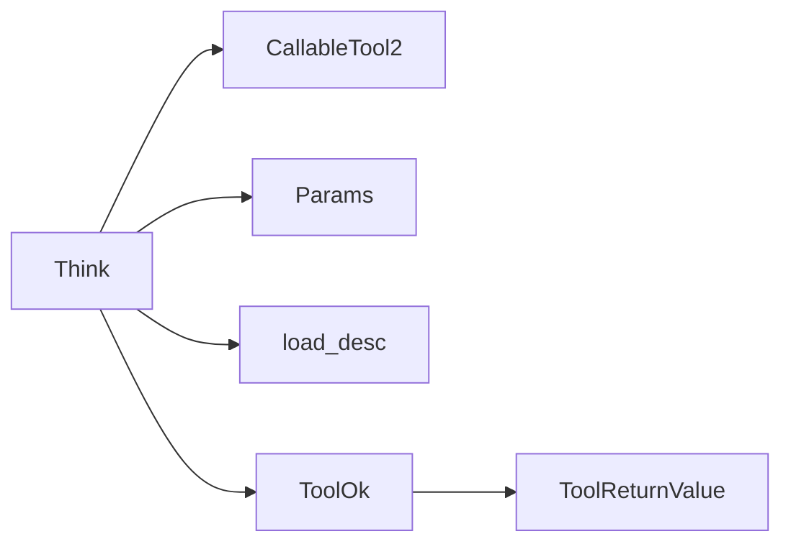
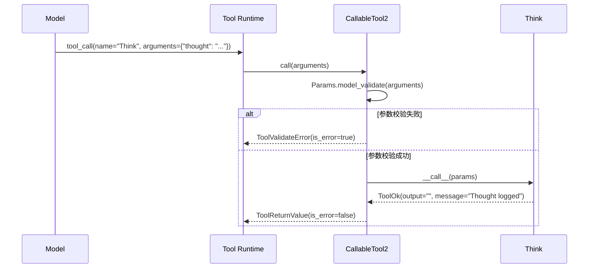
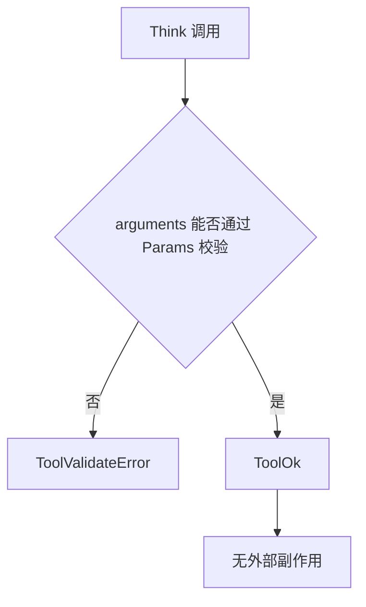

# internal_reasoning_marker 模块文档

`internal_reasoning_marker` 对应实现位于 `src/kimi_cli/tools/think/__init__.py`，在模块树中归属于 `tools_misc`，核心组件是 `Think` 与 `Params`。这个模块的代码非常短，但它在 Agent 运行时体系里承担的是“语义标记”而不是“功能执行”的角色：它让模型把一段内部推理显式写入工具调用轨道，从而让运行时、日志系统和调试工具知道“这里发生了一次思考动作”。

很多系统里，模型的中间推理要么完全不可见，要么和普通输出混在一起，难以治理。`internal_reasoning_marker` 的存在价值在于把“思考”从自由文本行为升级为一个标准化工具事件。这样做可以在不引入外部副作用的前提下提升可观测性，也方便策略层做约束（例如限制过多空转思考）。

---

## 1. 模块定位与设计目标

从系统分层看，这个模块并不负责文件、网络、shell 或会话管理，它只提供一个零副作用工具。它通过 `kosong_tooling` 的 `CallableTool2` 协议接入工具运行框架，参数使用 Pydantic 声明，返回值使用 `ToolReturnValue` 体系。也就是说，它的主要目标不是“做事”，而是“记录一次可追踪的思考意图”。

这一设计有三个直接收益。第一，运行时可以稳定区分“动作型工具调用”和“推理型工具调用”，便于日志审计与回放。第二，模型可以通过统一工具接口表达“我需要先想一下”，减少把大段思考塞进普通回答的倾向。第三，模块本身几乎没有依赖状态，跨 CLI/Web/测试环境的行为一致性很高。

---

## 2. 核心架构与依赖关系



这条链路里，`Think` 自身只处理成功路径并返回 `ToolOk`；参数校验失败与返回类型兜底都由 `CallableTool2` 统一处理。换句话说，`internal_reasoning_marker` 把“协议复杂度”外包给了框架，自己保持极小实现面。



依赖关系也非常克制：`load_desc` 负责从 `think.md` 装载工具描述；`Params` 定义输入契约；`ToolOk`/`ToolReturnValue` 定义输出契约。模块没有直接依赖 `soul_engine`、`wire_protocol`、`tools_file`、`tools_shell` 等执行型子系统。

如果你需要了解通用工具协议细节（例如参数如何转 JSON Schema、错误如何归一化），建议先阅读 [`kosong_tooling.md`](./kosong_tooling.md)。

---

## 3. 核心组件详解

### 3.1 `Params`

`Params` 是一个 Pydantic `BaseModel`：

```python
class Params(BaseModel):
    thought: str = Field(description=("A thought to think about."))
```

它定义了唯一输入字段 `thought`，语义是“本次要记录的思考内容”。从实现看，当前只声明了描述，没有额外约束（例如 `min_length`、`max_length`、正则）。因此只要类型是字符串，空字符串也会通过校验。

参数模型在 `CallableTool2` 初始化阶段会导出 JSON Schema，成为 LLM 工具调用协议的一部分。这意味着 `Params` 同时服务于两层：一层是运行时校验，一层是模型侧的工具使用提示。

### 3.2 `Think`

`Think` 继承 `CallableTool2[Params]`，核心定义如下：

```python
class Think(CallableTool2[Params]):
    name: str = "Think"
    description: str = load_desc(Path(__file__).parent / "think.md", {})
    params: type[Params] = Params

    @override
    async def __call__(self, params: Params) -> ToolReturnValue:
        return ToolOk(output="", message="Thought logged")
```

它的行为可以概括为：接收一个已校验的 `Params`，然后返回固定成功结果，不执行外部 I/O，不改变业务状态。值得注意的是，`__call__` 里没有使用 `params.thought` 生成任何输出文本，因此“thought 内容是否可见”完全取决于上层是否记录工具入参。

### 3.3 `load_desc` 的作用

`description` 不是硬编码字符串，而是通过 `load_desc(Path(__file__).parent / "think.md", {})` 读取。`load_desc` 使用 Jinja2 渲染模板（即使当前上下文为空），因此未来可以将描述做成参数化模板。当前 `think.md` 的内容强调了该工具不获取新信息、不改变数据库，只追加思考到日志，这与模块定位完全一致。

---

## 4. 执行流程与时序



实际运行中，框架通常调用的是 `call(arguments)`，而不是直接调用 `__call__`。前者负责输入验证与错误收敛；后者只承载业务语义。`internal_reasoning_marker` 正是利用这层抽象，把自身逻辑保持在“单行成功返回”的最小复杂度。

---

## 5. 输入输出契约与行为语义

### 输入

典型调用参数：

```json
{
  "thought": "先比较两种修复路径的回滚风险，再决定是否改配置。"
}
```

### 成功输出

概念化成功返回如下：

```json
{
  "is_error": false,
  "output": "",
  "message": "Thought logged",
  "display": []
}
```

`output` 为空字符串说明该工具不会向模型注入额外事实数据，`message` 仅提供确认语义。`display` 为空说明 UI 层不一定有显式可视反馈。

### 失败输出

若参数不合法（例如缺失 `thought`、`thought` 不是字符串、arguments 根本不是对象），`CallableTool2.call` 会捕获 `pydantic.ValidationError` 并返回 `ToolValidateError`。这是框架级行为，不需要 `Think` 自己处理。

---

## 6. 与其他模块的关系（避免重复说明）

`internal_reasoning_marker` 的职责非常单一，建议把它理解为 `tools_misc` 中的“内部语义工具”。它与其他工具的关系是互补而非替代：

- 需要与用户交互时，应使用 [`interactive_user_query.md`](./interactive_user_query.md) 对应能力。
- 需要维护任务状态投影时，应使用 `todo` 相关模块（可参考现有 `todo` 文档）。
- 需要执行真实动作时，应进入 `tools_file`、`tools_shell`、`tools_web` 等模块，而不是滥用 `Think`。

在协议层，它依赖 [`kosong_tooling.md`](./kosong_tooling.md)；在更高层运行时与会话系统中的集成，可参考 [`soul_engine.md`](./soul_engine.md) 与 [`wire_protocol.md`](./wire_protocol.md) 的调用上下文说明。

---

## 7. 可配置点与扩展方式

这个模块没有独立配置项，但有一个“软配置入口”：`think.md` 文本。修改它会直接影响模型对该工具的调用倾向和使用场景判断。因为描述在类属性初始化时加载，文件缺失或不可读会在导入阶段尽早失败。

如果要扩展该模块，推荐遵循“尽量保持无副作用”的原则。常见扩展是增强参数结构而不是增加执行逻辑，例如：

```python
class Params(BaseModel):
    thought: str = Field(min_length=1, description="A thought to think about.")
    category: str = Field(default="general", description="Thought category")

class Think(CallableTool2[Params]):
    name = "Think"
    description = load_desc(Path(__file__).parent / "think.md", {})
    params = Params

    async def __call__(self, params: Params) -> ToolReturnValue:
        return ToolOk(output="", message=f"Thought logged ({params.category})")
```

扩展后请同步检查三件事：工具描述是否匹配新参数、上游是否依赖旧返回格式、测试用例是否覆盖参数校验变化。

---

## 8. 边界条件、错误场景与限制



当前实现的主要边界和限制包括：

- `thought` 没有长度约束，空字符串或低价值重复内容可能进入日志。
- `__call__` 不消费 `thought` 字段，返回值中无法直接看到思考正文；排障时要看工具调用入参日志。
- 默认无 `display` 输出，终端/UI 用户可能感知不到这个工具“做了什么”。
- 该工具不会获取新信息，也不会验证事实正确性，因此不能把它当作检索或执行工具。
- 没有限流/去重机制；在循环策略不佳时可能被高频调用，产生“思考噪声”。

这些限制本质上不是 bug，而是“极简 marker 工具”设计的副作用。治理通常应放在提示词策略、循环控制和工具选择策略，而不是在 `Think` 内部堆积复杂逻辑。

---

## 9. 实践用法建议

在工程实践里，`Think` 最适用于以下节奏：先用一两次短 thought 标记关键决策点，然后立即转入执行工具。它应该是“中间站”，不是“终点站”。

一个常见有效模式是：`Think`（澄清计划）→ `Todo`（投影任务状态）→ 执行工具（文件/命令/网络）→ 必要时再次 `Think`（复盘下一步）。这样既保留思考可观测性，也避免无限自我反思。

如果你在排查“模型为什么频繁调用 Think”，优先检查 `think.md` 描述、系统提示中的工具使用规则、以及循环控制参数；通常不需要修改 `Think.__call__` 本体。
