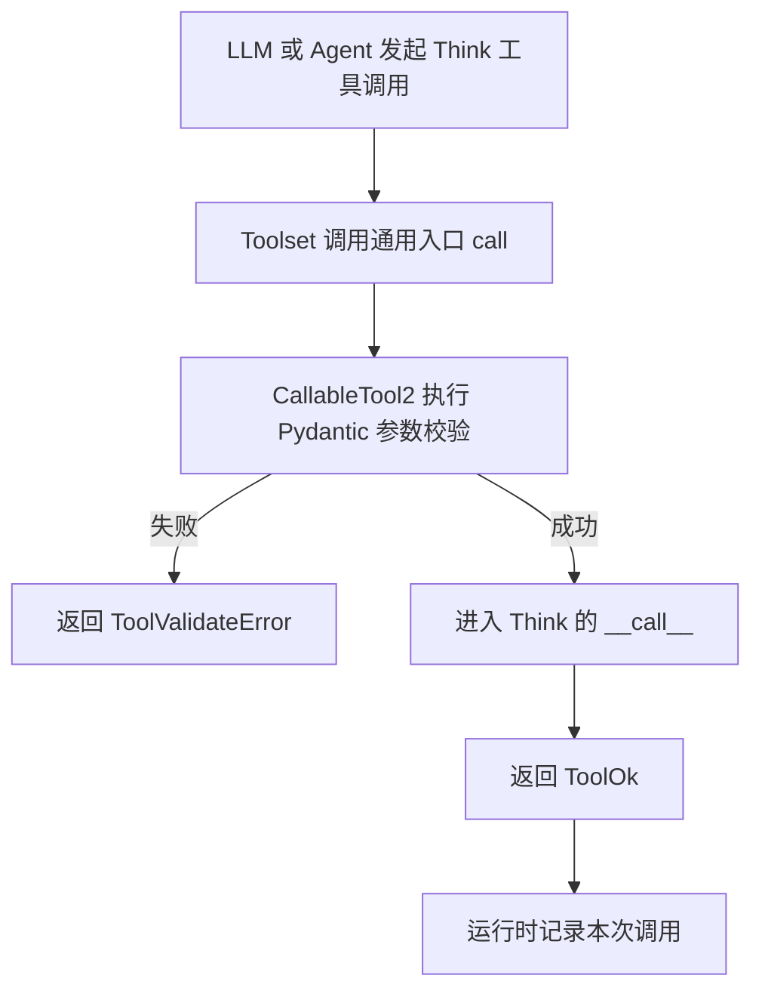
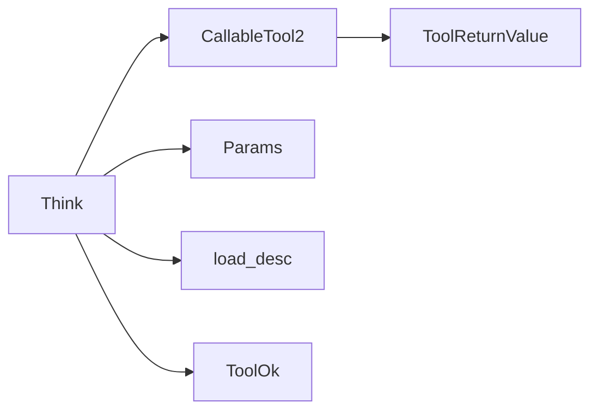
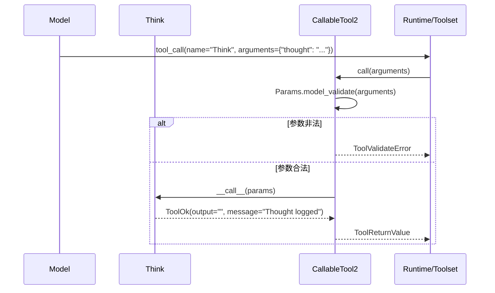
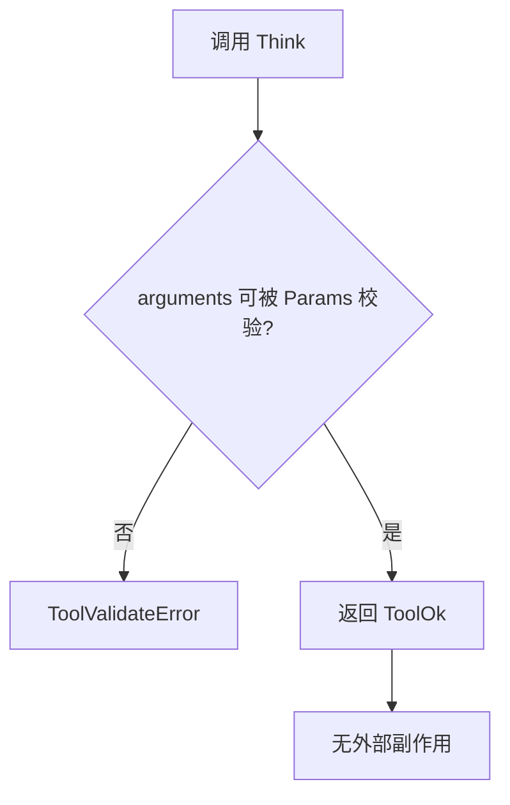

# internal_thinking 模块文档

## 1. 模块简介：它做什么、为什么存在

`internal_thinking` 模块（实现位于 `src/kimi_cli/tools/think/__init__.py`）提供了一个极简但非常关键的工具：`Think`。这个工具的目标不是访问外部资源，也不是修改系统状态，而是为 Agent 提供一个“显式记录内部思考”的标准调用点。换句话说，它把“我需要先整理思路再继续”这件事从隐式行为变成了可追踪、可审计的工具调用。

这个模块存在的意义主要在于运行时控制与可观测性。在复杂任务中，模型常常需要进行中间推理。若所有中间推理都只存在于上下文文本中，系统很难区分“最终行动”与“推理阶段”。`Think` 通过统一的工具接口承载这类行为，使上层运行时可以在日志、回放、调试或策略治理中识别“这是一次思考动作，而非真实副作用动作”。

从系统位置看，它隶属于 `tools_misc`，并通过 `CallableTool2` 接入 `kosong_tooling` 的工具框架。它与 [`kosong_tooling.md`](./kosong_tooling.md) 形成“协议-实现”关系：前者定义工具调用生命周期与返回值规范，后者提供具体业务语义。

---

## 2. 架构与依赖关系



上图展示了该模块在工具执行链路中的位置。`Think` 本身逻辑极简，真正承担“通用工具协议”的是 `CallableTool2`：它负责把 JSON 参数解析成 `Params`，并将异常场景规范化为结构化返回。`Think` 只需要实现 `__call__`，并返回一个合法的 `ToolReturnValue` 子类即可。



依赖图说明了 `internal_thinking` 的最小依赖集：描述文本由 `load_desc` 从 `think.md` 装载，参数模式由 `Params`（Pydantic）定义，执行结果通过 `ToolOk`（`ToolReturnValue` 的成功封装）返回。

---

## 3. 核心组件详解

### 3.1 `Params`

`Params` 是 `Think` 的入参模型：

```python
class Params(BaseModel):
    thought: str = Field(description=("A thought to think about."))
```

它定义了一个字段 `thought: str`，语义是“要记录的思考内容”。需要注意的是，这里仅提供了 `description`，并没有设置 `min_length`、`max_length` 或正则约束，因此从模型层面讲，空字符串在技术上是允许的（只要类型仍是字符串）。

在工具调用协议里，这个模型会被导出为 JSON Schema，用于模型侧函数调用与参数验证。也就是说，`thought` 字段既是运行时数据结构，也是对模型的提示契约。

### 3.2 `Think`

`Think` 是实际工具类，继承自 `CallableTool2[Params]`：

```python
class Think(CallableTool2[Params]):
    name: str = "Think"
    description: str = load_desc(Path(__file__).parent / "think.md", {})
    params: type[Params] = Params

    @override
    async def __call__(self, params: Params) -> ToolReturnValue:
        return ToolOk(output="", message="Thought logged")
```

它的设计要点如下：

- `name` 固定为 `"Think"`，这是被 LLM 工具调用系统识别的名字。
- `description` 在导入时通过 `load_desc` 从 `think.md` 读取。该描述文本会成为模型“何时调用该工具”的行为提示。
- `params` 显式绑定 `Params` 类型，使框架能做自动校验。
- `__call__` 不读取外部状态、不写入业务数据库、不执行 I/O（除框架层记录外），直接返回 `ToolOk`。

`__call__` 的返回值语义是“调用成功且已记录思考”。其中 `output=""` 表示不向模型提供额外内容数据，`message="Thought logged"` 提供最小确认语义。

---

## 4. 执行流程（内部机制）



这个流程里有一个容易忽略的点：外部通常调用的是 `call(arguments)`，而不是直接调用 `__call__`。`call` 是 `CallableTool2` 提供的安全入口，负责参数验证与返回类型兜底。`Think.__call__` 只关注业务语义，因此实现可以保持高度简洁。

---

## 5. 输入输出契约

### 5.1 输入示例

```json
{
  "thought": "需要先比较 A/B 两个方案的回滚风险，再决定是否改动配置。"
}
```

### 5.2 成功返回示例（概念化）

```json
{
  "is_error": false,
  "output": "",
  "message": "Thought logged",
  "display": []
}
```

这里 `display` 为空，意味着该工具默认不生成面向用户界面的可视块，只向运行时和模型返回一个轻量确认。

### 5.3 校验失败返回（由父类产生）

当入参不是对象、缺失 `thought`、或 `thought` 类型不匹配时，`CallableTool2.call` 会捕获 `pydantic.ValidationError` 并返回 `ToolValidateError`（`is_error=true`）。这是框架保证的一致行为，不是 `Think` 手动实现。

---

## 6. 与系统其他模块的关系

`internal_thinking` 本身不依赖会话持久化、Wire 协议、文件系统或网络能力，是一个“纯工具语义层”模块。它主要通过工具框架与系统连接：

- 与 [`kosong_tooling.md`](./kosong_tooling.md)：继承 `CallableTool2`，使用 `ToolOk`/`ToolReturnValue` 协议。
- 与 `tools_misc` 下其他工具（如 `ask_user_interaction`、`todo_state_presentation`）形成互补：`Think` 偏内部推理标记，其他工具偏外部交互或状态呈现。
- 与 `soul_engine`/`wire_protocol` 没有直接耦合：它不发送消息，也不等待外部响应。

这种低耦合设计使它在 CLI、Web、测试环境中都具备稳定一致的行为。

---

## 7. 配置、描述文件与行为提示

该模块没有独立配置项，但有一个非常重要的“行为入口”：`think.md`。

当前 `think.md` 内容为：

> Use the tool to think about something. It will not obtain new information or change the database, but just append the thought to the log. Use it when complex reasoning or some cache memory is needed.

这段文本会作为工具描述注入模型工具列表，直接影响模型调用倾向。由于 `description` 在类定义阶段通过 `load_desc(...)` 加载，如果文件缺失或读取失败，可能在模块导入时就触发异常。这是一种“早失败”策略：问题会尽快暴露，而不是在运行中悄悄降级。

---

## 8. 扩展与二次开发建议

如果你希望扩展 `internal_thinking`，建议优先保证“无副作用工具”的定位不被破坏。常见扩展方向包括：

- 增强参数结构，例如增加 `category`、`tags`、`importance` 字段，让后续日志分析更容易。
- 增加最小长度约束，防止空思考被大量记录。
- 返回简短结构化输出（例如 JSON 字符串），便于上游统计 thought 类型。

一个兼容性较好的扩展示例：

```python
class Params(BaseModel):
    thought: str = Field(min_length=1, description="A thought to think about.")
    category: str = Field(default="general", description="Thought category")

class Think(CallableTool2[Params]):
    ...
    async def __call__(self, params: Params) -> ToolReturnValue:
        return ToolOk(
            output=f"{{\"category\": \"{params.category}\"}}",
            message="Thought logged",
        )
```

扩展时要同步关注三件事：工具描述是否更新、模型是否仍能正确选择该工具、上游是否依赖 `output=""` 的旧行为。

---

## 9. 边界条件、错误场景与限制



该模块的边界与限制主要体现在“太简单”带来的行为含糊：

- `thought` 没有长度限制，空字符串或低价值内容可能污染日志质量。
- `__call__` 不使用 `params.thought` 生成返回内容，因此从返回值看不到实际 thought；真正内容是否可见取决于外围日志系统如何记录入参。
- 默认 `display=[]`，用户界面通常不会看到明显反馈，容易让人误以为工具“没做事”。
- 该工具不会获取新信息，因此不能把它当作检索、验证、执行类工具使用。

此外，`Think` 没有内建限流与去重。如果模型在循环中频繁调用，会造成“思考噪声”堆积，需要在上层策略（如 loop control 或提示词）进行约束。

---

## 10. 实践建议

在实际 Agent 设计中，`Think` 最适合用于“短暂整理计划后再行动”的场景，例如：先列出比较维度、先确认假设边界、先拆分子任务顺序。它不应替代真正的执行工具，也不应成为无限自我反思的出口。良好的实践是把它与 `Todo`/`AskUserQuestion` 等工具配合使用：先思考，再决定是否需要向用户提问或更新任务状态。

如果你正在阅读本模块是为了排查“为什么模型频繁调用 Think”，建议优先检查工具描述与系统提示中的触发策略，其次检查回路控制参数，而不是在 `Think.__call__` 内增加复杂逻辑。
