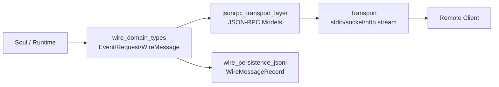
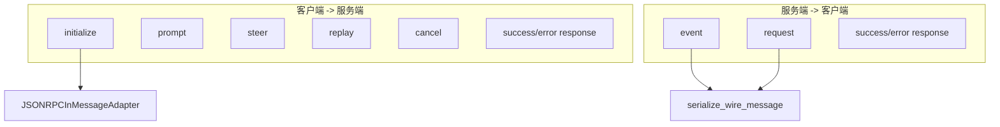
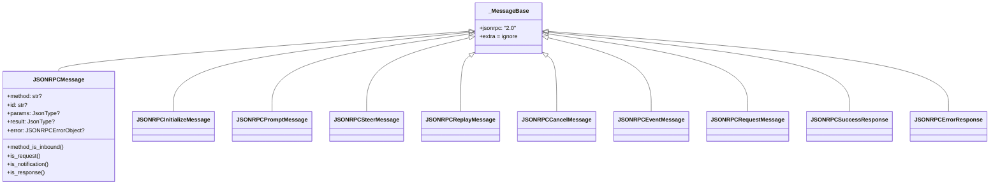
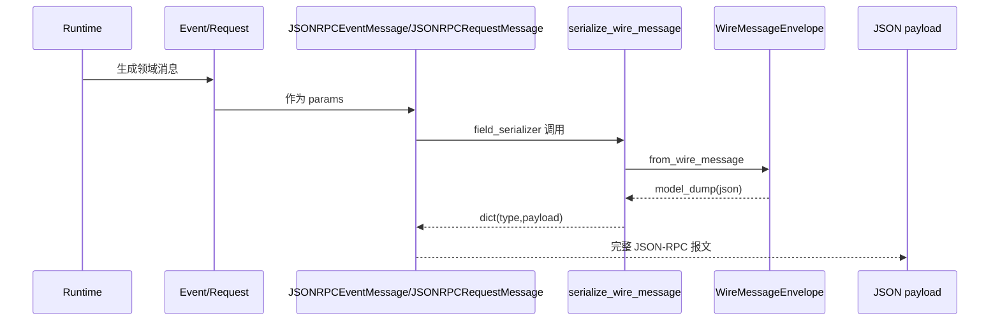
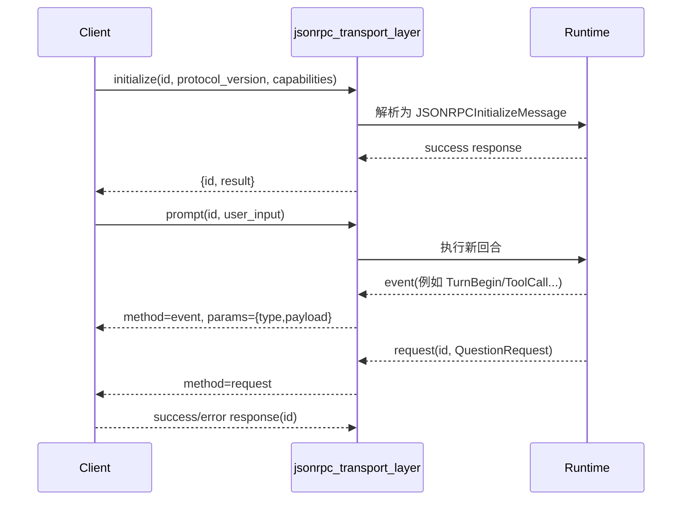

# jsonrpc_transport_layer 模块文档

## 概述：这个模块做什么、为什么存在

`jsonrpc_transport_layer`（实现位于 `src/kimi_cli/wire/jsonrpc.py`）是 `wire_protocol` 中负责 **JSON-RPC 2.0 传输建模与边界校验** 的核心模块。它并不直接定义业务事件本身，而是把内部运行时消息（`Event` / `Request` / `ContentPart` 等）包装到 JSON-RPC 的标准外壳中（`jsonrpc`, `method`, `id`, `params`, `result`, `error`），从而让 CLI、Web、UI Shell 或第三方客户端能够用统一协议与系统交互。

从设计上看，这个模块解决的是“协议边界分层”问题：

1. 领域层（消息语义）由 [wire_domain_types.md](wire_domain_types.md) 维护；
2. 传输层（JSON-RPC 结构）由本模块维护；
3. 持久化层（JSONL 记录）由 [wire_persistence_jsonl.md](wire_persistence_jsonl.md) 维护。

这样做的直接收益是：当业务消息演进时，JSON-RPC 壳层不一定要改；反过来，当传输策略变化时，也不必侵入领域模型。

---

## 模块在整体系统中的位置



上图展示了边界职责：运行时先产生领域消息，随后通过本模块形成可传输 JSON-RPC 报文；如果需要落盘回放，则走 `WireMessageEnvelope` 与 `WireMessageRecord` 路径。需要注意，本模块本身不负责网络 I/O，也不负责消息存储，它只负责“消息结构定义 + 校验 + 序列化入口约束”。

---

## 核心设计：入站与出站分离



模块通过 `JSONRPCInMessage` / `JSONRPCOutMessage` 两个联合类型，把消息方向和语义边界显式化。`JSONRPC_IN_METHODS` 与 `JSONRPC_OUT_METHODS` 作为轻量路由常量，帮助上层快速判定 method 是否在允许集合内。

---

## 数据模型关系与序列化职责



这张图体现了一个关键事实：模块通过一个非常薄的基类 `_MessageBase` 统一 JSON-RPC 外壳，再把每一种 method 建模成独立强类型消息。这样的设计比“单模型 + 大量可选字段”更有利于维护，因为调用者可以在类型层面拿到 method 专属字段约束；同时，`JSONRPCMessage` 作为宽口径模型继续保留，承担“快速判别与预路由”的职责。

在序列化责任上，本模块只对 `event/request` 的 `params` 做了明确、可运行的结构化序列化（通过 `serialize_wire_message`）。而 `prompt/steer/cancel` 的 `model_serializer` 尚未实现，这意味着它们当前更像“入站校验模型”而非“双向可序列化 DTO”。在维护时一定要把这件事当作协议约束，而不是临时实现细节。

---

## 组件详解

## 1) `_MessageBase`

`_MessageBase` 是几乎所有 JSON-RPC 模型的共同基类。它固定了 `jsonrpc: "2.0"`，并配置 `extra="ignore"`。这意味着当输入包含未知字段时，Pydantic 会忽略而不是报错。这个策略提高了前后兼容性，但也带来一个调试代价：字段拼错可能被静默吞掉，需要结合原始 payload 日志定位。

**关键行为**：
- 固定协议版本字段，防止每个子模型重复定义。
- 接受“超集输入”，提升跨版本弹性。

---

## 2) `JSONRPCErrorObject`

`JSONRPCErrorObject` 对应 JSON-RPC 标准错误对象，包含：
- `code: int`
- `message: str`
- `data: JsonType | None`

这是错误响应中的核心负载结构。`data` 允许携带可 JSON 化的扩展诊断信息（例如 provider 返回细节、参数错误上下文）。

---

## 3) `JSONRPCMessage`（通用校验模型）

`JSONRPCMessage` 是“宽口径”消息模型，用于对原始 JSON-RPC 报文做通用判断。字段覆盖请求、通知、响应三种形态：
- `method`
- `id`
- `params`
- `result`
- `error`

它提供 4 个辅助方法：
- `method_is_inbound()`：是否属于 `JSONRPC_IN_METHODS`。
- `is_request()`：`method != None 且 id != None`。
- `is_notification()`：`method != None 且 id == None`。
- `is_response()`：`method == None 且 id != None`。

这些方法适合用于日志检查、粗分类和预路由。它们不是完整协议校验（例如不会验证 `params` 内部结构）。

---

## 4) 标准响应模型

### `JSONRPCSuccessResponse`
- 字段：`id: str`, `result: JsonType`
- 用途：对某个请求返回成功结果。

### `JSONRPCErrorResponse`
- 字段：`id: str`, `error: JSONRPCErrorObject`
- 用途：对某个请求返回失败。

### `JSONRPCErrorResponseNullableID`
- 字段：`id: str | None`, `error: JSONRPCErrorObject`
- 用途：某些错误路径下请求 ID 丢失或不可用时仍可输出错误。

这三个模型用于 JSON-RPC “响应”语义，与 `event/request` 推送语义并行存在。

---

## 5) 初始化相关模型：`ClientInfo` / `ExternalTool` / `ClientCapabilities` / `JSONRPCInitializeMessage`

### `ClientInfo`
描述客户端身份：
- `name: str`
- `version: str | None`

### `ExternalTool`
描述客户端可被服务端调用的外部工具：
- `name: str`
- `description: str`
- `parameters: dict[str, JsonType]`

### `ClientCapabilities`
当前定义了：
- `supports_question: bool = False`

该能力位用于声明客户端是否支持 `QuestionRequest` 类交互流程（见 [wire_domain_types.md](wire_domain_types.md)）。

### `JSONRPCInitializeMessage`
入站初始化请求，结构如下：
- `method: "initialize"`
- `id: str`
- `params: JSONRPCInitializeMessage.Params`

其中 `Params` 包含：
- `protocol_version: str`
- `client: ClientInfo | None`
- `external_tools: list[ExternalTool] | None`
- `capabilities: ClientCapabilities | None`

初始化消息是能力协商和会话上下文建立的入口。

---

## 6) 用户控制入站消息：`prompt` / `steer` / `replay` / `cancel`

### `JSONRPCPromptMessage`
- `method: "prompt"`
- `id: str`
- `params.user_input: str | list[ContentPart]`

### `JSONRPCSteerMessage`
- `method: "steer"`
- `id: str`
- `params.user_input: str | list[ContentPart]`

### `JSONRPCReplayMessage`
- `method: "replay"`
- `id: str`
- `params: JsonType | None`

### `JSONRPCCancelMessage`
- `method: "cancel"`
- `id: str`
- `params: JsonType | None`

这四类都是客户端发给服务端的控制型消息。其中 `prompt/steer/cancel` 定义了 `@model_serializer`，但当前实现是直接抛出 `NotImplementedError`。这是一条非常重要的运行时约束：如果上层直接依赖这些模型实例执行默认 JSON 序列化，可能在运行中触发异常。

---

## 7) 服务端推送消息：`JSONRPCEventMessage` 与 `JSONRPCRequestMessage`

### `JSONRPCEventMessage`
- `method: "event"`
- `params: Event`
- 序列化：通过 `serialize_wire_message(params)`，最终产出 `{type, payload}` 包络。
- 反序列化验证：若输入值已是 `Event` 实例则通过；否则抛 `NotImplementedError`。

### `JSONRPCRequestMessage`
- `method: "request"`
- `id: str`
- `params: Request`
- 序列化与验证逻辑与 `JSONRPCEventMessage` 对称。

这两个模型是领域消息与 JSON-RPC 壳层的关键桥接点。它们把 `WireMessageEnvelope.from_wire_message(...).model_dump(...)` 这条序列化链条封装为字段级 serializer。



---

## 8) 联合类型与适配器

模块定义了：
- `type JSONRPCInMessage = (...)`
- `JSONRPCInMessageAdapter = TypeAdapter[JSONRPCInMessage](JSONRPCInMessage)`
- `type JSONRPCOutMessage = (...)`
- `JSONRPC_IN_METHODS` / `JSONRPC_OUT_METHODS`

`TypeAdapter` 允许上层对“一个原始输入可能属于多个消息模型”做统一验证，避免手工写大量 `if method == ...` + `model_validate` 的样板代码。在高并发流式输入里，这种结构化校验能显著减少分支错误。

---

## 9) `ErrorCodes` 与 `Statuses`

### `ErrorCodes`
该类集中定义标准 JSON-RPC 错误码和系统扩展错误码。

标准码：
- `PARSE_ERROR = -32700`
- `INVALID_REQUEST = -32600`
- `METHOD_NOT_FOUND = -32601`
- `INVALID_PARAMS = -32602`
- `INTERNAL_ERROR = -32603`

扩展码：
- `INVALID_STATE = -32000`
- `LLM_NOT_SET = -32001`
- `LLM_NOT_SUPPORTED = -32002`
- `CHAT_PROVIDER_ERROR = -32003`

这些常量的意义是保证错误处理逻辑依赖稳定整数码，而不是不稳定的文本消息。

### `Statuses`
该类定义运行状态字符串常量：
- `FINISHED`
- `CANCELLED`
- `MAX_STEPS_REACHED`
- `STEERED`

这些状态通常在事件 payload 或最终结果中被引用，保持跨组件的一致语义。

---

## 典型流程（初始化 + 交互 + 推送 + 响应）



这个流程强调：本模块只负责协议形态，不负责业务执行本身。运行逻辑仍在 runtime/soul 层（可参考 [soul_runtime.md](soul_runtime.md)）。

---

## 使用示例

### 示例 1：构造 initialize 请求

```python
from kimi_cli.wire.jsonrpc import (
    JSONRPCInitializeMessage,
    ClientInfo,
    ClientCapabilities,
    ExternalTool,
)

msg = JSONRPCInitializeMessage(
    id="init-1",
    params=JSONRPCInitializeMessage.Params(
        protocol_version="1.0",
        client=ClientInfo(name="my-client", version="0.3.0"),
        capabilities=ClientCapabilities(supports_question=True),
        external_tools=[
            ExternalTool(
                name="open_url",
                description="Open URL on client side",
                parameters={"url": {"type": "string"}},
            )
        ],
    ),
)

payload = msg.model_dump(mode="json")
```

### 示例 2：构造服务端事件推送

```python
from kimi_cli.wire.jsonrpc import JSONRPCEventMessage
from kimi_cli.wire.types import TurnBegin

ev = TurnBegin(user_input="hello")
out = JSONRPCEventMessage(params=ev)
payload = out.model_dump(mode="json")
# payload["params"] 将是 {"type": "turn_begin", "payload": {...}}
```

### 示例 3：对入站消息做联合校验

```python
from kimi_cli.wire.jsonrpc import JSONRPCInMessageAdapter

raw = {
    "jsonrpc": "2.0",
    "method": "replay",
    "id": "r-1",
    "params": None,
}

msg = JSONRPCInMessageAdapter.validate_python(raw)
```

---

## 扩展与维护建议

如果你要扩展本模块，建议按以下原则进行：

- 新增客户端入站控制命令时，优先新增独立 `JSONRPC...Message` 模型，并同步更新 `JSONRPCInMessage` 与 `JSONRPC_IN_METHODS`。
- 新增服务端业务事件/请求时，优先在 [wire_domain_types.md](wire_domain_types.md) 添加新 `WireMessage` 类型；本模块通常无需新增模型，只需复用 `event/request` 包装。
- 若要支持“从 dict 反序列化为 Event/Request”，应补齐 `JSONRPCEventMessage` 与 `JSONRPCRequestMessage` 的 `field_validator(mode="before")` 分支，调用 `WireMessageEnvelope(...).to_wire_message()` 路径完成还原。
- 若要允许直接序列化 `prompt/steer/cancel`，必须实现当前抛错的 `@model_serializer`，或移除不必要的自定义 serializer。

---

## 边界条件、错误场景与已知限制

当前代码中最容易踩坑的点有四类：

1. **未实现序列化器**：`JSONRPCPromptMessage`、`JSONRPCSteerMessage`、`JSONRPCCancelMessage` 的 `model_serializer` 会抛 `NotImplementedError`。
2. **未实现通用反序列化**：`JSONRPCEventMessage`、`JSONRPCRequestMessage` 在收到普通 dict `params` 时会抛 `NotImplementedError`，仅“已是 Event/Request 实例”可通过。
3. **`extra="ignore"` 的静默行为**：未知字段不会报错，提升兼容性但降低错误暴露性。
4. **辅助判定非严格校验**：`JSONRPCMessage.is_request()/is_response()` 只判断字段存在关系，不保证内容合法。

因此在生产环境中，建议将该模块与原始报文日志、统一异常映射、以及上层协议测试结合使用，避免把“结构通过”误认为“语义正确”。

---

## 相关文档

- 领域消息定义： [wire_domain_types.md](wire_domain_types.md)
- 持久化记录格式： [wire_persistence_jsonl.md](wire_persistence_jsonl.md)
- 协议总览： [wire_protocol.md](wire_protocol.md)
- 运行时上下文： [soul_runtime.md](soul_runtime.md)
