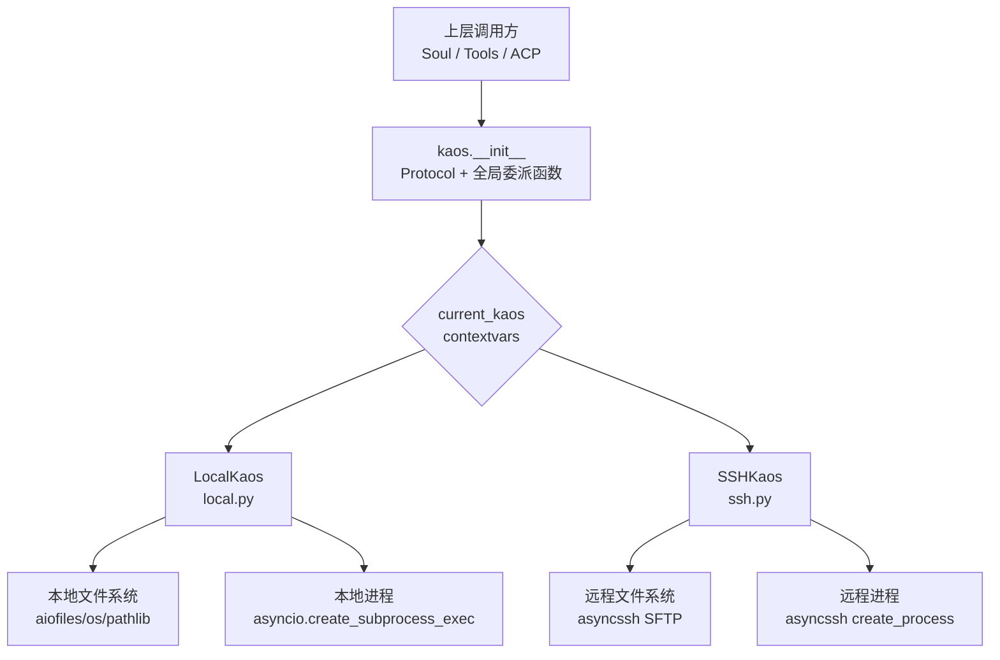
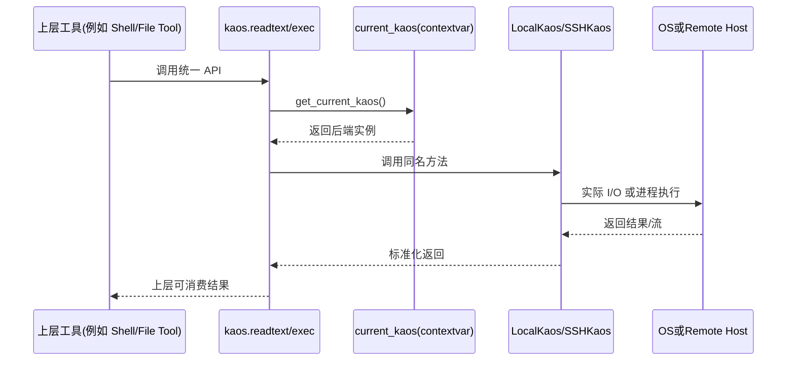
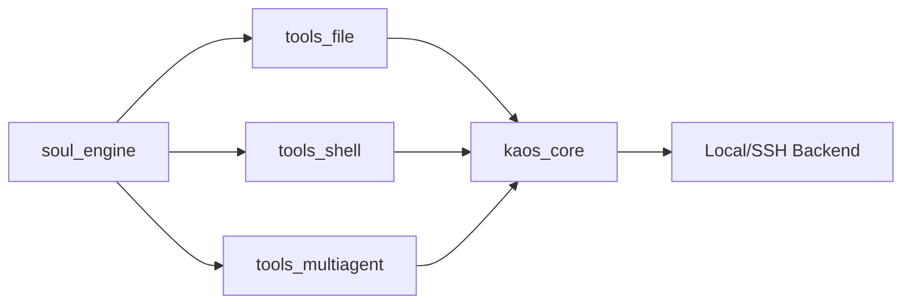

# kaos_core 模块文档

## 1. 模块定位与设计目标

`kaos_core` 提供了一个“统一异步操作系统抽象层”（KAOS, Kimi Agent Operating System），用于屏蔽“本地环境”和“远程 SSH 环境”在文件系统与进程执行方面的差异。对上层代理系统（例如 `soul_engine`、`tools_file`、`tools_shell`、`acp_kaos`）来说，调用方不需要关心目标是本机目录还是远程主机目录，只需依赖一致的接口：读写文件、列目录、glob、切换工作目录、执行命令、处理标准输入输出。

这个模块存在的核心价值是**可移植性 + 可测试性 + 运行时切换能力**。可移植性体现在 `Kaos` 协议定义了后端必须实现的行为契约；可测试性体现在 `AsyncReadable`/`AsyncWritable`/`KaosProcess` 皆为 `Protocol`，可以很容易注入 mock/stub；运行时切换能力体现在通过 `contextvars` 保存“当前 KAOS 实例”，使同一进程中的不同协程可在隔离上下文中使用不同后端。

从架构上看，`kaos_core` 并不追求“完整 POSIX API 覆盖”，而是聚焦于 agent 执行链路中最高频、最关键的一组能力。这种克制的 API 设计降低了多后端实现成本，也减少了上层工具对环境细节的耦合。

---

## 2. 架构总览



该图展示了模块的核心思路：`kaos.__init__` 只定义抽象协议与 API 门面，不持有具体实现逻辑；具体行为由 `current_kaos` 指向的后端（`LocalKaos` 或 `SSHKaos`）完成。这样，上层业务代码调用 `kaos.readtext()` 等函数时，本质是动态委派到当前上下文后端。

### 2.1 关键分层

1. **协议层（Protocol Layer）**：定义 `Kaos`、`KaosProcess`、`AsyncReadable`、`AsyncWritable`、`StatResult`。
2. **上下文分发层（Dispatch Layer）**：`get_current_kaos/set_current_kaos/reset_current_kaos` + 同名便捷函数（`readtext`, `exec` 等）。
3. **后端实现层（Backend Layer）**：`LocalKaos` 与 `SSHKaos`。
4. **路径抽象协作层（Path Collaboration）**：与 `KaosPath` 协作，保证不同 path flavor（Windows/Posix）的一致路径语义。

---

## 3. 组件关系与运行时数据流



在这条调用链中，最关键的是“**委派点只有一个**”：`get_current_kaos()`。这意味着如果系统切换后端，只需在上下文设置时变更实例，不需要大规模改动上层工具代码。

---

## 4. 子模块功能导览

### 4.1 `api_protocol_layer`（协议与统一入口）

该文档对应 `kaos.__init__` 的契约中心，定义所有后端必须遵守的异步接口，并提供与当前后端绑定的全局函数。它保证了调用侧 API 的稳定性，也是多后端扩展的锚点。

> 详见：[api_protocol_layer.md](api_protocol_layer.md)

### 4.2 `local_backend`（本地后端实现）

`LocalKaos` 基于 `aiofiles` 和 `asyncio.subprocess` 实现本地文件系统与进程管理。它是默认后端（`local_kaos`），也是开发与测试环境中最常用的执行路径。其实现特别关注跨平台 path flavor（Windows vs POSIX）和异步文件读写。

> 详见：[local_backend.md](local_backend.md)

### 4.3 `ssh_backend`（SSH 远程后端实现）

`SSHKaos` 通过 `asyncssh` 把同一套 KAOS API 映射到远程主机，底层结合 SFTP 与 SSH process。它处理了远程 stat 映射、cwd 追踪、命令安全拼接（`shlex.quote`）等细节，是实现“远程 agent 操作系统抽象”的核心。

> 详见：[ssh_backend.md](ssh_backend.md)

---

## 5. 与系统其他模块的协作位置

`kaos_core` 通常被视为“执行平面（execution plane）”基础设施，而不是业务逻辑模块。其上层关系可概括如下：

- 与 `tools_file` 配合：文件工具调用 KAOS 统一 API 做读写、替换、glob。
- 与 `tools_shell` 配合：Shell 工具通过 `kaos.exec()` 执行命令并消费 stdout/stderr。
- 与 `acp_kaos` 配合：ACP 进程层可能把 KAOS 过程封装为跨协议能力。
- 与 `soul_engine` 配合：Soul 在推理步骤中触发工具调用，工具最终落到 KAOS 抽象层。



---

## 6. 使用与配置速览

### 6.1 使用本地后端

```python
import kaos
from kaos.local import local_kaos

token = kaos.set_current_kaos(local_kaos)
try:
    content = await kaos.readtext("README.md")
    proc = await kaos.exec("bash", "-lc", "echo hello")
    out = await proc.stdout.read()
finally:
    kaos.reset_current_kaos(token)
```

### 6.2 使用 SSH 后端

```python
import kaos
from kaos.ssh import SSHKaos

ssh = await SSHKaos.create(
    host="example.com",
    username="user",
    key_paths=["~/.ssh/id_ed25519"],
    cwd="/workspace/project",
)

token = kaos.set_current_kaos(ssh)
try:
    files = [p async for p in kaos.iterdir(".")]
    proc = await kaos.exec("python", "--version")
    stdout = await proc.stdout.read()
finally:
    kaos.reset_current_kaos(token)
    await ssh.unsafe_close()
```

---

## 7. 典型扩展点

如果你要新增一个后端（例如容器后端、沙箱后端），最重要的是完整实现 `Kaos` 协议，并保证行为和现有后端在关键语义上一致：

- `exec().wait()` 后 stdout/stderr 仍可读取（至少行为需文档化一致）
- `stat` 返回 `StatResult` 字段完整且可预期
- `chdir/getcwd` 行为有闭环
- `glob` 的大小写规则与限制明确

建议先写契约测试（同一组用例对 `LocalKaos`/`SSHKaos`/新后端跑一遍），再上线。

---

## 8. 风险、限制与维护建议

`kaos_core` 的主要风险并非接口复杂，而是“不同系统能力差异导致的行为边缘不一致”。例如 SSH SFTP 无法提供 inode/dev、`readlines` 可能无法流式、远程进程 pid 不可得等。维护时应优先保证“语义透明”——即在文档和异常上明确差异，而不是隐藏差异。

此外，`SSHKaos.create()` 当前将 `known_hosts=None`，会绕过主机密钥校验，这对安全要求高的部署并不理想。生产环境若有安全基线，应在调用层额外约束连接参数或扩展创建逻辑。
