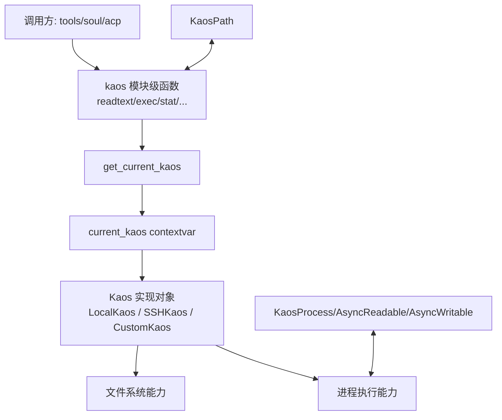
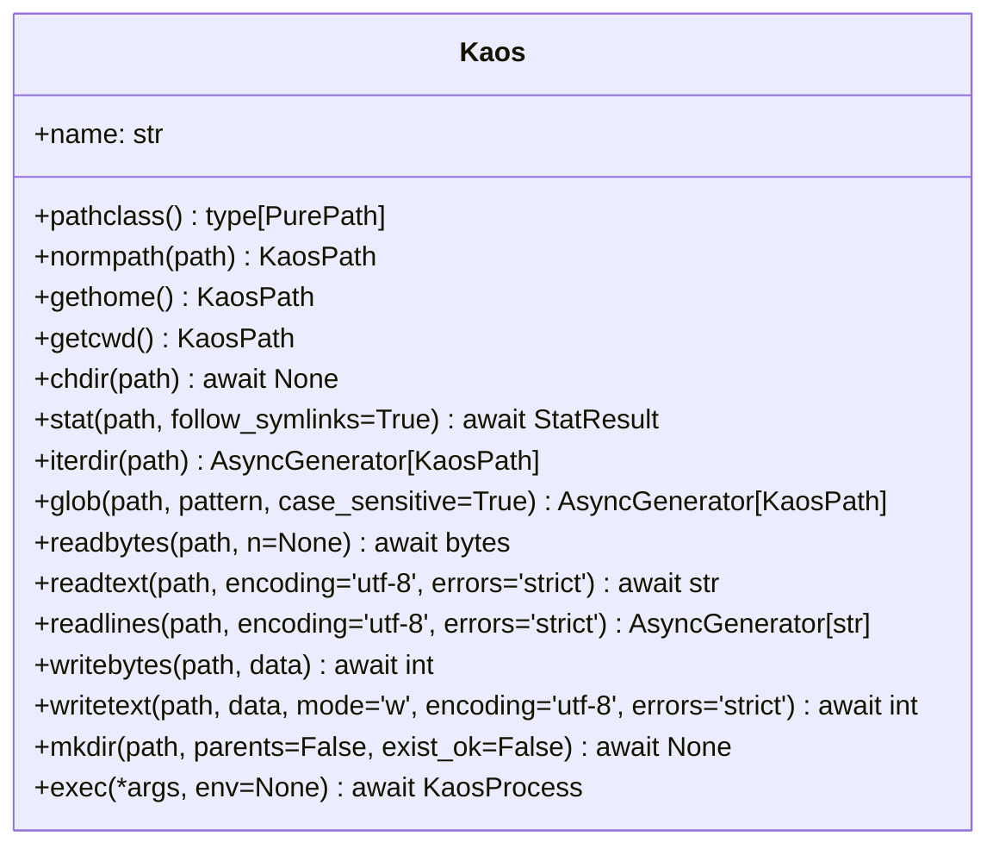
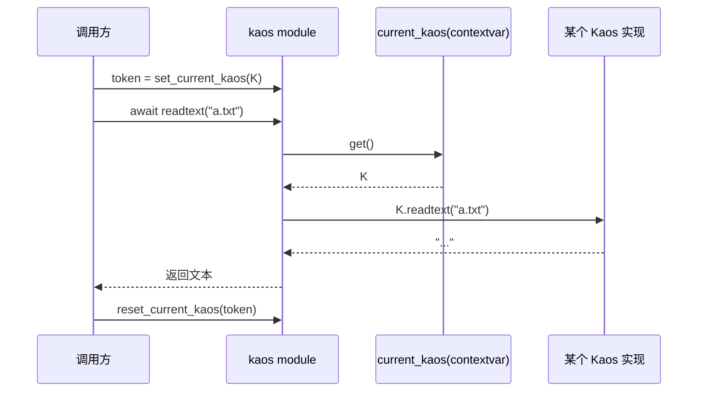

# kaos_protocols 模块文档

## 1. 模块定位与存在价值

`kaos_protocols` 对应 `packages/kaos/src/kaos/__init__.py` 中的协议与门面函数部分，是 `kaos_core` 的“契约层（contract layer）”。这个模块不直接做本地文件读写，也不直接发起 SSH 连接；它定义的是**所有 KAOS 后端都必须遵守的统一异步接口**，并通过 `contextvars` 提供“当前后端实例”的运行时分发。

这个设计的核心价值在于：上层模块（例如 `tools_file`、`tools_shell`、`acp_kaos`，以及更上层的 `soul_engine`）无需关心底层执行环境是 Local 还是 SSH，只需要调用 `kaos.readtext()`、`kaos.exec()` 这类稳定 API。后端切换变成“上下文设置问题”，而不是“业务代码重写问题”。

从工程角度看，`kaos_protocols` 同时承担了三种职责：第一，定义结构化协议（`Protocol`）以约束实现；第二，定义数据模型（`StatResult`）以统一返回形态；第三，提供委派函数（module-level wrappers）以简化调用入口。这使它成为整个 KAOS 子系统的 API 锚点。

---

## 2. 架构总览



上图展示了该模块最重要的控制点：所有公共 API 最终都通过 `get_current_kaos()` 找到当前后端并委派执行。`KaosPath` 与 `Kaos` 协议共同保证路径语义一致，`KaosProcess` 与流协议保证进程 I/O 语义一致。

---

## 3. 核心类型与协议设计

## 3.1 `StrOrKaosPath`

```python
type StrOrKaosPath = str | KaosPath
```

这是整个 API 的输入统一约定。调用方可以传字符串路径，也可以传 `KaosPath`。这种设计提高了兼容性：简单调用时可用 `str`，复杂路径拼接时可用 `KaosPath`。

需要注意，这种“宽输入”会把路径归一化责任下放到后端 `normpath` 与 `pathclass`。如果自定义后端没有正确处理字符串路径，行为会出现跨后端差异。

## 3.2 `AsyncReadable` 协议

`AsyncReadable` 描述“异步可读字节流”的最小契约，用于 `KaosProcess.stdout/stderr` 等场景。它兼容 `asyncio.StreamReader` 与 `asyncssh` 的 reader 语义。

```python
@runtime_checkable
class AsyncReadable(Protocol):
    def __aiter__(self) -> AsyncIterator[bytes]: ...
    def at_eof(self) -> bool: ...
    def feed_data(self, data: bytes) -> None: ...
    def feed_eof(self) -> None: ...
    async def read(self, n: int = -1) -> bytes: ...
    async def readline(self) -> bytes: ...
    async def readexactly(self, n: int) -> bytes: ...
    async def readuntil(self, separator: bytes) -> bytes: ...
```

设计上它不是面向“文本”，而是面向“字节”。这避免了编码层面的隐式假设，调用方可根据场景自行 decode。`feed_data`/`feed_eof` 的存在让协议更适合测试替身与适配器。

## 3.3 `AsyncWritable` 协议

`AsyncWritable` 描述“异步可写字节流”契约，主要用于子进程 `stdin`。

```python
@runtime_checkable
class AsyncWritable(Protocol):
    def can_write_eof(self) -> bool: ...
    def close(self) -> None: ...
    async def drain(self) -> None: ...
    def is_closing(self) -> bool: ...
    async def wait_closed(self) -> None: ...
    def write(self, data: bytes) -> None: ...
    def writelines(self, data: Iterable[bytes], /) -> None: ...
    def write_eof(self) -> None: ...
```

此协议的重点是显式缓冲控制（`drain`）和关闭握手（`wait_closed`）。如果调用方大量写入但不 `drain`，可能导致缓冲膨胀或背压问题。

## 3.4 `KaosProcess` 协议

`KaosProcess` 统一了“已启动进程对象”的操作面。

```python
@runtime_checkable
class KaosProcess(Protocol):
    stdin: AsyncWritable
    stdout: AsyncReadable
    stderr: AsyncReadable

    @property
    def pid(self) -> int: ...

    @property
    def returncode(self) -> int | None: ...

    async def wait(self) -> int: ...
    async def kill(self) -> None: ...
```

它关注的不是如何创建进程，而是创建后的生命周期控制与 I/O 交互。`returncode is None` 表示仍在运行；`wait()` 用于最终收敛；`kill()` 用于强终止。不同后端对 `pid` 的可用性细节可能不同，调用侧不应假设它总能映射为宿主 OS 的真实 PID。

## 3.5 `Kaos` 协议

`Kaos` 是本模块最核心的协议，定义了后端必须实现的“文件系统 + 进程 + cwd 管理”能力集合。



`Kaos` 的方法划分体现了明确设计取舍：提供高频、可组合、跨后端相对容易对齐的操作，而不试图覆盖完整 POSIX API。这样既降低实现复杂度，也减少上层语义分歧。

## 3.6 `StatResult` 数据类

`StatResult` 是跨后端统一的 stat 结果结构，字段与常见 `os.stat_result` 的核心项一致：`st_mode`、`st_size`、`st_mtime` 等。

该数据类的价值在于让调用方免于处理后端特有对象（例如某些 SSH 库的专有 stat 类型）。但也要注意：某些后端无法提供完整语义（如 inode/device 的真实性），实现方可能只能给出兼容值。

---

## 4. 上下文分发机制（`contextvars`）

模块通过 `get_current_kaos`、`set_current_kaos`、`reset_current_kaos` 管理当前上下文中的 KAOS 实例。这个机制允许在同一进程内，不同异步任务使用不同后端实例，而不会互相污染。



实践中应始终使用 token 对称恢复，避免“泄漏当前后端”影响后续协程。尤其在测试场景中，忘记 reset 是最常见问题之一。

---

## 5. 模块级便捷函数：行为与副作用

`kaos_protocols` 在协议定义之外，还暴露了一组与 `Kaos` 同名的模块级函数：`readtext`、`writebytes`、`exec`、`stat` 等。它们的行为非常直接：读取当前后端并转发参数。

这种设计降低了调用复杂度（无需处处传递实例），但也引入隐式状态依赖：函数行为由上下文决定，而不是参数显式决定。对可读性要求高的代码，可以在边界层注入并固定 `Kaos` 实例，内部尽量避免深层全局调用。

下面给出代表性函数语义摘要。

- `pathclass() -> type[PurePath]`：返回当前后端采用的路径类（例如 `PurePosixPath`/`PureWindowsPath`）。
- `normpath(path) -> KaosPath`：按当前后端规则归一化路径。
- `gethome()/getcwd()/chdir()`：管理逻辑 home 与 cwd。
- `stat()/iterdir()/glob()`：目录与元信息操作。
- `readbytes()/readtext()/readlines()`：读取接口，其中 `readlines` 为异步生成器。
- `writebytes()/writetext()/mkdir()`：写入与目录创建。
- `exec(*args, env=None)`：启动进程并返回 `KaosProcess`。

---

## 6. 典型使用模式

## 6.1 在作用域内切换后端

```python
import kaos
from kaos.local import local_kaos

async def load_readme() -> str:
    token = kaos.set_current_kaos(local_kaos)
    try:
        return await kaos.readtext("README.md")
    finally:
        kaos.reset_current_kaos(token)
```

这个模式的关键是 `try/finally` 保证 reset 执行。

## 6.2 进程执行与流读取

```python
proc = await kaos.exec("bash", "-lc", "echo hello; echo err >&2")
stdout = await proc.stdout.read()
stderr = await proc.stderr.read()
code = await proc.wait()
```

如果需要交互式输入：

```python
proc = await kaos.exec("python", "-c", "print(input())")
proc.stdin.write(b"hi\n")
await proc.stdin.drain()
proc.stdin.write_eof()
output = await proc.stdout.read()
await proc.wait()
```

## 6.3 与 `KaosPath` 协作

`KaosPath`（见 `kaos.path`）会调用本模块的门面函数，因此它的行为同样依赖当前后端。

```python
from kaos.path import KaosPath

p = KaosPath("~/project").expanduser().canonical()
exists = await p.exists()
if exists:
    text = await p.read_text()
```

---

## 7. 扩展与自定义后端指南

实现新后端时，最稳妥的方法是从 `Kaos` 协议逐项对齐，并先保证语义一致，再追求性能优化。尤其要优先对齐以下行为：路径规范化规则、`chdir/getcwd` 闭环、`exec` 返回的 I/O 可读写性、`stat` 字段完整性。

```python
class MyKaos:
    name = "my-kaos"

    def pathclass(self): ...
    def normpath(self, path): ...
    def gethome(self): ...
    def getcwd(self): ...
    async def chdir(self, path): ...
    async def stat(self, path, *, follow_symlinks=True): ...
    def iterdir(self, path): ...
    def glob(self, path, pattern, *, case_sensitive=True): ...
    async def readbytes(self, path, n=None): ...
    async def readtext(self, path, *, encoding="utf-8", errors="strict"): ...
    def readlines(self, path, *, encoding="utf-8", errors="strict"): ...
    async def writebytes(self, path, data): ...
    async def writetext(self, path, data, *, mode="w", encoding="utf-8", errors="strict"): ...
    async def mkdir(self, path, parents=False, exist_ok=False): ...
    async def exec(self, *args, env=None): ...
```

由于这些类型都带 `@runtime_checkable`，你可以在测试里用 `isinstance(obj, Kaos)` 做运行时契约检查（注意这是结构化检查，不保证语义正确）。

---

## 8. 关键边界条件与常见坑

`kaos_protocols` 自身逻辑很薄，但它定义的契约有几个经常被忽略的边界：

第一，`readtext`/`writetext` 的编码错误策略默认是 `strict`。在跨平台或历史文件混杂编码时，这会抛异常而不是静默降级。需要容错时应显式传 `errors="replace"` 或 `"ignore"`。

第二，`writetext` 支持 `mode="w" | "a"`，但并没有暴露更细粒度文件打开选项。若需要原子写、权限控制、锁语义，需要后端或上层工具额外封装。

第三，`exec(*args)` 采用“参数数组”风格，不是 shell command string。这通常更安全，但也意味着 shell 特性（管道、重定向、通配）不会自动生效，除非你显式调用 `bash -lc`。

第四，模块级函数依赖“当前上下文有已设置的 kaos 实例”。如果上下文未初始化，`get_current_kaos().xxx` 会在运行时失败（具体异常取决于 `current_kaos` 的默认配置）。生产代码应在会话/任务边界显式设置。

第五，`readlines` 与 `iterdir/glob` 都是异步生成器，消费方若中途退出迭代，后端资源回收语义依赖具体实现。长生命周期任务建议使用完整消费或可控取消策略。

---

## 9. 与其他文档的关系

为了避免重复，建议结合以下文档阅读：

- [kaos_core.md](kaos_core.md)：`kaos_core` 总体设计、系统定位与模块关系。
- `local_kaos.md`（若已生成）：本地后端实现细节与平台行为。
- `ssh_kaos.md`（若已生成）：远程后端实现细节与安全注意事项。

当前文档专注于“协议层与门面层”；具体后端实现差异不在此重复展开。
