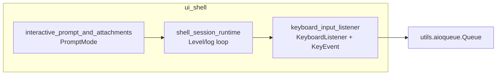
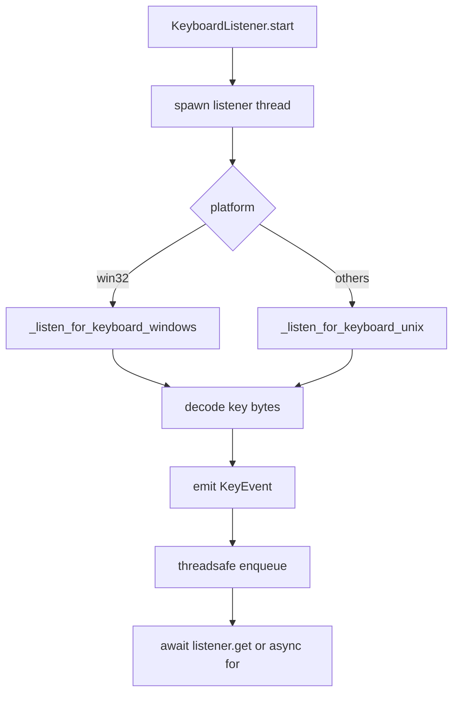
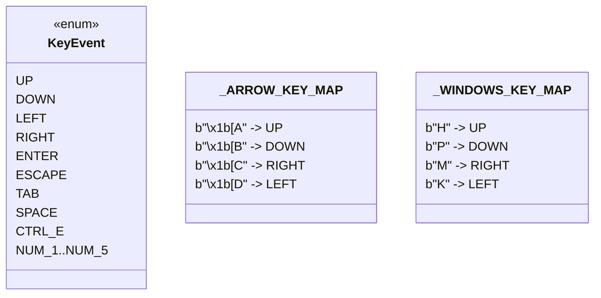
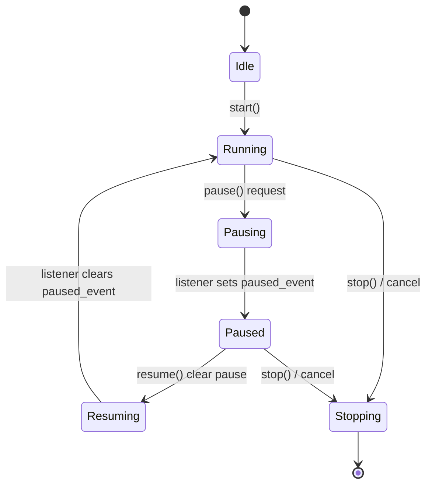

# keyboard_input_listener 模块文档

`keyboard_input_listener` 模块对应源码 `src/kimi_cli/ui/shell/keyboard.py`，是 `ui_shell` 子系统里负责“低层键盘输入捕获与事件化”的组件。它的核心目标不是渲染 UI，而是把操作系统级别的按键字节流，统一转换成业务可消费的 `KeyEvent` 事件流，供 Shell 会话运行时使用。该模块通过“线程监听 + asyncio 队列桥接”的设计，把阻塞式终端读取与异步应用主循环解耦，避免 UI 主协程被输入读取阻塞。

从系统分层上看，这个模块位于 `shell_session_runtime`（见 [shell_session_runtime.md](shell_session_runtime.md)）下方：上层状态机或交互循环只关心“收到了 `UP`/`ENTER`/`ESCAPE` 等事件”，不需要感知 Unix `termios` 与 Windows `msvcrt` 差异。这种设计使得跨平台行为收敛在单点，降低了交互代码复杂度，也让后续扩展新快捷键时影响范围更可控。

---


从依赖方向看，`keyboard_input_listener` 对上只暴露 `KeyEvent` 语义，对下仅依赖一个异步队列抽象和操作系统键盘读取能力。它并不管理提示词模式、会话级日志分级或自动更新状态，这些职责分别位于 [interactive_prompt_and_attachments.md](interactive_prompt_and_attachments.md)、[shell_session_runtime.md](shell_session_runtime.md)、[auto_update_lifecycle.md](auto_update_lifecycle.md)。这种边界划分使输入采集可独立演进。


## 1. 模块职责与设计动机

在 CLI 交互场景中，按键输入有三个典型难点：第一，终端输入 API 在不同平台差异明显；第二，读取按键往往是阻塞调用，直接放在 asyncio 主循环会导致卡顿；第三，方向键等“功能键”通常是多字节序列，不能按普通字符处理。`keyboard_input_listener` 通过 `KeyboardListener` 线程化监听并发射 `KeyEvent`，再通过异步 `Queue` 提供 `await` 语义，解决了以上三点。

模块当前聚焦于“控制类按键”而非完整文本输入：它支持方向键、Enter、Escape、Tab、Space、Ctrl+E 及数字 1~5。这表明它主要服务于命令选择、菜单导航、确认/取消等交互模式，而不是替代行编辑器。

---

## 2. 核心类型与接口

## 2.1 `KeyEvent`（核心组件）

`KeyEvent` 是一个 `Enum`，定义了上层可订阅的标准化键盘事件类型：

- 方向键：`UP`, `DOWN`, `LEFT`, `RIGHT`
- 控制键：`ENTER`, `ESCAPE`, `TAB`, `SPACE`, `CTRL_E`
- 数字快捷键：`NUM_1` ~ `NUM_5`

该枚举是模块对外的稳定契约。上层逻辑应仅依赖 `KeyEvent`，而不要依赖底层字节码（如 `b"\x1b[A"` 或 Windows 扩展键码），否则会破坏跨平台一致性。

## 2.2 `KeyboardListener`

`KeyboardListener` 是具体监听器实现，负责生命周期控制、线程协调与事件投递。

### 构造与内部状态

`__init__()` 初始化以下关键成员：

- `_queue: Queue[KeyEvent]`：异步消费队列（来自 `kimi_cli.utils.aioqueue.Queue`）。
- `_cancel_event: threading.Event`：终止监听线程的信号。
- `_pause_event: threading.Event`：请求暂停监听。
- `_paused_event: threading.Event`：监听线程已进入暂停状态的确认信号。
- `_listener: threading.Thread | None`：后台监听线程句柄。
- `_loop: asyncio.AbstractEventLoop | None`：用于从线程安全回投事件到 asyncio loop。

### `start()`

`start()` 会在当前运行中的 event loop 上注册监听桥接，并启动名为 `kimi-cli-keyboard-listener` 的 daemon 线程。若已启动（`_listener is not None`）则直接返回，具备幂等性。

关键点是内部 `emit(event)`：它使用 `loop.call_soon_threadsafe(queue.put_nowait, event)`，确保线程上下文安全地把事件放回异步队列。

### `stop()`

`stop()` 通过设置 `_cancel_event` 请求退出监听循环，并清除 pause（防止线程卡在 pause 分支）。若线程仍存活，则 `await asyncio.to_thread(self._listener.join)` 等待其结束，避免阻塞 event loop。

### `pause()` / `resume()`

暂停恢复设计为双向握手：

- `pause()`：设置 `_pause_event`，并等待 `_paused_event` 被监听线程置位。
- `resume()`：清除 `_pause_event`，等待 `_paused_event` 被监听线程清除。

这种设计避免“调用方以为已暂停，但线程还在读 stdin”或“调用方以为已恢复，但线程未切回监听”的竞态。

### `get()`

`get()` 是消费接口：`await self._queue.get()` 返回下一个 `KeyEvent`。调用方通常在循环中持续消费。

## 2.3 `listen_for_keyboard()`

这是一个便捷异步生成器，封装 `KeyboardListener` 生命周期：

1. 创建并 `start()` 监听器；
2. `while True` 不断 `yield await listener.get()`；
3. 在 `finally` 中 `stop()`，确保异常/取消时也会清理线程。

对于多数调用场景，优先使用该函数可以减少资源管理错误。

## 2.4 低层函数签名与语义（内部实现）

`_listen_for_keyboard_thread(cancel, pause, paused, emit) -> None` 是平台分派器。参数中的三个 `threading.Event` 分别用于取消、暂停请求、暂停确认，`emit` 是事件回调。它没有返回值，副作用是阻塞运行直到取消，并持续把解析后的 `KeyEvent` 交给 `emit`。

`_listen_for_keyboard_unix(cancel, pause, paused, emit) -> None` 是 Unix 实现。它的核心副作用包括：切换 `stdin` 到 raw 模式、轮询读取字节、解析并发射事件、在结束时恢复终端属性。若在 Windows 上误调用会抛 `RuntimeError`。

`_listen_for_keyboard_windows(cancel, pause, paused, emit) -> None` 是 Windows 实现。它使用 `msvcrt` 轮询键盘缓冲并映射事件，若在非 Windows 平台误调用同样抛 `RuntimeError`。

这些函数被设计为“线程主函数”，因此 API 不是给业务代码直接调用的；业务层应该只使用 `KeyboardListener` 或 `listen_for_keyboard()`。

---

## 3. 平台实现与内部工作流

模块根据 `sys.platform` 在统一入口 `_listen_for_keyboard_thread(...)` 中分发到 Unix 或 Windows 实现。



上图展示了典型数据路径：底层读取永远在独立线程中完成，应用协程通过队列异步拉取事件。这一模式是本模块最关键的架构决策。

## 3.1 Unix 路径：`_listen_for_keyboard_unix(...)`

Unix 实现使用 `termios` 把终端切换到 raw 模式（关闭 canonical 与 echo，`VMIN=0`, `VTIME=0`），从而实现非阻塞逐字节读取。函数内部维护 `enable_raw()` 与 `disable_raw()`，并在 `finally` 中用 `termios.tcsetattr(..., TCSAFLUSH, oldterm)` 恢复终端设置。

读取逻辑要点：

- 读到 `ESC` (`b"\x1b"`) 时，尝试再读最多两个字节，匹配 `_ARROW_KEY_MAP`（ANSI 序列）。
- 匹配到 `b"\x1b[A/B/C/D"` 时发射方向键；如果仅有单独 `ESC`，发射 `ESCAPE`。
- 对 `\r/\n`、空格、`\t`、`\x05`、`1~5` 做直接映射。
- 无输入时小睡 `0.01s`，避免忙等。

## 3.2 Windows 路径：`_listen_for_keyboard_windows(...)`

Windows 实现使用 `msvcrt.kbhit()` + `msvcrt.getch()`。其对方向键支持两种路径：

- 扩展键前缀 `b"\x00"` 或 `b"\xe0"`，后续字节通过 `_WINDOWS_KEY_MAP` 映射；
- 兼容 ESC 序列路径（与 Unix 类似）用于部分终端环境。

其余按键映射逻辑与 Unix 基本一致。

---

## 4. 关键映射表与行为约束

`_ARROW_KEY_MAP` 与 `_WINDOWS_KEY_MAP` 是事件规范化的中心。



注意模块只映射了明确列出的按键；其他键会被静默忽略，不会进入事件队列。这是有意的“白名单输入策略”。

---

## 5. 生命周期、并发与状态转换



`pause/resume` 不只是“标记位切换”，而是带确认语义的同步协议。对上层来说，这意味着在 `await pause()` 返回后，可以更安全地执行依赖 stdin 正常模式的操作（如调用其他同步输入逻辑）。

---

## 6. 使用方式

最简单方式是异步生成器：

```python
import asyncio
from kimi_cli.ui.shell.keyboard import listen_for_keyboard, KeyEvent

async def main():
    async for ev in listen_for_keyboard():
        if ev == KeyEvent.ESCAPE:
            break
        print("got", ev)

asyncio.run(main())
```

如果你需要精细控制暂停/恢复（例如临时交给其他输入组件接管），使用 `KeyboardListener`：

```python
listener = KeyboardListener()
await listener.start()

event = await listener.get()

await listener.pause()
# 执行需要 stdin 常规模式的逻辑
await listener.resume()

await listener.stop()
```

---

## 7. 扩展与定制建议

扩展新按键时，建议遵循“枚举先行、平台并行实现”的流程：先在 `KeyEvent` 新增语义项，再分别补齐 Unix/Windows 的字节映射与测试。不要只改某个平台，否则上层会出现行为分裂。

如果要支持组合键（如 Ctrl+数字、Alt+方向键）或功能键（F1~F12），应先评估不同终端模拟器与 shell 环境发出的实际序列，避免“在开发机可用、在用户终端失效”的兼容性问题。

---

## 8. 边界情况、错误与限制

该模块在正常交互式 TTY 环境下工作稳定，但它对运行环境有明确前提。Unix 路径依赖 `termios` 和 `stdin.fileno()`，因此在输入被重定向、CI 非交互终端、或部分 IDE 内嵌控制台中，可能出现无法读取、读取恒为空、或终端模式切换失败等问题。换句话说，它不是通用的“任意 stdin 消费器”，而是面向真实终端会话的输入监听器。

按键支持采用白名单策略：只有映射表中定义的按键会转成 `KeyEvent`。这能保证上层状态机简洁可控，但也意味着未覆盖按键会被静默忽略。若你在业务层“等一个永远不会产生的事件”，表现上会像监听器失效，实际上是映射未定义。

轮询循环里的 `sleep(0.01)` 是一个有意的折中：它把 CPU 占用控制在较低水平，同时引入约 10ms 级的输入处理粒度。对普通菜单导航几乎无感，但如果未来要支持高频按键连发或游戏式交互，可能需要重新评估该参数或改为事件驱动模型。

需要特别注意的是，`stop()` 当前只负责终止监听线程，并不会调用队列 `shutdown()`。这意味着如果某个协程正在 `await listener.get()`，而此时外部仅调用了 `stop()` 且后续不再有事件入队，该协程可能继续等待。当前模块主要通过取消外层任务或退出 `async for listen_for_keyboard()` 来结束消费流程，因此在自定义集成中应配套设计取消策略。

另外，底层 `Queue` 类型本身支持 `QueueShutDown` 异常（见 [aioqueue_shutdown_semantics.md](aioqueue_shutdown_semantics.md)），但本模块默认路径不会主动触发它。若你在扩展代码中显式对内部队列执行 `shutdown()`，则 `get()`/`put()` 可能抛出该异常，调用方需要自行处理。

在终端恢复方面，Unix 实现已在 `finally` 中恢复原始 termios 配置，可显著降低异常退出后“无回显、无行缓冲”的风险；不过在进程被强杀等极端场景下，用户仍可能需要手动执行 `stty sane` 修复终端状态。

---

## 9. 与其他模块的关系

`keyboard_input_listener` 是 `ui_shell` 的输入底座模块，主要被 Shell 运行时消费。你可以在 [shell_session_runtime.md](shell_session_runtime.md) 查看会话状态、日志等级和交互循环等更高层逻辑。本文不重复介绍 Shell 生命周期，只聚焦按键事件采集与投递。

---

## 10. 开发与调试提示

文件末尾提供了 `__main__` 调试入口，直接运行可打印捕获到的 `KeyEvent`，适合验证终端环境下的按键序列兼容性。定位“某键无响应”问题时，优先检查：运行环境是否为真实 TTY、平台分支是否正确、该键是否已加入映射表。
