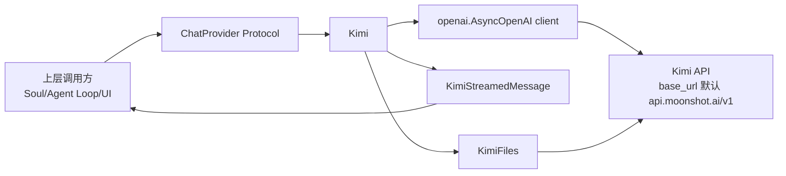
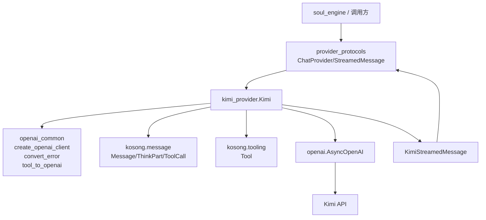
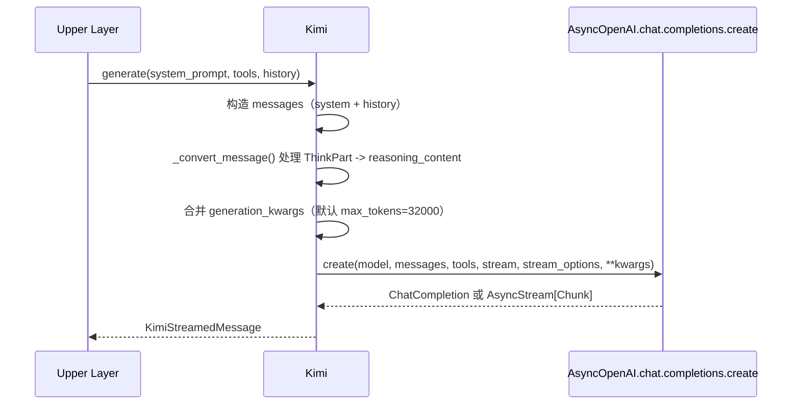
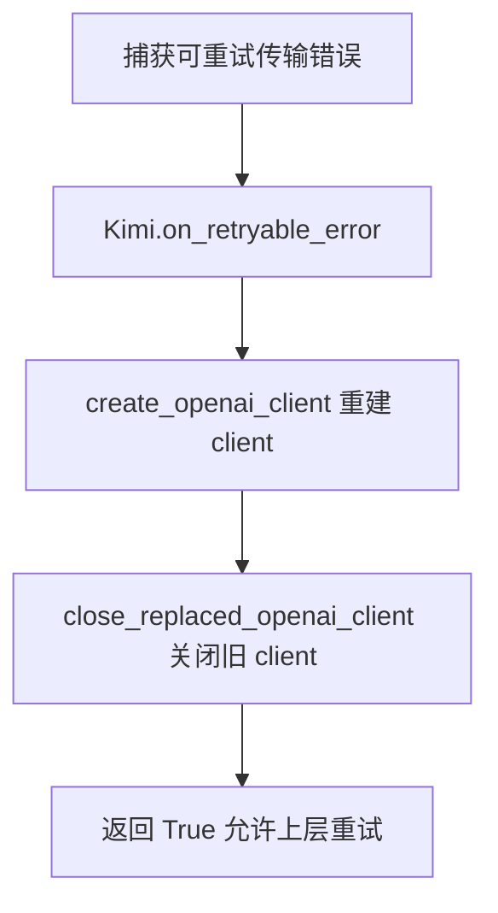
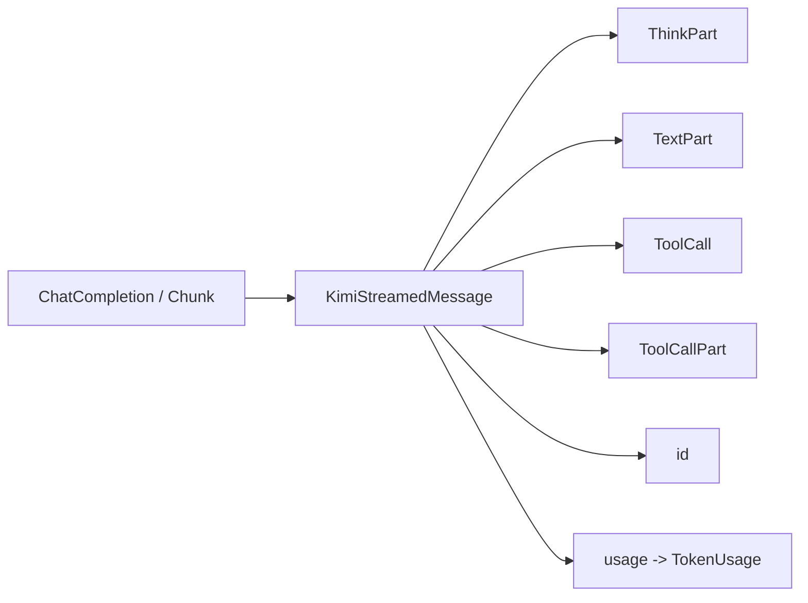

# kimi_provider 模块文档

## 模块简介

`kimi_provider` 是 `kosong_chat_provider` 体系里针对 Moonshot Kimi Chat API 的适配实现，代码位于 `packages/kosong/src/kosong/chat_provider/kimi.py`。它的核心职责是把 `kosong` 内部统一的消息/工具抽象（`Message`、`Tool`、`StreamedMessagePart`）转换为 OpenAI-compatible 的请求格式，再把 Kimi 返回的普通或流式响应转换回 `kosong` 的统一输出片段模型。

这个模块存在的意义，不是“再封装一层 SDK”这么简单，而是为上层 Agent/CLI/会话引擎提供稳定接口：上层只依赖 `ChatProvider` 协议，不感知 Kimi SDK 细节、错误类型差异、流事件结构差异。这样可以在不同 provider 间切换时保持调用方式一致，显著降低系统耦合度。关于协议层本身，请先参考 [provider_protocols.md](./provider_protocols.md)。

---

## 在系统中的位置



`Kimi` 类实现了 `ChatProvider` 与 `RetryableChatProvider` 约定的关键行为：生成响应、暴露模型参数、在可重试错误后重建客户端。`KimiStreamedMessage` 负责把响应流解码为 `ThinkPart`、`TextPart`、`ToolCall`、`ToolCallPart`。`KimiFiles` 则提供文件上传（当前公开方法是视频上传），用于多模态输入场景。

---

## 设计思路与关键决策

`kimi_provider` 采用了三项明确设计：第一是“不可变风格配置”，`with_generation_kwargs()`、`with_extra_body()`、`with_thinking()` 都返回浅拷贝对象，避免多会话共享同一 provider 时配置相互污染。第二是“流式优先”，默认 `stream=True` 并在流中携带 usage。第三是“兼容优先”，通过 `openai_common.convert_error()` 将 OpenAI/httpx 异常归一为 `ChatProviderError` 语义，同时兼容 Kimi 在 usage 字段上的历史差异（`cached_tokens` 非标准字段）。

---

## 依赖关系与跨模块协作

`kimi_provider` 并不是孤立模块，它站在 `provider_protocols`（协议层）与 OpenAI-compatible SDK（传输层）之间，并与消息模型、工具模型共同完成“统一输入 → 厂商请求 → 统一输出”的闭环。理解这个依赖面有助于定位问题边界：当出现工具 schema 异常时优先检查 `kosong_tooling`；当出现响应分片合并异常时优先检查 `kosong.message` 的 merge 行为；当出现网络/状态码异常时则应沿 `openai_common.convert_error` 追溯。



上图强调了两个关键事实。第一，`Kimi` 的“协议对齐”责任很重：它一边要满足 `ChatProvider` 协议，一边要兼容 Moonshot 的响应差异。第二，错误归一化并不在 `Kimi` 内部硬编码完成，而是委托给 `openai_common`，因此本模块可以保持实现简洁，同时与其他 OpenAI-compatible provider 共享错误语义。

---

## 核心组件总览

当前模块中最关键的可对外理解组件如下：

- `Kimi`
- `Kimi.GenerationKwargs`
- `ExtraBody`
- `KimiFiles`
- `KimiFileObject`
- `KimiStreamedMessage`
- `extract_usage_from_chunk()`
- `_convert_message()` / `_convert_tool()` / `_guess_filename()`

---

## 类型与配置模型

## `ExtraBody`

`ExtraBody` 是一个 `TypedDict(total=False, extra_items=Any)`，目前定义了：

```python
class ExtraBody(TypedDict, total=False, extra_items=Any):
    thinking: ThinkingConfig
```

它用于透传 Kimi 特有扩展请求体（`extra_body`），尤其是 thinking 开关：

```json
{
  "thinking": {
    "type": "enabled" | "disabled"
  }
}
```

因为 `extra_items=Any`，你可以在未来 API 扩展时继续塞入新字段，不会被类型层严格阻断。

## `Kimi.GenerationKwargs`

这是 `Kimi` 内部定义的请求参数覆盖模型，包含：`max_tokens`、`temperature`、`top_p`、`presence_penalty`、`frequency_penalty`、`stop`、`prompt_cache_key`、`reasoning_effort`（legacy）和 `extra_body`。

需要特别注意两点：

1. `reasoning_effort` 在注释中已标注为 legacy；推荐通过 `extra_body.thinking` 表达思考开关。
2. `generate()` 会先放入默认 `max_tokens=32000`，再与 `_generation_kwargs` 合并，因此自定义值会覆盖默认值。

## `KimiFileObject`

`KimiFileObject` 是上传接口响应模型（`BaseModel`），当前仅包含 `id: str`。`KimiFiles` 会将其转换为 `ms://{id}` 形式 URL，供 `VideoURLPart` 使用。

---

## `Kimi` 类详解

## 初始化行为

构造函数签名（简化）：

```python
Kimi(
    model: str,
    api_key: str | None = None,
    base_url: str | None = None,
    stream: bool = True,
    **client_kwargs: Any,
)
```

初始化策略如下：

- 当 `api_key` 为空时读取 `KIMI_API_KEY`，若仍为空则抛 `ChatProviderError`。
- `base_url` 为空时读取 `KIMI_BASE_URL`，再回退默认 `https://api.moonshot.ai/v1`。
- 通过 `create_openai_client()` 创建 `AsyncOpenAI` 客户端。
- `_generation_kwargs` 初始为空，作为后续“配置叠加层”。

这意味着你可以在代码中显式传值，也可以完全依赖环境变量运行。

## 核心属性

`model_name` 直接返回 `self.model`，用于日志和可观测；`thinking_effort` 则把 `_generation_kwargs.reasoning_effort` 映射到统一枚举：`low/medium/high/off/None`。其中未知值会被降级成 `"off"`，这是一个“容错但可能掩盖配置错误”的设计，需要在调试时留意。

## `generate()` 内部流程



具体行为要点：

- `history` 每条消息都经 `_convert_message()` 转换，`ThinkPart` 会从普通 `content` 中剥离并拼接到 `reasoning_content` 字段。
- 工具列表通过 `_convert_tool()` 转换；若工具名以 `$` 开头，会按 Kimi builtin function 格式发出。
- 流式模式下会启用 `stream_options={"include_usage": True}`，以便在 chunk 中获取 usage。
- 捕获 `OpenAIError` 与 `httpx.HTTPError` 后统一 `raise convert_error(e)`。

## 重试恢复：`on_retryable_error()`

该方法实现 `RetryableChatProvider` 语义：收到可重试错误后，直接重建 `AsyncOpenAI` 客户端，并尝试关闭旧客户端（避免连接泄漏）。



`close_replaced_openai_client()` 内部会避免误关共享 `http_client`，这是并发环境中很关键的保护机制。

## 配置复制方法

`with_generation_kwargs(**kwargs)` 与 `with_extra_body(extra_body)` 都采用 `copy.copy + deepcopy(_generation_kwargs)`，返回新对象。`with_extra_body()` 采用浅层 merge：`{**old_extra_body, **extra_body}`。因此如果你在 `extra_body` 里放嵌套对象，深层冲突不会自动递归合并。

`with_thinking(effort)` 会同时设置两路字段：

- `reasoning_effort`（legacy）
- `extra_body.thinking.type`（推荐语义）

这是兼容历史 API 的折中实现。

## `model_parameters`

用于 tracing/logging，返回 `{"base_url": ..., ..._generation_kwargs}`。注意它反映的是“当前 provider 副本上的配置快照”，不是请求后端实际最终接受参数的保证。

## `files`

`files` 属性每次返回一个新的 `KimiFiles(self.client)` 适配器对象，用于上传能力。

---

## `KimiFiles`：文件上传能力

`KimiFiles` 当前公开 `upload_video(data, mime_type)`：

1. 校验 `mime_type.startswith("video/")`，否则抛 `ChatProviderError`。
2. 调 `_upload_file(..., purpose="video")` 上传到 `/files`。
3. 将返回 `id` 包装为 `VideoURLPart(video_url={url: "ms://..."})`。

`_upload_file()` 细节：

- 用 `_guess_filename()` 从 mime 推断扩展名，失败时用 `.bin`。
- 以 multipart/form-data 发送，`files={"file": (filename, data, mime_type)}`。
- 返回值为 `ms://{response.id}`。

当前 `KimiFilePurpose` 类型支持 `"video" | "image"`，但公开 API 只暴露了视频上传。若要扩展图片上传，可参考 `upload_video()` 新增 `upload_image()`。

---

## 响应解码：`KimiStreamedMessage`

`KimiStreamedMessage` 既兼容非流式 `ChatCompletion`，也兼容流式 `AsyncStream[ChatCompletionChunk]`。构造时会根据响应类型绑定不同迭代器：

- 非流式：`_convert_non_stream_response()`
- 流式：`_convert_stream_response()`

## 数据流图



在流式分支中，模块会逐 chunk 更新 `_id` 与 `_usage`，然后解析 `delta`：

- `delta.reasoning_content` -> `ThinkPart`
- `delta.content` -> `TextPart`
- `delta.tool_calls`：
  - 有 `function.name`：产出完整 `ToolCall`
  - 仅 `function.arguments`：产出 `ToolCallPart`（参数增量）

如果 `tool_call.id` 缺失，会使用 `uuid4()` 生成临时 ID，保证上层仍可做关联。

## `usage` 归一化规则

`usage` 属性把底层 `CompletionUsage` 转换为统一 `TokenUsage`：

- 默认 `input_other = prompt_tokens`
- 若存在 `cached_tokens`（Moonshot 旧兼容字段）或 `prompt_tokens_details.cached_tokens`（OpenAI风格），则从 `input_other` 扣除并映射到 `input_cache_read`
- `output = completion_tokens`

这保证缓存命中与普通输入可分开统计。

---

## 关键辅助函数

## `_convert_message(message)`

这个函数是 Kimi thinking 适配的核心：它会深拷贝消息，遍历 `message.content`，把所有 `ThinkPart.think` 拼接成 `reasoning_content`，其余内容保留在 `content`。这样可同时兼容“可见回复内容”和“思考内容”双通道。

## `_convert_tool(tool)`

若工具名以 `$` 开头，输出 Kimi builtin function 格式：

```json
{
  "type": "builtin_function",
  "function": {"name": "$xxx"}
}
```

否则走 `tool_to_openai()` 转换为标准 function tool。该约定使系统可以统一工具对象，又能调用 Kimi 内建工具。

## `extract_usage_from_chunk(chunk)`

优先读取 `chunk.usage`；若为空，再尝试从 `chunk.choices[0].model_dump()["usage"]` 恢复（支持 dict 或 `CompletionUsage`）。这是对不同 SDK/version 序列化行为的兼容兜底。

---

## 使用示例

## 最小调用示例

```python
from kosong.chat_provider.kimi import Kimi
from kosong.message import Message

provider = Kimi(model="kimi-k2-turbo-preview")

stream = await provider.with_generation_kwargs(
    temperature=0.2,
    max_tokens=2048,
).generate(
    system_prompt="你是一个简洁的助手",
    tools=[],
    history=[Message(role="user", content="解释一下牛顿第一定律")],
)

async for part in stream:
    print(part)

print("id=", stream.id)
print("usage=", stream.usage)
```

## thinking 配置示例

```python
provider2 = provider.with_thinking("medium")
# 等效于：
# - reasoning_effort="medium" (legacy)
# - extra_body.thinking.type="enabled"
```

## 上传视频示例

```python
video_bytes = open("demo.mp4", "rb").read()
video_part = await provider.files.upload_video(data=video_bytes, mime_type="video/mp4")
# video_part 可作为消息内容的一部分发送
```

---

## 扩展与二次开发建议

如果你要在本模块上扩展功能，推荐优先沿着现有模式：新增能力放在独立 helper（如 `KimiFiles`），请求参数扩展优先挂到 `GenerationKwargs` 与 `ExtraBody`，并通过“返回副本”的配置方法暴露。

例如扩展图片上传时，可新增：

- `KimiFiles.upload_image(data, mime_type)`
- 校验 `image/` 前缀
- 调 `_upload_file(..., purpose="image")`
- 产出对应 `ImageURLPart`（需结合消息模型层）

这样不会破坏 `Kimi` 主生成路径，也便于测试。

---

## API 逐项说明（参数、返回值与副作用）

下面这一节按“阅读源码时最容易追踪调用链”的顺序，对关键方法做更细粒度说明。为了避免重复协议层概念，本文只描述 Kimi 实现特有行为；`ChatProvider` 协议语义请参考 [provider_protocols.md](./provider_protocols.md)。

### `Kimi.__init__(model, api_key=None, base_url=None, stream=True, **client_kwargs)`

该构造函数负责把运行时配置固化为 provider 实例状态。`model` 是必填参数，决定后续 `chat.completions.create` 的 `model` 字段；`api_key` 和 `base_url` 都支持环境变量回退。返回值是标准实例本身，但它有一个关键副作用：会立即创建 `AsyncOpenAI` client（通过 `create_openai_client`），因此认证与网络配置错误会在“首次调用 generate 之前”暴露，而不是延迟失败。

`client_kwargs` 会原样透传到底层 SDK，常见用途是注入自定义 `http_client`、超时设置或代理配置。需要注意的是，这些参数也会影响 `on_retryable_error` 的重建行为，因为重建时会复用同一份 `client_kwargs`。

### `Kimi.generate(system_prompt, tools, history)`

这是模块最核心的异步入口。`system_prompt` 可为空；非空时会作为第一条 `role=system` 消息写入请求。`tools` 是 `Sequence[Tool]`，每个工具会在请求阶段经过 `_convert_tool` 适配。`history` 为 `Sequence[Message]`，每条消息经 `_convert_message` 处理后进入 OpenAI-compatible message payload。

返回值是 `KimiStreamedMessage`，即一个可异步迭代的“响应适配器”对象，而不是字符串或 `Message`。副作用包括：发起远程网络请求、可能触发计费、更新流对象中的 `_id` 与 `_usage` 缓存状态。异常方面，方法会捕获 `OpenAIError` 与 `httpx.HTTPError`，并统一转换为 `ChatProviderError` 家族异常。

### `Kimi.on_retryable_error(error)`

该方法接收上层捕获到的异常实例，返回布尔值表示“是否执行了恢复动作”。当前实现始终返回 `True`，因为它总会尝试重建 client 并关闭旧 client。方法副作用较强：会替换 `self.client` 引用，因此如果你在外部缓存了旧 client 的直接句柄，后续状态将不再一致。推荐始终通过 provider 实例访问 `client`，而不要跨调用缓存底层对象。

### `Kimi.with_generation_kwargs(**kwargs)`

该方法接受 `GenerationKwargs` 中定义的任意可选字段，并返回新的 provider 副本。它不会修改原实例的 `_generation_kwargs`，因此特别适合在并发会话中按请求粒度派生配置。副作用是“对象层面的复制成本”：每次调用都会执行 `copy.copy` 和 `deepcopy(_generation_kwargs)`。

### `Kimi.with_extra_body(extra_body)`

该方法专门用于合并 Kimi 扩展请求体。参数 `extra_body` 类型是 `ExtraBody`，返回新 provider 副本。它采用浅合并策略，因此当新旧 `extra_body` 同时包含某个嵌套键时，后写值会覆盖整棵子对象。这是最容易在复杂实验参数里踩坑的一点。

### `Kimi.with_thinking(effort)` 与 `Kimi.thinking_effort`

`with_thinking` 接受统一枚举 `ThinkingEffort`（`off/low/medium/high`），并同时写入 legacy 字段 `reasoning_effort` 与推荐字段 `extra_body.thinking.type`。返回值是新副本。`thinking_effort` 属性则只从 `reasoning_effort` 反向推导，因此如果你仅通过 `with_extra_body` 改了 thinking 开关，该属性不一定能准确反映真实开关状态。

### `Kimi.model_parameters`

该属性返回一个 `dict[str, Any]`，用于 tracing/logging。它至少包含 `base_url`，并附带当前 `_generation_kwargs` 快照。它没有网络副作用，也不保证是“服务端最终生效参数”，因为后端仍可能对非法值做忽略或裁剪。

### `Kimi.files`、`KimiFiles.upload_video(data, mime_type)` 与 `_upload_file(...)`

`files` 属性每次返回新的 `KimiFiles` 轻量包装器。`upload_video` 要求调用方提供字节串和视频 MIME；若 MIME 不是 `video/*` 会抛 `ChatProviderError`。成功时返回 `VideoURLPart`，可直接放回 `Message.content`。

`_upload_file` 是内部通用上传方法，参数包括原始字节、MIME 与 purpose。该方法副作用是向 `/files` 发起 multipart 请求，并把返回 `id` 组装成 `ms://` 协议 URL。它不会把文件信息持久化在本地 provider 中，因此调用方若需复用资源，应自行保存返回 URL。

### `KimiStreamedMessage.__aiter__/__anext__`

这两个方法实现了标准异步迭代协议。`__anext__` 实际委托到构造时选定的内部迭代器（流式或非流式转换器）。调用副作用是逐步消费底层响应流；一旦消费完成，通常不应再次复用同一流对象进行二次遍历。

### `KimiStreamedMessage._convert_non_stream_response(response)`

该方法处理 `stream=False` 的响应。它会先记录 `id` 与 `usage`，再把首个 choice message 转为统一分片序列：可选 `ThinkPart`、可选 `TextPart`、零到多个 `ToolCall`。如果厂商未提供 tool call id，会生成 `uuid4` 兜底。

### `KimiStreamedMessage._convert_stream_response(response)`

该方法处理 chunk 流。每收到一个 chunk，都会尝试更新 `id` 和 usage，并读取首个 choice 的 delta 内容。输出可能交错出现 `ThinkPart`、`TextPart`、`ToolCall` 与 `ToolCallPart`。这意味着上层消费端必须具备增量拼接能力，不能假设“先文本后工具”或“工具参数一次性完整”。

### `extract_usage_from_chunk(chunk)`、`_convert_message(message)`、`_convert_tool(tool)`、`_guess_filename(mime_type)`

`extract_usage_from_chunk` 负责兼容不同 SDK 结构中的 usage 位置；`_convert_message` 负责把 `ThinkPart` 折叠为 `reasoning_content`；`_convert_tool` 负责区分 builtin tool 与普通 function tool；`_guess_filename` 负责 MIME 到扩展名推断。四者都属于无状态纯函数（除 `_convert_message` 内部会对深拷贝对象做改写），可单独编写单元测试。

---

## 边界条件、错误与限制

1. **API key 缺失会在初始化即失败**，而非延迟到首个请求。
2. **`with_extra_body()` 仅浅合并**，深层对象可能被整体覆盖。
3. **`thinking_effort` 属性依赖 `reasoning_effort` 字段**，若你只手动设置了 `extra_body.thinking`，该属性可能返回 `None` 或旧值。
4. **工具流增量场景下会产出 `ToolCallPart`**，上层必须能拼接参数，而不能假设每次都是完整 `ToolCall`。
5. **usage 可能在流结束后才完整**，不要在中途读取并用于最终计费。
6. **`_convert_message()` 会汇总多个 `ThinkPart` 为单个字符串**，若上层依赖原始分段边界，需要自行保留。
7. **`KimiFiles` 目前对外只支持视频上传**，图片虽在 `KimiFilePurpose` 中声明，但无公开方法。
8. **错误被统一转换后会丢失部分 SDK 专有字段**，排查深层问题时可在调用处额外记录原始异常。

---

## 与其他文档的关系

- 协议语义、错误类型、`StreamedMessage` 与 `TokenUsage` 通用约定：见 [provider_protocols.md](./provider_protocols.md)
- `Tool` 的结构与 schema 生成机制：见 [kosong_tooling.md](./kosong_tooling.md)

本文件聚焦 Kimi 适配实现本身，不重复解释协议层基础概念。