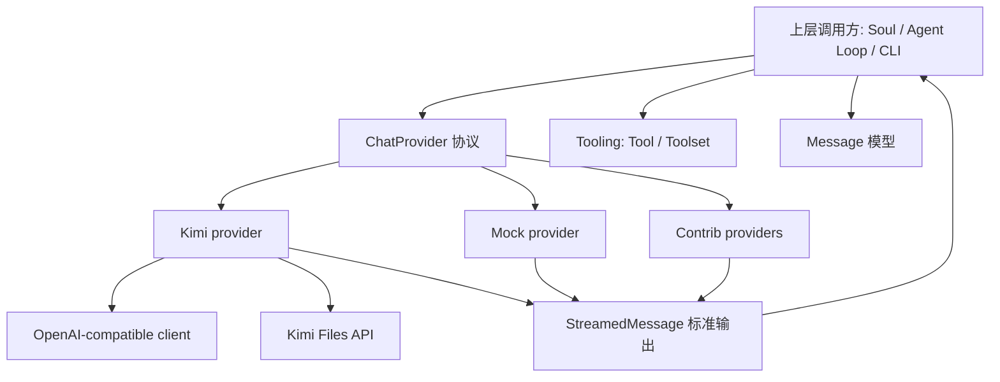
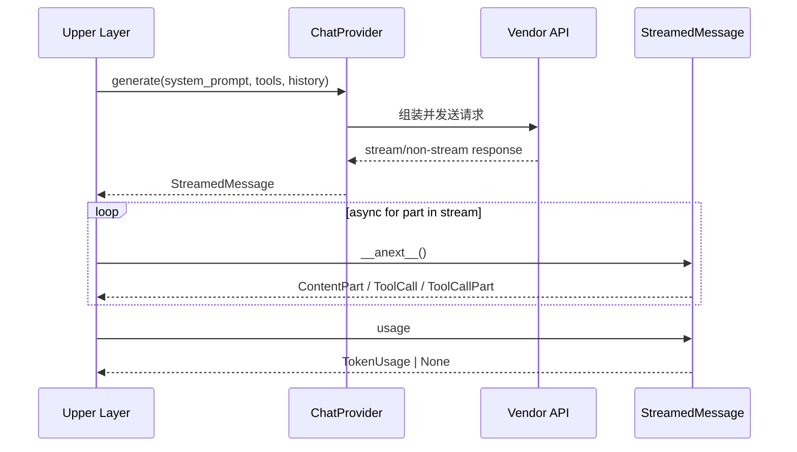
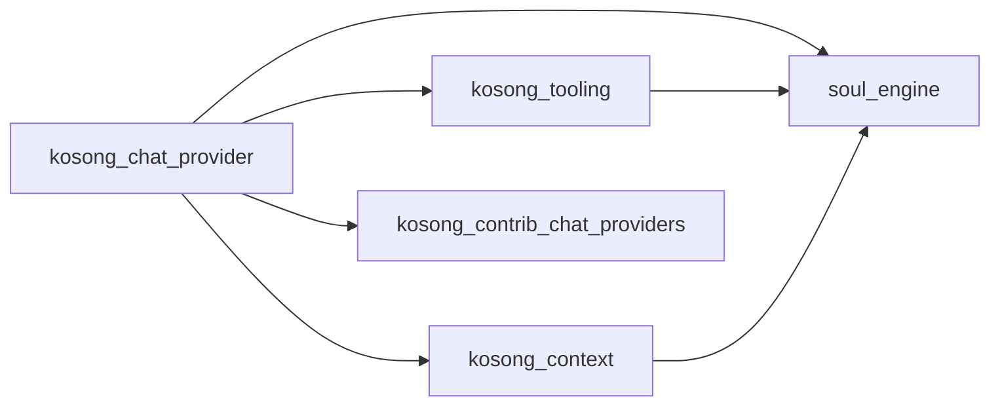

# kosong_chat_provider 模块文档

## 模块简介：它做什么、为何存在

`kosong_chat_provider` 是 `kosong` 生态中的“模型提供方抽象层与内置实现层”。它把不同 LLM 厂商（如 Kimi 及 contrib 中的 OpenAI/Anthropic/Google 适配）统一到一套可替换接口上，让上层系统（如 `soul_engine`、CLI 交互循环、工具调度链路）不需要直接依赖某家 SDK 的请求/响应细节。

这个模块要解决的核心问题是：真实模型服务在接口协议、流式返回格式、工具调用事件结构、错误类型、token 用量字段上差异巨大，如果上层直接耦合具体 SDK，会导致代码分叉严重、测试困难、扩展新 provider 成本高。`kosong_chat_provider` 通过协议（`ChatProvider` / `StreamedMessage`）、统一错误层（`ChatProviderError` 家族）、统一 token 统计（`TokenUsage`）和 provider 特定适配器（如 `Kimi`）实现了“上层一致、下层可变”。

从职责边界看，本模块不负责“工具的定义与执行”（见 [kosong_tooling.md](kosong_tooling.md)）、不负责“会话上下文管理与压缩”（见 [kosong_context.md](kosong_context.md)、[soul_engine.md](soul_engine.md)），也不负责 UI 与线协议。它专注于“把历史消息 + 工具定义送到模型，并把模型输出流标准化返回”。

---

## 架构总览



该架构体现了两层解耦：第一层是“上层编排逻辑”与“具体模型厂商”解耦；第二层是“消息消费方式”与“底层流事件格式”解耦。上层只处理 `StreamedMessagePart` 联合类型（内容分片 / 工具调用 / 工具调用增量），不用感知 SDK chunk 的差异字段。

---

## 组件关系与数据流



数据流关键点：

1. 输入侧由 `system_prompt + tools + history` 组成，其中 `tools` 来自 `kosong_tooling`，`history` 来自消息模型层。
2. provider 负责做厂商请求格式转换与异常映射。
3. 输出侧统一为可异步迭代的 `StreamedMessage`，支持文本与工具调用事件交错到达。
4. token 用量通过 `TokenUsage` 归一化暴露，但允许 `None`（部分厂商/时机不可用）。

---

## 子模块功能导览

### 1) 协议与基础模型：`provider_protocols`

详见 [provider_protocols.md](provider_protocols.md)。

该子模块定义了整个体系最重要的契约：`ChatProvider`、`RetryableChatProvider`、`StreamedMessage`、`TokenUsage`、`ThinkingEffort` 和标准错误类型。它是“可替换 provider 架构”的根基。任何自定义 provider 只要满足这个协议，就可以接入现有 agent 循环与工具编排而无需改上层业务代码。

### 2) Kimi 实现：`kimi_provider`

详见 [kimi_provider.md](kimi_provider.md)。

该子模块是生产级 provider 适配示例，展示了如何把 `kosong` 内部消息/工具模型映射到 OpenAI-compatible chat completion 请求，如何处理流式 chunk 并转回 `StreamedMessagePart`，以及如何在可重试传输错误后重建客户端。它还提供 `KimiFiles`（视频上传）能力，覆盖多模态输入场景。

### 3) 测试替身实现：`mock_provider`

详见 [mock_provider.md](mock_provider.md)。

该子模块提供确定性、无网络依赖的 provider，用于单元测试与回归复现。它的 `generate()` 忽略 prompt/history/tools，固定回放预置分片，适合验证上层流消费、工具调用拼装、状态机逻辑；但不适合模拟真实网络错误与计费统计。

---

## 与其他模块的协同关系



- 与 **`kosong_tooling`**：`ChatProvider.generate()` 接收 `Sequence[Tool]`，provider 将其转为厂商工具定义格式；工具调用结果仍由上层 `Toolset` 处理。见 [kosong_tooling.md](kosong_tooling.md)。
- 与 **`soul_engine`**：`Soul` 循环消费 `StreamedMessage`，并据 `ToolCall/ToolCallPart` 驱动工具执行与下一轮对话。见 [soul_engine.md](soul_engine.md)。
- 与 **`kosong_contrib_chat_providers`**：contrib 模块提供其它厂商的 `GenerationKwargs` 等扩展，复用相同协议语义。见 [kosong_contrib_chat_providers.md](kosong_contrib_chat_providers.md)。
- 与 **消息模型层**：provider 将 `Message` 与 `ContentPart` 结构映射到厂商请求体，并将返回流再映射回同一抽象。

---

## 使用与配置指南

### 快速使用（以 Kimi 为例）

```python
from kosong.chat_provider.kimi import Kimi
from kosong.message import Message

provider = Kimi(model="kimi-k2-turbo-preview")

stream = await provider.generate(
    system_prompt="你是一个可靠的编程助手",
    tools=[],
    history=[Message(role="user", content="请解释 async iterator")],
)

async for part in stream:
    print(part)

print("id:", stream.id)
print("usage:", stream.usage)
```

常见配置入口：

- 认证：`api_key` 参数或环境变量 `KIMI_API_KEY`
- 服务地址：`base_url` 参数或 `KIMI_BASE_URL`
- 生成参数：`with_generation_kwargs(...)`
- thinking 开关/强度：`with_thinking("off"|"low"|"medium"|"high")`

### 测试使用（Mock）

```python
from kosong.chat_provider.mock import MockChatProvider
from kosong.message import TextPart

provider = MockChatProvider([TextPart(text="hello")])
stream = await provider.generate("", [], [])
```

---

## 扩展指南：如何新增一个 provider

新增 provider 时，建议遵循以下实现顺序：

1. 实现 `ChatProvider` 协议的最小闭环：`name`、`model_name`、`generate()`、`with_thinking()`。
2. 定义一个 `StreamedMessage` 实现，把厂商原始流事件稳定映射为 `ContentPart | ToolCall | ToolCallPart`。
3. 统一错误转换到 `ChatProviderError` 家族，避免把厂商 SDK 异常泄露到上层。
4. 若底层连接可恢复，实现 `RetryableChatProvider.on_retryable_error()`。
5. 增加 provider 专属参数模型（类似 `GenerationKwargs`），并采用“返回副本”配置风格避免并发污染。

这套模式可参考 [kimi_provider.md](kimi_provider.md) 的完整实践。

---

## 错误处理、边界情况与限制

`kosong_chat_provider` 最需要注意的是“协议统一不等于行为完全一致”。不同 provider 在以下方面仍可能存在差异：

- `usage` 可用时机与字段口径（尤其缓存 token）
- 工具调用是一次性完整返回还是增量分片返回
- `thinking_effort` 是否真正支持，以及 `None` 与 `"off"` 的语义差异
- 可重试错误后的恢复能力（是否实现 `RetryableChatProvider`）

推荐的调用策略是：

1. 把 `generate()` 放在可观测、可重试的外层封装中。
2. 对 `StreamedMessagePart` 做严格类型分派，不要假设仅有文本。
3. 在流结束后读取并记录 `usage`（允许为空）。
4. 对 `APIStatusError.status_code` 做策略化处理（429 退避、401 鉴权、5xx 重试）。

---

## 已知局限与实践建议

当前内置 provider 主要覆盖 Kimi 与 Mock；更多厂商能力位于 contrib 子域。对于生产系统，建议将 provider 选择、重试策略、超时参数、模型参数放在配置层统一管理，而不是散落在业务代码中。对测试系统，建议同时使用 Mock（确定性回放）与真实 provider（集成验证）两套测试，覆盖“逻辑正确性 + 线上语义正确性”。

---

## 文档索引与推荐阅读顺序

- 主文档（本文件）：[kosong_chat_provider.md](kosong_chat_provider.md)
- 协议层与错误体系：[provider_protocols.md](provider_protocols.md)
- Kimi 适配实现：[kimi_provider.md](kimi_provider.md)
- Mock 测试实现：[mock_provider.md](mock_provider.md)
- 工具定义与调用：[kosong_tooling.md](kosong_tooling.md)
- 其它厂商参数模型：[kosong_contrib_chat_providers.md](kosong_contrib_chat_providers.md)
- Agent 主循环上下文：[soul_engine.md](soul_engine.md)

建议先阅读协议层，再看 `kimi_provider` 与 `mock_provider` 的实现差异，最后结合 `soul_engine` 理解端到端运行链路。
