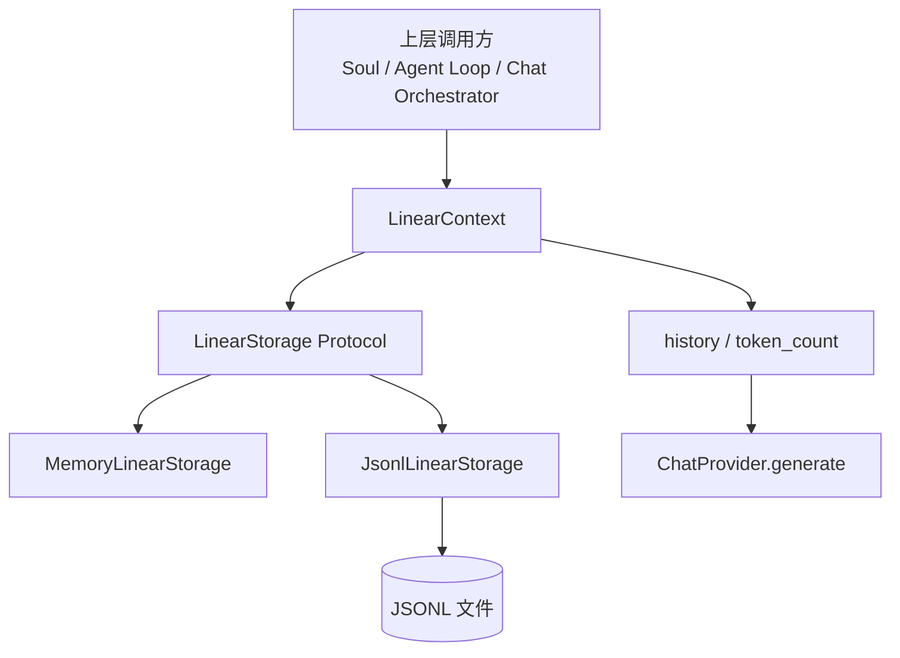
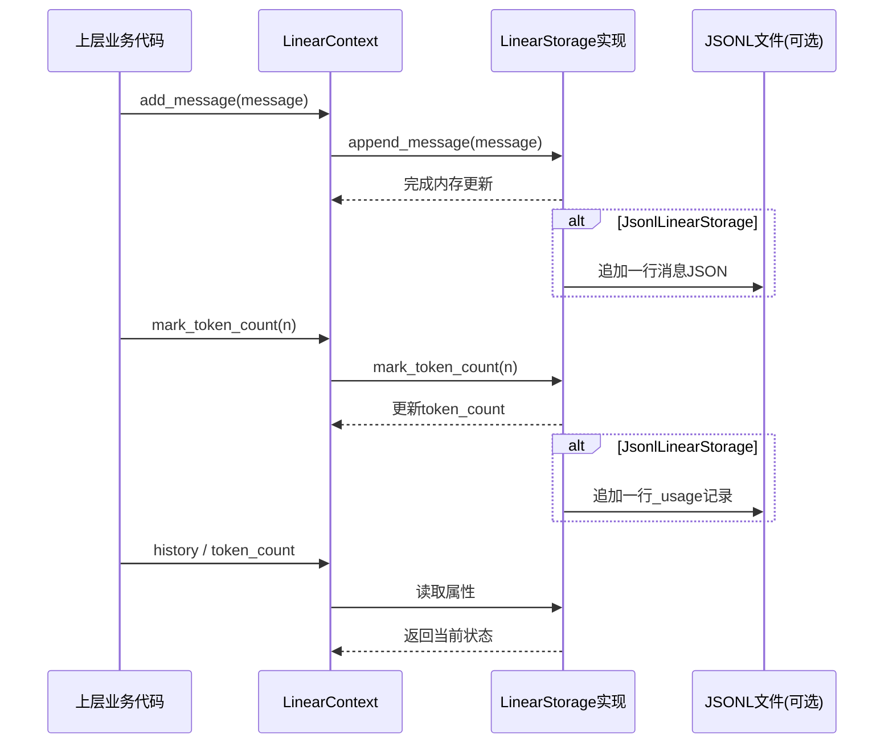
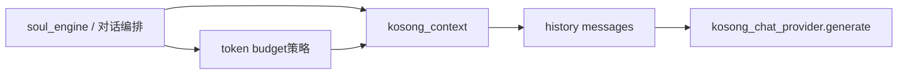

# kosong_context 模块文档

## 1. 模块定位与设计动机

`kosong_context`（当前代码位于 `packages/kosong/src/kosong/contrib/context/linear.py`）提供了一套极简但实用的“线性会话上下文”抽象。它的核心目标不是做复杂的记忆检索、向量索引或分层上下文管理，而是先解决一个更基础、但在 Agent/Chat 系统中几乎必需的问题：**以稳定、可恢复、可异步访问的方式维护消息历史与 token 计数**。

在整个系统里，聊天生成器（见 `[provider_protocols.md](provider_protocols.md)`）通常需要把 `history: Sequence[Message]` 作为输入；同时，上层循环（如 `soul_engine`）会关心 token 使用量以触发压缩、截断或预算控制。`kosong_context` 正是连接这两类需求的“轻量状态层”：它把“消息线性追加”和“token 计数标记”收敛到同一个存储协议中，并且提供内存版与 JSONL 持久化版实现。

这种设计的价值在于：当你不需要复杂上下文策略时，可以直接使用 `LinearContext + JsonlLinearStorage` 获得一个可落盘、可重启恢复、实现成本极低的上下文系统；当你确实需要更复杂行为时，也可以基于 `LinearStorage` 协议替换底层实现，而保持上层调用接口不变。

---

## 2. 架构总览



这张图体现了模块最关键的抽象层次：`LinearContext` 是面向使用者的“门面对象（facade）”，`LinearStorage` 是可替换存储契约，`MemoryLinearStorage`/`JsonlLinearStorage` 是默认实现。上层只与 `LinearContext` 交互，因此可以在测试、开发、生产中切换存储策略而不改业务逻辑。

---

## 3. 组件关系与数据流



该流程说明了一个重要事实：**写入是追加式（append-only）语义**。尤其是 `JsonlLinearStorage`，不会回写或重写历史文件，而是不断追加消息行和 `_usage` 行。这让实现非常简单、故障恢复友好，但也引入了“状态可能被后续标记覆盖”的行为特征（详见第 8 节）。

---

## 4. 核心组件详解

## 4.1 `LinearContext`

`LinearContext` 是一个非常薄的包装器，它本身不持有复杂状态，而是把所有数据和写操作委托给注入的 `LinearStorage`。其设计重点是：将调用方与具体存储解耦，保持统一 API。

### 构造函数

```python
LinearContext(storage: LinearStorage)
```

- `storage`：任意满足 `LinearStorage` 协议的对象。

### 属性与方法

#### `history -> list[Message]`

返回当前全部消息历史，底层直接映射 `storage.messages`。这是一份可变列表引用（取决于实现），调用方应避免直接原地修改该列表内容，否则可能破坏存储一致性约定。

#### `token_count -> int`

返回当前 token 计数，底层映射 `storage.token_count`。它是“最近一次标记值”，不保证是实时精确计算值。

#### `async add_message(message: Message)`

将新消息追加到上下文。方法本身不做消息合法性增强，依赖 `Message` 模型约束（例如 `Message.model_validate` 的行为）。

#### `async mark_token_count(token_count: int)`

显式标记 token 计数，用于在外部完成 token 统计后回写。该值是业务侧“声明值”，不是模块内部重新计算得出。

### 典型用法

```python
from kosong.contrib.context.linear import LinearContext, JsonlLinearStorage
from kosong.message import Message

storage = JsonlLinearStorage("./session.jsonl")
await storage.restore()

ctx = LinearContext(storage)
await ctx.add_message(Message(role="user", content="你好"))
await ctx.mark_token_count(128)

history = ctx.history
usage = ctx.token_count
```

---

## 4.2 `LinearStorage`（Protocol）

`LinearStorage` 是运行时可检查（`@runtime_checkable`）的协议，定义了线性上下文存储必须具备的最小接口。它不是抽象基类，没有默认实现；任何对象只要“结构兼容”即可被 `LinearContext` 使用。

```python
@runtime_checkable
class LinearStorage(Protocol):
    @property
    def messages(self) -> list[Message]: ...

    @property
    def token_count(self) -> int: ...

    async def append_message(self, message: Message) -> None: ...
    async def mark_token_count(self, token_count: int) -> None: ...
```

### 协议语义说明

- `messages`：当前完整历史，顺序即对话顺序。
- `token_count`：当前已知 token 总量，但注释明确说明它可能不精确，取决于外部何时调用 `mark_token_count`。
- `append_message`：必须保持追加语义，通常不应重排历史。
- `mark_token_count`：更新“最新 token 标记”，可与消息追加解耦。

对于扩展实现者来说，这个协议刻意保持最小化，便于实现多种后端（数据库、Redis、远程 KV、事件流日志等）。

---

## 4.3 `MemoryLinearStorage`

> 说明：`MemoryLinearStorage` 在文件注释中标注“only for testing”，属于默认内存实现，适合单进程测试或短生命周期运行。

该类用两个字段保存状态：`_messages: list[Message]` 与 `_token_count: int | None`。所有写入都在内存中完成，不涉及磁盘 I/O。

### 行为特征

`messages` 直接返回内部列表；`token_count` 在 `_token_count is None` 时返回 `0`。这意味着未显式标记 token 时，调用方看到的是默认 0，而不是 `None`。

`append_message` 只做 `list.append`，`mark_token_count` 只做字段赋值，均为异步函数签名但本体是同步常量时间操作。保留 `async` 主要是与协议统一，方便在不同存储实现之间无缝切换。

### 适用场景

- 单元测试、集成测试中的可控上下文容器
- 不需要持久化的临时会话
- 对恢复能力无要求的短任务

---

## 4.4 `JsonlLinearStorage`

`JsonlLinearStorage` 继承 `MemoryLinearStorage`，在保持内存镜像的同时，把每次变更追加写入 JSONL 文件。它是本模块最实用的持久化实现。

### 初始化

```python
JsonlLinearStorage(path: Path | str)
```

- `path`：JSONL 文件路径；字符串会自动转换为 `Path`。
- 内部维护 `_file: IO[str] | None`，采用“延迟打开”策略。

### `async restore()`

从 JSONL 文件恢复历史与 token 信息。实现逻辑包括：

1. 如果 `_messages` 已非空，抛出 `RuntimeError("The storage is already modified")`，防止在已变更状态下再次恢复导致重复加载。
2. 如果文件不存在，直接返回（视为“空上下文”）。
3. 在线程池中逐行读取 JSONL：
   - 空行跳过。
   - 包含 `token_count` 字段的行被视为 usage 记录，更新 `_token_count`。
   - 其余行通过 `Message.model_validate(line_json)` 反序列化并追加到 `_messages`。

由于 `_usage` 行会多次出现，最终生效的是“最后一次出现的 token_count”。

### `_get_file()` 与资源管理

`_get_file()` 在首次写入时以 append 模式打开文件并缓存句柄。`__del__` 中会尝试关闭文件句柄。

需要注意，`__del__` 在 Python 中不是强保证的资源释放机制；在进程异常退出或循环引用等情形下，关闭时机不稳定。因此，若你对文件刷盘时序有严格要求，建议在上层提供明确生命周期管理（例如封装 `close()` 或在进程结束前主动 flush/close）。

### `async append_message(message: Message)`

先调用父类把消息加入内存，再在线程池执行文件追加：

- 写入 `message.model_dump(exclude_none=True)` 的紧凑 JSON（`separators=(",", ":")`）
- 使用 `ensure_ascii=False` 保留 UTF-8 文本
- 末尾追加换行符

### `async mark_token_count(token_count: int)`

先更新内存 token 值，再在线程池写入一条 usage 行：

```json
{"role":"_usage","token_count":123}
```

注意：恢复逻辑只检查 `token_count` 字段，不依赖 `role == "_usage"`。因此任何包含 `token_count` 的行都会被当作 usage 行处理。

---

## 5. 与其他模块的协作关系

`kosong_context` 本身是上下文存储层，不直接调用模型 API，也不负责工具执行。它通常作为“会话状态提供者”服务于聊天提供器与代理循环。



在这条链路里，`Message` 数据模型来自 `kosong.message`，其序列化/反序列化能力（`model_dump`/`model_validate`）是 `JsonlLinearStorage` 落盘与恢复的基础。关于 provider 接口细节请参考 `[provider_protocols.md](provider_protocols.md)`。

---

## 6. 配置与使用模式

## 6.1 最小可用：内存模式

```python
from kosong.contrib.context.linear import LinearContext, MemoryLinearStorage

ctx = LinearContext(MemoryLinearStorage())
# 适合测试，不会写文件
```

此模式零配置、速度快，但进程重启后历史丢失。

## 6.2 生产友好：JSONL 持久化模式

```python
from kosong.contrib.context.linear import LinearContext, JsonlLinearStorage

storage = JsonlLinearStorage("./data/chat-session.jsonl")
await storage.restore()  # 重启后恢复
ctx = LinearContext(storage)
```

建议在会话启动阶段调用一次 `restore()`，之后统一通过 `ctx.add_message()` 和 `ctx.mark_token_count()` 写入。

## 6.3 自定义存储实现（扩展示例）

```python
from kosong.contrib.context.linear import LinearStorage
from kosong.message import Message

class RedisLinearStorage:
    @property
    def messages(self) -> list[Message]:
        ...

    @property
    def token_count(self) -> int:
        ...

    async def append_message(self, message: Message) -> None:
        ...

    async def mark_token_count(self, token_count: int) -> None:
        ...
```

只要满足协议结构，即可直接注入 `LinearContext`。如果要支持多实例并发，请优先在存储层保证原子性和顺序一致性。

---

## 7. 设计取舍与实现细节说明

该模块选择“线性历史 + 外部 token 标记”的模型，是一种非常务实的工程折中。它不尝试在存储层理解消息语义（例如工具调用配对、系统消息优先级），也不自行计算 token（避免依赖具体 tokenizer/provider）。这种中立设计降低了耦合，但意味着调用方要承担更多策略责任，例如何时做压缩、何时刷新 token、何时丢弃历史。

`JsonlLinearStorage` 使用 `asyncio.to_thread` 把阻塞文件 I/O 转移到线程池，避免阻塞事件循环。这对 CLI/服务端异步链路都很重要，但也意味着写入完成时序受线程调度影响；如果上层在高并发下并行写同一个 storage 实例，顺序与一致性需要额外关注。

---

## 8. 边界条件、错误与限制

### 8.1 `restore()` 的调用时机限制

`restore()` 只能在“尚未修改存储”时调用。只要 `_messages` 非空，就会抛出 `RuntimeError`。这可防止重复恢复，但也要求你在应用生命周期中明确初始化顺序。

### 8.2 并发写入一致性

当前实现未显式加锁。若多个协程同时调用 `append_message`/`mark_token_count`：

- 内存列表追加顺序通常取决于调度时序；
- 文件写入在线程池进行，理论上可能出现交错风险（共享同一文件句柄时尤其需要注意）。

如果你的场景存在高并发写需求，建议在 `LinearContext` 外层增加串行队列，或在自定义存储中引入 `asyncio.Lock`。

### 8.3 token 记录语义

`token_count` 是“最后一次标记值”，不是累计日志自动求和。恢复时读取到多条 usage 行会被后值覆盖。若你需要分阶段 token 统计，应在上层另行保存明细。

### 8.4 文件完整性与耐久性

实现中没有显式 `flush()`/`fsync()` 策略，仅依赖文件对象缓冲与关闭时机。对“写后立即断电不丢数据”的强一致需求，这个实现并不充分。

### 8.5 `__del__` 关闭文件的局限

`JsonlLinearStorage.__del__` 只是兜底关闭，不是严格生命周期控制。长生命周期服务建议显式管理资源释放，而不要完全依赖析构。

---

## 9. 维护与扩展建议

如果你准备扩展 `kosong_context`，建议优先保持 `LinearStorage` 协议稳定，把新增能力作为“可选扩展”而非破坏性修改。例如可新增独立的压缩器组件、快照机制或索引层，而不改变 `LinearContext` 的最小 API。这样可以确保现有上层调用代码（尤其是依赖 `history` 的 provider 调用链）持续可用。

在工程实践上，推荐为每种存储实现建立一致的契约测试：追加消息顺序、token 标记覆盖语义、恢复一致性、异常恢复（损坏行/空行处理）等。这样即使替换为数据库或远程日志后端，也能维持与当前模块相同的可预期行为。
