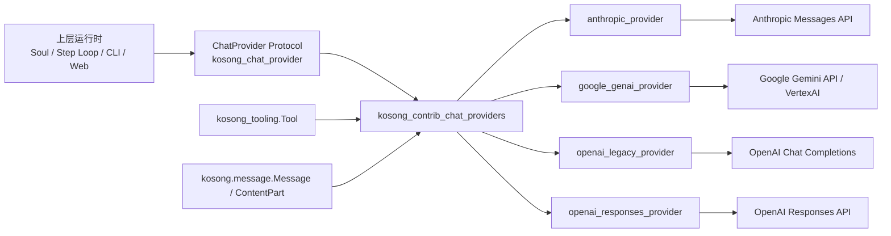
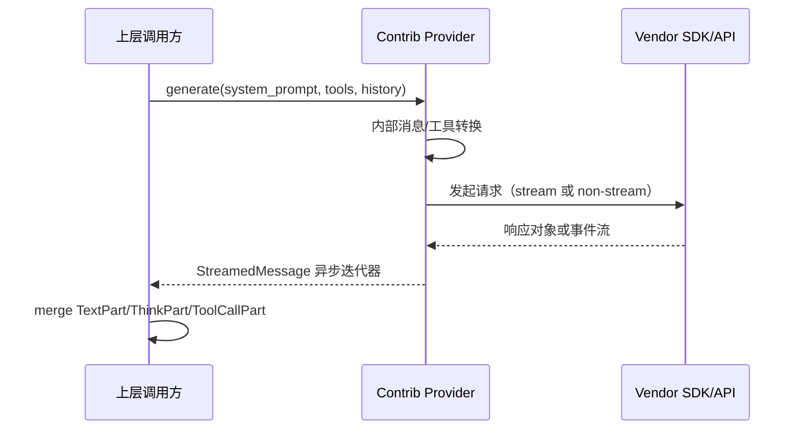
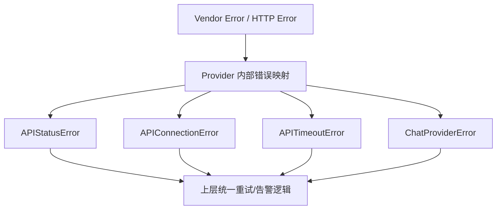

# kosong_contrib_chat_providers 模块文档

## 1. 模块定位与设计动机

`kosong_contrib_chat_providers` 是 `kosong` 体系中的“扩展型聊天模型适配层”，位于 `packages/kosong/src/kosong/contrib/chat_provider/`。它的核心职责不是实现新的对话抽象，而是在 `kosong_chat_provider` 已定义的统一协议之上，为更多第三方模型 API 提供可替换实现。

换句话说，`kosong_chat_provider` 解决“上层应该如何和模型交互”的问题，而 `kosong_contrib_chat_providers` 解决“不同供应商的 SDK 和协议差异如何被屏蔽”的问题。这样做的设计收益是：上层 Agent、会话编排、工具调用框架可以保持稳定，只在运行时替换 provider 实例即可完成 Anthropic / Google Gemini / OpenAI（两套 API）切换。

这个模块存在的现实背景是：不同厂商在以下方面差异很大——消息角色定义、thinking/reasoning 表达、工具调用结构、流式事件粒度、错误类型、token usage 统计口径。若把这些差异暴露给业务层，会导致流程代码被供应商细节污染，难以维护与测试。本模块通过“统一输入输出 + 厂商特化编解码器”的方式，将复杂性限制在 provider 边界内。

---

## 2. 与整体系统的关系



上图说明了该模块的架构定位：它依赖 `kosong_chat_provider` 的协议契约、`kosong.message` 的统一消息模型，以及 `kosong_tooling` 的工具声明；向下则分别对接不同供应商 API。模块本身不处理业务编排，也不执行工具本体，仅负责协议映射与流式解码。

---

## 3. 架构总览与组件协同

### 3.1 统一执行路径



四个子模块都遵循这一执行模式：

1. 把内部 `Message` 序列转换为供应商输入格式。
2. 把 `Tool` 定义转换为供应商工具声明格式。
3. 调用 SDK（流式或非流式）。
4. 把输出还原为 `StreamedMessagePart`（文本、thinking、tool call、tool call delta）。
5. 统一暴露 `id` 和 `TokenUsage`。

### 3.2 错误与恢复语义



各 provider 都做了错误类型归一化，但**恢复策略不完全一致**：
- `openai_legacy_provider` 与 `openai_responses_provider` 实现了 `RetryableChatProvider`，支持 `on_retryable_error()` 进行 client 重建。
- `anthropic_provider` 与 `google_genai_provider` 当前不实现该恢复钩子，需由上层重试框架处理。

---

## 4. 子模块功能概览（含文档索引）

### 4.1 `anthropic_provider`

该子模块提供对 Anthropic Messages API 的适配，重点处理 Anthropic 特有的 system prompt 语义、thinking 配置代际差异（legacy budget 与 adaptive thinking）、以及 prompt caching 相关的 `cache_control` 注入。它还能将 Anthropic 流式事件映射为统一的 `TextPart`、`ThinkPart`、`ToolCall`、`ToolCallPart`，并输出兼容 `TokenUsage` 的缓存读写统计字段。

详细实现、边界条件与错误映射请见：[anthropic_provider.md](./anthropic_provider.md)

### 4.2 `google_genai_provider`

该子模块面向 Google Gemini（`google-genai` SDK），除了常规消息转换，还重点解决了 VertexAI 场景下工具调用回合必须“函数调用数量与函数响应数量匹配”的严格约束。它通过对连续 tool 消息进行打包和 ID 校验，降低并行工具执行时的顺序问题风险。该模块还处理图像/音频 URL 与 data URI 转换，支持 thinking_level / thinking_budget 双风格映射。

详细实现、工具结果打包机制和注意事项请见：[google_genai_provider.md](./google_genai_provider.md)

### 4.3 `openai_legacy_provider`

该子模块对接 OpenAI Chat Completions API（以及兼容该协议的网关），用于旧接口形态下的消息、流式 chunk、tool call 语义适配。它支持 `reasoning_key` 模式以兼容“将思维内容放在扩展字段”的平台，并实现 `on_retryable_error()` 以在重试前重建底层 client。对需要兼容大量 OpenAI-like 服务的系统来说，这一适配层实用性较高。

详细实现、`GenerationKwargs` 扩展策略与流式增量处理请见：[openai_legacy_provider.md](./openai_legacy_provider.md)

### 4.4 `openai_responses_provider`

该子模块对接 OpenAI Responses API，是与 legacy 并行的“新接口形态”实现。它会将 reasoning 参数封装到 `reasoning` 对象，并主动请求 `reasoning.encrypted_content`，使 thinking 信息能在统一消息模型中表示。它还支持将 tool 消息映射为 `function_call_output`，并对 Responses 事件流进行细粒度解析（text delta、function arguments delta、reasoning summary delta）。

详细实现、模型识别逻辑与事件映射请见：[openai_responses_provider.md](./openai_responses_provider.md)

---

## 5. 核心设计模式总结

`kosong_contrib_chat_providers` 的四个子模块虽然对接不同 API，但共享几个关键设计模式：

1. **不可变配置风格**：`with_generation_kwargs()` / `with_thinking()` 返回新实例，避免共享状态污染。
2. **统一分片输出**：无论流式与否，都包装成异步迭代输出，减少上层分支。
3. **工具调用双向映射**：既支持 assistant 触发工具调用，也支持 tool 回包重放。
4. **token usage 归一化**：将供应商不同字段映射到 `TokenUsage(input_other/output/input_cache_read/...)`。
5. **错误归一化**：SDK/HTTP 错误统一映射到 `ChatProviderError` 体系。

这种一致性让上层可以把 provider 当“可插拔引擎”，而不是“每个供应商一套流程”。

---

## 6. 使用与配置建议

在使用上，建议把 provider 实例当作“基础模板”，再按场景派生配置：

```python
# 伪代码示意
base = OpenAIResponses(model="gpt-5-codex", api_key=API_KEY)
fast = base.with_thinking("low").with_generation_kwargs(max_output_tokens=1024)
deep = base.with_thinking("high").with_generation_kwargs(max_output_tokens=8192)
```

常见实践建议：
- 在生产中记录 `model_parameters`，用于追踪推理强度、温度、网关地址等。
- 流式消费时确保处理 `ToolCallPart` 增量拼接，否则工具参数可能不完整。
- 工具回包务必携带 `tool_call_id`（或 call_id），避免 provider 转换失败。
- 多模态 URL 输入要注意 MIME 与 data URI 格式，尤其在 Google/Anthropic 路径上有白名单限制。

---

## 7. 扩展指南（如何新增 provider）

若要扩展新的 contrib provider，建议遵循当前模块的既有约束：

1. 实现 `ChatProvider` 所需最小接口：`model_name`、`thinking_effort`、`generate()`、`with_thinking()`。
2. 提供本 provider 的 `GenerationKwargs` TypedDict，并实现 `with_generation_kwargs()`。
3. 明确消息转换边界：system、tool、assistant/user 以及 `ThinkPart` 处理策略。
4. 统一流/非流输出为单一异步迭代器封装类。
5. 将供应商异常映射到统一错误层次。
6. 输出 `model_parameters` 以支持 tracing/logging。

如果 provider 支持连接恢复，建议实现 `RetryableChatProvider.on_retryable_error()`，并注意 client 生命周期管理。

---

## 8. 典型风险与排障清单

该模块常见问题通常集中在“协议不对齐”而非业务逻辑本身。建议优先检查：

- **工具调用参数格式**：是否为 JSON object 字符串，是否存在分片未合并。
- **tool 回包关联 ID**：是否缺失、重复或顺序错配（尤其 Google 场景）。
- **thinking 语义差异**：`off` 与“未设置”在不同 provider 里可能不是同一行为。
- **多模态输入合法性**：data URI 结构、MIME 类型白名单、远程 URL 可访问性。
- **流式 usage 时机**：很多 provider 仅在流末尾才有完整 usage。

---

## 9. 与其他文档的交叉参考

- 通用 provider 协议与统一异常：见 [provider_protocols.md](./provider_protocols.md)、[kosong_chat_provider.md](./kosong_chat_provider.md)
- 工具定义与参数 Schema：见 [kosong_tooling.md](./kosong_tooling.md)
- 当前模块子文档（已生成并建议优先按场景阅读）：
  - [anthropic_provider.md](./anthropic_provider.md)
  - [google_genai_provider.md](./google_genai_provider.md)
  - [openai_legacy_provider.md](./openai_legacy_provider.md)
  - [openai_responses_provider.md](./openai_responses_provider.md)

建议阅读顺序：先看本文件理解统一架构，再按实际接入供应商进入对应子文档。这样可以避免在细节层面迷失，并更快定位“协议差异导致的问题”是发生在请求编码、工具回包，还是流式事件解码阶段。

本文件聚焦总览与架构，不重复子模块中已详细展开的 API 字段级说明与代码路径级行为细节。
