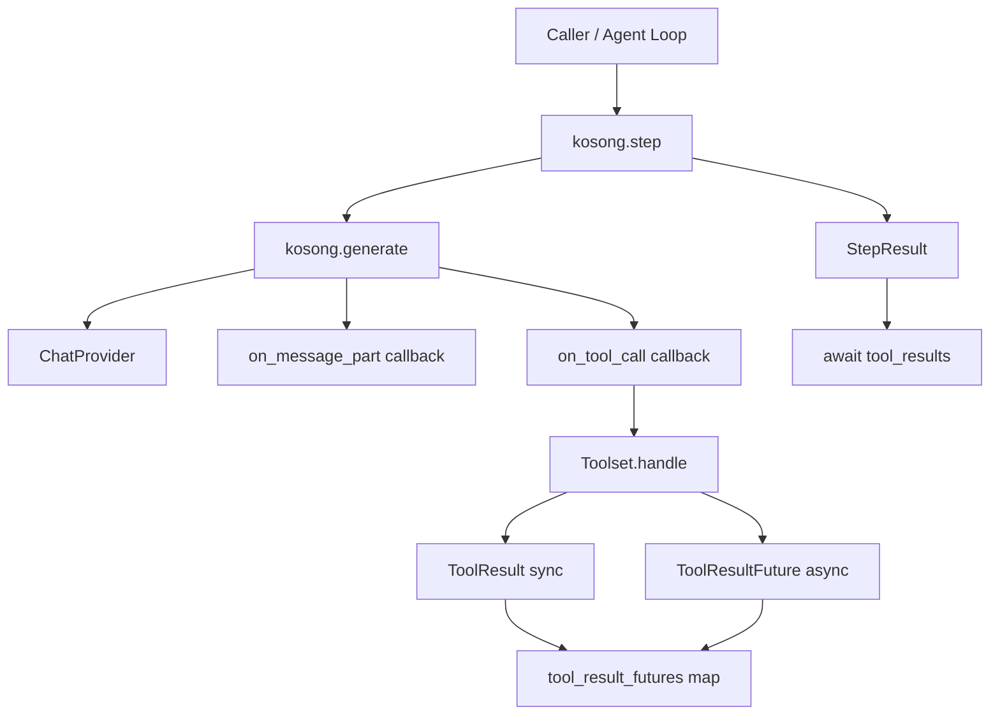
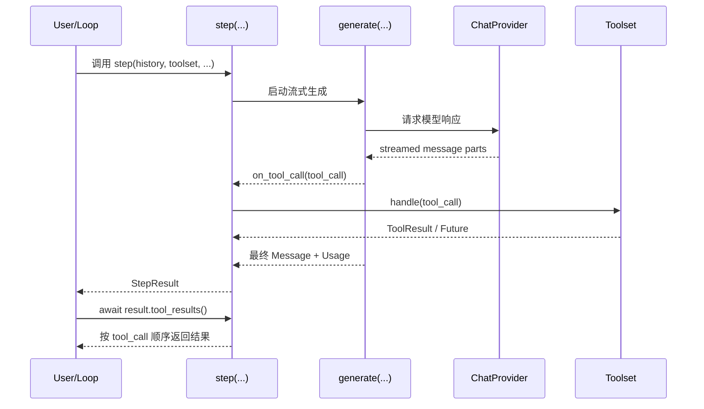
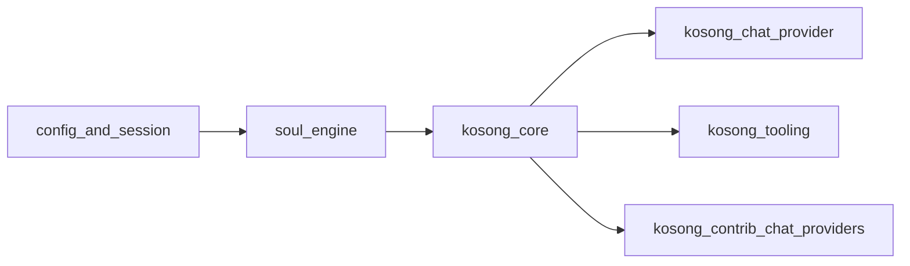

# kosong_core 模块文档

`kosong_core` 是 `kosong` 运行时中的最小核心层，负责把“模型生成”与“工具执行”拼接为一个可控、可等待、可取消的单步执行原语（`step` + `StepResult`），并提供一个可直接运行的 CLI 入口示例（`__main__.py`，含 `BashToolParams`）。这个模块存在的意义是：在不绑定具体模型厂商的前提下，为上层代理循环提供统一的“单步推理 + 工具调用闭环”，让调用方既能拿到最终 assistant 消息，也能按顺序收集工具结果与 token 使用量。

从系统分层上看，`kosong_core` 本身非常薄，但位置关键：它位于 [kosong_chat_provider.md](kosong_chat_provider.md) 提供的流式生成能力之上，位于 [kosong_tooling.md](kosong_tooling.md) 的工具抽象之上，同时被更高层执行引擎（例如 `soul_engine`）复用来构建完整对话回合。若你只想理解“代理一次 step 到底如何落地”，先读本文件，再读 [step_runtime.md](step_runtime.md) 与 [cli_entrypoint.md](cli_entrypoint.md)。

---

## 1. 设计目标与问题背景

在现代 Agent 系统中，一个常见难点是：LLM 的输出是流式增量的，工具调用可能是同步结果也可能是异步 Future，且在取消、超时、上游报错时容易遗留悬挂任务。`kosong_core` 通过 `step(...)` 统一处理这几类复杂性：它在生成过程中收集 `ToolCall`，把工具执行结果标准化为 `ToolResultFuture`，并在异常/取消时主动清理，避免事件循环被“僵尸 future”污染。

另一个设计重点是“历史不可变”：`step` 不会直接修改传入的 `history`。这让上层可以精确控制状态提交时机（例如先审查工具输出再入历史），非常适合需要审计、回放或人类确认的代理系统。

---

## 2. 架构总览



这张图展示了 `kosong_core` 的核心控制流：`step` 并不直接做模型 API 请求，而是委托给 `generate`；它的主要职责是围绕 `on_tool_call` 建立工具执行生命周期管理。无论工具立即返回还是延迟完成，最终都被统一成可等待对象，并封装进 `StepResult`。



这个时序强调了一个关键语义：工具结果的收集与返回顺序，依赖 `tool_calls` 的出现顺序，而不是 Future 完成顺序。这样可避免并发完成导致的“工具消息乱序”。

---

## 3. 子模块说明（高层）

`kosong_core` 当前可清晰拆分为两个子模块；本模块的细节已分别落在独立文档 [step_runtime.md](step_runtime.md) 与 [cli_entrypoint.md](cli_entrypoint.md)，主文档仅保留架构级说明，避免重复。

### 3.1 step_runtime

`step_runtime` 的核心是 `StepResult`（以及与其强关联的 `step` 函数行为）。它定义了“单步执行”的结果边界：消息 ID、assistant 消息、token usage、工具调用列表和工具结果 future 映射。该子模块重点解决并发回收与异常传播问题，是整个 Agent 回合稳定性的基础。详见 [step_runtime.md](step_runtime.md)。

### 3.2 cli_entrypoint

`cli_entrypoint` 提供了 `python -m kosong` 形式的快速入口，`BashToolParams` 是其示例工具参数模型之一。它展示如何选择不同 provider（Kimi/OpenAI/Anthropic/Google）、如何从环境变量读取配置、以及如何在 while-loop 中反复调用 `step` 完成“模型 -> 工具 -> 模型”的多跳执行。详见 [cli_entrypoint.md](cli_entrypoint.md)。

---

## 4. 关键组件与内部机制

### 4.1 `step(...)` 的内部处理要点

`step` 在工具调用分发时兼容两种返回：

1. `Toolset.handle(...)` 直接返回 `ToolResult`（同步完成）
2. 返回 `ToolResultFuture`（异步完成）

为统一行为，函数会把同步结果包成已完成 Future，再放入 `_tool_result_futures`。这使得 `StepResult.tool_results()` 可以用同一套 await 逻辑处理所有工具。

异常路径中，`step` 捕获 `ChatProviderError` 与 `asyncio.CancelledError` 后，会取消所有登记过的 Future，并 `gather(..., return_exceptions=True)` 完成清理。这是一个非常重要的资源安全策略，能防止中断后后台任务继续跑。

### 4.2 `StepResult.tool_results()` 的语义

`tool_results()` 会按 `tool_calls` 原顺序逐个 await 对应 future。即使某个 future 很慢，也不会提前返回后续更快完成的结果，这保证了对话上下文拼接的一致性。

此外，方法在 `finally` 中会取消全部 future 并统一回收：即使中途抛异常，也不会把其他工具任务留在事件循环里。调用方应理解这意味着 `tool_results()` 更偏“一次性收敛接口”，而非可重复、增量拉取接口。

### 4.3 `BashToolParams` 与 CLI 示例定位

`BashToolParams` 只是一个最小 `pydantic.BaseModel`（字段 `command: str`），其价值在于演示：
- 如何用 `CallableTool2[TParams]` 定义强类型工具
- 如何将工具结果映射回 `tool` 角色消息再喂给下一轮 `step`
- 如何构建可退出（`exit/quit`）的交互式代理循环

---

## 5. 与其他模块关系



`kosong_core` 并不关心具体模型协议细节，这些由 [kosong_chat_provider.md](kosong_chat_provider.md) 与 [kosong_contrib_chat_providers.md](kosong_contrib_chat_providers.md) 负责；它也不实现复杂工具生态，只依赖 [kosong_tooling.md](kosong_tooling.md) 的抽象接口。更高层的会话管理、压缩与运行编排通常在 [soul_engine.md](soul_engine.md)（若存在）中完成。

---

## 6. 使用与配置指南

### 6.1 最小调用方式

```python
result = await kosong.step(
    chat_provider=provider,
    system_prompt="You are a helpful assistant.",
    toolset=toolset,
    history=history,
)

assistant_msg = result.message
tool_results = await result.tool_results()
```

推荐模式是：将 `assistant_msg` 与 `tool_results` 转为 `tool` 消息追加进历史，然后在存在工具调用时继续下一轮 step，直到本轮无工具调用为止。

### 6.2 CLI 环境变量约定（示例入口）

`__main__.py` 默认读取：
- `${PROVIDER}_BASE_URL`
- `${PROVIDER}_API_KEY`
- `${PROVIDER}_MODEL_NAME`

例如 `provider=openai` 时使用 `OPENAI_API_KEY`。Google 分支还兼容 `GEMINI_API_KEY`。这些是示例入口约定，不一定代表你在生产中必须沿用的配置方案。

### 6.3 扩展建议

扩展 `kosong_core` 时，建议优先遵守两个不变式：第一，任何新路径都要保证 Future 可回收；第二，`history` 的突变应继续留给调用方。若要支持“部分工具结果先消费”，应新增独立 API，而不是改变 `tool_results()` 现有顺序与回收语义。

---

## 7. 错误处理、边界条件与限制

`step` 可能抛出 `ChatProviderError` 与 `asyncio.CancelledError`（其注释中还提到若干 API 级错误，通常由 provider 层具体实现并上抛）。在调用侧应把这两类错误纳入统一重试/取消策略。

常见边界条件包括：
- **无工具调用**：`tool_results()` 快速返回空列表。
- **部分工具很慢**：返回被最慢工具阻塞（按顺序 await 的设计使然）。
- **单个工具失败**：异常会导致 `tool_results()` 中断，并触发 finally 清理其他 future。
- **中途取消**：`step` 与 `tool_results()` 都会尽量取消并回收挂起任务。

当前限制在于：`kosong_core` 不直接提供并行消费工具结果、重试单个工具、或细粒度 backpressure 控制。这些能力若需要，通常应在上层运行时封装。

---

## 8. 阅读路径建议

1. 先阅读 [step_runtime.md](step_runtime.md) 理解结果模型与并发语义。  
2. 再看 [cli_entrypoint.md](cli_entrypoint.md) 把概念映射到可运行循环。  
3. 如需替换模型供应商，阅读 [provider_protocols.md](provider_protocols.md)、[kimi_provider.md](kimi_provider.md)、[openai_responses_provider.md](openai_responses_provider.md) 等。  
4. 如需扩展工具，阅读 [kosong_tooling.md](kosong_tooling.md)。
